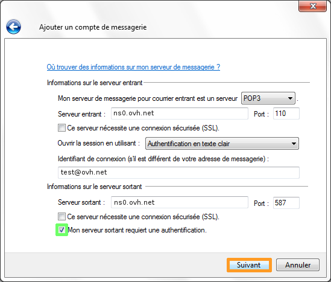

## Parte 1: aggiungi un account email
Apri Windows Mail e crea un nuovo account inserendo le informazioni richieste, clicca su "Avanti".

{.thumbnail}

## Parte 2: impostazione account email
Nella finestra che appare, inserisci le informazioni richieste.

Il server di posta in entrata è un server: POP3

Server di posta in entrata: ns0.ovh.net
Porta : 110

Identificativo di connessione: il tuo indirizzo email completo

Informazioni sul server in uscita: ns0.ovh.net
Porta: 587

Seleziona la casella "Il server in uscita richiede l'autenticazione"

È necessario utilizzare la porta SMTP 587 e selezionare l'autenticazione per accedere al server di posta in uscita. 

Clicca su "Avanti" per completare la configurazione.

{.thumbnail}

- L'autenticazione per il server in uscita è un parametro indispensabile per inviare email sui nostri server SMTP.

- Se l'autenticazione non è attivata un ticket incidente Open SMTP può essere aperto automaticamente per informarti che l'autenticazione "POP before SMTP" non è supportata. Devi tassativamente attivare l'autenticazione del server in uscita per poter inviare email.

## Configurazione POP
Queste sono le informazioni per configurare un account email POP su Outlook 2010.

Configurazione POP con sicurezza SSL attivata o disattivata:

Indirizzo email: il tuo indirizzo di mail condivisa completo

Password: la password che hai definito nel tuo [Spazio Cliente OVH](https://www.ovh.com/managerv3/)

Nome utente: il tuo indirizzo di mail condivisa completo
Server di posta in entrata, il server che riceve i messaggi: ssl0.ovh.net
Porta del server in entrata, la porta del server in entrata: 995 o 110
Server di posta in uscita, il server di invio delle mail: ssl0.ovh.net
Porta del server in uscita, la porta del server in uscita: 465 o 587

Le porte110 e 587 corrispondono alla securizzazione SSL disattivata.
Le porte995 e 465 corrispondono alla securizzazione SSL attivata.

- Devi tassativamente attivare [l'autenticazione](#configuration_manuelle_partie_5_serveur_sortant_amp_options_avancees) del server in uscita SMTP.

|Porte|SSLattivata|SSLdisattivata|
|In entrata|995|110|
|In uscita|465|587|

## Configurazione IMAP
Queste sono le informazioni per configurare un account email IMAP su Outlook 2010.

Configurazione IMAP con sicurezza SSL attivata o disattivata:

Indirizzo email: il tuo indirizzo di mail condivisa completo

Password: la password che hai definito nel tuo [Spazio Cliente OVH](https://www.ovh.com/managerv3/)

Nome utente: il tuo indirizzo di mail condivisa completo
Server di posta in entrata, il server che riceve i messaggi: ssl0.ovh.net
Porta del server in entrata, la porta del server in entrata: 993 o 143
Server di posta in uscita, il server di invio delle mail: ssl0.ovh.net
Porta del server in uscita, la porta del server in uscita: 465 o 587

Le porte143 e 587 corrispondono alla securizzazione SSL disattivata.
Le porte993 e 465 corrispondono alla securizzazione SSL attivata.

- Devi tassativamente attivare [l'autenticazione](#onfiguration_manuelle_partie_5_serveur_sortant_amp_options_avancees) del server in uscita SMTP.

|Porte|SSLattivata|SSLdisattivata|
|In entrata|993|143|
|In uscita|465|587|

## Informazioni generali
Se vuoi, possiamo occuparci di alcuni servizi relativi al tuo account email con interventi a pagamento.

Per informazioni contatta il [nostro supporto](http://www.ovh.it/supporto/).

{.thumbnail}

