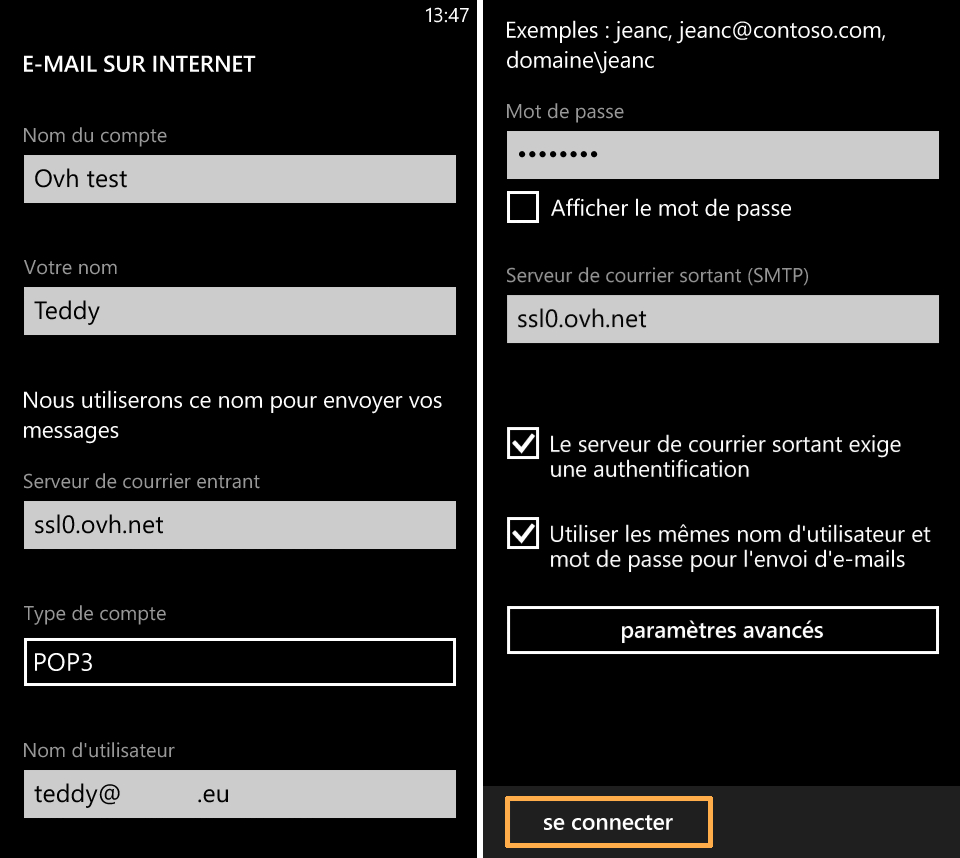

## 1 dalis: Nustatymai
Pirmiausiai spragtelėkite piktogramą Settings.

Pavyzdyje konfigūruosime el. pašto paskyrą su POP, Nokia Lumia 625 telefone su Windows Phone 8.0.

{.thumbnail}

## 2 dalis: Sistema
Paskyros kūrimas prasidės, kai spragtelėsite e-mail + accounts.

{.thumbnail}

## 3 dalis: Paskyros sukūrimas
Pasirinkite Add an account ir pradėkite paskyros kūrimą.

Atkreipkite dėmesį, kad šiame žingsnyje galite rinktis iš kelių paskyrų tipų.

{.thumbnail}

## 4 dalis: Paskyros tipas
Privaloma nurodyti paskyros tipą.

Pasirinkite Other account, kad pridėtumėte POP arba IMAP tipo paskyrą.

{.thumbnail}

## 5 dalis: Paskyros konfigūravimas
Pirmajame laukelyje įveskite visą el. pašto adresą.

Taip pat įveskite slaptažodį, kurį nurodėte [valdymo sąsajoje](https://www.ovh.com/auth/?action=gotomanager), kurdami paskyrą.

Spustelėjus „Connect“ matysis naujas pranešimas.

Norėdami pereiti prie paskyros konfigūracijos, rinkitės Advanced.

{.thumbnail}

## 6 dalis: Išsamūs nustatymai
Prie išsamių paskyros nustatymų ir POP arba IMAP konfigūravimo pereisite pasirinkę E-mail over the Internet.

{.thumbnail}

## 7 dalis: El. pašto paskyros nustatymai
Įveskite šią informaciją:

Account name: Paskyros pavadinimas, matomas telefone.

Your name: Vardas, matomas kaip laiškų siuntėjo vardas.

Incoming mail server: SSL0.OVH.NET

Account type: POP3(taip pat galite rinktis IMAP, pastarojo tipo nustatymai pateikiami gido pabaigoje).

User name: Visas el. pašto adresas.

Password: Slaptažodis, kurį nurodėte [valdymo sąsajoje](https://www.ovh.com/auth/?action=gotomanager) kurdami paskyrą.

Outgoing mail server (SMTP): SSL0.OVH.NET

Pažymėkite dvi parinktis: "Outgoing server requires authentification" ir "Use the same user name and password for outgoing emails".

Po to spragtelėkite Connect.

{.thumbnail}

- Būtina įjungti išeinančių el. laiškų autentifikaciją, priešingu atveju el. laiškai nebus siunčiami per mūsų SMTP serverius.

- Jeigu autentifikacija nebus įjungta, automatiškai bus sukurtas gedimo kvitas Open SMTP ir jūs būsite informuoti, kad POP before SMTP mūsų sistemoje nepalaikoma. Norėdami siųsti el. laiškus, privalėsite įjungti išeinančių el. laiškų serverio autentifikaciją.

## 8 dalis: Pabaiga
Jūsų el. pašto paskyra sukonfigūruota ir bus matoma telefono sąsajoje.

{.thumbnail}

## Prieiga prie el. pašto
El. paštą galite naudoti spragtelėję atitinkamą piktogramą, esančią telefono ekrane.

{.thumbnail}

## POP konfigūravimas
Čia pateikiama informacija, kuria reikėtų vadovautis konfigūruojant POP paskyrą Windows Phone.

POP konfigūravimas su įjungta ar išjungta SSL apsauga:

Email Address: Jūsų el. pašto adresas
Password: Slaptažodis, kurį nurodėte [valdymo sąsajoje](https://www.ovh.com/auth/?action=gotomanager) kurdami paskyrą.
Username: Visas el. pašto adresas
Incoming server:SSL0.OVH.NET
Incoming Server Port:995 arba 110
Outgoing server:SSL0.OVH.NET
Outgoing Server Port:465 arba 587

Prievadai 110 ir 587 atitinka išjungtą SSL apsaugą.
Prievadai 995 ir 465 atitinka įjungtą SSL apsaugą.

- Privaloma įjungti [išeinančio serverio (SMTP) ](#configuration_protocole_imap_partie_6_parametres_avances).

|Prievadai|SSLįjungta|SSLišjungta|
|Įeinantis|995|110|
|Išeinantis|465|587|

## IMAP konfigūravimas
Čia pateikiama informacija, kuria reikėtų vadovautis konfigūruojant POP paskyrą Windows Phone.

POP konfigūravimas su įjungta ar išjungta SSL apsauga:

Email Address: Jūsų el. pašto adresas
Password: Slaptažodis, kurį nurodėte [valdymo sąsajoje](https://www.ovh.com/auth/?action=gotomanager) kurdami paskyrą.
Username: Visas el. pašto adresas
Incoming server:SSL0.OVH.NET
Incoming Server Port:993 arba 143
Outgoing server:SSL0.OVH.NET
Outgoing Server Port:465 arba 587

Prievadai 143 ir 587 atitinka išjungtą SSL apsaugą.
Prievadai 993 ir 465 atitinka įjungtą SSL apsaugą.

- Privaloma įjungti [išeinančio serverio (SMTP) ](#configuration_protocole_imap_partie_6_parametres_avances).

|Prievadai|SSLįjungta|SSLišjungta|
|Įeinantis|995|110|
|Išeinantis|465|587|

