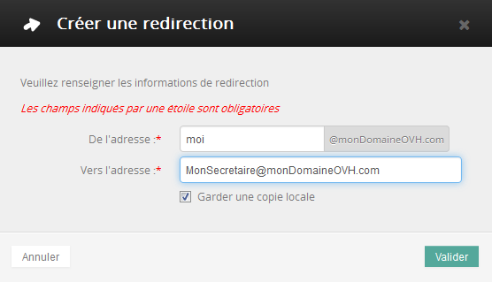

## Che cos'è un reindirizzamento email?
Un reindirizzamento email ti permette di inoltrare automaticamente un messaggio ricevuto su un account verso un altro indirizzo.

Ad esempio, vuoi che:

- i messaggi inviati a tuoindirizzo@tuodominio.com
- siano reindirizzati verso tuoaltroindirizzo@altrodominio.com.

In questo modo, puoi utilizzare il tuo account tuoindirizzo@tuodominio.com senza rendere pubblico il tuo secondo indirizzo tuoaltroindirizzo@altrodominio.com.

È possibile reindirizzare i messaggi anche verso più indirizzi o inoltrare le tue email conservandone una copia sulla casella in cui le hai ricevute.

Se hai impostato un reindirizzamento, qualsiasi email in arrivo verrà inoltrata automaticamente su un'altra casella senza che il mittente ne sia a conoscenza.

{.thumbnail}

## Di cosa hai bisogno?

- Accedere al tuo [Spazio Cliente OVH](https://www.ovh.com/manager/web/login/) (se non riscordi le tue credenziali, consulta [questa guida](https://www.ovh.it/g1909.hosting_web_gestisci_le_tue_password#le_password_associate_ai_tuoi_servizi_di_web_hosting_ovh_accesso_al_tuo_spazio_cliente_ovh))

- Se non utilizzi ancora un servizio email OVH e vuoi attivarne uno, consulta la guida .

## Dove configurare i reindirizzamenti delle tue email?
Per eseguire questa operazione, accedi al tuo [Spazio Cliente OVH](https://www.ovh.com/manager/web/login/) e clicca sulla sezione Email nel menu a sinistra.

{.thumbnail}
Seleziona il dominio su cui vuoi aggiungere un reindirizzamento email.

Se il tuo dominio non si trova nella lista, significa che su di esso non è attivo nessun servizio email. In questo caso, consulta [questa guida](https://www.ovh.it/g1864.ordina_il_tuo_mx_plan) o clicca su Ordina un MX Plan prima di proseguire.

{.thumbnail}
Selezionando il tuo dominio, accedi alla sezione Email.

Resta sulla scheda Email e clicca su Gestisci i reindirizzamenti per visualizzare la lista dei reindirizzamenti attivi e crearne di nuovi.

{.thumbnail}

## Aggiungi un reindirizzamento
Per eseguire questa operazione, clicca su Aggiungi un reindirizzamento, nella parte destra della pagina con la tabella dei reindirizzamenti attivi.

{.thumbnail}
Inserisci le informazioni richieste:

- Dall'indirizzo: inserisci l'indirizzo email su cui vuoi attivare il reindirizzamento

Sarà una delle tue caselle di posta che termina per @TuoDominio.

- All'indirizzo: inserisci l'indirizzo email su cui vuoi inoltrare automaticamente i tuoi messaggi. Può essere uno dei tuoi indirizzi email OVH o un account esterno.

- Conserva una copia in locale: seleziona questa opzione se vuoi conservare sul tuo indirizzo email i messaggi reindirizzati. In questo caso, le email saranno disponibili su entrambi gli account.

Clicca su Conferma per aggiungere il reindirizzamento.

{.thumbnail}

## Elimina un reindirizzamento
Per eliminare un reindirizzamento, accedi alla pagina con la tabella dei reindirizzamenti attivi, clicca sull'icona a forma di ingranaggio a destra e seleziona Elimina il reindirizzamento

{.thumbnail}
Clicca su Conferma per eliminare definitivamente il reindirizzamento.

{.thumbnail}

## Copia i messaggi ricevuti dall'account A sull'indirizzo B
Vuoi che tutti i messaggi che ti vengono inviati siano ricevuti anche da un altro account. In questo caso, configura il tuo reindirizzamento in questo modo:

{.thumbnail}

## Reindirizza i messaggi ricevuti dall'account A sugli indirizzi B e C
Esempio:
Hai cambiato il tuo indirizzo email, ma non vuoi comunicare il tuo nuovo indirizzo ad alcuni contatti.
Per non ricevere più messaggi sul tuo account A, imposta un reindirizzamento di messaggi sui tuoi indirizzi B e C.
È necessario configurare due reindirizzamenti diversi, in questo modo:

{.thumbnail}

