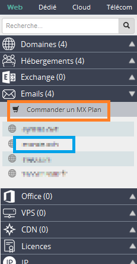
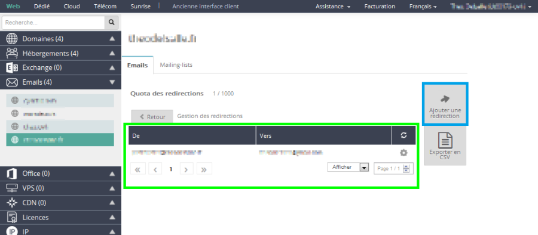
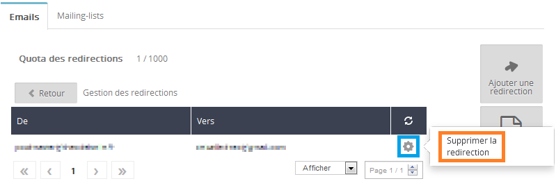

## Kas yra el. pašto nukreipimas?
Nukreipimas leidžia nukreipti el. laišką, gautą adresu A, į adresą B ar kitus el. pašto adresus.

Pavyzdžiui, jūs norite, kad:

- el. laiškas, jums išsiųstas adresu manoadresas@manoadresas.com
- būtų persiųstas į manokitasadresas@kitasadresas.com.

Tai leidžia paskelbti pirmąjį viešą adresą (manoadresas@manoadresas.com), neskelbiant tikrojo el. pašto adreso (manokitasadresas@kitasadresas.com).

Jūs galite nukreipti el. laiškus į keletą adresų, taip pat nukreipti el. laišką išsaugant jo kopiją pirmoje el. pašto dėžutėje.

Taigi nukreipiamas el. laiškas bus persiųstas į kitą jūsų el. pašto dėžutę, gavėjams apie tai nieko nežinant.

{.thumbnail}

## Reikalavimai

- Prieiga prie [valdymo sąsajos](https://www.ovh.com/manager/web/login/). 

Jeigu nebeturite prieigos prie kliento valdymo sąsajos, vadovaukitės [šiuo gidu](https://www.ovh.lt/g1909.slaptazodziu-valdymas).

- Jeigu jau naudojatės OVH el. pašto paskyromis, pereikite prie kito žingsnio.

- Priešingu atveju, jeigu nesinaudojate el. pašto pasiūlymu, skaitykite šį gidą: .

## Kur konfigūruojami el. pašto nukreipimai?
Pirmiausia prisijunkite prie savo [valdymo sąsajos](https://www.ovh.com/manager/web/login/).

Iš karto po prisijungimo spauskite skiltį El. laiškai.

{.thumbnail}
Domenų sąraše pasirinkite domeną, kuriam norite pridėti el. laiško nukreipimą.

Jeigu jūsų domeno nėra sąraše, jam nebuvo užsakytas el. pašto pasiūlymas. Tokiu atveju vadovaukitės [šiuo gidu](https://www.ovh.lt/g1864.mz-plano-uzsakymas) arba spauskite Užsakyti MX planą.

{.thumbnail}
Pasirinkę savo domeną būsite nukreipti į El. laiškų skiltį.

Likite pirmajame langelyje El. laiškai ir dešinėje paspauskite Nukreipimų valdymas.

Čia taip pat matysite aktyvių nukreipimų sąrašą ir galėsite sukurti naujus nukreipimus.

{.thumbnail}

## Nukreipimo pridėjimas
Šiame puslapyje pasirinkite aktyvių nukreipimų lentelę.
Jei norite pridėti naują nukreipimą, dešinėje spauskite mygtuką Pridėti nukreipimą.

{.thumbnail}
Svarbu žinoti 3 nukreipimų parametrus:

- Iš adreso: Nurodykite el. pašto adresą, kurį norite nukreipti.

Tai bus viena iš el. pašto dėžučių su pabaiga @JusuDomenas.

- Į adresą: Nurodykite savo nukreipimo paskirties el. pašto adresą. Tai gali būti vienas iš jūsų OVH el. pašto adresų arba išorinis el. pašto adresas.

- Lokalios kopijos saugojimas: Pažymėkite šią parinktį, jei norite, kad el. laiškai būtų ne tik nukreipiami, bet ir išsaugomi jūsų el. pašto adrese. Pasirinkus šią parinktį, el. laiškai bus siunčiami dviem adresais. 

Po to spauskite Patvirtinti, jei norite patvirtinti šio nukreipimo pridėjimą.

{.thumbnail}

## Nukreipimo pašalinimas
Jei nebenorite nukreipti savo el. laiškų ar norite ištrinti aktyvų nukreipimą, eikite į aktyvių nukreipimų lentelę.

- Spauskite krumpliaratį, esantį nukreipimo dešinėje

- Spauskite Pašalinti nukreipimą

{.thumbnail}
Jums tereikia spragtelėti Patvirtinti, jei norite galutinai pašalinti nukreipimą.

{.thumbnail}

## El. pašto adresu A gautų el. laiškų kopijavimas į el. pašto adresą B
Jei norite, kad visus jums siunčiamus el. laiškus gautų ir jūsų sekretorė, atlikite konfigūravimą, kaip paaiškinta toliau:

{.thumbnail}

## El. pašto adresu A gautų el. laiškų nukreipimas į du el. pašto adresus B ir C
Situacija:
Jūs pakeitėte savo el. pašto dėžutę, bet nenorite skelbti savo naujojo el. pašto adreso visiems kontaktams.
Jūs nebenorite gauti el. laiškų, siunčiamų į adresą A, bet norite juos nukreipti į savo kitus el. pašto adresus B ir C.
Jums reikės atlikti dviejų atskirų nukreipimų konfigūravimą, kaip paaiškinta toliau:

{.thumbnail}

