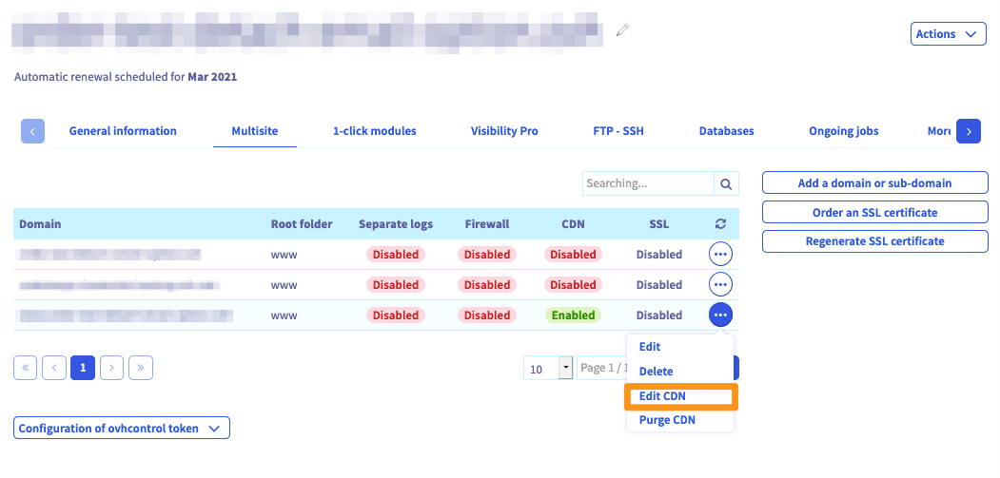
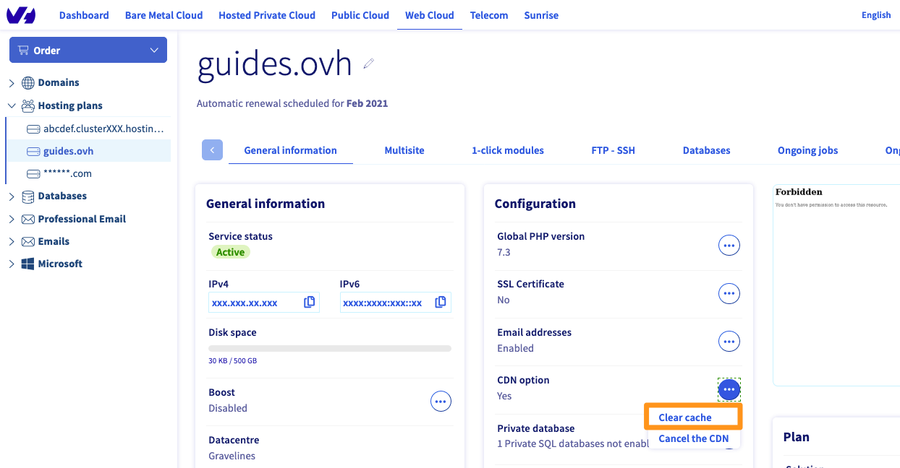

**Stand 19.11.2020**

> [!primary]
> Diese Übersetzung wurde durch unseren Partner SYSTRAN automatisch erstellt. In manchen Fällen können ungenaue Formulierungen verwendet worden sein, z.B. bei der Beschriftung von Schaltflächen oder technischen Details. Bitte ziehen Sie beim geringsten Zweifel die englische oder französische Fassung der Anleitung zu Rate. Möchten Sie mithelfen, diese Übersetzung zu verbessern? Dann nutzen Sie dazu bitte den Button «Mitmachen» auf dieser Seite.
>

## Ziel

Sie können die Benutzererfahrung durch die Beschleunigung Ihrer Website verbessern, indem Sie die effektivste Technik, d. h. die Aktivierung eines CDN (Content Delivery Network) anwenden. Letzteres ermöglicht das Zwischenspeichern statischer Dateien wie Bilder, CSS und Javascript auf Servern, die näher bei Ihren Kunden liegen.

**Erfahren Sie, wie Sie die CDN-Option für Ihr Webhosting verwalten. **

## Definition

**Wie funktioniert ein CDN?**

Das CDN (Content Delivery Network) ist buchstäblich ein Netzwerk für die Bereitstellung von Inhalten. Es werden mehrere Server weltweit bereitgestellt, um Ihre Website anzuzeigen. Je näher diese Server bei Ihren Benutzern liegen, desto schneller funktioniert ihre Website.

Jeder Server speichert einen Teil Ihrer Website im Cache, um die Funktion zu gewährleisten. Im Allgemeinen ist es ratsam, so genannte statische Dateien einzubeziehen: Bilder, Javascript- und CSS-Dateien, die das ordnungsgemäße Funktionieren Ihrer Website ermöglichen, aber nur sehr selten geändert werden.

## Voraussetzungen

- Sie sind in Ihrem [OVHcloud-Kundencenter](https://www.ovh.com/auth/?action=gotomanager){.external}angemeldet.
- Sie verfügen über ein [OVH-Webhosting](https://www.ovh.de/hosting/){.external}.

## In der praktischen Anwendung

###  Die CDN Option einrichten

> [!primary]
> 
> Die CDN-Option ist bereits in den Webhosting-Angeboten von Performance enthalten.

####  Wenn die CDN Option nicht auf Ihrem Webhosting bestellt oder aktiviert wird

Loggen Sie sich in Ihr [OVHcloud Kundencenter ein](https://www.ovh.com/auth/?action=gotomanager){.external} und wählen Sie dann `Web Cloud aus`{.action}. Klicken Sie im linken Menü auf Hosting-Pakete und wählen Sie das entsprechende Angebot aus. Klicken Sie auf `...`{.action}. rechts neben "CDN Option"und dann auf `CDN`{.action} bestellen oder ` `{.action}Die Option aktivieren, wenn die CDN Option bereits in Ihrem Hosting enthalten ist.

> [!primary]
> 
> Wenn Sie eine CDN Option vor dem 19.11.2020 haben, können Sie das neue Shared CDN Angebot bestellen, indem Sie auf `Das CDN auf die obere Version updaten`{.action}.

{.thumbnail}

Sie werden zur Generierung des Bestellformulars weitergeleitet. Sobald die Bestellung bezahlt wurde, ist Ihre Dienstleistung innerhalb weniger Minuten verfügbar.

#### Wenn die CDN Option bereits für Ihr Webhosting aktiviert ist

Loggen Sie sich in Ihr [OVHcloud Kundencenter ein](https://www.ovh.com/auth/?action=gotomanager){.external} und wählen Sie dann `Web Cloud aus`{.action}. Klicken Sie im linken Menü auf Hosting-Pakete und wählen Sie das entsprechende Angebot aus. Klicken Sie auf der Registerkarte `Multisite`{.action} auf das Zahnrad rechts neben dem Multisite-Eintrag und dann auf `Ändern`{.action}.

Kreuzen Sie „CDN aktivieren an“, klicken Sie auf `Weiter`{.action} und dann auf `Bestätigen`{.action}.

{.thumbnail}

> [!warning]
> 
> Liegt der Domainname, der an mehreren Standorten im Webhosting hinzugefügt wurde, außerhalb von OVHcloud, müssen Sie die IP-Adresse des CDN Ihres Hostings in der DNS-Zone des Domainnamens angeben.<br>
> In der [Liste der IP-Adressen der Cluster und Webhosting](../verzeichnis-der-ip-adressen-web-hosting-cluster/){.external} finden Sie die spezifische IP-Adresse des CDN Ihres Clusters.

 
**Warum kann ich die geolokalisierte IP mit der CDN Option nicht nutzen?** <br>
<br>
Das CDN basiert auf dem Prinzip der Anycast-IP. Sie werden nicht denselben Server zu Ihrer geografischen Position abfragen, was die Ladezeit Ihrer statischen Dateien sehr effektiv verkürzt. Eine IP-Geolokalisierung ist daher nicht erforderlich. <br>
SEO (Suchmaschinen-Referenzierung): Die Geschwindigkeit der Anzeige Ihrer Website ist wichtiger als die Geolokalisierung der IP-Adresse Ihres Hostings.

### Shared CDN verwalten 

> [!primary]
> 
> Die Shared CDN Option ist bereits in den Performance Webhosting Angeboten enthalten oder seit dem 19.11.20 zur Bestellung verfügbar. Für ältere Versionen lesen Sie den Abschnitt "[CDN verwalten"(historische Version)](./#ihr-cdn-verwalten-historische-version_2).

#### Den Shared CDN Cache leeren

Es ist manchmal nützlich, den CDN-Cache zu leeren, insbesondere, wenn Sie Ihre statischen Dateien ändern. Zum Beispiel, wenn Sie eine neue Version Ihrer Website erstellen. Sie können den Cache für jeden Ihrer Multisite-Einträge leeren.

Gehen Sie auf die Registerkarte `Multisite`{.action} Ihres Webhostings, klicken Sie auf `...`{.action} rechts neben dem Multisite-Eintrag und `danach Das CDN löschen`{.action}.

{.thumbnail}

#### Shared CDN Optionen konfigurieren

Gehen Sie auf die Registerkarte `Multisite`{.action} Ihres Hostings, klicken Sie auf `...`{.action} rechts neben dem Multisite-Eintrag und `dann CDN ändern`{.action}.

> [!warning]
> 
> Einige Optionen sind für das Basic Angebot gesperrt.

{.thumbnail}

- **Immer online** : Erlaubt die Online-Speicherung der CDN Daten im Fall eines Serverausfalls.

- **HTTP/2** : Protokoll, das die Sicherheit und Latenz Ihrer Website verbessert.

- **Dev-Mode** : ermöglicht es Ihnen, den Cache während der Entwicklung Ihrer Website zu deaktivieren.

- **Brotli** :  Typ der Komprimierung, um die Größe Ihrer Dateien im Cache zu optimieren.

- **Cache-Regel**: Erstellen Sie bis zu 5 Regeln. Sie definieren die Häufigkeit der Cache-Aktualisierungen für bestimmte Ressourcen Ihrer Website. ([folgen Sie dem nächsten Schritt](./#eine-cache-regel-erstellen).

Wenn Sie Ihre Optionen ausgewählt haben, klicken Sie auf `Konfiguration anwenden`{.action} und dann auf `Konfiguration im folgenden`{.action} Fenster bestätigen.

{.thumbnail}

##### Eine Cache-Regel erstellen

Um eine Cache-Regel zu einem der Elemente Ihrer Seite hinzuzufügen, gehen Sie auf den Tab `Multisite`{.action} Ihres Hostings, klicken Sie auf `...`{.action} rechts neben dem Multisite-Eintrag und anschließend auf `CDN konfigurieren`{.action}.

Klicken Sie unter **Cache-Regeln** auf den Button `Regel hinzufügen`{.action}.

{.thumbnail}

- **Regelname** : Weisen Sie Ihrer Regel einen Namen zu.

- **URI** : Geben Sie die Teilmenge der Ressourcen Ihrer Website über ihren Pfad in das Verzeichnis der Website ein. Für das CDN-Basic Angebot können Sie nur eine Dateierweiterung angeben.

- **Laufzeit** : Geben Sie die Lebensdauer der Regel für die gewählte Ressource an.

- **Einstufung** :  Sortieren Sie Ihre Regeln nach Ausführungsordnung (von der niedrigsten zur höchsten).

Wenn Sie Ihre Auswahl vorgenommen haben, klicken Sie auf den Button `Regel erstellen`{.action}.

Die Regeln erscheinen in einer Liste.  Sie können sie ändern, indem Sie auf `..`{.action} rechts neben der Regel klicken und dann auf `Die Regel ändern`{.action} oder löschen, indem Sie auf `Die Regel löschen`{.action}.

{.thumbnail}

Klicken Sie nach der Konfiguration Ihrer Regeln und Optionen auf `Konfiguration anwenden`{.action} und dann auf `Konfiguration`{.action} im folgenden Fenster bestätigen.

### Ihr CDN verwalten (historische Version)

> [!primary]
> 
> Die CDN Option ist bereits in den Performance Webhosting Angeboten oder den vor dem 19.11.20 bestellten Angeboten enthalten.

#### Den CDN-Cache leeren

Es ist manchmal nützlich, den CDN-Cache zu leeren, insbesondere, wenn Sie Ihre statischen Dateien ändern. Zum Beispiel, wenn Sie eine neue Version Ihrer Website erstellen. In diesem Fall können Sie den CDN-Cache vollständig leeren.

Loggen Sie sich in Ihr [OVHcloud Kundencenter ein](https://www.ovh.com/auth/?action=gotomanager){.external} und wählen Sie dann `Web Cloud aus`{.action}. Klicken Sie im linken Menü auf Hosting-Pakete und wählen Sie das entsprechende Angebot aus. Klicken Sie auf `...`{.action} rechts neben "CDN Option" und danach auf  `Den Cache leeren`{.action}.

{.thumbnail}

### Wie kann ich meine Dateien im CDN zwischenspeichern?

**Verwendung eines CMS**

Die wichtigsten CMS bieten zahlreiche Plugins, die es erlauben, das Caching statischer Dateien so zu konfigurieren, dass diese automatisch vom CDN berücksichtigt werden. Andere ermöglichen die automatische Konfiguration statischer Dateien durch Aktivierung des im CMS integrierten Caching. Weitere Informationen finden Sie in der offiziellen Dokumentation des von Ihnen verwendeten CMS oder des Plugin-Editors.

**Ohne Verwendung eines CMS**

Sie können auch dann vom CDN-Cache profitieren, wenn Sie kein CMS verwenden. Hierzu müssen Sie bei HTTP-Anforderungen Header hinzufügen. Es gibt verschiedene Methoden zum Hinzufügen dieser Header. Eine der einfachsten ist, Regeln in einer .htaccess-Datei zu definieren, abhängig von den Dateierweiterungen.

```htaccess
1. # Bilder 1 Woche lang ausblenden
2. <FilesMatch "\.(jpg|jpeg|png|gif)$">
3. Header-Set Cache-Control "max-age=604800, public"
4. </FilesMatch>
5. 
6. # Cache von Javascript und CSS für 1 Monat
7. <FilesMatch "\.(js|css)$">
8. Header-Set Cache-Control "max-age=2592000"
9. </FilesMatch>
```
> [!warning]
>
> Das Zwischenspeichern über HTTP-Header ermöglicht das Zwischenspeichern innerhalb des CDN, aber auch innerhalb des Browsers Ihrer Benutzer. Um zu verhindern, dass Ihre Besucher eine zu alte zwischengespeicherte Version anzeigen, wird empfohlen, die Namen der Dateien bei jeder neuen Version zu ändern.
> 

### CDN Option deaktivieren

Mit dieser Aktion kann das CDN für einen oder mehrere Ihrer Multisite-Einträge deaktiviert werden, ohne die CDN-Option aus Ihrem Webhosting zu entfernen.

Begeben Sie sich in Ihr [OVHcloud Kundencenter](https://www.ovh.com/auth/?action=gotomanager){.external} und wählen Sie dann `Web Cloud aus`{.action}. Klicken Sie im linken Menü auf Hosting-Pakete und wählen Sie das entsprechende Angebot aus. Klicken Sie im Tab `Multisite`{.action} auf ...` rechts neben dem Multisite-Eintrag und dann `{.action}Ändern` `{.action}.

Entfernen Sie das Kreuz auf „CDN aktivieren“, klicken Sie auf `Weiter`{.action} und dann auf `Bestätigen`{.action}.

{.thumbnail}

### Die CDN-Option entfernen

Der Zweck dieser Aktion besteht darin, die CDN-Option für Ihr gesamtes Webhosting zu entfernen.

Begeben Sie sich in Ihr [OVHcloud Kundencenter](https://www.ovh.com/auth/?action=gotomanager){.external} und wählen Sie dann `Web Cloud aus`{.action}. Klicken Sie im linken Menü auf Hosting-Pakete und wählen Sie das entsprechende Angebot aus. Klicken Sie auf `...`{.action} rechts neben "CDN Option" und danach auf  `Das CDN kündigen`{.action}.

{.thumbnail}

Bestätigen Sie die Kündigung, indem Sie auf `Bestätigen`{.action} klicken.

> [!warning]
>
> Sie erhalten eine E-Mail mit dem Verfahren zum Schließen Ihres CDN. Befolgen Sie die Anweisungen, um die Anforderung zu bestätigen oder abzubrechen. 
> 


### Überprüfen, ob Ihr CDN in Betrieb ist

Um sicherzustellen, dass das CDN in Ihrem Domainnamen aktiv ist, können Sie eine Überprüfung über ein Terminal mit dem folgenden Befehl durchführen:

```
curl -i http://yourpersonnaldomain.ovh/
```

Wenn Ihr Domain-Name vom CDN gut unterstützt wird, erhalten Sie das folgende Ergebnis:

```
HTTP/1.1 200 OK
Datum: Mo, 01. Januar 2020 00:00:00 GMT
Inhaltstyp: text/html; charset=UTF-8
Set-Cookie: SERVERID12345=123456; path=/; max-age=900
Vary: Accept-Encoding
X-Request-ID: 123456789
X-CDN-Pop: rbx1
X-CDN-Pop-IP: 00.111.22.333/44
X-Cacheable: Cacheable
Accept-Ranges: bytes
Transfer-Encoding: chunked
X-IPLB-Instanz: 12345
```
Die Hinweise „*X-CDN*“ bestätigen, dass Sie das CDN reibungslos durchlaufen.

Falls der Domainname das CDN nicht durchläuft, erhalten Sie das folgende Ergebnis:

```
HTTP/1.1 200 OK
Datum: Mo, 01. Januar 2020 00:00:00 GMT
Inhaltstyp: text/html; charset=UTF-8
Set-Cookie: SERVERID12345=123456; path=/; max-age=900
Server: Apache
X-Powered-By: PHP/7.1
Vary: Accept-Encoding
X-IPLB-Instanz: 12345
```

Das Fehlen des Hinweises „*X-CDN*“ zeigt an, dass Sie das CDN nicht durchlaufen.

## Weiterführende Informationen

Für den Austausch mit unserer User-Community gehen Sie auf [https://community.ovh.com/en/](https://community.ovh.com/en/){.external}.
