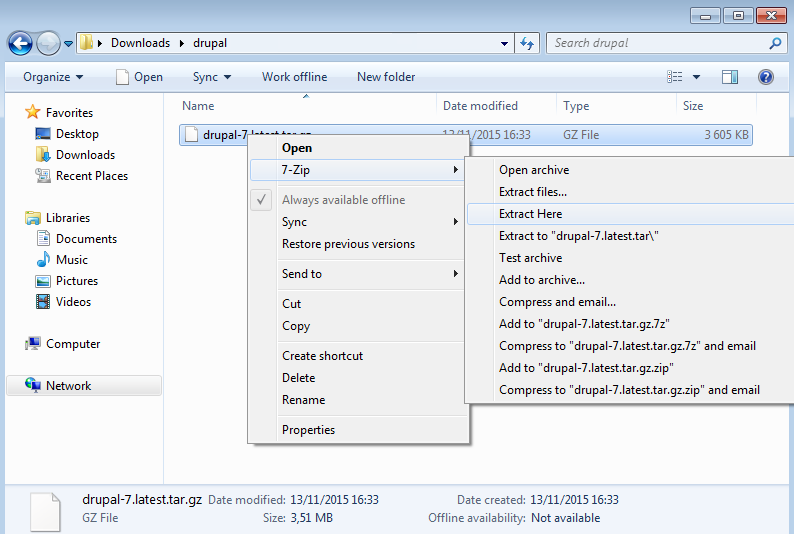
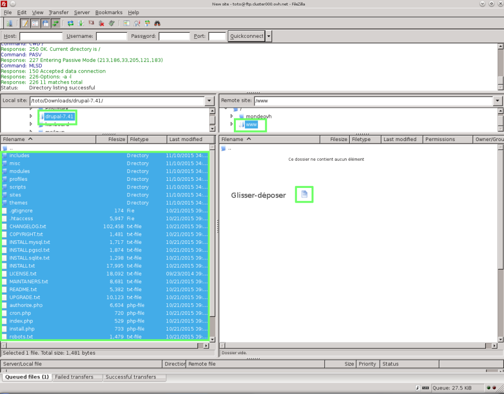
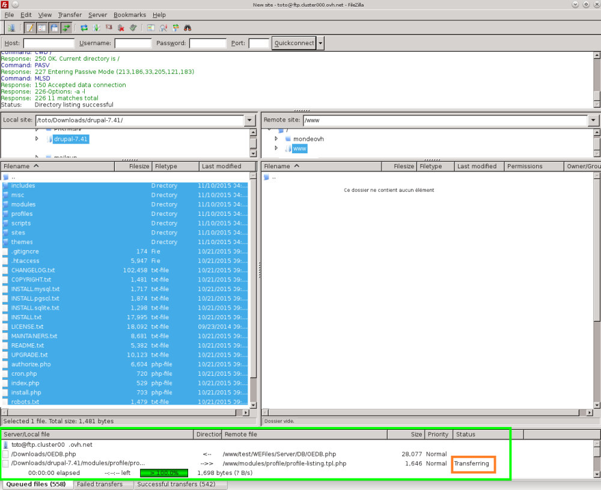
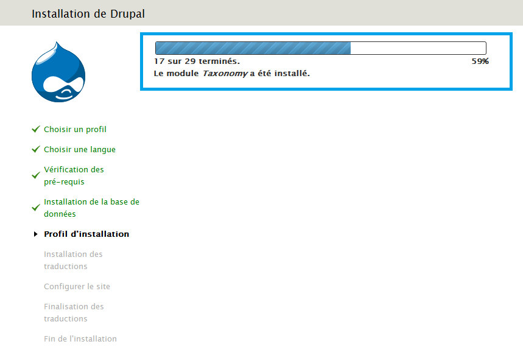
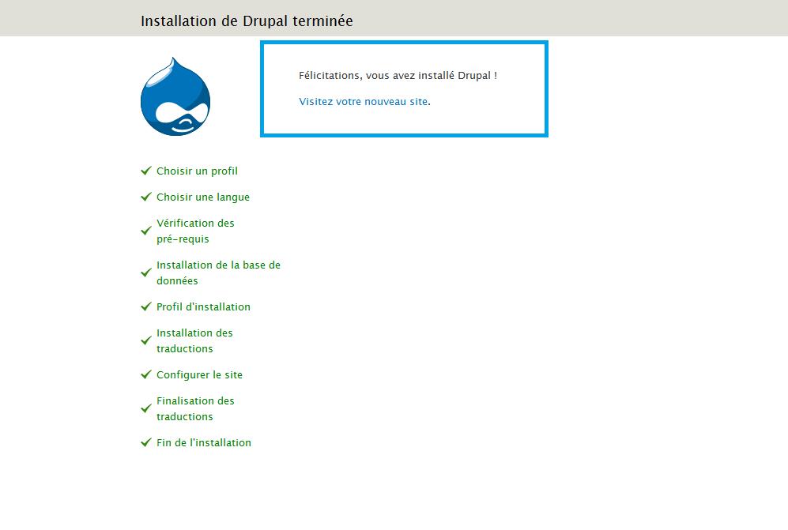

**Last updated 5th May 2020**

## Part 1: preparing for installation

Necessary tools

To install the Drupal platform on your shared hosting package, we advise your to get an FTP program such as  FileZilla (free).

## Necessary credentials

Make sure that you have your customer ID (nic-handle) and password so you can log in to your [OVHcloud customer account](https://www.ovh.com/auth/?action=gotomanager) if necessary.

- Get your FTP ID and password so you can log in to your hosting package. 

- You also need to have your SQL database ID and password so you can log in to the database.
There is a guide showing you how to get your SQL credentials: 

## Part 2: get source files

- Go to the [Drupal](https://www.drupal.org/) website.

{.thumbnail}
There should be a link that lets you download the latest stable version of the CMS
Our example uses 7.41.
The file that you download will usually be compressed (zipped) so you have to be able to extract the files to your computer. There is lots of help available online.

## Part 3: Upload your files to your hosting package via FTP

- Unzip the file folder

Open the folder that contains the zipped folder you downloaded. 

Right-click on the folder, then select "Extract all...".

Select a destination in order to extract your files in to a new folder.

There are a number of tutorials and types of decompression software available online to help with this.
Check them out if you are stuck at this stage.

The target folder will be called "Drupal-xxx" (xxx often being replaced by the number of the version).

{.thumbnail}
Log on to the web hosting package via FTP

To upload the Drupal files to your hosting package, you first have to log on. 

Follow this guide on connecting to a hosting package in FTP:
Transfer files via FTP

Follow these steps to upload your files using FTP.

## Step 1

Once you are logged in to FileZilla. 

In the "Local site" section, which refers to the list of files on your computer, open the unzipped file entitled "Drupal-xxx" where your CMS files will be located. 

In the "Remote site" section, which refers to your OVHcloud shared hosting package, open the "www" folder. This is the folder that you need to upload your CMS files to.
If this folder does not exist you can create it.
Your files must be uploaded to the "www" folder or you will not be able to access the installation procedure from your domain name.

## Step 2

Once these folders are open:

In the "Local site" section, find all the files you need to install the Drupal CMS. 

To select them all just click CTRL+A.

Then drag and drop the files in to the "Remote site" section in the "www" folder.

{.thumbnail}
It is very likely that the "www" folder is not empty. You do not have to remove the files that are in it. We will go back to this point later on in the guide.

## Step 3

The files are being transferred.. 

Wait until all of the files are dropped in to the remote FTP server. This could take a few minutes.

Once the transfer is complete, make sure that all of the files and folders have been correctly transfered. 

This is the end of the section devoted to transfering files via FTP.

{.thumbnail}

## Step 1 - Installing Drupal

Go to your web browser, and type your domain name in the address bar. 

You will reach this page

Tick "Standard Install with commonly used features pre-configured." then click "Save and continue".

{.thumbnail}

## Step 2 - Language choice

Select your chosen language and then click "Save and continue".

{.thumbnail}

## Step 3 - Log on to the database

Get your database credentials (there is a guide available here: ).

Enter the information requested:

Tick "MySQL, MariaDB or equivalent".

- Database name: chosen when it was created in the customer account. 

- Username: identical to database name. 

- Database password: you were sent it in an email when you created the database - you might have changed it since then.

- Then click "ADVANCED OPTIONS".

{.thumbnail}

- Database survey: enter your database's server name, as stated in the setup email or in your customer account. It usually ends in ".mysql.db".

- Database port: Leave empty. 

Table prefix: useful for installing Drupal lots of times on the same database. In this case, you have to enter a different prefix for each installation. If in doubt, leave empty

{.thumbnail}
Important: the database IDs are not automatically sent when installing the hosting package. To receive them, you have to enable the database in your customer account.
Click "Save and continue" to confirm the database login details.

## Step 4
If you have correctly entered the different database information, the installation will launch. 
If not you need to enter it again correctly.

- Just wait for the installation to complete.

{.thumbnail}

## Step 5 - Configuring Drupal administration
Here are the administration settings for your Drupal CMS.

- Website name: Enter your domain name.

- Website email address: Enter the address that your website will use to send messaged to your subscribers. 

- User name: Enter the name of the administrator account for your website. In our example we have chosen "admin".

- Email address: Enter the address which will be attached to your administrator account. 

- Password: Enter your administrator account password.
- Confirm your password:.

Go to the bottom of the page

{.thumbnail}

- By default: Choose the country/language of the website. 
- Default time zone: Choose the website time zone. 

- Automatic update and get notification emails:

We recommend that you enable these options before increasing the stability and security of your website. 

- Then click  “Register and continue".

{.thumbnail}

## Step 6 - Completion
Your Drupal CMS is now installed. 
Click on "Visit your new website".

{.thumbnail}
You now simply have to use Drupal and build your website.

{.thumbnail}

## Drupal support
Please have a look at the forums dedicated to the Drupal solution.

- Here is the [Drupal](https://www.drupal.org/support) website if you need help.

OVHcloud support is not authorised to answer questions about Drupal configuration.
However, there is a user guide available: .

## Typical errors

- Error "OVHcloud - site under construction"

You have set up your files on FTP, however the "site under construction" page is still displayed. 

When your hosting system was installed, OVHcloud set up a "waiting" page while you were uploading files to your site. 

If you only drop your own files into the "www" folder and do not delete the OVHcloud content first, then you may encounter this problem.

To correct/fix this issue, you will need to remove or rename the "index.html" file that was created by OVHcloud.

It may be useful to simply just rename the file so that you can re-enable it at any time, and use it as your own "waiting" page.

Something else to note: Your website's files must be placed in the "www" folder in order for them to display your website.

{.thumbnail}
Typical error: PHP version

This is an error to do with your server's PHP version. 

The cause is simple: the latest version of PHP is not enabled. 

A guide is available concerning how to modify the PHP version on your shared hosting package:[Modify hosting package PHP version]({legacy}1207)

