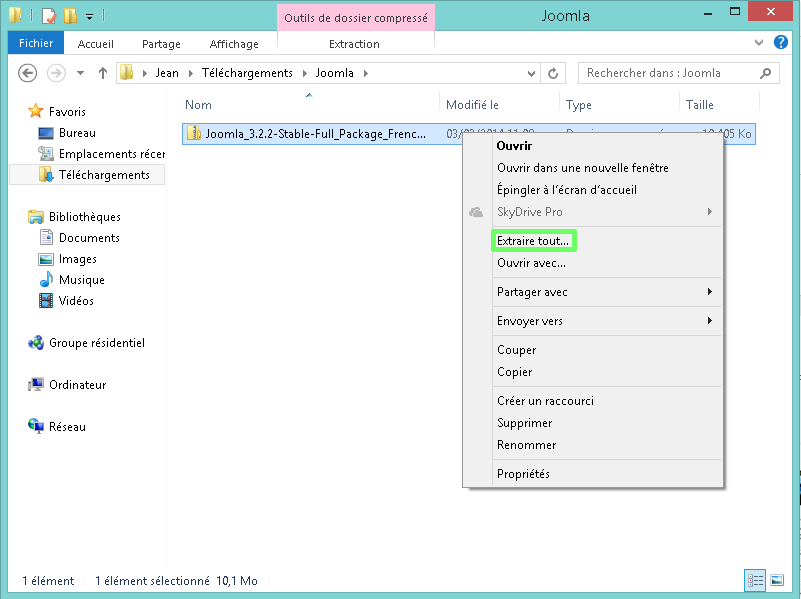
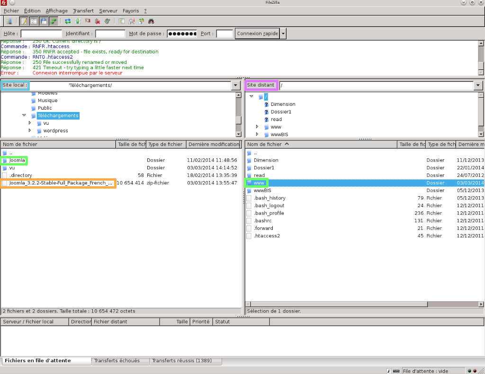
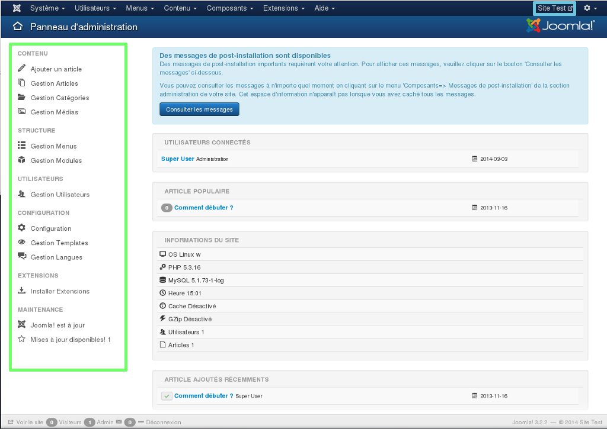

## 1. Osa: asennuksen valmistelu

## Tarvittavat työkalut
Jotta voit asentaa Joomla!alustan webhotelliisi, on suositeltavaa käyttää FTP-ohjelmistoa kuten FileZillaa (ilmainen).

## Asennukseen tarvittavat tunnukset:
Varmista, että sinulla on [hallintapaneeliin](https://www.ovh.com/manager/web/login/) kirjautumiseen tarvittava käyttäjätunnus ja salasana (nic-handle).

- Hae FTP-tunnuksesi ja salasanasi, joiden avulla voit kirjautua webhotelliin.
FTP-tunnusten hakemisesta voi lukea lisää ohjeesta: 

- On tärkeää, että sinulla on myös SQL-tietokantasi tunnukset, jotta pääset sisään tietokantaasi.
SQL-tunnusten hakemisesta voi lukea lisää ohjeesta: 

{.thumbnail}

## 2. osa:  lähdetiedostojen kerääminen

- Mene Joomla! -järjestelmän kehittäjän sivuille .

Löydät sieltä linkin, josta voit ladata järjestelmän tuoreimman vakaan version tietokoneellesi.

Tiedosto, jonka saat on yleensä pakattu (Zip),joten tietokoneesi täytyy purkaa se. Mikäli tarvitset apua tiedoston purkamiseen, aiheesta löytyy lukuisia ohjeita internetistä.

{.thumbnail}

## 3. Osa: Tiedostojen asettaminen FTP-palvelimelle

## Tiedoston purkaminen
Avaa kansio, johon latasit pakatun tiedoston.

Klikkaa hiiren oikeaa näppäintä kansion kohdalla ja valitse "Pura kaikki". 

Ilmoita kohde, mihin puretut tiedostot laitetaan.

Verkosta löytyy lukuisia ohjeita tiedostojen purkamiseen liittyen. Katso niitä, jos et pääse tästä kohdasta eteenpäin.

Juurikansion nimeksi tulee

"Joomla"

{.thumbnail}

## Kirjautuminen webhotelliin FTP:llä
Webhotelliin täytyy kirjautua sisään, jotta sinne voi asettaa Joomla!-tiedostoja.

Webhotelliin kirjautumisesta FTP:llä on myös saatavina ohje:

{.thumbnail}

## Tiedostojen siirtäminen FTP:n kautta
Seuraa näitä vaiheita tiedoston siirtämiseksi FTP-yhteydellä.

## 1. Vaihe
Yhdistä ensin FileZillaan.

Avaa osassa "Site local", joka vastaa tietokoneellasi olevaa tiedostolistaa, purettu "Joomla!"-kansio. Se sisältää kaikki sisällönhallintajärjestelmän tiedostot.

Avaa webhotelliasi vastaavassa osiossa "Site distant", "www"-kansio. Tähän kansioon tullaan siirtämään kaikki sisällönhallintajärjestelmän tiedostot.

Jos kansiota ei ole olemassa, se voidaan luoda.

Tiedostot täytyy ehdottomasti aseettaa "www"-kansioon, muuten asennusprosessiin ei pääse verkkotunnuksestasi.

{.thumbnail}

## 2. Vaihe
Kun edellisen vaiheen kansiot on avattu:

Löydät osiosta "Site local" kaikki Joomla!-järjestelmän asennukseen tarvittavat tiedostot.

Valitaksesi kaikki tiedostot klikkaa CTRL+A.

Rahaa seuraavaksi tiedostot osiosta "Site distant""www"-kansioon.

On hyvin mahdollista, että "www"-kansio ei ole tyhjä. Sen sisältämät muut tiedostot täytyy ehdottomasti poistaa ennen siirtoa. Tähän kohtaan palataan myöhemmin tässä ohjeessa.

{.thumbnail}

## 3. Vaihe
Tiedostojen siirto on käynnissä.

Odota, että kaikki tiedostot ovat siirtyneet FTP-palvelimelle. Tässä voi kestää joitakin minuutteja.

Kun siirto on päättynyt, varmista että kaikki tiedostot ovat siirtyneet oikein.

Tämä toimenpide päättää osion, joka koskee tiedostojen asettamista FTP-palvelimelle.

{.thumbnail}

## 4. Osa: linkki tietokantaan

- Ennen kuin jatkat asennusta, tyhjennä selaimesi välimuisti virheiden välttämiseksi.

Luodaksesi yhdyslinkin tietokantasi ja Joomla!- järjestelmän välille, seuraa sisällönhallintajärjestelmän asennusohjeita:

## 1. Vaihe
Mene verkkotunnukseesi.
Asennusapuri käynnistyy.

Aluksi on määritettävä Joomla!-järjestelmän konfiguraatiotiedot:

Select Language: valitse järjestelmän asennuskieli

Site Name: määritä verkkosivun nimi, tämä voi vaikuttaa indeksointiin.

Description: anna sivulle kuvaus, tämä voi vaikuttaa indeksointiin. 

Site Offline: voit estää ulkopuolisten pääsyn sivulle

Email: syötä voimassa oleva sähköpostiosoite

Username: valitse käyttäjätunnus, jolla pääset hallintajärjestelmään.

Password: määrittele salasana, jolla pääset hallintajärjestelmään.

Confirm Password:: vahvista äsken antamasi salasana

Klikkaa Next siirtyäksesi seuraavaan vaiheeseen

{.thumbnail}

## 4. Vaihe
Käytä tietokantasi tunnuksia. (Aiheesta löytyy apua tämän ohjeen alussa.)

Syötä pyydetyt tietokannastaasi koskevat tiedot:

Database type: Valitse MySQL-tyyppi.

Database server address:syötä tietokannan palvelimen nimi, se ilmoitetaan hallintapaneelissa tai tietokanna asennuksen vahvistussähköpostissa.

Username(login): Identtinen tietokannan nimen kanssa. Löydät sen tietokannan asennuksen vahvistussähköpostista.

Database password: tietokannan salasana on lähetetty sinulle tietokannan luomisen yhteydessä - olet saattanut muuttaa sitä.

Database name: tietokannan nimi, määritelty tietokannan luomisen yhteydessä hallintapaneelissa.

Tables prefix: hyödyllinen, jos haluat asentaa useita Joomla! -moduuleja samaan tietokantaan. Siinä tapauksessa jokaiselle asennukselle on käytettävä eri etuliitettä.

Edellinen asennus: mikäli tietokannassa on taulukoita, joiden etuliite on sama kuin asennuksessa käytetty, ne nimetään uudelleen etuliittellä "bak_".

Klikkaa "Next" vahvistaaksesi tiedot.

{.thumbnail}

## Viimeistely

## Asennuksen viimeistely
Jatka vaiheita Joomla!-järjestelmän asennuksen loppuun saattamiseksi.

## 1. Vaihe
Eteesi ilmestyy muistutus valituista asetuksista.

Sinua pyydetään antamaan kaksi tietoa:

- Site Type:

Valitse Learn Joomla! English (GB) sample data.

- Email configuration

Ilmoita, jos haluat vastaanottaa asennustietoja, kuten aiemmin määritellyn salasanan, sähköpostitse.

Klikkaa Install jatkaaksesi eteenpäin.

{.thumbnail}

## 2. Vaihe
Odota hetki, että asennus valmistuu.

{.thumbnail}

## 3. Vaihe
Turvallisuussyistä Joomla! suosittaa asennushakemiston poistamista.

Se tapahtuu klikkaamalla kohtaa Remove Installation folder.

{.thumbnail}

## 4. Vaihe
Näät viestin, joka vahvistaa kansion poistamisen.

Jatkossa voit kirjautua Joomla! järjestelmän hallintapaneeliin. Kirjaudu sisään avautuvassa ikkunassa, jossa voit myös tarkastella Joomla!:n asettamaa etusivua.

{.thumbnail}

## Näkymä Joomla! -järjestelmän hallintapaneeliin
Nähdäksesi Joomla!:n hallintapaneelin, klikkaa oheista kuvaa.

{.thumbnail}

## Hyödyllistä tietoa
OVH ei voi auttaa Joomla!-järjestelmän konfiguraatioon liittyvissä kysymyksissä.
Saatavilla on kuitenkin aiheeseen liittyvä ohje: .

Voit myös tutustua Joomla!-ratkaisulle omistettuihin foorumeihin. 

Esimerkiksi:

## Tyypillinen virhe: sivua rakennetaan
Olet siirtänyt tiedostosi FTP-palvelimelle, mutta sivu "site under construction" on edelleen näkyvissä.

Webhotellin asennuksen ajaksi, OVH asettaa odotussivun kunnes olet siirtänyt tiedostot internettiin.

Jos siirrät tiedostot "www"-kansioon poistamatta OVH:n lisäämää sisältöä, voi tästä aiheutua ongelmia. 

Tilanteen korjaamiseksi, OVH:n webhotelliin asettama tiedosto "index.html" on poistettava tai nimettävä uudelleen.

Voi olla hyödyllistä antaa tiedostolle vain uusi nimi, jotta voit aktivoida sen koska tahansa uudestaan ja käyttää jälleen odotussivuna.

Muuta hyödyllistä tietoa: verkkosivujesi tiedostojen täytyy sijaita "www"-kansiossa, jotta ne otetaan huomioon.

{.thumbnail}

## Tyypillinen virhe: PHP-versio
Tässä on kyse palvelimen PHP-versioon liittyvästä virheestä.

Syy virheeseen on yksinkertainen: viimeistä PHP-versiota ei ole aktivoitu. 

PHP-version muokkaamisesta webhotelleissa on tarjolla ohje:

{.thumbnail}

## Tyypillinen virhe: Magic Quotes
Kyseessä on huonosti määritelty muuttuja, joka estää Joomla!-järjestelmän asennuksen.

Konfiguraatiotiedostossa Magic Quotes -muuttujan on siis oltava tilassa OFF ja 0.

Uusissa 2014-tuotteissa, Magic Quotes -muuttuja on oletuksena deaktivoitu kun PHP-FPM on aktivoituna. Vanhemmissa webhotelleissa muuttujan voi deaktivoida tiedostossa .htaccess. 

PHP-muuttujan muokkauksesta uudessa webhotellissa on saatavilla ohje tässä:

PHP-muuttujan muokkaamiseen vanhoissa webhotelleissa on saatavilla ohje tässä:[PHP-muuttujan muokkaaminen OVH:n vanhoissa tuotteissa](http://guide.ovh.com/ConfigPhp)

{.thumbnail}

