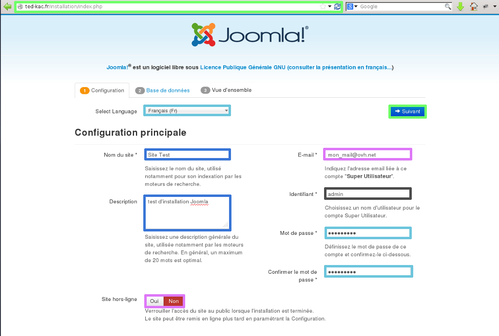
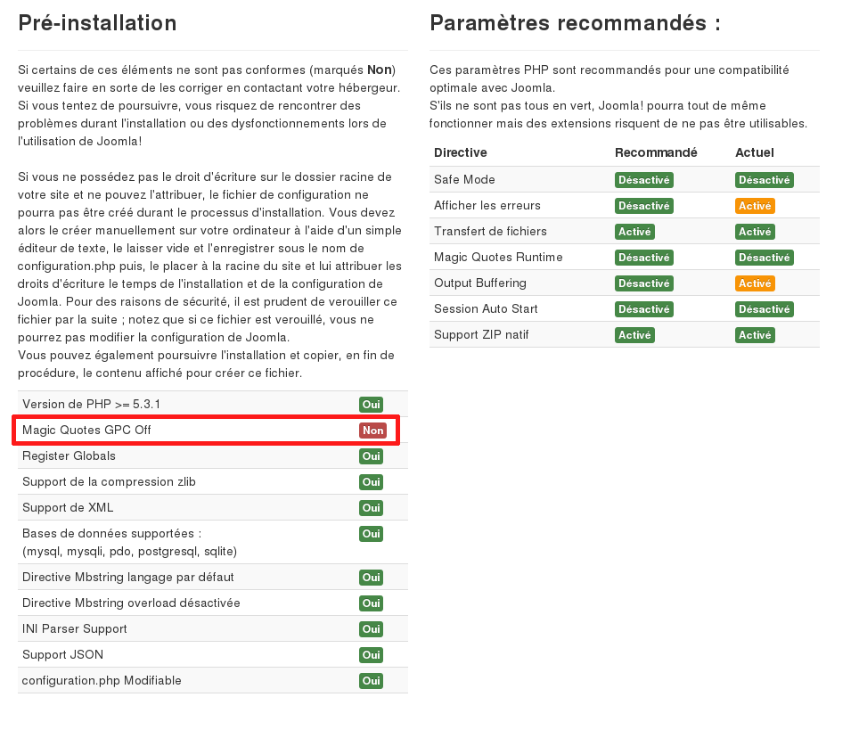

Pour vous aider, chacune des étapes est détaillée. Pour toute demande précise liée au CMS, nous vous invitons à vous rapprocher de l'éditeur du CMS, ou des communautés en rapport avec celui-ci.

Si vous souhaitez installer d'autres modules/CMS, consultez [ce guide]({legacy}1375){.ref}.

Les CMS sont des [systèmes de gestion de contenu](https://fr.wikipedia.org/wiki/Syst%C3%A8me_de_gestion_de_contenu){.external}, ils ont généralement besoin d'une plateforme d'hébergement comprenant un serveur FTP, une base de données, et un nom de domaine.

Vous pouvez trouver tous ces éléments dans [nos offres](https://www.ovh.com/fr/hebergement-web/){.external}.

*Si vous souhaitez installer Joomla de manière automatique depuis votre espace client, vous pouvez vous aider du guide suivant :* {.ref}

## Joomla!

### Partie 1 &#58; preparation de linstallation
Pour installer la plateforme  **Joomla!**  sur votre offre d'hébergement mutualisé, nous vous conseillons de vous munir d'un logiciel  **FTP**  tel que **FileZilla**  (gratuit). *Assurez-vous d'être en possession de votre identifiant client (nic-handle) et de votre mot de passe, pour pouvoir vous connecter à votre espace client OVH si nécessaire.*

- Récupérez votre identifiant et le mot de passe FTP qui vous permettent de vous connecter sur l'hébergement web.
- Il est aussi nécessaire d'avoir en votre possession votre identifiant et le mot de passe de la base de données SQL qui vous permettent de vous connecter dans la base de données.

{.thumbnail}

### Partie 2 &#58; recuperation des fichiers sources
- Rendez-vous sur le site du développeur de [Joomla!](http://aide.joomla.fr/telechargements/joomla-3-0-package-d-installation-et-patchs){.external} que vous pourrez télécharger.

**compressé**  (zippé), il faudra être en mesure de le  **décompresser**  (extraire) sur votre ordinateur. Vous trouverez sur Internet différentes aides à ce sujet.

{.thumbnail}

### Partie 3 &#58; mise en place des fichiers sur le FTP
Ouvrez le dossier dans lequel vous avez téléchargé le dossier compressé.

Réalisez un clic droit sur le dossier en question, puis sélectionnez "Extraire tout...".

Indiquez une destination afin d'extraire vos fichiers dans un nouveau dossier.

*De nombreux tutoriels et logiciels de décompression sont disponibles sur internet pour vous aider à réaliser ces manipulations. Consultez-les si vous êtes bloqués à cette étape.*

Le dossier cible sera intitulé " **Joomla** "

{.thumbnail}

Pour déposer les fichiers de  **Joomla!**  sur votre hébergement, vous devez tout d'abord vous connecter à celui-ci.

*Un guide est disponible concernant la connexion en FTP sur l'offre mutualisée :* {.ref}

{.thumbnail}

Suivez ces étapes pour déposer vos fichiers sur le FTP. Une fois connecté à FileZilla.

Dans la partie "Site local", qui correspond à la liste des fichiers présents sur votre ordinateur, ouvrez le dossier décompressé intitulé "Joomla!" dans lequel sont présents les fichiers du CMS.

Dans la partie "Site distant" qui correspond dans ce cas à votre hébergement mutualisé OVH, ouvrez le dossier "www". C'est dans ce dossier que tous les fichiers du CMS devront être déposés.

*Si ce dossier n'existe pas il vous est possible de le créer.*

*Vos fichiers doivent obligatoirement être déposés dans le dossier "www" sinon la procédure d'installation ne sera pas accessible depuis votre nom de domaine.*

{.thumbnail}

Une fois ces dossiers ouverts :

Dans la partie "Site local", vous retrouvez tous les fichiers nécessaires à l'installation du CMS Joomla!.

Pour tous les sélectionner, réaliser la combinaison de touche  **CTRL+A** .

Réalisez ensuite le glisser-déposer des fichiers vers la partie "Site distant" dans le dossier "www".

*Il est fort probable que le dossier "www" ne soit pas vide. Il n'est pas obligatoire de supprimer les fichiers présents dedans. Nous reviendrons sur ce point dans la suite de ce guide.*

{.thumbnail}

Le transfert des fichiers est terminé.

La totalité des fichiers doivent être déposés sur le serveur FTP distant. Cela peut prendre quelques minutes.

Une fois le transfert terminé, assurez-vous que tous les fichiers et les dossiers ont été correctement transférés.

Cette opération conclut la partie consacrée au dépôt des fichiers sur le FTP.

{.thumbnail}

### Partie 4 &#58; lien avec la base de donnees
- Avant de continuer l'installation, videz le cache de votre navigateur internet, afin d'éviter toute erreur.

Pour réaliser le lien entre votre base de données et Joomla!, suivez les étapes d'installation du CMS : Rendez-vous sur votre nom de domaine. L'assistant d'installation s'exécute.

Dans un premier temps, il faut définir les informations de configuration de **Joomla!**  :

Select Language : sélectionnez la langue d'installation de Joomla!.

Nom du site : définissez le nom du site, cela peut influencer le référencement.

Description : définissez la description du site, cela peut influencer le référencement.

Site hors-ligne : vous permet de bloquer l'accès du site au public.

E-mail : renseignez un e-mail valide à ce niveau.

Identifiant : choisissez l'identifiant permettant d'accéder à la console d'administration.

Mot de passe : définissez votre mot de passe pour l'accès à la partie administration du site.

Confirmer le mot de passe : validez le mot de passe renseigné précédemment.

Cliquez sur "Suivant" pour continuer vers l'étape suivante.

{.thumbnail}

Munissez-vous des identifiants de votre base de données (une aide à ce sujet est disponible dans le début de ce guide).

Renseignez les informations demandées concernant la base de données :

Type de la base de données : sélectionnez le type de base MySQL.

Nom du serveur : renseignez le nom du serveur de votre base de données, indiqué dans le mail d'installation ou dans votre espace client.

Nom d'utilisateur : identique au nom de la base de données, vous le trouverez dans l'e-mail d'installation de la base de données.

Mot de passe : vous a été envoyé par mail lors de la création de la base de données – il est possible que vous l'ayez modifié.

Nom de la base de données : choisi lors de sa création dans l'espace client.

Préfixe des tables : utile pour réaliser plusieurs installations de Joomla! sur la même base de données. Dans ce cas, il faudra renseigner un préfixe différent pour chacune des installations.

Installation précédente : si des tables sont présentes en base de données, celles dont le préfixe est le même que celles renseignées à l'installation seront renommées avec le préfixe "bak".

Cliquez sur "Suivant" pour valider les informations demandées.

{.thumbnail}

### Finalisation
Afin de terminer l'installation de Joomla!, continuez les étapes d'installation. Un rappel des paramètres sélectionnés apparaît.

Deux informations vous sont demandées :

- Type de site :

Sélectionnez "Simple page d'accueil en français".

- Envoi de la configuration

Indiquez si vous souhaitez recevoir par e-mail les informations d'installation, telles que le mot de passe d'accès à la partie administration défini précédemment.

Cliquez sur "Installer" pour poursuivre.

{.thumbnail}

Patientez quelques instants durant l'installation.

{.thumbnail}

Par mesure de sécurité  **Joomla!**  vous invite à supprimer le répertoire d'installation.

Pour cela cliquez simplement sur "Supprimer le répertoire d'installation".

{.thumbnail}

Un message confirme la suppression du répertoire.

Vous pouvez à présent vous connecter dans la partie administration de **Joomla!** . Identifiez-vous dans la fenêtre qui s'ouvre, où vous pouvez également consulter la page d'accueil mis en place par  **Joomla!** .

{.thumbnail}

Pour un aperçu du panel d'administration de Joomla!, cliquez sur l'image ci- contre.

{.thumbnail}

### Informations utiles
**Le support d'OVH ne sera pas habilité à vous répondre pour toute demande d'aide concernant la configuration de votre Joomla!.** **Cependant, un guide d'utilisation est à votre disposition** : {.ref} **.**

Vous pouvez également consulter les forums dédiés à la solution Joomla!.

- Voici un lien vers un [forum d'entraide](http://forum.joomla.fr/){.external} dédié à ce CMS.

Vous avez mis en place vos fichiers sur le FTP, cependant la page "site en construction" est toujours affichée.

À l'installation de votre hébergement, OVH met en place une page d'attente, le temps que vous déposiez les fichiers de votre site internet.

Si vous déposez simplement vos fichiers dans le dossier  **"www"**  sans supprimer le contenu déposé par OVH, vous risquez de rencontrer ce souci.

Afin de corriger cela, vous devez supprimer ou renommer le fichier "index.html" mis en place par OVH sur votre hébergement.

*Il peut être intéressant de simplement le renommer afin de vous permettre de le réactiver à tout moment et de vous en servir comme page d'attente.*

Autre information utile : les fichiers de votre site doivent être déposés dans le dossier "www" afin d'être pris en compte.

{.thumbnail}

Il s'agit ici d'une erreur concernant la version PHP de votre serveur.

La cause est simple : la dernière version du PHP n'a pas été activée.

*Un guide est disponible concernant la modification de la version PHP sur l'offre mutualisée :* {.ref}

{.thumbnail}

Il s'agit d'une variable mal définie qui empêche l'installation de Joomla!.

Magic Quotes doit être à Off et, donc, à 0 dans votre fichier de configuration.

Sur les nouvelles offres 2014, si PHP-FPM est activé, alors la variable Magic Quote est désactivé par défaut. Pour les anciennes offres mutualisées, vous pouvez désactiver cette variable dans le fichier .htaccess.

*Un guide est disponible concernant la modification de variable PHP sur l'offre mutualisée 2014 :* {.ref}

*Un guide est disponible concernant la modification de variable PHP sur les anciennes offres :* [Modification de variable PHP sur d'anciennes offres OVH](http://guide.ovh.com/ConfigPhp){.external}

{.thumbnail}