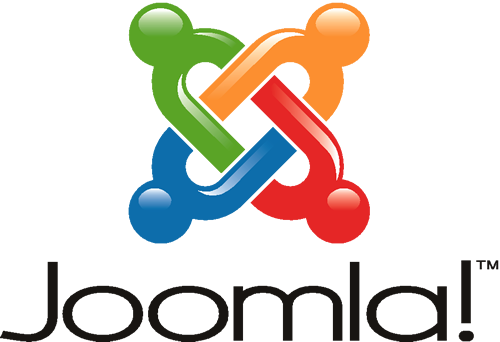
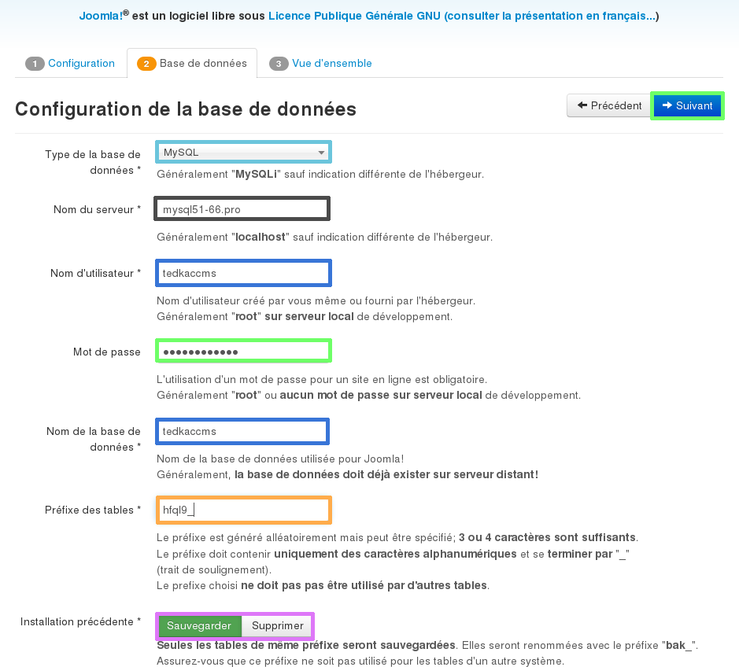
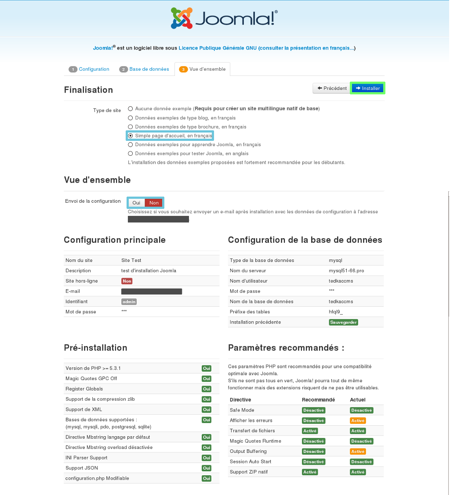

## Parte 1: preparazione all’installazione

## [b]Software[/b]
Per installare la piattaforma Joomla! sulla tua offerta di hosting condiviso, ti consigliamo di utilizzare un client FTP come FileZilla (gratuito).

## [b]Credenziali[/b]
Assicurati di disporre delle credenziali (Nic-handle e password) di accesso al tuo [Spazio Cliente OVH](https://www.ovh.com/manager/web/login/).

- Recupera le credenziali FTP per accedere al tuo hosting Web.
Per recuperare gli identificativi FTP, consulta la guida 

- Assicurati di avere a disposizione le credenziali per accedere al tuo database SQL.
Per recuperare le tue credenziali SQL, consulta la guida 

{.thumbnail}

## Parte 2: recupero dei file sorgente

- Accedi al sito di [Joomla!](http://www.joomla.it/download/joomla-3/joomla-3-3-0-4.html).

In genere, il link disponibile ti permette di scaricare l'ultima versione stabile del CMS.

Il file scaricato generalmente è compresso (.zip). Per aprirlo e installarlo è necessario decomprimerlo.

{.thumbnail}

## Parte 3: configurazione dei file sull'FTP

## - Decomprimi la cartella:
Apri la cartella in cui hai scaricato il file compresso.

Clicca con il tasto destro, seleziona Estrai tutto... o Estrai qui e indica la cartella di destinazione dei tuoi file.

Se hai bisogno di aiuto, segui i numerosi tutorial online e scarica uno dei tanti programmi per decomprimere file .zip disponibili su Internet.

La cartella di destinazione si chiamerà Joomla! (xxx spesso è sostituito dal numero della versione).

{.thumbnail}

## - Accedi al tuo hosting Web via FTP
Accedi al tuo hosting e salva i file di Joomla!.

Se hai bisogno di aiuto per accedere in FTP alla tua soluzione di hosting condiviso, consulta la guida 

{.thumbnail}

## - Trasferisci i tuoi file via FTP
Per salvare i tuoi file sull'FTP, segui questi step.

## Step 1
Apri FileZilla.

Nella sezione Sito locale, che contiene l'elenco dei file presenti sul tuo pc, apri la cartella decompressa Joomla! in cui sono presenti i file del tuo CMS.

Nella sezione Sito remoto, che corrisponde in questo caso al tuo hosting condiviso OVH, apri la cartella www in cui dovrai salvare tutti i file del CMS.

Se questa cartella non esiste, puoi crearla.

Per poter effettuare l'installazione dal tuo dominio, i tuoi file devono necessariamente essere salvati nella cartella "www".

{.thumbnail}

## Step 2
Apri le cartelle:

Nella sezione Sito locale, trovi i file necessari all'installazione di Joomla!.

Selezionali tutti premendo i tasti CTRL+A.

Trascina i tuoi file nella cartella "www" della sezione Sito remoto.

È molto probabile che la cartella "www" non sia vuota. Non è obbligatorio eliminare i file presenti al suo interno.

{.thumbnail}

## Step 3
Attendi qualche minuto fino al completo trasferimento dei file sul server FTP remoto.

Al termine dell'operazione, assicurati che tutti i file e le cartelle siano stati spostati correttamente.

{.thumbnail}

## Parte 4: collega Joomla! al tuo database

- Per evitare errori, prima di proseguire cancella la cache del tuo browser.

Per collegare Joomla! al tuo database, è necessario seguire gli step di installazione del CMS.

## Step 1
Accedi al tuo dominio e inserisci le informazioni di configurazione di Joomla!:

Seleziona la lingua: seleziona la lingua di installazione di Joomla!.

Nome sito: definisci il nome del tuo sito (ti ricordiamo che può influenzarne la referenziazione).

Descrizione: inserisci la descrizione del tuo sito (ti ricordiamo che può influenzarne la referenziazione).

Sito Offline: ti permette di bloccare l'accesso al tuo sito al pubblico.

Email amministratore: inserisci un indirizzo email valido.

Nome utente: scegli il nome utente per accedere al tuo sito come amministratore.

Password amministratore: definisci la password per accedere al tuo sito come amministratore.

Conferma Password amministratore: conferma la password inserita precedentemente.

Clicca su Avanti per continuare.

{.thumbnail}

## Step 2
Inserisci le informazioni del tuo database:

Tipo database: seleziona il tipo di database, generalmente MySQL.

Nome Host: inserisci il nome del server del tuo database, indicato nell'email di installazione o nel tuo Spazio Cliente OVH.

Nome utente: uguale al nome del database, indicato nell'email di installazione.

Password: se non l'hai modificata, la password che hai ricevuto per email al momento della creazione del tuo database.

Nome database: definito al momento della creazione nel tuo Spazio Cliente OVH.

Prefisso tabelle: utile per realizzare più installazioni di Joomla! utilizzando lo stesso database. In questo caso, è necessario inserire un prefisso diverso per ognuna delle installazioni.

Processa database vecchio: se le tabelle già esistenti nel database hanno lo stesso prefisso di quelle definite al momento dell’installazione, verranno rinominate con il prefisso "bak_".

Clicca su Avanti per confermare le informazioni inserite.

{.thumbnail}

## Finalizzazione

## Finalizzazione dell'installazione
Segui gli step di installazione del CMS per completare l'installazione del tuo Joomla!

## Step 1
Compare la pagina di riepilogo dei dati.

Ti vengono richieste due informazioni:

- Dati di esempio:

Seleziona Dati di esempio italiani.

- Configurazione email:

Indica se vuoi ricevere via email le impostazioni della configurazione, come la password per accedere al pannello amministrativo.

Clicca su Installa per continuare.

{.thumbnail}

## Step 2
Attendi qualche minuto fino al completamento dell’installazione.

{.thumbnail}

## Step 3
Per motivi di sicurezza, Joomla! ti invita a eliminare la cartella installation.

Per eseguire questa operazione, clicca semplicemente sul tasto Elimina la cartella installation.

{.thumbnail}

## Step 4
Compare un messaggio di conferma della cancellazione della cartella.

A questo punto, inserisci le tue credenziali per accedere al pannello amministrativo e alla homepage di Joomla!.

{.thumbnail}

## Pannello di amministrazione di Joomla!
Una volta effettuato l'accesso, visualizzi il pannello di amministrazione di Joomla!.

{.thumbnail}

## Informazioni utili
Il supporto OVH non risponde alle domande relative alla configurazione del tuo Joomla!. Se hai bisogno di aiuto, consulta la guida  disponibile online o i [forum dedicati](http://forum.joomla.it/) a questa soluzione.

## - Errore "Sito in costruzione"
Hai configurato i tuoi file sul tuo server FTP, ma continui a visualizzare la pagina "Sito in construzione".

Quando installi il tuo hosting, OVH realizza una pagina di attesa per permetterti di caricare i file del tuo sito.

Se salvi i file nella cartella www ma non elimini il contenuto inserito da OVH, potrebbe verificarsi questo problema.

Per risolverlo, elimina o rinomina il file "index.html" che OVH ha salvato sul tuo hosting.

Se rinomini semplicemente il file, puoi riattivarlo in qualsiasi momento per utilizzarlo come pagina di attesa.

Altre informazioni utili: per essere presi in carico, i file del tuo sito devono trovarsi nella cartella "www".

{.thumbnail}

## - Errore con la versione di PHP
È un errore che riguarda la versione PHP del tuo server.

La causa è semplice: l'ultima versione di PHP non è stata attivata.

Per modificare la versione PHP del tuo hosting coindiviso, consulta la guida [Configura PHP sul tuo Hosting Web OVH]({legacy}1207)

{.thumbnail}

## Errore Magic Quotes
Se si verifica questo errore, significa che la variabile Magic Quotes non è definita in modo corretto e impedisce l'installazione di Joomla!.

Magic Quotes deve essere Off, cioè a 0 nel tuo file di configurazione.

Nelle nuove offerte 2014, Magic Quote è disattivata di default se PHP-FPM è attivato. Nelle vecchie offerte du hosting condiviso, è possibile disattivare la variabile nel file .htaccess.

Per modificare la versione PHP del tuo hosting coindiviso 2014, consulta la guida [Configura PHP sul tuo Hosting Web OVH]({legacy}1207).

Per modificare la versione PHP su una vecchia offerta, consulta la guida []]({legacy}1175).

{.thumbnail}

