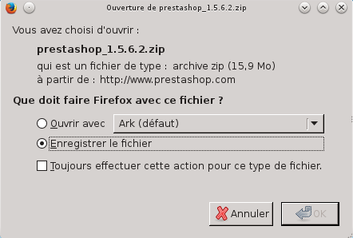
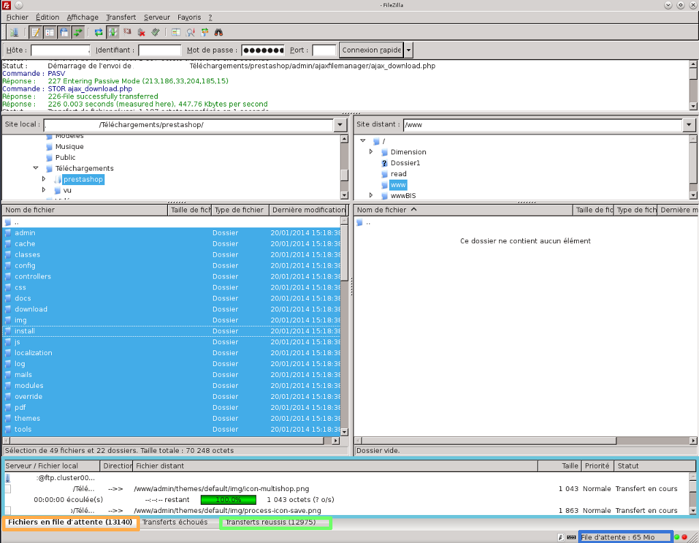
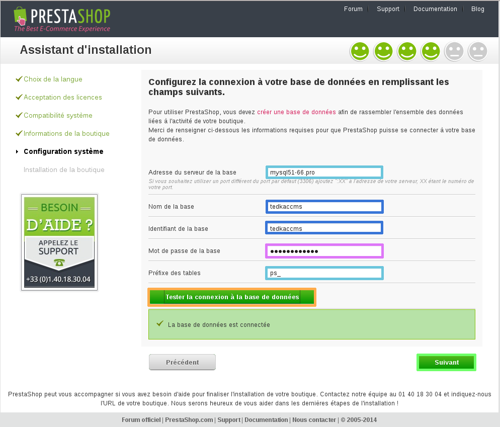
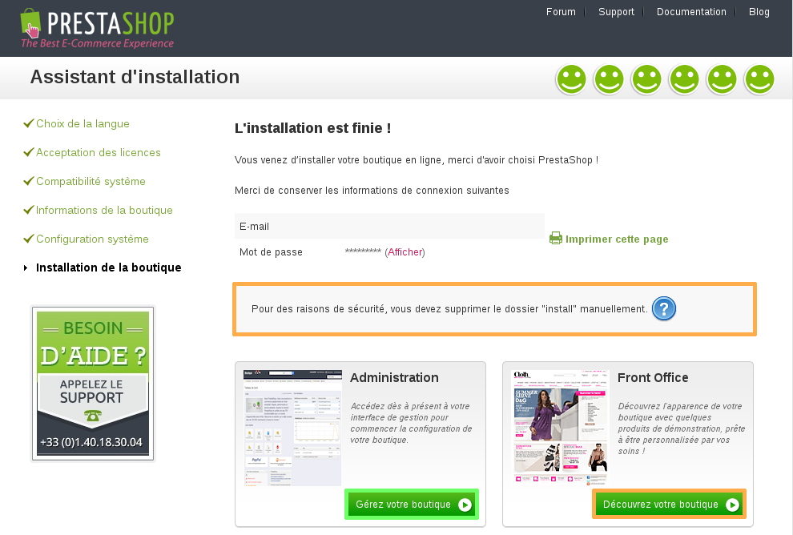
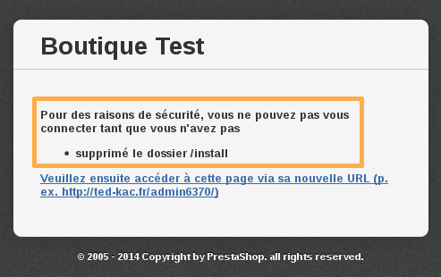

## 1. Vaihe: asennuksen valmistelu

## Tarvittavat työkalut
Jotta voit asentaa PrestaShop-alustan webhotelliisi, on suositeltavaa käyttää FTP-ohjelmistoa kuten FileZillaa (ilmainen).

## Asennukseen tarvittavat tunnukset:
Varmista, että sinulla on hallintapaneeliin kirjautumiseen tarvittava käyttäjätunnus ja salasana (nic-handle).

- Hae FTP-tunnuksesi ja salasanasi, joiden avulla voit kirjautua webhotelliin.
FTP-tunnusten hakemisesta voi lukea lisää ohjeesta: 

- On tärkeää, että sinulla on myös SQL-tietokantasi tunnukset, jotta pääset sisään tietokantaasi.
SQL-tunnusten hakemisesta voi lukea lisää ohjeesta: 

{.thumbnail}

## 2. Vaihe:  lähdetiedostojen hakeminen

- Mene PrestaShop -järjestelmän kehittäjän sivuille .

Löydät sieltä linkin, josta voit ladata järjestelmän tuoreimman vakaan version tietokoneellesi.

Tiedosto, jonka saat on yleensä pakattu (Zip),joten tietokoneesi täytyy purkaa se. Aiheesta löytyy lukuisia ohjeita internetistä.

{.thumbnail}

## 3. Vaihe: tiedostojen siirtäminen FTP:llä

## Tiedoston purkaminen
Avaa kansio, johon latasit pakatun tiedoston.

Klikkaa hiiren oikeaa näppäintä kansion kohdalla ja valitse "Pura kaikki". 

Ilmoita kohde, mihin puretut tiedostot laitetaan.

Verkosta löytyy lukuisia ohjeita tiedostojen purkamiseen liittyen. Katso niitä, jos et pääse tästä kohdasta eteenpäin.

Juurikansion nimeksi tulee

"prestashop"

{.thumbnail}

## Kirjautuminen webhotelliin FTP:llä
Webhotelliin täytyy kirjautua sisään, jotta sinne voi asettaa PrestaShop-tiedostoja.

Webhotelliin kirjautumisesta FTP:llä on myös saatavina ohje: 

{.thumbnail}

## Tiedostojen siirto FTP:N kautta
Seuraa vaiheita siirtääksesi tiedostoja FTP:n avulla.

## 1. Vaihe
Yhdistä ensin FileZillaan.

Avaa osassa "Site local", joka vastaa tietokoneellasi olevaa tiedostolistaa, purettu "prestashop"-kansio. Se sisältää kaikki sisällönhallintajärjestelmän tiedostot.

Avaa webhotelliasi vastaavassa osiossa "Site distant", "www"-kansio. Tähän kansioon tullaan siirtämään kaikki sisällönhallintajärjestelmän tiedostot.

Jos kansiota ei ole olemassa, se voidaan luoda.

Tiedostot täytyy ehdottomasti aseettaa "www"-kansioon, muuten asennusprosessiin ei pääse verkkotunnuksestasi.

{.thumbnail}

## 2. Vaihe
Kun edellisen vaiheen kansiot on avattu:

Löydät osiosta "Site local" kaikki Prestashopin asennukseen tarvittavat tiedostot.

Valitaksesi kaikki tiedostot klikkaa CTRL+A.

Rahaa seuraavaksi tiedostot osiosta "Site distant""www"-kansioon.

On hyvin mahdollista, että "www"-kansio ei ole tyhjä. Sen sisältämät muut tiedostot täytyy ehdottomasti poistaa ennen siirtoa. Tähän kohtaan palataan myöhemmin tässä ohjeessa.

{.thumbnail}

## 3. Vaihe
Tiedostojen siirto on käynnissä.

Odota, että kaikki tiedostot ovat siirtyneet FTP-palvelimelle. Tässä voi kestää joitakin minuutteja.

Kun siirto on päättynyt, varmista että kaikki tiedostot ovat siirtyneet oikein.

Tämä toimenpide päättää osion, joka koskee tiedostojen asettamista FTP-palvelimelle.

{.thumbnail}

## 4. Vaihe: linkki tietokantaan

## Seuraa Prestashopin asennusohjeita

- Virheiden välltämiseksi tyhjennä selaimesi välimuisti ennen asennuksen jatkamista.

Sisällönhallintajärjestelmän ohjeita on seurattava yhdyslinkin luomiseksi tietokannan ja Prestashopin välille.

## 1. Vaihe
Mene verkkotunnukseesi.

Valitse kieli, jota haluat käyttää PrestaShopin asennuksessa.

Klikkaa "Next" jatkaaksesi.

{.thumbnail}

## 2. Vaihe
Ruksaa I agree to the above terms and conditions.

Klikkaa "Next" jatkaaksesi seuraavaan kohtaan.

{.thumbnail}

## 3. Vaihe
Sinua pyydetään täyttämään verkkokauppaasi liittyviä lisätietoja. Täytä seuraavat kentät:

Shop name: verkkokauppasi nimi, tämä voi vaikuttaa hakutuloksiin.

Main activity: verkkokaupan pääasiallinen toiminta.

Country: valitse verkkokauppasi maa.

First name:[/blue ]administraattorin etunimi

Last name: administraattorin sukunimi

E-mail address: syötä voimassa oleva sähköpostiosoite verkkokaupan hallintaan pääsyä varten 

Password: syötä salasana hallintaan pääsyä varten (vähintään 8 merkkiä).

Re-type to confirm: syötä salasana uudestaan

Sign-up to the newsletter: rastita vaihtoehto, jos haluat vastaanottaa PrestaShop-uutiskirjeitä

Klikkaa Next vahvistaaksesi verkkokauppaa koskevat tiedot.

{.thumbnail}

## 4. Vaihe
Käytä tietokantasi tunnuksia. (Aiheesta löytyy apua tämän ohjeen alussa.)

Syötä pyydetyt tietokannastaasi koskevat tiedot:

Database server address: syötä tietokannan palvelimen nimi, se ilmoitetaan hallintapaneelissa tai tietokannan asennuksen vahvistussähköpostissa.

Database name: tietokannan nimi, määritelty tietokannan luomisen yhteydessä hallintapaneelissa.

Username(login): Identtinen tietokannan nimen kanssa.

Database password: tietokannan salasana on lähetetty sinulle tietokannan luomisen yhteydessä - olet saattanut muuttaa sitä.

Tables prefix: hyödyllinen, jos haluat asentaa useita PrestaShop -moduuleja samaan tietokantaan. Siinä tapauksessa jokaiselle asennukselle on käytettävä eri etuliitettä.

Tärkeää: Tietokannan tunnuksia ei lähetetä automaattisesti webhotellin asennuksen yhteydessä. Niiden saamiseksi, tietokanta täytyy aktivoida hallintapaneelista.

Kun tiedot on täytetty, voit testata yhteyttä tietokannassa.

Klikkaa "Next" vahvistaaksesi yhteyden tiedot.

- Nämä vaiheet päättävät yhdyslinkin luomisen tietokannan ja PrestaShopin välille. Jäljellä on enää asennuksen viimeistely.

{.thumbnail}

## Viimeistely

## Asennuksen vaiheiden viimeistely
Jotta voit saattaa loppuun PrestaShop-verkkokaupan asennuksen, seuraa asennusvaiheita.

## 1. Vaihe
Anna asennuksen päättyä. Kun 100% on täyttynyt, eteesi aukeaa uusi ikkuna.

{.thumbnail}

## 2. Vaihe
PrestaShop-verkkokauppa on nyt asennettu!

Voit nyt kirjautua ja aloittaa verkkokaupan rakentamisen klikkaamalla "Manage your store".

- Huomaa, turvallisuussyistä "install"-kansio on poistettava käsin webhotellin "www"-kansiosta, jotta yhdistäminen onnistuu.

{.thumbnail}

## PrestaShop-hallintapaneelin näkymä
Tässä näet, miltä PrestaShopin hallintapaneeli näyttää.

{.thumbnail}

## Hyödyllistä tietoa
OVH ei voi auttaa PrestaShopin konfiguraatioon liittyvissä kysymyksissä.
Saatavilla on kuitenkin aiheeseen liittyvä ohje: .

Suosittelemme tutustumaan PrestaShop-ratkaisuun keskittyviin foorumeihin.

- Tässä esimerkiksi linkki: https://www.prestashop.com/forums/

## Tyypillinen virhe: sivua rakennetaan
Olet siirtänyt tiedostosi FTP-palvelimelle, mutta sivu "site under construction" on edelleen näkyvissä.

Webhotellin asennuksen ajaksi, OVH asettaa odotussivun kunnes olet siirtänyt tiedostot internettiin.

Jos siirrät tiedostot "www"-kansioon poistamatta OVH:n lisäämää sisältöä, voi tästä aiheutua ongelmia. 

Tilanteen korjaamiseksi, OVH:n webhotelliin asettama tiedosto "index.html" on poistettava tai nimettävä uudelleen.

Kannattaa antaa tiedostolle vain uusi nimi, jotta voit aktivoida sen koska tahansa uudestaan ja käyttää sitä jälleen odotussivuna.

Muuta hyödyllistä tietoa: verkkosivujesi tiedostojen täytyy sijaita "www"-kansiossa, jotta ne otetaan huomioon.

{.thumbnail}

## Tyypillinen virhe: unohdit poistaa "install"-tiedoston

- Huomaa, turvallisuussyistä "install"-kansio on poistettava käsin webhotellin "www"-kansiosta. Voit näin kirjautua kun asennus on päättynyt.

{.thumbnail}

