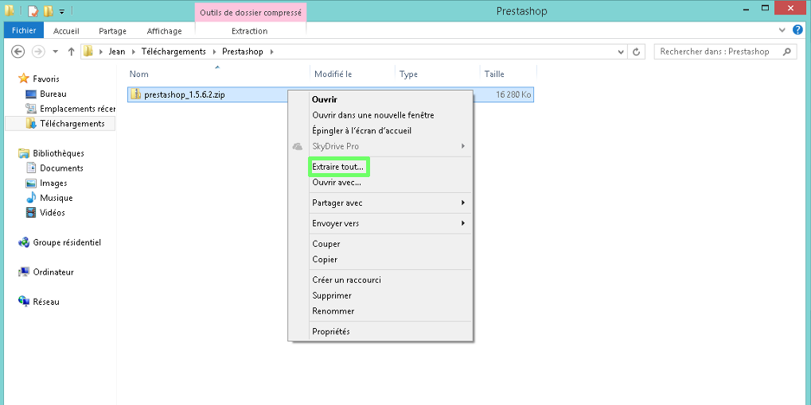
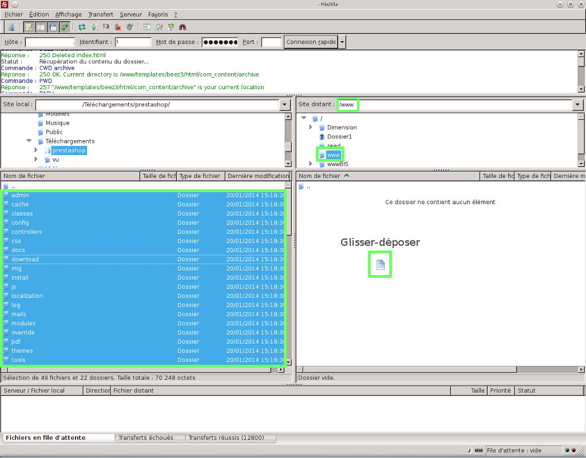

## 1 dalis: pasiruošimas diegimui

## Reikalingi įrankiai
PrestaShop diegimui į talpinimo planą reikės FTP programos, pavyzdžiui, FileZilla (nemokamai).

## Diegimui reikalingi prisijungimo parametrai
Įsitikinkite, kad žinote teisingą OVH kliento ID ir paskyros slaptažodį, nes gali prireikti prisijungti prie valdymo sąsajos.

- Reikės FTP prisijungimo vardo ir slaptažodžio, kad galėtumėte prisijungti prie failų saugyklos. Šiame gide pateikiama informacija, kaip sužinoti FTP prisijungimo duomenis:

- Taip pat reikės SQL identifikacinių duomenų ir slaptažodžio. Šiame gide pateikiama informacija, kaip sužinoti SQL prisijungimo duomenis:

{.thumbnail}

## 2 dalis: diegimo failų parsiuntimas

- Atidarykite kūrėjo svetainę: [PrestaShop](http://www.prestashop.com/).

Kūrėjo svetainėje rasite nuorodą į naujausią stabilią TVS versiją.

Paprastai parsiųstas failas bus suarchyvuotas (zip), todėl prieš įkeliant failus, juos reikės išarchyvuoti (išskleisti). Visą reikiamą pagalba šia tema rasite internete.

{.thumbnail}

## 3 dalis: failų įkėlimas per FTP

## Failų katalogo išarchyvavimas
Atidarykite katalogą, kuriame išsaugotas archyvas.

Dešiniuoju pelės mygtuku spragtelėkite katalogą ir pasirinkite Išarchyvuoti viską....

Nurodykite paskirtį, kad visi failai būtų išarchyvuoti naujame kataloge.

Jeigu reikia pagalbos išarchyvuojant failus, skaitykite internete pateikiamus gidus. 

Naujai sukurtas katalogas bus pavadintas prestashop

{.thumbnail}

## Prisijungimas prie svatainių talpinimo per FTP
Junkitės per FTP, kad įkeltumėte PrestaShop failus į savo svetainių talpinimo plano saugyklą.

Esame paruošę atskirą prisijungimo prie svetainių talpinimo saugyklos per FTP gidą:

{.thumbnail}

## Failų perkėlimas per FTP
Sekite šiuos žingsnius, jei norite įkelti failus per FTP.

## 1 žingsnis
Kai prisijungsite su FileZilla:

Skyriuje Local Site, kuris atitinka jūsų kompiuterio failus, atidarykite išskleistą prestashop katalogą, kuriame yra TVS failai.

Skyriuje Distant Site, kuris atitinka OVH saugyklą, atidarykite www katalogą. Į šį katalogą reikės įkelti TVS failus.

Jeigu tokio katalogo nėra, galite jį sukurti.

Failus būtinai kelkite į www katalogą, kad diegimo sistema būtų pasiekiama per pagrindinį domeną.

{.thumbnail}

## 2 žingsnis
Kai atverti reikiami katalogai:

Skyriuje Local Site matysite visus PrestaShop TVS failus.

Spauskite CTRL+A, kad pažymėtumėte visus failus.

Tuomet pele nuvilkite failus į Distant Site www kataloge.

Gali būti, kad www katalogas nebus tuščias. Nebūtina ištrinti ten esančių failų. Šį atvejį apžvelgsime vėliau.

{.thumbnail}

## 3 žinsgnis
Bus vykdomas failų perkėlimas.

Palaukite, kol failai bus perkelti į FTP saugyklą. Tai gali užtrukti kelias minutes.

Kai perkėlimas bus baigtas, patikrinkite, ar visi failai buvo perkelti.

Failų įkėlimo per FTP dalis baigta.

{.thumbnail}

## 4 dalis: susiejimas su duomenų baze

## Tęskite PrestaShop diegimą.

- Prieš tęsdami diegimą išvalykite naršyklės spartinančiąją atmintinę, kad išvengtumėte galimų klaidų.

PrestaShop ir duomenų bazės susiejimas atliekamas TVS diegimo metu.

## 1 žingsnis
Naršyklės adreso juostoje įveskite savo domeną.

Matysite pasveikinimo langą. Jame reikės pasirinkti kalbą, kuri bus naudojama PrestaShop. Čia naudosime anglų English.

Spragtelėkite Next, kad pereitumėte prie kito žingsnio.

{.thumbnail}

## 2 žingsnis
Pažymėkite I agree to the above terms and conditions.

Spragtelėkite Next, kad pereitumėte prie kito žingsnio.

{.thumbnail}

## 3 žingsnis
Šiame žingsnyje reikia įvesti papildomą informaciją.
Papildomos informacijos laukai yra šie:

Shop name: Parduotuvės pavadinimas. Tai gali įtakoti surandamumą.

Main activity: Nurodykite pagrindinę parduotuvės veiklos sritį.

Country: Nurodykite parduotuvės šalį.

First name: Administratoriaus vardas.

Last name: Administratoriaus pavardė.

E-mail address: Įveskite galiojantį parduotuvės administratoriaus slaptažodį.

Password: Įveskite administratoriaus slaptažodį (mažiausiai 8 simboliai).

Re-type to confirm: Įveskite slaptažodį dar kartą.

Sign-up to the newsletter: pažymėkite, jei pageidaujate gauti PrestaShop naujienlaiškius (juos siunčia PrestaShop).

Spragtelėkite Next ir PrestaShop diegimas prasidės.

{.thumbnail}

## 3 žingsnis
Jums reikės įvesti duomenų bazės informaciją (duomenų bazės pagalba pateikiama gido pradžioje).

Užpildykite šiuos laukus:

Database server address: Įveskite duomenų bazės serverio pavadinimą. Jis nurodytas kliento sąsajoje arba diegimo patvirtinimo el. laiške.

Database name: Įveskite duomenų bazės pavadinimą, kurį nurodėte ją kurdami.

Username (login): Prisijungimo vardas, sutampantis su duomenų bazės pavadinimu.

Database password: Įveskite duomenų bazės slaptažodį, kurį nurodėte kurdami DB. Gali būti, kad slaptažodis vėliau buvo pakeistas.

Tables prefix: Naudinga, kai toje pačioje bazėje naudojamos kelios PrestaShop svetainių versijos. Kiekvienai versijai reikia suteikti skirtingą prefiksą.

Svarbu: Duomenų bazės parametrai nėra automatiškai siunčiami įdiegus talpinimo planą. Duomenų bazės yra kuriamos vėliau, naudojant kliento sąsają.

Kai įvesite informaciją, galėsite patikrinti susijungimą su duomenų baze. 

Spragtelėkite Next, kad pereitumėte prie kito žingsnio.

- Šiame Étape užbaigiamas duomenų bazės ir PrestaShop susiejimas. Tereikia užbaigti diegimą.

{.thumbnail}

## Baigimas

## Diegimo etapų pabaiga
PrestaShop diegimas bus baigtas, kai atliksite šiuos žingsnius.

## 1 žingsnis
Palaukite, kol diegimas bus baigtas. Kai progreso juosta pasieks 100%, atsidarys naujas langas.

{.thumbnail}

## 2 žingsnis
PrestaShop diegimas baigtas!

Galite jungtis prie administratoriaus paskyros ir kurti savo parduotuvę, spragtelėkite Manage your store. 

- Dėmesio: saugumo sumetimais ištrinkite katalogą install, esantį būti www kataloge.

{.thumbnail}

## PrestaShop administravimo sąsajos pavyzdys
Spragtelėję paveikslėlį matysite PrestaShop administravimo sąsajos pavyzdį.

{.thumbnail}

## Naudinga informacija
OVH pagalbos skyrius nėra apmokytas teikti PrestaShop konfigūravimo ir palaikymo pagalbą.

Tačiau galite vadovautis gidu: .

- Pateikiame nuorodą į specializuotą
[PrestaShop pagalbos forumą](https://www.prestashop.com/forums/forum/74-lietuvi%C5%A1kai-lithuanian/).

## Dažnai pasitaikanti klaida: svetainė kuriama
Įkėlėte failus per FTP, tačiau vis tiek matomas puslapis „svetainė kuriama“.

Diegiant talpinimo paslaugą, OVH automatiškai įkeliamas laukimo puslapis, kol jūsų failai įkeliami į interneto svetainę.

Jeigu tiesiog įkėlėte failus į www katalogą ir neištrynėte ten buvusių, yra klaidos rizika.

Problemą pataisysite, jei ištrinsite ar pervadinsite index.html failą, kurį įdiegė OVH į jūsų svetainių talpinimo planą.

Rekomenduojame failą pervadinti, kad vėliau prireikus galėtumėte atkurti jo pavadinimą ir naudoti puslapį kaip laikiną pranešimą apie vykdomus darbus.

Kita naudinga informacija: failai turi būti www kataloge, kad būtų pasiekiami iš interneto.

{.thumbnail}

## Dažnai pasitaikanti klaida: pamiršote ištrinti „install“ katalogą.

- Dėmesio: saugumo sumetimais, jūs turite ranktiniu būdu pašalinti install katalogą, esantį jūsų svetainių talpinimo plano www kataloge. Jūs taip pat galite prisijungti po to, kai bus užbaigtas diegimas.

{.thumbnail}

