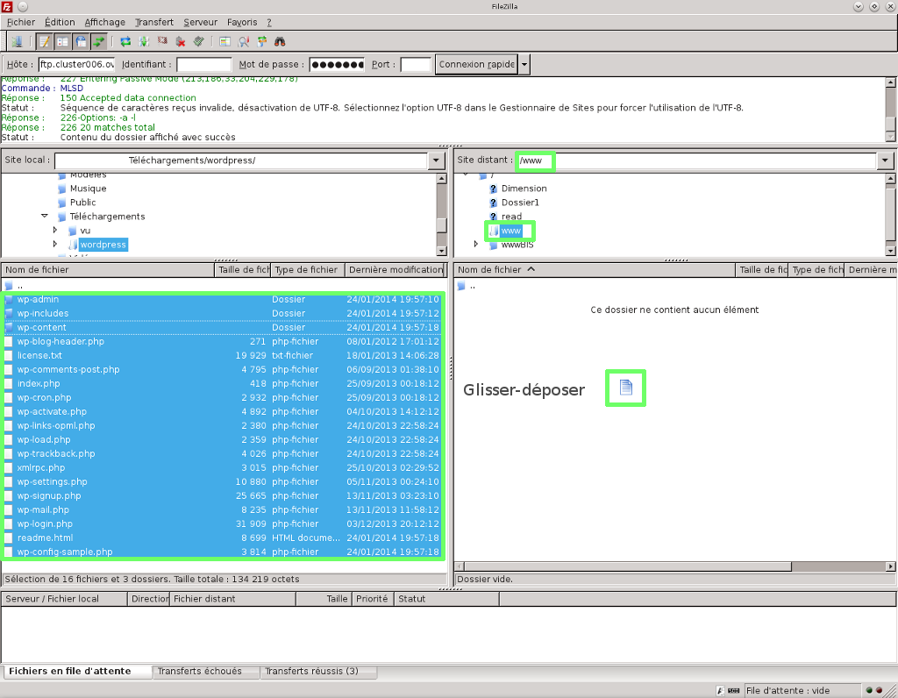
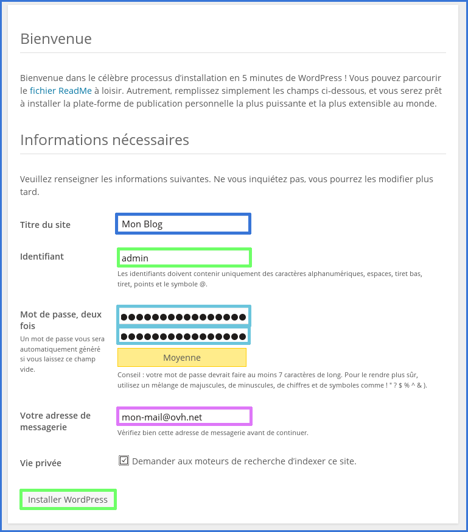

## Część 1: przygotowanie instalacji

## Niezbędne narzędzia
Aby móc zainstalować platformę WordPress na hostingu www, skorzystaj z programu FTP takiego jak FileZilla (program darmowy).

## Dane niezbędne do instalacji
Sprawdź, czy posiadasz identyfikator klienta (nic-handle) i hasło, aby móc się zalogować do panelu klienta.

- Musisz posiadać dane do logowania do FTP, aby zalogować się do hostingu.
Zapoznaj się z przewodnikiem na temat odzyskania danych do FTP:

- Musisz również posiadać dane do bazy danych SQL, dzięki którym będziesz mógł się połączyć z bazą danych.
Zapoznaj się z przewodnikiem na temat odzyskania danych do SQL:

{.thumbnail}

## Część 2: pobranie plików źródłowych

- Przejdź na stronę producenta modułu [WordPress](https://pl.wordpress.org/).

Na stronie tej znajduje się link pozwalający na pobranie najnowszej stabilnej wersji modułu.

Pobrane pliki są spakowane. Należy je rozpakować na swoim komputerze. W Internecie odnajdziesz pomoc na ten temat.

{.thumbnail}

## Część 3: umieszczenie plików na FTP

## Rozpakowywanie plików
Otwórz katalog, w którym umieściłeś spakowane pliki w postaci katalogu. 

Kliknij prawym przyciskiem na ten katalog i wybierz "Extract to".

Wskaż lokalizację, w której chcesz rozpakować pliki. 

W Internecie dostępne są liczne przewodniki związane z tą operacją. Skorzystaj z nich, jeśli na tym etapie napotkasz problem. 

Katalog docelowy będzie nosił nazwę "wordpress".

{.thumbnail}

## Logowanie na hosting www przez FTP
Aby umieścić pliki modułu WordPress na hostingu, należy najpierw zalogować się na ten hosting. 

Udostępniamy przewodnik na temat połączenia FTP w ofercie hostingu www:

{.thumbnail}

## Transfer plików przez FTP
Postępuj zgodnie z opisanymi poniżej etapami, aby umieścić pliki na serwerze FTP.

## Etap 1
Po zalogowaniu do programu FileZilla:

W części "Adres lokalny", która zawiera listę plików znajdujących się na Twoim komputerze, otówrz rozpakowany katalog o nazwie "wordpress", w którym znajdują się pliki modułu.

W części "Serwer zdalny", która odnosi się do hostingu www OVH, otwórz katalog "www". W tym katalogu zostaną umieszczone wszystkie pliki modułu. 

Jeśli taki katalog nie istnieje, możesz go utworzyć.

Pliki muszą zostać obowiązkowo umieszczone w katalogu "www". W przeciwnym razie procedura instalacji nie będzie dostępna z poziomu nazwy domeny.

{.thumbnail}

## Etap 2
Po otwarciu tych katalogów:

W części "Adres lokalny" odnajdziesz wszystkie pliki niezbędne do instalacji modułu CMS WordPress.

Aby zaznaczyć wszystkie pliki, skorzystaj z połączenia klawiszy CTRL+A.

Następnie skorzystaj z funkcji przeciągnij i upuść do części "Serwer zdalny" do katalogu "www".

Możliwe, że katalog "www" nie jest pusty. Nie trzeba usuwać plików z tego katalogu. Powrócimy do tego tematu w dalszej części tego przewodnika.

{.thumbnail}

## Etap 3
Trwa przenoszenie plików.

Poczekaj, aż wszystkie pliki zostaną umieszczone na zdalnym serwerze FTP. Operacja ta może zająć kilka minut. 

Po przeniesieniu plików, upewnij się, że wszystkie pliki i katalogi zostały poprawnie przeniesione. 

Ta operacja kończy część poświęconą umieszczaniu plików na FTP.

{.thumbnail}

## Część 4: połączenie z bazą danych

## Etapy instalacji modułu WordPress

- Przed kontynuowaniem instalacji wyczyść cache swojej przeglądarki internetowej, aby uniknąć ewentualnych błędów. 

Aby połączyć bazę danych z modułem WordPress, należy przejść przez etapy instalacji modułu.

## Etap 1
Wpisz w przeglądarce internetowej nazwę swojej domeny. Pojawi się taki komunikat. 

Kliknij na "Utwórz plik konfiguracyjny", aby kontynuować.

{.thumbnail}

## Etap 2
Zaopatrz się w dane do logowania do bazy danych  (pomoc w tym zakresie jest dostępna na początku przewodnika).

Kliknij na "Zaczynajmy!", aby przejść do kolejnego etapu.

{.thumbnail}

## Etap 3
Podaj informacje dotyczące bazy danych:

Nazwa bazy danych: Wybrana podczas zakładania bazy danych w panelu klienta.

Nazwa użytkownika: Identyczna z nazwą bazy danych.

Hasło: Zostało wysłane e-mailem po utworzeniu bazy danych - możliwe, że już je zmieniłeś. 

Adres serwera bazy danych: pisz nazwę serwera bazy danych wskazaną w e-mailu instalacyjnym i w panelu klienta.

Prefiks tabel: Opcja użyteczna w przypadku chęci zainstalowania kilku modułów Drupal na jednej bazie danych. W takim przypadku należy wpisać inny prefiks dla każdej instalacji. 

Ważne:  Dane do bazy danych nie są wysyłane automatycznie po zainstalowaniu hostingu. Aby je otrzymać, należy założyć bazę danych w panelu klienta.

Kliknij na "Wyślij", aby kontynuować.

- Etapy te kończą tworzenie połączenia między bazą danych i modułem WordPress. Wystarczy dokończyć instalację.

{.thumbnail}

## Zakończenie

## Zakończenie instalacji
Aby dokończyć instalowanie modułu Wordpress, kontynuuj etapy instalacji.

## Etap 1
Kliknij na "Uruchomienie instalacji", aby kontynuować.

{.thumbnail}

## Etap 2
Podaj informacje dotyczące administrowania blogiem WordPress:

Tytuł witryny: Wpisz tytuł bloga.

Nazwa użytkownika: Wybierz nazwę użytkownika do logowania do panelu administracyjnego bloga.

Hasło: Wpisz hasło do logowania do panelu administracyjnego bloga WordPress.

Twój e-mail: Wpisz prawidłowy adres e-mail.

Prywatność: Jeśli pole to jest zaznaczone, wyszukiwarki będą pozycjonować blog. 

Kliknij na "Zainstaluj WordPressa".

{.thumbnail}

## Etap 3
Instalacja została zakończona.

Możesz już administrować blogiem klikając na przycisk "Zaloguj się".

{.thumbnail}

## Część administracyjna modułu WordPress
Tak wygląda panel administracyjny modułu WordPress.

{.thumbnail}

## Użyteczne informacje
Pomoc OVH nie będzie w stanie zapewnić Ci wsparcia w zakresie konfiguracji modułu WordPress.
Udostępniamy przewodnik na ten temat: .

Zachęcamy do korzystania z forum rozwiązania WordPress.

- Oto link do [forum](https://pl.forums.wordpress.org/) tego modułu.

## Klasyczny błąd: strona w budowie
Umieściłeś pliki na FTP, ale nadal wyświetla się informacja "strona w budowie".

Po zainstalowaniu hostingu, OVH umieszcza na nim stronę tymczasową.

Jeśli umieścisz pliki w katalogu "www" i nie usuniesz treści umieszczonych przez OVH, pojawi się ten problem. 

Aby to poprawić, usuń plik "index.html" umieszczony przez OVH lub zmień jego nazwę.

Zmień nazwę tego pliku. Będziesz mógł później aktywować ten plik jako tymczasową stronę główną.

Inna użyteczna informacja: pliki strony muszą zostać umieszczone w katalogu "www", aby były brane pod uwagę.

{.thumbnail}

## Klasyczny błąd: wersja PHP
Chodzi o błąd dotyczący wersji PHP serwera. 

Przyczyna jest prosta: najnowsza wersja PHP nie została włączona.

Udostępniamy przewodnik na temat zmiany wersji PHP na hostingu www:[Zmiana wersji PHP na hostingu]({legacy}1207)

{.thumbnail}

