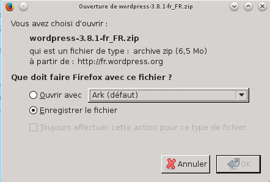
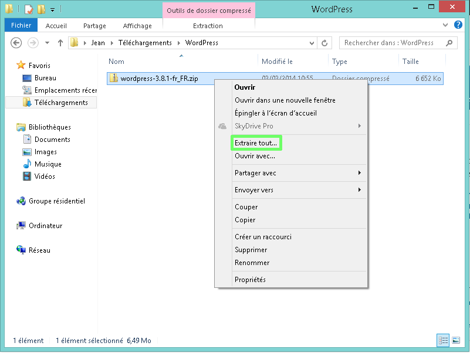
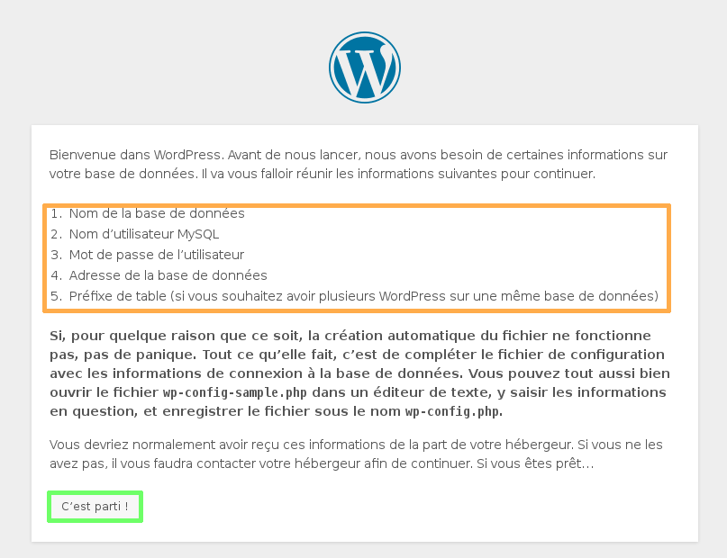
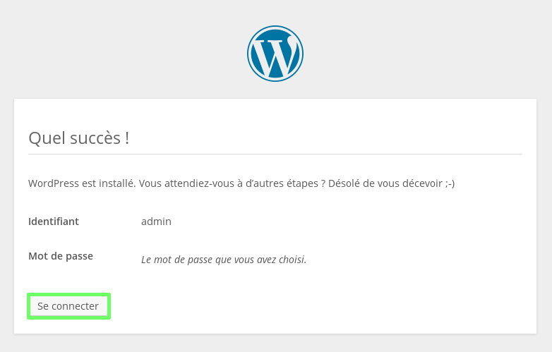
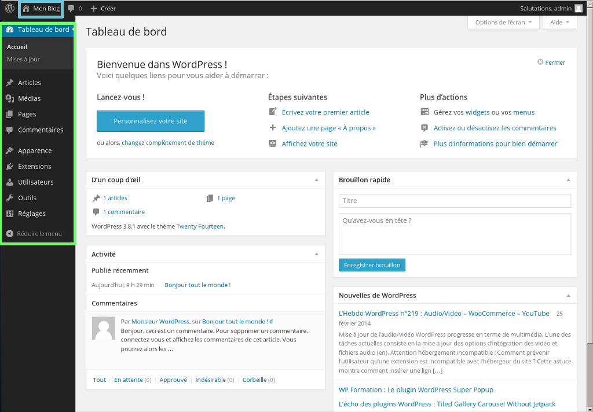
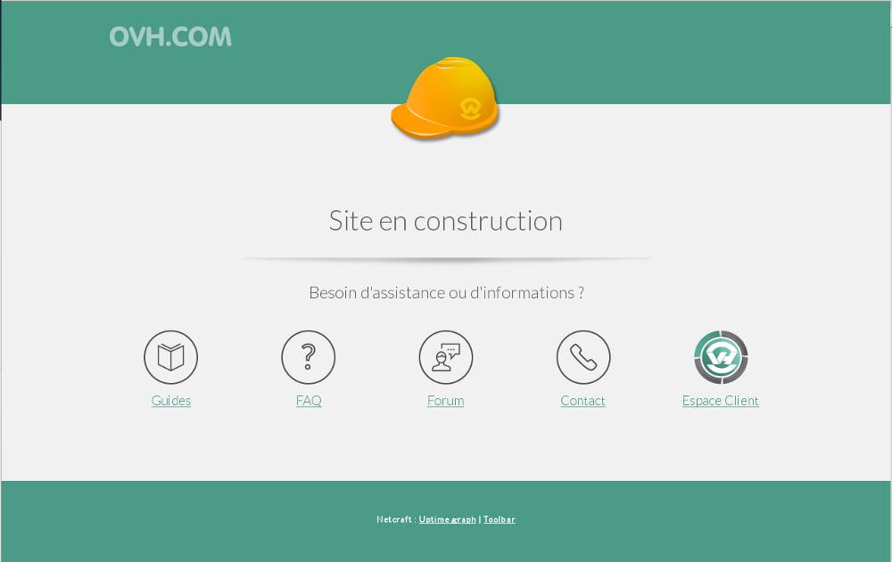

## Parte 1: preparação da instalação

## Ferramentas necessárias
Para instalar a sua plataforma WordPress no seu alojamento partilhado, sugerimos o uso do cliente FTP FileZilla (gratuito).

## Identificadores de acesso necessários para a instalação
Assegura-se que possui o Nichandle e a palavra-passe associada para poder ligar-se ao seu Espaço Cliente OVH, se necessário.

- Obtenha o seu identificador e palavra-passe de acesso FTP para se ligar ao espaço de armazenamento do seu serviço de alojamento partilhado OVH.
Um guia para obtenção dos dados de acesso FTP está à disposição:

- É necessário possuir um identificador e palavra-passe da base de dados SQL que lhe permita a ligação a uma base de dados.
Um guia para obtenção dos dados de acesso à base de dados está à disposição:

{.thumbnail}

## Parte 2: recuperação dos ficheiros "fonte" da instalação

- Aceda ao site oficial [WordPress](http://fr.wordpress.org/).

 Aí encontrará, geralmente, o link para fazer o download da última versão estável do CMS WordPress para o seu computador.

O ficheiro que vai obter estará, geralmente, comprimido (em formato zip, certamente). Será necessário poder descomprimir esse ficheiro no seu computador. Encontrará na Internet vários tutoriais para ajuda com essa operação.

{.thumbnail}

## Parte 3: colocação dos ficheiros no seu espaço de armazenamento através de FTP

## Descompressão da pasta de ficheiros
Abra a pasta na qual guardou o ficheiro comprimido.

Clique com o botão do lado direito do rato e escolha "Extrair tudo".

Indique um destino a fim de descomprimir os ficheiros para esse destino.

Vários tutoriais e softwares de descompressão estão disponíveis na Internet para o ajudar com estas ações:

A pasta terá o nome "wordpress"

{.thumbnail}

## Ligação ao espaço de alojamento através de FTP
Para colocar os ficheiros de WordPress no seu alojamento, deverá ligar-se ao mesmo.

Está à disposição um guia de ajuda à ligação FTP num alojamento partilhado OVH:

{.thumbnail}

## Transferência dos ficheiros através de FTP
Siga estas etapas para colocar os seus ficheiros no espaço FTP.

## Etapa 1
Uma vez já ligado através de FileZilla:

- Na secção "Site local", que corresponde aos ficheiros presentes no seu computador local, abra a pasta que descomprimiu com o nome "wordpress" e na qual estão presentes os ficheiros do CMS.

Na secção "Site Distante/remoto", que corresponde ao espaço de alojamento OVH, abra a pasta "www". É nessa pasta que deverão ser colocados todos os ficheiros do CMS.

Se a pasta não existir, terá  a possibilidade de a criar.

Os seus ficheiros devem estar obrigatoriamente na pasta "www". Se não o fizer, o procedimento de instalação não estará diretamente acessível através do seu nome de domínio.

{.thumbnail}

## Etapa 2
Uma vez abertas as pastas:

Na secção "Site local" encontrará os ficheiros necessários à instalação do CMS WordPress.

Para selecionar todos os ficheiros, use CTRL+A.

Arraste e largue, de seguida, os ficheiros na secção "Site Distante/Remoto" dentro da pasta "www".

É muito provável que a sua pasta "www" não esteja vazia. Vamos abordar esse assunto mais adiante neste guia.

{.thumbnail}

## Etapa 3
A transferência de ficheiros está em curso.

Aguarde até que todos os ficheiros sejam colocados no servidor FTP. Isso poderá levar alguns minutos.

Uma vez que a transferência esteja concluída, assegure-se que todos os ficheiros e as pastas foram corretamente transferidos.

Esta operação é a última da parte consagrada à transferência de ficheiros para o espaço FTP.

{.thumbnail}

## Parte 4: ligação com a base de dados

## Etapas de instalação de WordPress

- Antes de continuar a instalação, limpe a cache do seu browser a fim de evitar eventuais erros.

Para estabelecer a ligação entre o seu site WordPress e a sua base de dados, devemos seguir as etapas de instalação do CMS.

## Etapa 1
Aceda ao seu nome de domínio através de um browser.

Esta mensagem aparecerá.

Cliquem em "Criar um ficheiro de configuração" para continuar.

{.thumbnail}

## Etapa 2
Obtenha os seus identificadores da base de dados (há informação de ajuda para esta ação no início deste guia).

Clique em "Iniciar!" para aceder à etapa seguinte.

{.thumbnail}

## Etapa 3
Introduza as informações solicitadas para a base de dados:

Nome da base de dados: O que escolheu no seu Espaço Cliente aquando da criação da base de dados que vai usar para o seu site WordPress;

Nome de utilizador: igual ao nome da base de dados;

Palavra-passe: se não a modificou, é a que lhe foi enviada por email;

Endereço do servidor de base de dados: Introduza o nome do servidor de base de dados que vê no seu Espaço Cliente ou no email de instalação da base de dados;

Prefixo das tabelas: útil para realizar várias instalações de WordPress na mesma base dados. Nesses casos, será necessário criar um prefixo diferente para cada uma das instalações

Importante: os dados de acesso da base de dados não são enviados de forma automática após a criação do alojamento. Para os receber, tem de criar uma base de dados a partir da sua área de cliente.

Clique em "Enviar" para validar as informações de ligação à base de dados.

- Estas etapas levarão à criação da ligação entre o seu website WordPress e a sua base de dados. Apenas falta concluir a "instalação" do site.

{.thumbnail}

## Finalização

## Finalização da instalação
A fim de terminar a instalação do blog WordPress, continue as etapas de instalação.

## Etapa 1
Clique em "Iniciar Instalação" para prosseguir.

{.thumbnail}

## Etapa 2
Introduza as informações solicitadas em relação à administração do seu blog WordPress. A descrição das informações é sugestiva:

Título do site : Atribua um nome ao seu blog;

Nome de utilizador: O nome do utilizador que administrará o seu site;

Endereço de email: Introduza o email do administrador. Deve ser um email válido e existente;

Privado: se marcar esta opção, os motores de busca não farão a indexação do seu site.

Para iniciar a instalação de WordPress clique em "Instalar WordPress".

{.thumbnail}

## Etapa 3
A instalação do seu blog WordPress está concluída!

Poderá agora autenticar-se no seu site e começar a trabalhar na edição do seu aspeto e conteúdos.

{.thumbnail}

## Visualização da parte de administração de WordPress
Encontrará aqui uma pré-visualização do painel de administração WordPress.

{.thumbnail}

## Informações úteis
O suporte da OVH não está habilitado para responder às suas questões sobre configuração e utilização de WordPress.
Contudo, um guia de ajuda à utilização de WordPress está à disposição: .

Convidamo-lo a consultar os fóruns dedicados à [ferramenta Wordpress](http://www.wordpress-fr.net/).

## Erro clássico: site em construção
Colocou os seus ficheiros, através de FTP mas, continua a ver "Página em construção" numa página padrão criada pela OVH aquando da instalação do seu alojamento.

Se colocar o seu conteúdo na pasta "www" sem ter eliminado o conteúdo padrão adicionado pela OVH, encontrará esse caso.

Para corrigir o problema:

- elimine ou altere o nome do ficheiro "index.html".

Poderá ser interessante apenas mudar o nome para que, caso necessário, possa mais tarde colocar o site em manutenção.

{.thumbnail}

## Erro Clássico: versão de PHP
Trata-se de um erro relativo à versão de PHP do seu servidor.

A causa é simples: a última versão de PHP não foi ativada.

Tem à sua disposição um guia para o ajudar a alterar a versão de PHP em uso no seu alojamento:[aqui]({legacy}1207)

{.thumbnail}

