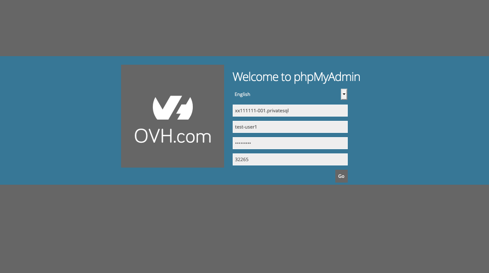

**Letzte Aktualisierung am 16.09.2020**

## Ziel

Sie können den Inhalt Ihrer Datenbank über ein Interface einsehen. Dafür gibt es verschiedene Möglichkeiten, sich einzuloggen.

**Hier erfahren Sie, wie Sie sich auf Ihrem Datenbankserver mit Ihrer Datenbank verbinden.**

## Voraussetzungen

- Sie verfügen über ein [SQL Private oder ](https://www.ovh.com/fr/hebergement-web/options-sql.xml){.external}Cloud Databases Hosting[ ](https://www.ovh.com/fr/cloud-databases){.external}.
- Sie sind in Ihrem [OVHcloud Kundencenter](https://www.ovh.com/auth/?action=gotomanager){.external} angemeldet.

## In der praktischen Anwendung

> [!primary]
>
> Hinweis: Die Angebote >Es gibt keinen "root" Superuser Zugang.
> <br> Generische SQL-Befehle funktionieren normal, und Programme wie HeidiSQL, SQuirreL oder Adminer sind vollständig kompatibel.
> 

### Mit einer MySQL oder MariaDB Datenbank verbinden 

> [!primary]
>
> Da MariaDB ein Derivat von MySQL ist, sind die verschiedenen Befehle für diese 2 Arten von Datenbanken exakt gleich.
> 

####  phpMyAdmin von OVHcloud (ausschließlich für das SQL Private Angebot)

Begeben Sie sich in Ihr Kundencenter (Rubrik IP) Klicken Sie auf den Tab `Web` und dann `auf`{.action} Datenbank im linken Bereich. Wählen Sie den Namen Ihres Datenbankservers aus.

Im Tab `Allgemeine` Informationen finden Sie den Zugangslink im Rahmen **"Verwaltung der Datenbank"unter** der Rubrik "Benutzerschnittstelle".

{.thumbnail}

Sie erreichen die phpMyAdmin-Login-Seite.

{.thumbnail}

- **Server:** Geben Sie den Hostnamen Ihres Servers im Tab `Allgemeine Informationen` im Rahmen **"Verwaltung der Datenbank"unter** dem Eintrag "Hostname"in Teil **SQL** ein.
- **Benutzer:** Geben Sie den im Tab Benutzer `und Rechte` Ihres Datenbankservers erstellten Benutzernamen ein.
- **Passwort:** Geben Sie das Passwort des betreffenden Benutzers ein.
- **Port:** Tragen Sie den im Tab `Allgemeine` Informationen** im Rahmen **"Verwaltung der Datenbank"unter der Überschrift "Port"in Teil **SQL** genannten Port ein. (Dieses Feld wird nur für SQL Private Server angezeigt)

Wenn die Verbindung erfolgreich ist, erscheint die folgende phpMyAdmin-Seite.

{.thumbnail}

> **Bei einem Fehler #1045**
> 
> Bei einem Fehler #1045 bedeutet das, dass die Identifikation falsch ist. Überprüfen Sie daher Ihren Benutzernamen und/oder Ihr Passwort.
> 
> **Bei einem Fehler #2005**
> 
> Bei einem Fehler #2005 empfiehlt es sich, den Namen des Servers zu überprüfen und festzustellen, ob dieser korrekt funktioniert.

#### Verbindung zur Datenbank außerhalb des Kundencenters

Um sich mit Ihrer Datenbank zu verbinden, rufen Sie bitte folgende Informationen ab:

- **Server:** Der Hostname Ihres Servers ist im Tab `Allgemeine `Informationen Ihres Datenbankservers im Rahmen **"Verwaltung der Datenbank"unter der Rubrik "Hostname"im **SQL**-Bereich** sichtbar.
- **Benutzer:** den im Tab Benutzer und Rechte `Ihres` Datenbankservers erstellten Benutzernamen.
- Passwort des Root-Benutzers ändern
- **Port:** Der Port ist im Tab `Allgemeine `Informationen Ihres Datenbankservers im Rahmen **"Verwaltung der Datenbank"unter der Rubrik "Port"in Teil **SQL** ** sichtbar.
- **Name der Datenbank:** Die Datenbanken sind im Tab `Datenbanken` Ihres Datenbankservers aufgeführt.

##### 1. Administration über die Kommandozeile

> [!primary]
>
> Für einen SQL Private Server ist diese Aktion ausschließlich über [SSH]( ../mutualise-le-ssh-sur-les-hebergements-mutualises/){.external} über ein OVHcloud Shared Hosting möglich.

```bash
mysql --host=serveur --user=utilisateur --port=port --password=password nom_de_la_base
```

##### 2. Verbindung per PHP Skript

> [!primary]
>
> Für einen SQL Private Server kann dieses Skript nur über ein OVHcloud Shared Hosting ausgeführt werden. 

```php
1. <?php
2. $db = new PDO('mysql:host=host;port=port;dbname=dbname', 'username', 'password');
3.
```

##### 3. Software-Verbindung (SQuirreL SQL)

> [!primary]
>
> In unserem Beispiel verwenden wir die Open-Source-Software SQquirreL, aber andere Interfaces wie HeidiSQL oder Adminer sind voll kompatibel. 

- Starten Sie SQuirreL SQL und klicken Sie auf `Aliases`{.action} und dann auf `+`{.action}

{.thumbnail}

- Füllen Sie die folgenden Felder aus und bestätigen Sie mit dem Button `OK`{.action}:
    - {{name}} Wählen Sie einen Typ aus...
    - **Driver**: Wählen Sie "MySQL Driver"
    - URL Geben Sie die Adresse des Servers und den Port als jdbc ein:mysql://server:port
    - „Benutzername“ Geben Sie den Benutzernamen an
    - „Kennwort“ Das Passwort speichern:

{.thumbnail}

- Bestätigen Sie erneut mit dem Button `Connect`{.action}

{.thumbnail}

Sie sind nun gut mit Ihrer Datenbank verbunden:

{.thumbnail}


##### 4. phpMyAdmin Verbindung

Sie können Ihr eigenes phpMyAdmin-Interface verwenden, um den Inhalt Ihrer Datenbank zu analysieren. Installieren Sie hierfür phpMyAdmin auf Ihrem eigenen Server oder Webhosting. Achten Sie bei dieser Installation darauf, die Informationen Ihres Datenbankservers und Ihrer gewünschten Datenbank so einzurichten, dass phpMyAdmin sich damit verbinden kann.


### Mit einer PostgreSQL Datenbank verbinden 


Um sich mit Ihrer Datenbank zu verbinden, rufen Sie bitte folgende Informationen ab:

- **Server:** Der Hostname Ihres Servers ist im Tab `Allgemeine `Informationen Ihres Datenbankservers im Rahmen **"Verwaltung der Datenbank"unter der Rubrik "Hostname"im **SQL**-Bereich** sichtbar.
- **Benutzer:** den im Tab Benutzer und Rechte `Ihres` Datenbankservers erstellten Benutzernamen.
- Passwort des Root-Benutzers ändern
- **Port:** Der Port ist im Tab `Allgemeine `Informationen Ihres Datenbankservers im Rahmen **"Verwaltung der Datenbank"unter der Rubrik "Port"in Teil **SQL** ** sichtbar.
- **Name der Datenbank:** Die Datenbanken sind im Tab `Datenbanken` Ihres Datenbankservers aufgeführt.

#### Administration über die Kommandozeile

> [!primary]
>
> Für einen SQL Private Server ist diese Aktion ausschließlich über [SSH]( ../mutualise-le-ssh-sur-les-hebergements-mutualises/){.external} über ein OVHcloud Shared Hosting möglich.


```bash
psql --host=serveur --port=port --user=utilisateur --password=password nom_de_la_base
```

#### Verbindung per PHP Skript

> [!primary]
>
> Für einen SQL Private Server kann dieses Skript nur über ein OVHcloud Shared Hosting ausgeführt werden.

```php
1. <?php
2. $myPDO = new PDO('pgsql:host=host;port=port;dbname=dbname', 'username', 'password');
3.
```

#### Software-Verbindung (SQuirreL SQL)

> [!primary]
>
> In unserem Beispiel verwenden wir die Open-Source-Software SQquirreL, aber andere Interfaces wie HeidiSQL oder Adminer sind voll kompatibel.

- Starten Sie SQuirreL SQL und klicken Sie auf `Aliases`{.action} und dann auf `+`{.action}

{.thumbnail}

- Füllen Sie die folgenden Felder aus und bestätigen Sie mit dem Button `OK`{.action}:
    - {{name}} Wählen Sie einen Typ aus...
    - **Driver**: Wählen Sie "PostgreSQL"
    - URL Geben Sie die Adresse des Servers und den Port als jdbc ein:postgresql://server:port/database
    - „Benutzername“ Geben Sie den Benutzernamen an
    - „Kennwort“ Das Passwort speichern:

{.thumbnail}

- Bestätigen Sie erneut mit dem Button `Connect`{.action}

{.thumbnail}

Sie sind nun gut mit Ihrer Datenbank verbunden:

{.thumbnail}

## Weiterführende Informationen

Für den Austausch mit unserer User Community gehen Sie auf <https://community.ovh.com>.
