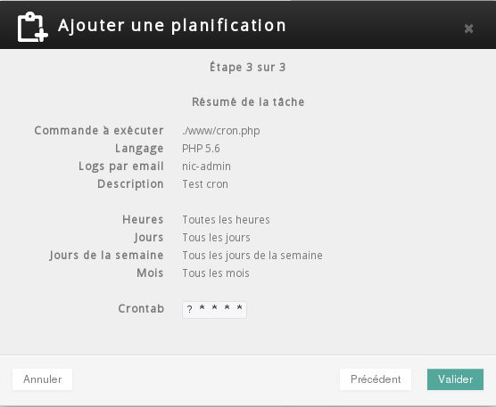
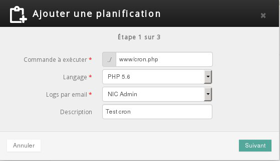

## Luo automatisoitu tehtävä
Valitse webhotellisi vasemmanpuoleisesta valikosta (1), klikkaa sitten "Enemmän +" ja lopuksi "Ajastetut tehtävät -Cron" (2) ja seuravaksi "Lisää ajastettu tehtävä" (3).

{.thumbnail}
Ensimmäisessä vaiheessa ilmoita polku skriptiisi ja ohjelmointikielen tyyppi.
Kaksi muuta kohtaa ovat valinnaisia. Sähköpostilokin avulla voit saada aiemmin määrittelemääsi sähköpostiosoitteeseen Cron-tehtäväsi suoritukseen liittyviä lokeja.


- Sähköpostiviesti lähetetään ainoastaan virhetilanteessa.


Lopuksi on ajastettuun tehtävään on mahdollisuus lisätä kuvaus.

{.thumbnail}
Toisessa vaiheessa määrität tehtävän toistuvuuden.

{.thumbnail}
Käytössä on kaksi vaihtoehtoa: yksinkertainen tila ja edistynyt tila.

{.thumbnail}
Kun olet määrittänyt Cron-tehtävän asetukset, näkyviin tulee yhteenvetoikkuna.


- Jos tiedot ovat oikein, vahvista ajastetun tehtävän luonti.


{.thumbnail}
Näet vahvistusviestin, joka ilmoittaa pyynnön olevan saatavilla muutamassa minuutissa.

{.thumbnail}


## Automatisoitujen tehtävien muokkaus
Valitse webhotellisi vasemmanpuoleisesta sarakkeesta (1), klikkaa sitten "Enemmän +" ja lopuksi "Ajastetut tehtävät -Cron" (2) ja klikkaa lopuksi  kynää (3), joka vastaa automatisoitua tehtävää, jota haluat muokata.

{.thumbnail}
Tässä kohtaa voit muokata polkua tai ohjelmointikieltä, aktivoida lokeja sähköpostitse ja lisätä Cron-tehtävään kuvauksen.

{.thumbnail}


## Poista automatisoitu tehtävä
Valitse webhotellisi vasemmanpuoleisesta sarakkeesta (1), klikkaa sitten "Enemmän +" ja lopuksi "Ajastetut tehtävät -Cron" (2) ja klikkaa lopuksi poistettavaa automatisoitua tehtävää vastaavaa roskakoria.

{.thumbnail}
Näkyviin tulee yhteenveto automattisesta tehtävästä, jonka haluat poistaa. Vahvista valinta, jos kaikki tiedot ovat oikein.

{.thumbnail}


## Testaa automatisoiden tehtävän suorittaminen internetselaimessa
Voit testata skriptiä suoraan selaimessa, jotta näät aihetttaako se virheen.
Esimerkiksi mikäli cron-tehtäväsi on hakemistossa www/cron.php ja verkkotunnuksesi on test.com, täytyy sinun kirjoittaa URL http://test.com/cron.php.
Jotta testi on optimaalinen  webhotellisi PHP-version tulisi olla sama kuin automatisoidun tehtävän luonnin yhteydessä ilmoitettu versio.
Mikäli sinulla on virhe, on skripti korjattava itse.
Mikäli yhtään virhettä ei havaittu kannattaa tarkistaa Cron-tehtävien suorittamiseen liittyvät lokit.


## Katso automatisoidun tehtävän suorituslokit
Valitse webhotelli vasemmanpuoleisesta valikosta ja klikkaa kuvaketta "Plus +".

{.thumbnail}
Klikkaa seuraavaksi linkkiä "Lokitiedot"

{.thumbnail}
Mikäli ajastettu tehtäväsi on ajettu saman päivän aikana, voit katsoa suorituslokeja OVH:n Speed Log -lokista (1).

-> Mikäli tehtävän ajamisesta on yli 24h, valitse sen kuukauden lokitiedosto, jota haluat tarkastella.

{.thumbnail}
Esimerkki ajastetun tehtävän suorituslokista:


```
[2015-06-04 10:39:03] ## OVH ## START - 2015-06-04 10:39:03.700912 executing: /usr/local/php5.6/bin/php /homez.600/loginftp/www/cron.php
[2015-06-04 10:39:03] Could not open input file: /homez.600/loginftp/www/cron.php
[2015-06-04 10:39:03]
[2015-06-04 10:39:03] ## OVH ## END - 2015-06-04 10:39:03.762685 exitcode: 1
```


Tässä tapauksessa seuraavan rivin loki ilmoitaa, että ajastettua tehtävää ei ole suoritettu oikein johtuen skriptin virheellisestä tai olemattomasta polusta:


```
Could not open input file: /homez.600/loginftp/www/cron.php
```


## Rajoitukset
Webhotellissa ei voi konfiguroida tehtävien suoritusaikaa minuutin tarkkuudella. Lisäksi tehtävän voi suorittaa vain kerran tunnissa.


- Suoritusaika on rajoitettu 60 minuuttiin

- Tietojen generointi on rajoitettu 5 MB (stdin/stderr)


## Automatisoidut tehtävät muuttujilla
Automatisoidulle tehtävälle ei voi asettaa polkua käyttämällä muuttujia.

Esimerkki:

```
/www/cron.php?variable=test
```


-  Muuttujat voi kuitenkin määrittää esimerkiksi skriptissä. 


## Absoluuttisten polkujen käyttö
Jotta ajoitettu tehtäväsi toimii, skpritissä on käytettävä absoluuttisia eikä suhteellisia polkuja.
Saadaksesi juoksevan polun osoitteen, voit käyttää jatkuvaa "_DIR_": [PHP Dokumentaatiota](http://php.net/manual/en/language.constants.predefined.php)


## Suoritusraportti
Sinulle lähetetään sähköpostitse vain yksi suoritusraportti päivässä.


## Toisen skriptin kutsuminen
Mikäli CRON-tehtäväsi käyttämä skripti käyttää muita skriptejä, täytyy silloin käyttää absoluuttista polkua, jotta se toimii. Webhotellisi absoluuttinen polku alkaa:


```
/home/loginFTP/
```


## Suoritusvirheen sattuessa
Jos ajastettu tehtäväsi (cron) on virhetilassa, se lukittuu kymmenen epäonnistuneen suoritusyrityksen jälkeen.


## Lokiesimerkkejä
Skripitin suorittaminen oikein:

```
# OVH ## START - 2014-12-23 15:34:12.680711 executing: /homez.600/loginftp/test/run.sh
I am the client and I'm printing stuff with this nice 'echo' feature.

# OVH ## END - 2014-12-23 15:34:13.056472 exitcode: 0
```


Skriptin virheellinen suorittaminen koska kutsuttua tiedostoa ei löytynyt: 

# OVH ## START - 2014-12-23 15:36:16.206693 executing: /homez.600/loginftp/test/idontexist.sh
# OVH ## ERROR command '/homez.600/loginftp/test/idontexist.sh' not found

# OVH ## END - 2014-12-23 15:36:16.546574 exitcode: 255
[/code]
Skriptin virheellinen suorittaminen aikarajan umpeutumisen vuoksi:


```
# OVH ## START - 2014-12-23 16:05:52.233058 executing: /homez.600/loginftp/test/sleep.sh
mardi 23 décembre 2014, 16:05:52 (UTC+0100)
Now sleeping 9000 sec

# OVH ## ERROR - CRON TASK INTERRUPTED BY OVH - reason: your script duration exceeded the maximum permitted (3600 seconds)
# OVH ## END - 2014-12-23 17:05:54.690413 exitcode: 0
```


Skriptin virheellinen suorittaminen tiedostojen generointirajan ylittämisestä johtuen:

```
# OVH ## START - 2014-12-23 15:43:27.606083 executing: /homez.600/loginftp/test/echoer.sh
[...a lot of logs here...]
# OVH ## ERROR - CRON TASK INTERRUPTED BY OVH - reason: cron output (9288634 bytes) exceeds maximum permitted (5242880 bytes)
# OVH ## END - 2014-12-23 15:43:50.999934 exitcode: 255
```


Skriptin virheellinen suorittaminen huonoista oikeuksista (chmod) tai huonosta .ovhconfig -tiedoston konfiguraatiosta johtuen:

```
[2015-01-08 18:07:10]
[2015-01-08 18:07:10] ## OVH ## Your job could not be initiated for an unknown reason. Please contact customer support for more information.
[2015-01-08 18:07:10] ## OVH ## END - 2015-01-08 18:07:10.969840 exitcode: 255
```


