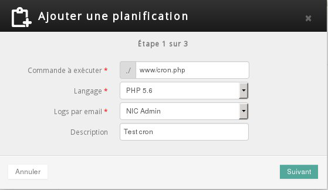
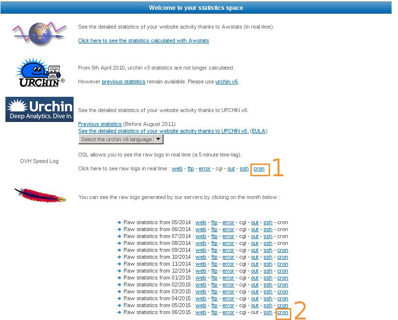

## Crea un task automatizzato
Seleziona il tuo hosting nella colonna di sinistra (1), clicca sul tab "Altre opzioni" e scegli "Task pianificati - Cron" (2), poi clicca su Aggiungi un intervento programmato (3).

{.thumbnail}
Nel primo step, indica il percorso dello script da eseguire, il tipo di linguaggio di programmazione e i log via email, che ti consentono di ricevere i log di esecuzione del tuo task Cron su un indirizzo email predefinito o di tua scelta.


- Riceverai questa email solo in caso di errore.


Nell'ultimo campo, hai la possibilità di inserire una descrizione del tuo task Cron.

{.thumbnail}
Lo step 2 ti permette di impostare la periodicità di esecuzione del tuo task Cron.

{.thumbnail}
Puoi scegliere tra due modalità: semplice o esperto.

{.thumbnail}
Una volta inseriti tutti i parametri del tuo task Cron, si apre una finestra di riepilogo.


- Se tutte le informazioni sono corrette, conferma la creazione del tuo task automatizzato.


{.thumbnail}
Questo messaggio ti conferma che la tua richiesta è stata presa in carico.

{.thumbnail}


## Modifica il tuo task automatizzato
Seleziona il tuo hosting nella colonna di sinistra (1), clicca sul tab "Altre opzioni" e scegli "Task pianificati - Cron" (2), poi clicca sull'icona a forma di matita (3) in corrispondenza del task automatico che vuoi modificare.

{.thumbnail}
Puoi modificare il percorso o il linguaggio di programmazione, attivare i log via email e aggiungere una descrizione al tuo task Cron.

{.thumbnail}


## Elimina il tuo task automatizzato
Seleziona il tuo hosting nella colonna di sinistra (1), clicca sul tab "Altre opzioni" e scegli "Task pianificati - Cron" (2), poi clicca sull'icona a forma di cestino (3) in corrispondenza del task automatico che vuoi eliminare.

{.thumbnail}
Visualizzi la finestra di riepilogo del task che vuoi eliminare.
Per confermare l'operazione, clicca su "Elimina".

{.thumbnail}


## Effettua un test di esecuzione del tuo task automatizzato dal tuo browser Internet
Per verificare che il tuo script non generi errori, puoi testarne la corretta esecuzione direttamente dal tuo browser.
Ad esempio, se il tuo Cron si trova nella directory www/cron.php e il tuo dominio è test.com, inserisci l'URL http://test.com/cron.php.
Per ottenere un risultato più affidabile, ti consigliamo di utilizzare per il tuo hosting la stessa versione di PHP indicata durante la creazione del tuo task automatizzato.
In caso di errore, correggi il tuo script.
Se non vengono rilevati errori, ti consigliamo comunque di verificare i log associati all'esecuzione dei tuoi Cron.


## Verifica i log di esecuzione dei tuoi task automatizzati
Seleziona il tuo hosting nella colonna di sinistra e clicca sul tab Altre opzioni.

{.thumbnail}
Clicca sul link corrispondente ai Log.

{.thumbnail}
Se il tuo task automatizzato è stato eseguito nel corso della giornata, controlla i tuoi log di esecuzione nell'OVH Speed Log (1).

-> Se l'esecuzione è avvenuta da più di 24h, seleziona il file dei log del mese che vuoi consultare (nell'esempio, il mese di giugno).

{.thumbnail}
Esempio di log di esecuzione di un task automatizzato:


```
[2015-06-04 10:39:03] ## OVH ## START - 2015-06-04 10:39:03.700912 executing: /usr/local/php5.6/bin/php /homez.600/loginftp/www/cron.php
[2015-06-04 10:39:03] Could not open input file: /homez.600/loginftp/www/cron.php
[2015-06-04 10:39:03]
[2015-06-04 10:39:03] ## OVH ## END - 2015-06-04 10:39:03.762685 exitcode: 1
```


In questo caso, la riga di log indica che il task automatizzato non è stato eseguito correttamente perché il percorso di accesso allo script è inestistente o non valido:


```
Could not open input file: /homez.600/loginftp/www/cron.php
```


## Limitazioni
Se hai attivato una soluzione di hosting condiviso, non puoi configurare i minuti in cui il tuo task automatizzato deve essere eseguito. Inoltre, il task può essere eseguito solo una volta ogni ora.


- Il limite del tempo di esecuzione è fissato a 60 minuti

- Il limite della generazione dei dati è fissato a 5 MB (stdin/stderr)


## Task automatizzati con parametri
Non è possibile impostare percorsi per i task automatizzati con passaggi di parametri.

Esempio:

```
/www/cron.php?variable=test
```


- Puoi definire queste variabili nel tuo script.


## Percorsi assoluti
Per il corretto funzionamento del tuo task Cron, è necessario utilizzare nel tuo script percorsi assoluti e non relativi.
Per ottenere l'indirizzo del percorso corrente, puoi utilizzare la costante "_DIR_":
[Documentazione PHP](http://php.net/manual/en/language.constants.predefined.php)


## Notifica di esecuzione
L'email di notifica di esecuzione del tuo task Cron viene inviata una volta al giorno.


## Chiamata a un altro script
Se lo script utilizzato dal tuo task CRON richiama altri script, per il suo corretto funzionamento è necessario utilizzare un percorso assoluto e non relativo. Il percorso assoluto del tuo hosting inizia per:


```
/home/loginFTP/
```


## Errore di esecuzione
Se la tua operazione pianificata (Cron) non viene eseguita correttamente, viene disattivata dopo 10 tentativi non riusciti.


## Esempi di log
Esecuzione corretta dello script:

```
# OVH ## START - 2014-12-23 15:34:12.680711 executing: /homez.600/loginftp/test/run.sh
I am the client and I'm printing stuff with this nice 'echo' feature.

# OVH ## END - 2014-12-23 15:34:13.056472 exitcode: 0
```


Esecuzione dello script in errore perché il file non è stato trovato:

```
# OVH ## START - 2014-12-23 15:36:16.206693 executing: /homez.600/loginftp/test/idontexist.sh
# OVH ## ERROR command '/homez.600/loginftp/test/idontexist.sh' not found

# OVH ## END - 2014-12-23 15:36:16.546574 exitcode: 255
```


Esecuzione dello script in errore in seguito a un timeout:

```
# OVH ## START - 2014-12-23 16:05:52.233058 executing: /homez.600/loginftp/test/sleep.sh
mardi 23 décembre 2014, 16:05:52 (UTC+0100)
Now sleeping 9000 sec

# OVH ## ERROR - CRON TASK INTERRUPTED BY OVH - reason: your script duration exceeded the maximum permitted (3600 seconds)
# OVH ## END - 2014-12-23 17:05:54.690413 exitcode: 0
```


Esecuzione dello script in errore per generazione eccessiva di dati:

```
# OVH ## START - 2014-12-23 15:43:27.606083 executing: /homez.600/loginftp/test/echoer.sh
[...a lot of logs here...]
# OVH ## ERROR - CRON TASK INTERRUPTED BY OVH - reason: cron output (9288634 bytes) exceeds maximum permitted (5242880 bytes)
# OVH ## END - 2014-12-23 15:43:50.999934 exitcode: 255
```


Esecuzione dello script in errore per configurazione non corretta del file .ovhconfig o errore dei permessi di accesso al file (chmod):

```
[2015-01-08 18:07:10]
[2015-01-08 18:07:10] ## OVH ## Your job could not be initiated for an unknown reason. Please contact customer support for more information.
[2015-01-08 18:07:10] ## OVH ## END - 2015-01-08 18:07:10.969840 exitcode: 255
```


