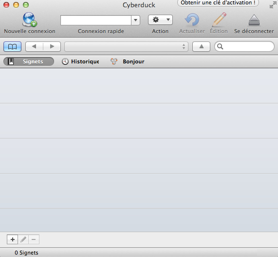
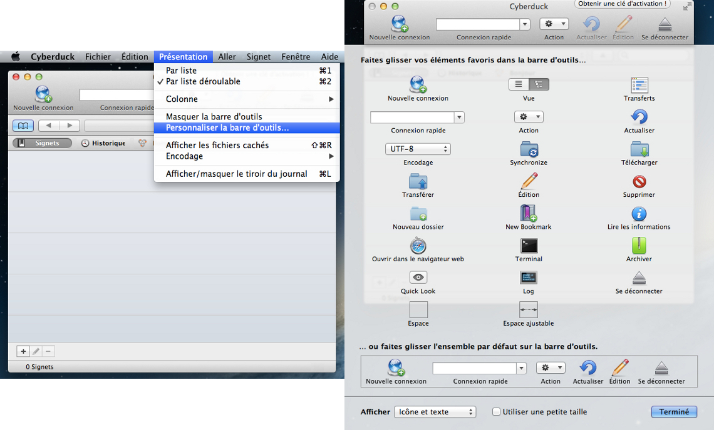
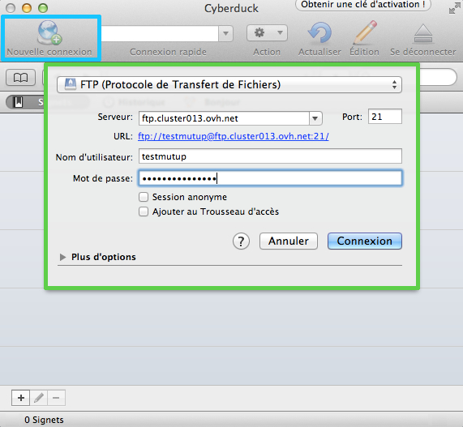
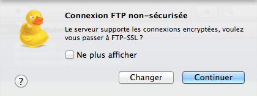
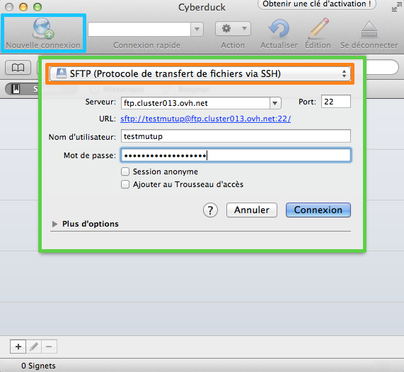
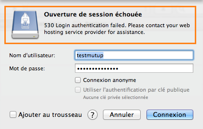
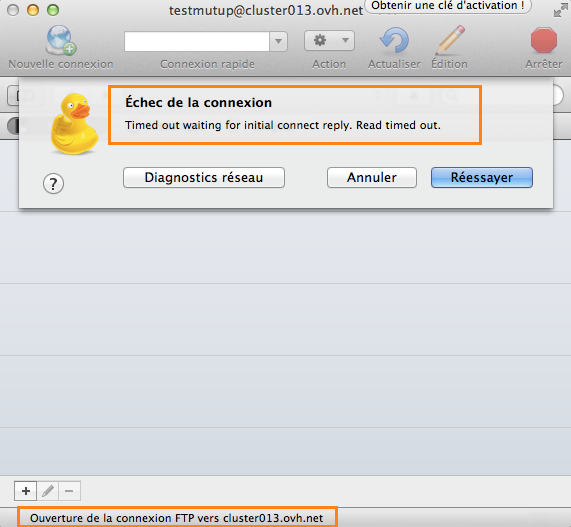
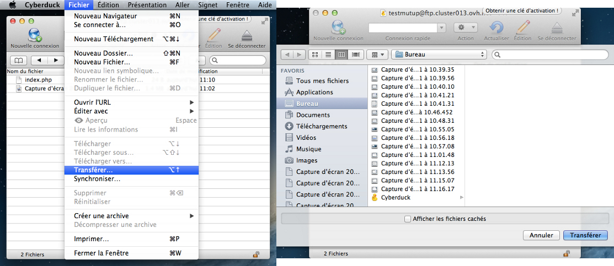
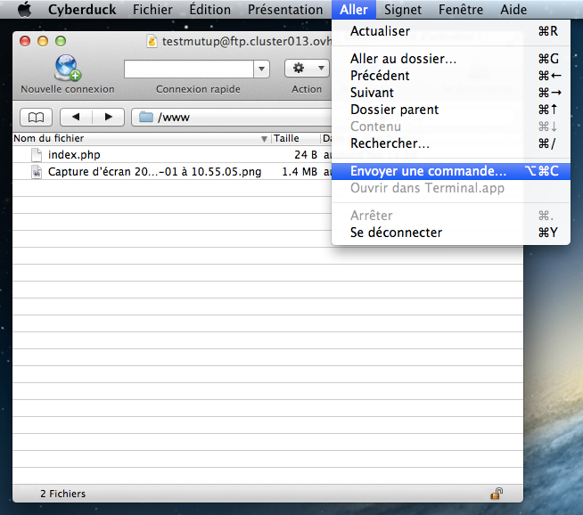

## Presentación
Cyberduck es una aplicación disponible para Mac que permite publicar un sitio web conectándose al espacio de alojamiento por FTP.

Para descargarla, visite la web oficial de la aplicación: [cyberduck.io](https://cyberduck.io/)

{.thumbnail}

Cyberduck es una aplicación para usuarios de Mac. Si utiliza Windows en su máquina, recomendamos usar FileZilla: 

- 

## Interfaz
La primera vez que ejecute la aplicación, podrá ver la pantalla de la imagen.

- La zona superior permite establecer una nueva conexión rápida y, una vez se haya conectado a su espacio FTP, acceder a distintas acciones: renombrar, editar, etc.

- En la zona central puede ver los favoritos que haya añadido (sus conexiones FTP guardadas) y, después de conectarse, aparece el contenido de su espacio de alojamiento.

- La zona inferior muestra información sobre la acción actual (conexión al servidor FTP) y algunos iconos para, por ejemplo, añadir un nuevo favorito.

{.thumbnail}

Personalizar la apariencia de Cyberduck

Es posible personalizar la apariencia de Cyberduck para hacerlo más eficaz y adaptarlo a nuestras necesidades.

Para ello, haga clic en «Visualización» y seleccione «Personalizar barra de herramientas...». 

En la nueva pantalla, arrastre los elementos que desee a la barra de herramientas. Para aceptar los cambios, haga clic en «Aceptar»

{.thumbnail}

## Conexión FTP
Para conectarse a su espacio de alojamiento por FTP, siga las indicaciones que se ofrecen a continuación:

1. Haga clic en «Nueva conexión», en la esquina superior izquierda.

2. En la nueva ventana, introduzca los datos de conexión a su espacio FTP:

- Servidor FTP
- Puerto: 21
- Nombre de usuario
- Contraseña

3. Marque la casilla «Guardar contraseña» si quiere que Cyberduck memorice la contraseña.

4. Haga clic en «Conectar».

{.thumbnail}

Si no marca la casilla «Guardar contraseña», deberá introducir la contraseña cada vez que se conecte a su espacio de alojamiento.

Si no recuerda sus claves FTP, consulte esta guía para [recuperar sus claves FTP](http://www.ovh.es/g1374.publicar-sitio-web-en-internet#subir_los_archivos_por_ftp_claves_ftp).
Debería aparecer un mensaje informando de que el servidor admite conexiones encriptadas (SSL).
Nuestro servidor no es compatible con FTP-SSL, por lo que debe marcar la casilla «No mostrar de nuevo» y seleccionar «Continuar».

Si desea conectarse de forma segura, conéctese por  [SFTP](#utilizar_cyberduck_conexion_sftp). Tenga en cuenta que solo puede utilizar esta conexión si dispone de acceso SSH en su plan de hosting.

{.thumbnail}

Si no sabe si su alojamiento incluye acceso SSH, consulte nuestros [planes de web hosting](http://www.ovh.es/hosting/). 

Si sigue sin estar seguro, elija «Continuar». El servidor rechazará la conexión si su alojamiento no tiene acceso SSH.
Le recomendamos que guarde los datos de conexión en los [favoritos](#utilizar_cyberduck_favoritos).

## Conexión SFTP
Si su plan de hosting es compatible con el acceso SSH, también puede conectarse por SFTP. Es imprescindible disponer de este acceso para que funcione la conexión SFTP.
Si no sabe si su alojamiento incluye acceso SSH, consulte nuestros [planes de web hosting](http://www.ovh.es/hosting/).

Si sigue sin estar seguro, conéctese por [FTP](#utilizar_cyberduck_conexion_ftp) en lugar de SFTP. El servidor rechazará la conexión si su alojamiento no tiene acceso SSH.
Para poder conectarse a su espacio de alojamiento, siga indicaciones que se ofrecen a continuación:

1. Haga clic en «Nueva conexión», en la esquina superior izquierda.

2. En la nueva ventana, seleccione en el menú desplegable «SFTP (SSH Transferencia de archivos segura)».

3. Introduzca los datos de conexión a su espacio FTP:

- Servidor FTP
- Puerto: 22
- Nombre de usuario
- Contraseña

3. Marque la casilla «Guardar contraseña» si quiere que Cyberduck memorice la contraseña.

4. Haga clic en «Conectar».

{.thumbnail}

Si no marca la casilla «Guardar contraseña», deberá introducir la contraseña cada vez que se conecte a su espacio de alojamiento.

Si no recuerda sus claves FTP, consulte esta guía para [recuperar sus claves FTP](http://www.ovh.es/g1374.publicar-sitio-web-en-internet#subir_los_archivos_por_ftp_claves_ftp).
La primera vez que se conecte a su espacio de alojamiento, aparecerá un mensaje informando de que el servidor no es reconocido por el sistema.
Marque la casilla «Siempre» y haga clic en «Permitir». De esa forma, no tendrá que volver a confirmar el servidor de conexión (OVH).

{.thumbnail}

Le recomendamos que guarde los datos de conexión en los [favoritos](#utilizar_cyberduck_favoritos).

## Errores de conexión
Al intentar conectarse a su espacio de alojamiento, puede aparecer un error en Cyberduck. A continuación se explica la causa de los dos errores más frecuentes.
Falló la autenticación

Este mensaje, seguido de la mención «530 Login authentification failed», suele indicar un error en los datos de conexión introducidos.

Compruebe que los datos de conexión que ha introducido son correctos.

Si ha creado un favorito, también deberá modificarlo. Para ello, selecciónelo y haga clic en el icono con forma de lápiz.

{.thumbnail}

Si no recuerda sus claves FTP, consulte esta guía para [recuperar sus claves FTP](http://www.ovh.es/g1374.publicar-sitio-web-en-internet#subir_los_archivos_por_ftp_claves_ftp).
Falló la conexión

Este mensaje, seguido de la mención Timed out waiting for initial connect reply, suele indicar que no ha sido posible conectar con el servidor. 

Puede deberse a que el servidor introducido no es correcto o no está disponible.

Compruebe que los datos de conexión que ha introducido son correctos.

Si ha creado un favorito, también deberá modificarlo. Para ello, selecciónelo y haga clic en el icono con forma de lápiz.

También puede deberse a que un cortafuegos o red local bloquean el puerto 21 o 22, que son los utilizados para conectarse al espacio FTP. En ese caso, compruebe su configuración personal.

{.thumbnail}

Le recordamos que el servidor de conexión a su espacio de alojamiento es ftp.su-dominio.tld (sustituyendo su-dominio.tld por su nombre de dominio y extensión) o ftp.clusterXXX.ovh.net (sustituyendo XXX por su número de cluster).

- Si lo necesita, consulte esta guía para [recuperar sus claves FTP](http://www.ovh.es/g1374.publicar-sitio-web-en-internet#subir_los_archivos_por_ftp_claves_ftp).

## Favoritos
Para acceder más fácilmente a su espacio de alojamiento, le recomendamos que utilice el sistema de «favoritos», que permite memorizar los datos de conexión.

Para ello:

- Conéctese a su espacio de alojamiento (por FTP o SFTP).
- Acceda a los favoritos como se muestra en la imagen.
- Haga clic en el icono «+», en la esquina inferior izquierda de la ventana.

{.thumbnail}

Se abrirá una nueva ventana con los datos de conexión. La próxima vez que inicie Cyberduck, podrá hacer doble clic en el favorito para conectarse más rápidamente.

## Transferir archivos
La transferencia de archivos le permite subir un sitio web a su espacio de alojamiento. Por defecto, debe subir los archivos del sitio a la carpeta www.

Puede transferir los archivos de varias formas.
Arrastrándolos

Para realizar transferir los archivos por FTP, puede simplemente seleccionarlos y arrastrarlos desde la ventana de la carpeta local (los archivos de su equipo) a la ventana de Cyberduck (el espacio de alojamiento).

Los archivos se pondrán automáticamente en cola para subir al servidor y se abrirá una ventana mostrando el progreso de la transferencia.

{.thumbnail}

Mediante el menú «Subir»

Haga clic en «Archivo» > «Subir». Se abrirá una ventana desde la que podrá seleccionar los archivos de su equipo que desee subir.

Haga clic en «Escoger». A continuación, sus archivos se pondrán automáticamente en cola para subir al servidor y se abrirá una ventana mostrando el progreso de la transferencia.

{.thumbnail}

Ver las transferencias

En la ventana «Transferencias», puede ver el historial de las transferencias a su espacio de alojamiento:

- archivos pendientes de subir al servidor remoto que todavía están en cola (o están siendo transferidos);
- archivos que no han podido subirse;
- archivos cuya transferencia al alojamiento remoto se ha completado.

Esta ventana se abre de dos formas distintas:

- automáticamente al comenzar una transferencia;
- haciendo clic en «Ventana» > «Transferencias».

{.thumbnail}

## Posibles acciones sobre un archivo o carpeta
Seleccionando un archivo o carpeta contenido en su espacio de alojamiento (en la ventana de Cyberduck), podrá realizar diversas acciones:

- ver la información del archivo o carpeta y editar sus permisos (CHMOD);
- editar el archivo con la aplicación que desee;
- renombrar el archivo o carpeta;
- eliminar el archivo o carpeta;
- descargar el elemento o elementos seleccionados;
- crear un nuevo archivo o carpeta.

La lista anterior no es exhaustiva; existen otras acciones posibles. Para más información, visite la web oficial de Cyberduck.

{.thumbnail}

## Permisos de los archivos y carpetas
Puede editar los permisos (CHMOD) de los archivos y carpetas contenidos en el alojamiento.

Se distribuyen en tres categorías:

- Propietario
- Grupo 
- Otros (público)

Para acceder a esta ventana, seleccione el/los archivo/s o carpeta/s deseados y haga clic en «Acción» > «Información».

En la nueva ventana, haga clic en «Permisos» y realice los cambios deseados: 

- Permisos UNIX: el valor actualizará automáticamente las casillas de las tres categorías.
- Marcando las casillas deseadas: el valor se actualizará automáticamente para los permisos UNIX.

{.thumbnail}

## Reapertura del sitio web
Puede reabrir su sitio utilizando un comando personalizado.

Por lo general, esta operación se realiza después de que OVH cierre por seguridad un espacio de alojamiento que ha sido hackeado.

Para utilizar un comando, haga clic en el menú «Ir» y seleccione «Enviar orden...».

{.thumbnail}

En la nueva ventana, introduzca el comando CHMOD 705 / y haga clic en «Enviar».

En el recuadro de abajo debería aparecer como confirmación el mensaje «200 Permissions changed on /».

Para comprobar que el sitio web se haya abierto, simplemente pruebe a acceder a él desde un navegador de internet.

{.thumbnail}

- El comando anterior no funciona en SFTP. Para realizarlo, utilice una conexión [conexión FTP](#utilizar_cyberduck_conexion_ftp).

- Recordamos que para probar que el sitio esté abierto, debe esperar un máximo de 3 horas. Nuestros robots pasan cada 3 horas para comprobar si se han realizado cambios de estado. En función del momento en el que haya realizado la operación, el sitio puede tardar más o menos en volver a visualizarse.

- Si ha transcurrido el intervalo de 3 horas y su sitio web sigue sin estar disponible, contacte con el soporte.

## Conocer el servidor de conexión
En algunos casos, el soporte puede preguntarle a qué servidor se ha conectado Cyberduck.

Esta comprobación puede pedirse en caso de ralentización o de anomalías diversas en su espacio FTP. 

Para conocer el servidor de conexión, debe activar previamente el diálogo con el servidor haciendo clic en «Visualización» > «Diálogo con el servidor. En la parte inferior de la ventana de Cyberduck debería aparecer un recuadro.

A continuación:

- Conéctese a su espacio FTP.
- Suba hasta el principio del diálogo.
- Consulte el servidor webmXXX.

{.thumbnail}

