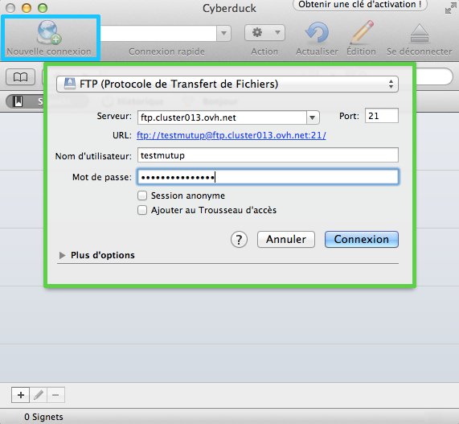
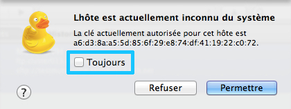
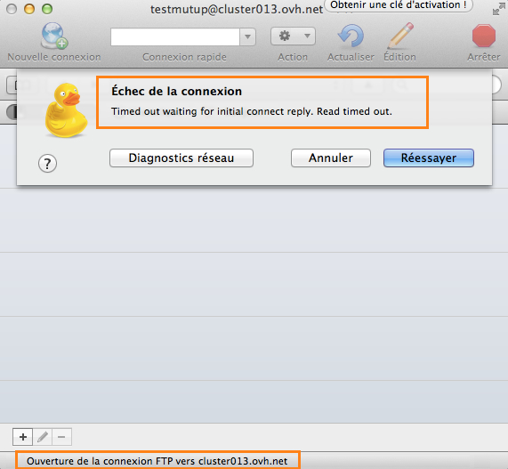
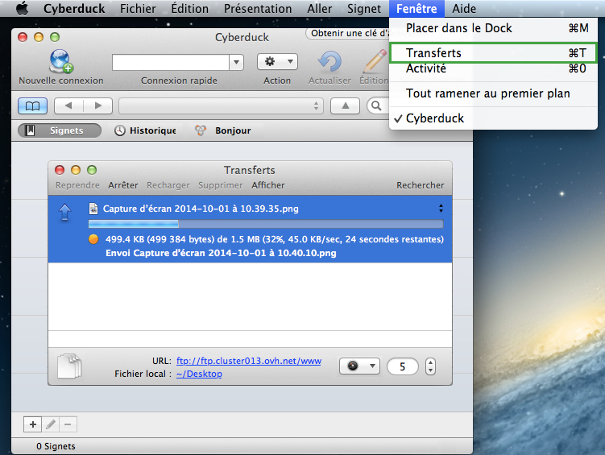
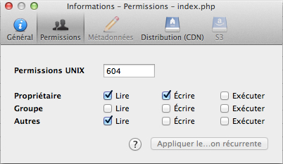
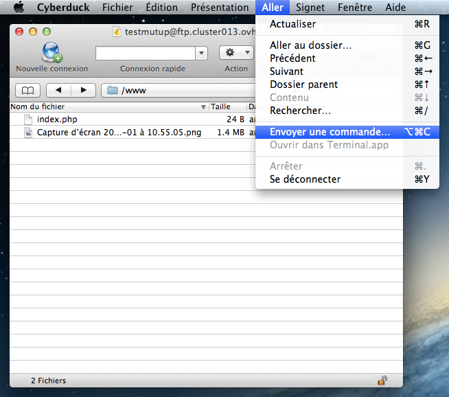
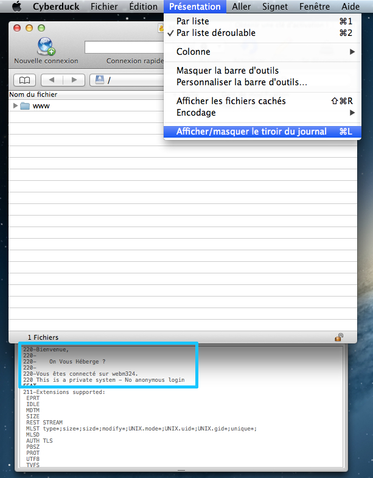

## Esittely
Cyberduck on sovellus MAC-laitteille.

Sen avulla voi kirjautua webhotelliin (FTP) julkaistakseen kotisivut verkossa.

- Cyberduckin virallinen sivusto: [cyberduck.io](https://cyberduck.io/)

{.thumbnail}
Cyberduck-sovellus on tarkoitettu MAC-laitteille. Mikäli käytössäsi on Windows, käytä FileZillaa: 

## Käyttöliittymä
Ensimmäisen kerran sovellusta käynnistettäessä voi nähdä oheisen ikkunan.

- Ylimmässä alueessa voi luoda uuden pikayhteyden ja tehdä eri toimintoja FTP-tilaan kirjauduttuasi (uudelleennimetä, muokata jne.).

- Keskellä olevassa alueessa voi esimerkiksi nähdä itse lisätyt kirjanmerkit (ennakkoon rekisteröidyt FTP-yhteydet) ja kirjautumisen jälkeen webhotellitilan.

- Alimmassa alueessa voi nähdä keskeneräisen toiminnon tiedot (yhteys FTP-palvelimelle) sekä esimerkiksi eräitä logoja uuden kirjanmerkin lisäämiseksi.

{.thumbnail}
Cyberduck-näkymän kustomointi
Cyberduck-näkymää voi kustomoida sen muuttamiseksi tehokkaammaksi ja henkilökohtaisemmaksi.

Klikkaa Esittely ja Kustomoi työkaluriviä....

Siirrä näkyviin tulevaan kehykseen ne elementit, jotka haluat työkaluriville. Vahvista muutokset klikkaamalla Valmis.

{.thumbnail}

## FTP-yhteys
Ottaaksesi FTP-yhteyden seuraa ohjeita:

1. Klikkaa Uusi yhteys ylhäällä vasemmalla.

2. Määrittele FTP-yhteyden tiedot avautuvaan ikkunaan:

- FTP-palvelin
- Käyttäjänimi
- Salasana
- Portti (21)

3. Rastita ruutu Lisää avainnippuun jos haluat Cyberduckin muistavan salasanan.

4. Klikkaa Yhdistä kirjautuaksesi FTP-tilaan.

{.thumbnail}

- Laita ruksi kohtaan Lisää avainnippuun,

jos haluat ohjelman muistavan salasanasi. Valinta ei ole pakollinen. Mikäli et rastita ruutua, sinun on syötettävä salasanasi uudelleenyhdistääksesi webhotellitilaan.

- Jos et tiedä FTP-tunnuksiasi, lue seuraava ohje:
[FTP-tunnukset](http://www.ovh-hosting.fi/https://docs.ovh.com/fi/hosting/webhotellit_kotisivujen_siirto_verkkoon#tiedostojen_siirto_ftplla_ftp-kayttajatunnuksen_saaminen).

Seuraavan viestin pitäisi tulla näkyviin: Palvelin tukee salattuja yhteyksiä (SSL).

- Palvelimemme ei ole FTP-SSL-yhteensopiva, rastita ruutu Älä näytä enää ja valitse Jatka.

- Mikäli haluat käyttää salattua yhteyttä, käytä [SFTP-yhteyttä](#utiliser_cyberduck_connexion_sftp). Huomaa, että tähän yhteyteen tarvitaan, että omassa webhotellituotteessasi on SSH-yhteys.

{.thumbnail}

- Jos et tiedä sisältyykö SSH-yhteys webhotelliisi, lue [webhotellien tuotekuvaus](http://www.ovh-hosting.fi/webhotelli/).

- Jos et vieläkään ole varma, valitse mieluummin oletuksena Jatka. Palvelin hylkää yhteyden, jos tuotteessa ei ole SSH-yhteyttä.

- Suosittelemme, että tallennat yhteystiedot Kirjanmerkkiin. Sen avulla jotkut yhteystiedot säilyvät.

- Tarvittaessa lue ohjeen osio: [Mikä on kirjanmerkki?](#utiliser_cyberduck_quest-ce_quun_signet).

## SFTP-yhteys
Mikäli webhotellituotteesi on yhteensopiva SSH-yhteyden kanssa, voit ottaa SFTP-yhteyden. SSH-yhteys on pakollinen SFTP:n toimimiseksi.

- Jos et tiedä sisältyykö SSH-yhteys webhotelliisi, lue [webhotellien tuotekuvaus](http://www.ovh-hosting.fi/webhotelli/).

- Jos et vieläkään ole varma, valitse mieluummin oletuksena [FTP-yhteys](#utiliser_cyberduck_connexion_ftp) kuin SFTP. Palvelin hylkää yhteyden, jos tuotteessa ei ole SSH-yhteyttä.

Seuraa alla annettuja ohjeita kirjautuaksesi webhotellitilaan:

1. Klikkaa Uusi yhteys ylhäällä vasemmalla.

2. Valitse alasvetovalikosta SFTP (SSH-suojattu tiedostosiirto) (ympäröity oranssilla oheisessa kuvassa).

3. Määrittele FTP-yhteyden tiedot avautuvaan ikkunaan:

- FTP-palvelin
- Käyttäjänimi
- Salasana
- Portti (22)

4. Rastita ruutu Lisää avainnippuun jos haluat Cyberduckin muistavan salasanan.

5. Klikkaa Yhdistä kirjautuaksesi FTP-tilaan.

{.thumbnail}

- Laita ruksi kohtaan Lisää avainnippuun,

jos haluat ohjelman muistavan salasanasi. Valinta ei ole pakollinen. Mikäli et rastita ruutua, sinun on syötettävä salasanasi uudelleenyhdistääksesi webhotellitilaan.

- Jos et tiedä FTP-tunnuksiasi, lue seuraava ohje:
[FTP-tunnukset](http://www.ovh-hosting.fi/https://docs.ovh.com/fi/hosting/webhotellit_kotisivujen_siirto_verkkoon#tiedostojen_siirto_ftplla_ftp-kayttajatunnuksen_saaminen).

Ottaessasi ensimmäistä kertaa yhteyden webhotellitilaan avautuu ikkuna: Tuntematon isäntäavain.

- Rastita ruutu Aina ja napsauta Salli. Näin toimien voit valtuuttaa pysyvästi yhteysisännän (joka on OVH).

{.thumbnail}

- Suosittelemme, että tallennat yhteystiedot Kirjanmerkkiin. Sen avulla jotkut yhteystiedot säilyvät.

- Tarvittaessa lue ohjeen osio: [Mikä on kirjanmerkki?](#utiliser_cyberduck_quest-ce_quun_signet).

## Yhteysvirheet
Yhteyttä otettaessa saattaa esiintyä virheitä. Alla kaksi usein esiintyvää virhettä.
Istunnon avaus epäonnistui
Viestiin liittyy myös 530 Login authentification failed. Useimmiten virhe liittyy käyttäjätunnukseen, jotka todennäköisesti on syötetty väärin.

- Tarkista käyttäjätunnus ja syötä se oikein.

- Mahdollisesti on myös muokattava luotua Kirjanmerkkiä (valitse kirjanmerkki ja napsauta kynälogoa).

{.thumbnail}

- Jos et tiedä FTP-tunnuksiasi, lue seuraava ohje:
[FTP-tunnukset](http://www.ovh-hosting.fi/https://docs.ovh.com/fi/hosting/webhotellit_kotisivujen_siirto_verkkoon#tiedostojen_siirto_ftplla_ftp-kayttajatunnuksen_saaminen).

Yhteysvirhe
Viestiin liittyy myös Timed out waiting for initial connect reply. Useimmiten virhe johtuu hostista, johon ei saada yhteyttä, joka on joko virheellinen tai siihen ei voi muodostaa yhteyttä.

- Tarkista yhteyden muodostamiseksi syötetyt tiedot.

- Mahdollisesti on myös muokattava luotua Kirjanmerkkiä (valitse kirjanmerkki ja napsauta kynälogoa).

Virhe voi lisäksi johtua palomuurista tai paikallisverkosta, joka estää portin 21 tai 22, jota käytetään FTP-yhteyden muodostamiseen. Tarkista niiden asetukset.

{.thumbnail}
Webhotellitilan yhteysisäntä on ftp.oma-domain.tld (käytä omaa verkkotunnusta) tai ftp.clusterXXX.ovh.net (korvaa XXX oman klusterin numerolla).

- Jos et tiedä FTP-tunnuksiasi, lue seuraava ohje:
[FTP-tunnukset](http://www.ovh-hosting.fi/https://docs.ovh.com/fi/hosting/webhotellit_kotisivujen_siirto_verkkoon#tiedostojen_siirto_ftplla_ftp-kayttajatunnuksen_saaminen).

## Mikä on kirjanmerkki?
Suosittelemme Kirjanmerkkien käyttöä webhotellitilaan (FTP) yhdistämiseen. Kirjanmerkillä voi laittaa muistiin yhteystiedot.

Lisää kirjanmerkki:

- Yhdistä webhotellitilaan (FTP-tai SFTP)
- Mene Kirjanmerkkien päälle (sininen ympyröinti ja sitten vihreä ympyröinti kuvassa)
- Napsauta [+]-logoa ikkunan vasemmassa alareunassa

{.thumbnail}
Uusi ikkuna avautuu, jossa näkyy yhteystiedot. Seuraavan kerran Cyberduckia käynnistettäessä voit kaksoisnapsauttaa kirjanmerkkiä kirjautuaksesi nopeammin.

## Tiedostosiirto
Tiedostosiirrolla viedään kotisivu webhotellitilaan. Oletuksena tiedostot on siirrettävä www-kansioon.

Tiedostot voi siirtää usealla tavalla.
Raahaa-ja-pudota
Tiedostojen siirtämiseksi FTP:hen ne voi yksinkertaisesti valita ja siirtää ne raahaamalla paikallisesta kansiosta (tietokoneen tiedostot) ja viemällä ne Cyberduckiin (webhotellitila).

- Vietyäsi tiedostot Cyberduckiin, ne päätyvät automaattisesti jonoon, josta ne siirtyvät palvelimelle. Tästä avautuu ikkuna.

{.thumbnail}
Siirto-käyttöliittymä
Tiedostonsiirtoon voi myös käyttää Siirto-käyttöliittymää, josta avautuu ikkuna ja jonka kautta tiedostoja voi selata. Valitse halutut tiedostot ja napsauta Siirrä.

- Vietyäsi tiedostot Cyberduckiin, ne päätyvät automaattisesti jonoon, josta ne siirtyvät palvelimelle. Tästä avautuu ikkuna.

{.thumbnail}
Keskeneräisten siirtojen tarkastelu
Voit tarkastella menneitä siirtotapahtumia webhotellitilaan, josta näkyy:

- jonossa olevat tiedostot, jotka odottavat siirtymistä etäpalvelimelle (tai joiden lähetys kesken)
- tiedostot, joiden siirto on epäonnistunut
- tiedostot, joiden siirto on onnistunut etäpalvelimelle

Ikkuna näkyy kahdessa vaiheessa:

- automaattisesti kun siirto alkaa
- napsauttamalla Ikkuna ja Siirrot

{.thumbnail}

## Kansiolle/hakemistolle mahdolliset toiminnot
Valitessasi webhotellitilassa (Cyberduck-ikkunassa) olevan kansion tai hakemiston voit tehdä niille eri Toimintoja.

Toiminnoilla voidaan:

- Lukea kansion tai hakemiston tietoja ja muuttaa niiden oikeuksia (CHMOD)
- Muokata kansiota valitsemallasi sovelluksella
- Uudelleennimetä kansion tai hakemiston
- Poistaa kansion tai hakemiston
- Ladata valitun kohteen / valitut kohteet
- Luodan uuden kansion tai hakemiston

Ylläoleva lista ei ole täydellinen, toimintoja on myös muita. Katso lisätietoja tarvittaessa Cyberduckin viralliselta sivustolta.

{.thumbnail}

## Kansio- ja hakemisto-oikeudet
Webhotellitilassa sijaitsevien kansioiden ja hakemistojen oikeuksia (CHMOD) voidaan muuttaa.

Ne jakautuvat kolmeen ryhmään:

- Yksityinen
- Ryhmä
- Julkinen (muut).

Oikeuksia pääsee muuttamaan valitsemalla kansion/t tai hakemiston/t ja Toiminnot, napsauta "Lue tiedot".

Uudessa ikkunassa napsauta Oikeudet ja tee haluamasi muutokset:

- UNIX-oikeudet: arvo päivittyy automaattisesti kolmeen yllämainittuun ryhmään
- Rastita halutut valinnat: arvo päivittyy automaattisesti kolmen yllämainitun ryhmän UNIX-oikeuksille

{.thumbnail}

## Sivuston uudelleenavaus
Kotisivut voi uudelleenavata käyttämällä personoitua komentoa.

Useimmissa tapauksissa tämä toimenpide on tehtävä silloin, kun OVH on sulkenut webhotellin turvasyistä tietomurron vuoksi.

Komennon käyttämiseksi:

- Napsauta Mene
- Napsauta Lähetä komento...

{.thumbnail}
Syötä komento avautuvaan ikkunaan:

- CHMOD 705 /
- Napsauta Lähetä

Varmistuksena viestin 200 Permissions changed on / pitäisi näkyä ylläolevassa ruudussa.

- Tarkista uudelleenavaus testaamalla sivuston toimivuus nettiselaimessa.

{.thumbnail}

- Tämä komento ei toimi SFTP:ssä. Käytä [FTP-yhteyttä](#utiliser_cyberduck_connexion_ftp) sen suorittamiseksi.

- Testaa sivuston toimivuutta enintään kolmen tunnin kuluttua. Robottimme tarkastavat tilanmuutokset joka kolmas tunti ja riippuen siitä, milloin yllämainittu muutos tehtiin, sivusto voi palautua nopeammin tai hitaammin.

- Jos sivusto ei ole palautunut kolmenkaan tunnin kuluttua, ota yhteys asiakaspalveluumme.

## Yhteyspalvelin
Joissain tapauksissa asiakaspalvelumme saattaa joutua kysymään, mihin palvelimeen Cyberduck on yhdistänyt.

Tämä saattaa tulla kyseeseen esimerkiksi jos olet huomannut hitautta tai muita poikkeavuuksia FTP-tilassa.

Aktivoi päiväkirja:

- Napsauta Esittely
- Napsauta Näytä/piilota päiväkirjan laatikko

Cyberduck-ikkunan alle pitäisi ilmestyä kehys, sitten:

- Ota FTP-yhteys
- Mene päiväkirjan kehyksen yläosaan
- Ota muistiin webmXXX

{.thumbnail}

