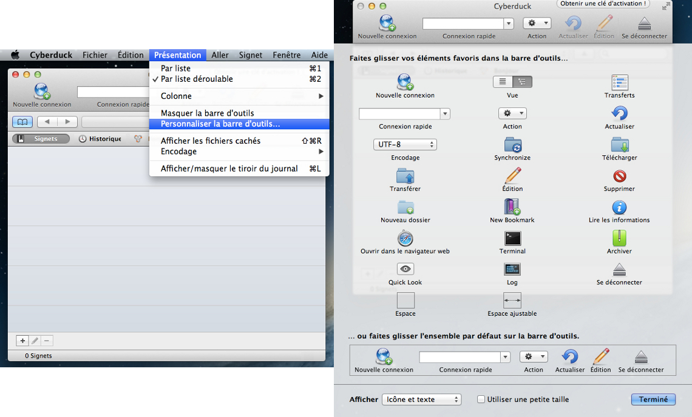
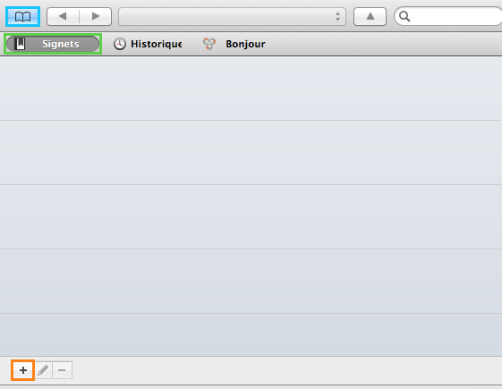

## Introduzione
Cyberduck è un software MAC che ti permette di pubblicare il tuo sito accedendo al tuo spazio hosting (FTP).

Per utilizzarlo, vai sul sito ufficiale Cyberduck: [cyberduck.io](https://cyberduck.io/)

{.thumbnail}
Cyberduck è un software MAC. Se utilizzi Windows, ti consigliamo di utilizzare FileZilla: 

## Interfaccia
Al primo avvio, potresti visualizzare questa finestra.

- La parte in alto ti permette di impostare una nuova connessione e un collegamento veloce, e di effettuare diverse azioni dopo esserti connesso al tuo spazio FTP (rinomina, modifica, ecc.).

- La parte centrale ti permette di visualizzare i preferiti che hai aggiunto (le tue connessioni FTP configurate) e, dopo esserti connesso, il contenuto del tuo spazio hosting.

- La parte in basso include le informazioni su un'azione in corso (connessione al server FTP) e le icone per aggiungere nuove operazioni.

{.thumbnail}
Personalizza l'interfaccia di Cyberduck

Rendi il tuo Cyberduck perfetto per te. 

Per effettuare le modifiche, clicca su Visuale poi su Personalizza Barra Strumenti.

Nella finestra che compare, trascina gli elementi che vuoi aggiungere alla barra degli strumenti poi clicca su Fine per confermare.

{.thumbnail}

## Connessione FTP
Per accedere al tuo spazio hosting (FTP), segui questi step: 

1. Clicca su Nuova connessione in alto a sinistra

2. Inserisci nella nuova finestra i dati per connetterti al tuo spazio FTP:

- Server FTP
- Nome utente
- Password
- Porta (21)

3. Clicca su Aggiungi all'Accesso Portachiavi se vuoi memorizzare la tua password su Cyberduck

4. Clicca su Connessione per connetterti al tuo spazio hosting (FTP)

{.thumbnail}

- Puoi memorizzare la tua password su Cyberduck cliccando Aggiungi all'Accesso Portachiavi. Questa opzione è facoltativa: se non usi questa opzione dovrai reinserire la password per riconnetterti al tuo spazio hosting.

- Se non hai le credenziali FTP, consulta questa guida: [Recupera le tue credenziali FTP](http://www.ovh.it/g1374.mettre-mon-site-en-ligne#deposer_mes_fichiers_en_ftp_recuperer_mes_identifiants_ftp).

Un eventuale avviso ti confermerà che il server supporta connessioni cifrate (SSL).

- Se il server non è compatibile con l'FTP-SSL, clicca su Non mostrare nuovamente e seleziona Continua.

- Se vuoi una connessione sicura, utilizza [connessione SFTP](#utiliser_cyberduck_connexion_sftp). Questa connessione è disponibile solo se la tua offerta di Web hosting include un accesso SSH.

{.thumbnail}

- Per verificare se la tua offerta include l'accesso SSH, controlla i [dettagli delle nostre offerte](http://www.ovh.it/hosting-web/). 

- Se non sei sicuro, seleziona comunque Continua: se l'accesso SSH non è incluso nella tua offerta, il server rifiuterà la connessione.

Per conservare le informazioni di connessione, salvale tra i Preferiti. 

- Se non riesci, consulta questa parte della guida: [Che cos'è un Preferito?](#utiliser_cyberduck_quest-ce_quun_signet).

## Connessione SFTP
Se la tua offerta include un accesso SSH, puoi connetterti in SFTP.

- Per verificare se la tua offerta include l'accesso SSH, controlla i [dettagli delle nostre offerte](http://www.ovh.it/hosting-web/).

- Se non sei sicuro, seleziona una [Connessione FTP](#utiliser_cyberduck_connexion_ftp) al posto di una SFTP: se l'accesso SSH con è incluso nella tua offerta, il server rifiuterà la connessione.

Per connetterti al tuo hosting, segui questi step:

1. Clicca su Nuova connessione in alto a sinistra

2. Seleziona nel menu a tendina SFTP (SSH Trasferimento File Sicuro) (riquadro arancione nell'immagine)

3. Inserisci i tuoi dati per connetterti al tuo spazio FTP:

- Server FTP 
- Nome utente
- Password
- Porta (22)

4. Clicca su Aggiungi all'Accesso Portachiavi se vuoi memorizzare la tua password su Cyberduck

5. Clicca su Collegamento per connetterti al tuo spazio hosting (FTP)

{.thumbnail}

- Puoi memorizzare la tua password su Cyberduck cliccando Aggiungi all'Accesso Portachiavi. Questa opzione è facoltativa: se non usi questa opzione dovrai reinserire la password per riconnetterti al tuo spazio hosting.

- Se non hai le credenziali FTP, consulta questa guida: [Recupera le tue credenziali FTP](http://www.ovh.it/g1374.mettre-mon-site-en-ligne#deposer_mes_fichiers_en_ftp_recuperer_mes_identifiants_ftp).

Al primo accesso al tuo spazio hosting, apparirà la finestra Questo Host è attualmente sconosciuto dal sistema.

- Clicca su Sempre e poi su Permetti per confermare definitivamente l'host di connessione (OVH).

{.thumbnail}
Per conservare le informazioni di connessione, salvale tra i Preferiti. 

- Se non riesci, consulta questa parte della guida: [Che cos'è un Preferito?](#utiliser_cyberduck_quest-ce_quun_signet).

## Errori di connessione
Durante la connessione al tuo spazio hosting, possono verificarsi degli errori. Ecco i due più frequenti.
Accesso fallito
Con questo messaggio visualizzerai 530 Login authentification failed e, nella maggior parte dei casi, questo errore è dovuto all'inserimento di credenziali sbagliate.

- Verifica le informazioni di connessione inserite

- Se necessario modificale anche nei Preferiti salvati (cliccando sul logo a forma di matita)

{.thumbnail}

- Se non hai le credenziali FTP, consulta questa guida:
[Recupera le mie credenziali FTP](http://www.ovh.it/g1374.mettre-mon-site-en-ligne#deposer_mes_fichiers_en_ftp_recuperer_mes_identifiants_ftp).

Connessione fallita
Con questo messaggio visualizzerai Timed out waiting for initial connect reply e nella maggior parte dei casi significa che l'host è sbagliato o non raggiungibile.

- Verifica le informazioni di connessione inserite

- Se necessario modificale anche nei Preferiti salvati (cliccando sul logo a forma di matita)

Il problema può essere causato anche da un blocco da parte del firewall o di una rete locale delle porte 21 o 22 utilizzate per connettersi all'FTP. In questo caso verifica la tua configurazione personale.

{.thumbnail}

- Reminder: l'host di connessione per il tuo spazio hosting è ftp.tuo-dominio.tld (sostituisci con il tuo dominio) o ftp.clusterXXX.ovh.net (sostituisci XXX con il tuo numero di cluster).

- Se necessario, consulta questa guida: [Recupera le mie credenziali FTP](http://www.ovh.it/g1374.mettre-mon-site-en-ligne#deposer_mes_fichiers_en_ftp_recuperer_mes_identifiants_ftp).

## Che cos'è un Preferito?
Per facilitare l'accesso al tuo spazio hosting (FTP) e memorizzare le tue informazioni di connessione, puoi utilizzare i Preferiti

Per farlo:

- Connettiti al tuo spazio hosting (FTP o SFTP)
- Entra nei Preferiti (in blu e poi in verde nell'immagine)
- Clicca su [+] (in arancione) nella parte in basso a sinistra della finestra

{.thumbnail}
Visualizzerai una nuova finestra con le tue informazioni di connessione. Al prossimo accesso a Cyberduck, clicca due volte sul segnalibro per connetterti più rapidamente.

## Trasferisci i file
Per trasferire il tuo sito Internet sul tuo spazio hosting, sposta i tuoi file nella cartella www. 

Puoi farlo in diversi modi.
Drag and drop
Per spostare i tuoi file in FTP, trascina gli elementi dalla cartella locale (i file sul tuo computer) alla finestra di Cyberduck (il tuo spazio hosting).

- Automaticamente i tuoi file verranno messi in lista d'attesa per essere trasferiti sul server e si aprirà una nuova finestra.

{.thumbnail}
Interfaccia Transferire
Nell'interfaccia Transferire si aprirà una finestra in cui potrai visualizzare i tuoi file. Selezionali e clicca su Transferire.

- Automaticamente i tuoi file verranno messi in lista d'attesa per essere trasferiti sul server e si aprirà una nuova finestra.

{.thumbnail}
Visualizzare i trasferimenti in corso
Visualizza la cronologia dei trasferimenti effettuati sul tuo spazio hosting. Qui troverai:

- i file in attesa di essere spostati sul server remoto ancora in coda o in corso di invio
- i file il cui trasferimento è fallito
- i file il cui trasferimento è riuscito 

Questa finestra si apre in due modi:

- automaticamente quando si inizia un trasferimento;
- cliccando su Finestra > Trasferimenti

{.thumbnail}

## Operazioni possibili su un file/cartella
Selezionando un file o una cartella del tuo spazio hosting (nella finestra di Cyberduck), puoi eseguire una serie di Azioni che ti permetteranno di: 

- Leggere le informazioni di un file o di una cartella e modificarne i diritti (CHMOD)
- Modificare i file con l'applicazione desiderata
- Rinominare i file o le cartelle
- Eliminare i file o le cartelle
- Scaricare gli elementi selezionati
- Creare un nuovo file o cartella

La lista non è completa: esistono altre azioni possibili. Se hai bisogno, consulta il sito ufficiale di Cyberduck.

{.thumbnail}

## Diritti dei file o delle cartelle
Puoi modificare i diritti (CHMOD) dei file e delle cartelle presenti sul tuo hosting.

I diritti sono di 3 tipi: 

- Proprietario
- Gruppo 
- Altri

Per accedere a questa interfaccia seleziona i file o cartelle desiderati, poi clicca su "Info" in Azione. 

Clicca su Permessi nella nuova finestra e poi esegui le modifiche desiderate. 

- Permessi UNIX: il valore aggiornerà automaticamente le caselle delle tre tipologie di diritti.
- Seleziona le caselle desiderate: il valore aggiornerà automaticamente per i Permessi UNIX.

{.thumbnail}

## Sblocco del sito
Puoi sbloccare il sito con un comando personalizzato in seguito al blocco di sicurezza del tuo spazio hosting OVH a causa di un attacco.

Puoi usare il comando: 

- Clicca su Vai
- Clicca su Invia comando...

{.thumbnail}
Nella nuova finestra, inserisci il comando:

- CHMOD 705 /
- Clicca su Invia

Visualizzerai il messaggio di conferma 200 Permissions changed on /.

- Per verificare lo sblocco, prova ad accedere al tuo sito da un browser Internet.

{.thumbnail}

- Questo comando non funziona in SFTP. Per utilizzarlo usa una [connessione FTP](#utiliser_cyberduck_connexion_ftp).

- Reminder: le nostre macchine verificano i cambiamenti di stato ogni 3 ore, quindi l'aggiornamento del tuo sito potrà richiedere più o meno tempo.

- Contatta il nostro supporto se dopo tre ore il tuo sito non è ancora on-line.

## Server di connessione
In alcuni casi il nostro supporto potrebbe chiederti il server a cui è connesso Cyberduck. 

Questa verifica può avvenire, ad esempio, se rilevi rallentamenti o anomalie del tuo spazio FTP. 

Per attivare i log:

- Clicca su Visuale
- Clicca su Mostra/Nascondi Pannello Log

Comparirà un riquadro sotto la finestra di Cyberduck, quindi:

- Connettiti al tuo spazio FTP
- Ritorna in alto nel Pannello Log
- Prendi nota del webmXXX

{.thumbnail}

