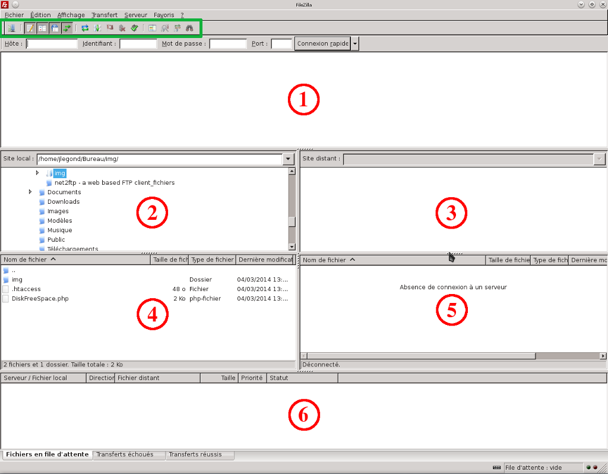
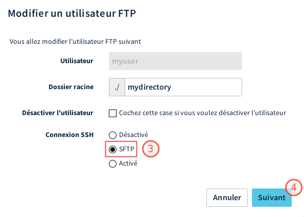

Retrouvez dans ce guide de l'aide concernant l'utilisation du logiciel FileZilla.

Retrouvez nos [différents guides mutualisés/hébergement Web](https://www.ovh.com/fr/hebergement-web/faq/){.external} disponibles.


## Généralités

### Presentation
FileZilla est un logiciel disponible sur plusieurs systèmes d'exploitations (Windows, MacOS, etc).

Ce dernier vous donne notamment la possibilité de mettre en ligne votre site internet en vous permettant de vous connecter à votre espace d'hébergement (FTP).

Pour en bénéficier, veuillez vous reporter au site : [filezilla.fr](http://filezilla.fr/){.external}


{.thumbnail}


### Interface
La  **zone 1**  donne des informations sur l'état de la connexion, les transferts, les erreurs de connexions, etc. Généralement les informations qui y sont reprises ne sont pas utiles pour des personnes non initiées.

La  **zone 2**  reprend l'arborescence pour arriver au dossier de votre site (ou des fichiers à transférer) sur votre ordinateur.

La  **zone 3**  reprend l'arborescence pour arriver au dossier où vous êtes actuellement sur le serveur.

La  **zone 4**  liste le répertoire que vous avez ouvert sur votre ordinateur, reprenant le nom, la taille, le type et la date de modification des fichiers.

La  **zone 5**  liste le répertoire que vous avez ouvert sur le serveur, reprenant le nom, la taille, le type, la date de modification, les droits et propriétaire des fichiers.

La  **zone 6**  indique la liste d'attente des fichiers qui vont être transférés (ou en cours de transfert) vers le serveur ou sur l'ordinateur.

La partie tout en haut de l'interface (sous l'encadré vert) reprend le nom d'hôte (serveur sur lequel vous êtes connecté), ainsi que le nom d'utilisateur du FTP, son mot de passe et le port utilisé.


{.thumbnail}


## Utiliser FileZilla

### Connexion FTP
Dans l'encadré vert tout en haut, afin d'établir la connexion au serveur distant, on vous demandera :

- Hôte : ftp.cluster0XX.hosting.ovh.net
- Identifiant : votre login FTP
- Mot de passe : le mot de passe FTP associé au login
- Port : peut rester vide (sinon mettre 21)

Une fois que tout est correctement saisi, cliquez sur *Connexion rapide* afin d'établir la connexion au serveur.


{.thumbnail}


### Connexion SFTP
Le SFTP (pour **S**ecure **F**ile **T**ransfer **P**rotocol) est un protocole similaire au FTP fonctionnant au dessus de SSH, sur le port 22. En plus d'établir une connexion sécurisée, il vous permettra de modifier des droits de fichiers que vous ne pouvez pas exécuter en étant connecté en FTP sur le port 21 par exemple.


> [!success]
>
> SFTP est activable gratuitement pour toutes les
> offres d'hébergements d'OVH (sauf 60free / demo1g) !
> 


#### Verifiez l'activation de SFTP
Avant d'aller plus loin, vérifiez tout d'abord que le SFTP est activé pour votre compte.

Rendez-vous dans votre [espace client](https://www.ovh.com/manager/web){.external} > onglet SSH-FTP.

S'il s'agit d'une offre d'hébergement "Start10M", vérifiez que "SFTP" est coché.


{.thumbnail}

Dans les autres cas :

- Cliquez sur la roue crantée <i class="fa fa-gear"></i> à côté de votre login puis sur `Modifier`{.action}.

{.thumbnail}

- Dans la fenêtre qui s'affiche, vérifiez alors que l'une des options suivantes est activée :
    - "Activé", si vous souhaitez activer le **SSH** (SFTP inclus)
    - "SFTP", si vous ne souhaitez activer **que le SFTP**.

{.thumbnail}

- Cliquez ensuite sur `Suivant`{.action} puis sur `Valider`{.action}


#### Lancez la connexion SFTP
Dans l'encadré vert tout en haut cette fois, afin d'établir la connexion au serveur distant, on vous demandera :

- Hôte : ftp.cluster0XX.hosting.ovh.net
- Identifiant : votre login FTP
- Mot de passe : le mot de passe FTP associé au login
- Port : 22 cette fois

Après avoir cliqué sur le bouton *Connexion rapide*, une boîte de dialogue s'ouvre (cf. ci-dessus) afin de certifier la connexion à l'hôte sur lequel vous vous apprêtez à vous connecter. En étant connecté sur un hôte OVH, vous pouvez cocher "*Toujours faire confiance à cet hôte, ajouter cette clé au cache*" afin qu'on ne vous le redemande plus à l'avenir.


{.thumbnail}


### Erreurs de connexion
Le message renseigné nous indique une erreur d'identification lors de la connexion en FTP à l'hébergement mutualisé.

Ce type de message est généré par une erreur dans le couple : Login // Mdp

Vérifiez vos identifiants afin de vous assurer qu'aucune erreur ne soit renseignée, cas échéant il vous est possible de modifier le mot de passe de l'accès FTP de votre hébergement, directement dans l'espace client.

*Un guide est disponible concernant la modification du mot de passe FTP sur les offres mutualisées :* []({legacy}1374){.ref}


{.thumbnail}

Dans ce cas l'erreur est générée par un nom d'hôte incorrect.


{.thumbnail}


### Transfert des fichiers
Pour réaliser le transfert de vos fichiers en FTP, vous pouvez simplement les sélectionner et réaliser un glisser-déposer des fichiers de la fenêtre de gauche *(vos fichiers en local)* vers la fenêtre de droite *(votre espace d'hébergement)*.

- Attention de bien sélectionner le dossier cible dans la fenêtre de droite.

Une fois cette action réalisée, vos fichiers vont automatiquement se mettre en file d'attente pour être déposés sur le serveur.


{.thumbnail}


### Vue sur la file d'attente
Une vue sur la file d'attente est disponible.

À ce niveau il vous est possible de retrouver :

- les fichiers en attente d'être déposés sur le serveur distant encore présents dans la file d'attente.
- les fichiers pour lesquels le transfert à échoué.
- les fichiers pour lesquels le transfert est réussi sur l'hébergement distant.


{.thumbnail}


### Menu contextuel Serveur
Si vous réalisez un clic droit sur l'un des fichiers présents (cf zone 5).

Un menu contextuel apparait, et plusieurs choix vous sont proposés :

Télécharger : *télécharge le fichier dans le dossier local ouvert.*

Ajouter les fichiers à la file d'attente : *ajoute le fichier à la file d'attente, vous permet par exemple de différer le téléchargement des données.*

Afficher/Éditer : *vous permet d'afficher ou d'éditer directement un fichier présent sur votre hébergement, vous devez cependant avoir un logiciel capable de lire le fichier installé sur votre poste.*

Créer un dossier : *vous permet de créer un nouveau dossier directement sur l'hébergement distant.*

Actualiser : *actualise l'affichage des données afin d'afficher correctement les différents fichiers présents.*

Supprimer : *vous permet de supprimer le fichier sélectionné.*

Renommer : *vous permet de renommer le fichier sélectionné.*

Copier l'(es) adresse(s) dans le presse-papier : *vous permet de copier automatiquement le lien direct vers le fichier sélectionné.* *Exemple d'URL qui peut être générée : ftp://loginftp@ftp.cluster0XX.hosting.ovh.net/www/mondossier1/monfichier.jpg*

Permissions de fichier : *vous donne la possibilité de modifier les droits des fichiers (CHMOD)*


{.thumbnail}


## Informations utiles

### Droits des fichiers &amp; dossiers
Afin d'accéder à cette interface, réalisez un clic droit sur l'un des fichiers présents sur le serveur, puis sélectionnez "Permissions de fichier".

Vous avez la possibilité dans cette interface de modifier les droits (CHMOD) de vos fichiers et de vos dossiers présents sur l'hébergement.

Renseignez les permissions que vous souhaitez attribuer, la valeur CHMOD sera automatiquement mise à jour.

Il vous est possible de cocher "Récursion dans les sous-dossiers".

Cela aura pour effet de modifier les droits du dossier en question, ainsi que des dossiers et des fichiers qui pourraient être présents dans celui-ci.


{.thumbnail}


### Reouverture de site
Ouvrez FileZilla, cliquez sur "Serveur" puis sélectionnez "Saisir une commande personnalisée".

*Dans FileZilla à la place de "Saisir une commande personnalisée" il est possible d'avoir "Entrez une commande FTP".*

Renseignez la commande :


```bash
SITE CHMOD 705 /
```

Si vous obtenez l'erreur suivante :

**550 would not chance perms on /. not such file or directory**

Il vous faut dans ce cas utiliser la commande :


```bash
SITE CHMOD 705 .
```

*Pour vérifier que la réouverture est bien effective, testez tout simplement votre site depuis un navigateur Internet.*

*Cette commande n'est pas fonctionnel en SFTP.*


{.thumbnail}


> [!alert]
>
> Pour rappel, veillez à tester l'affichage après 3 heures maximum. En effet,
> nos robots passent toutes les 3 heures pour vérifier les changements d'état.
> En fonction du moment où la manipulation ci-dessus sera réalisée, le
> rétablissement de l'affichage de votre site pourra donc être plus ou moins
> rapide.
> Si le délai des 3 heures est passé et que votre site n'est toujours pas en
> ligne, veuillez contacter notre support.
> 


### Transfert de fichiers binaires
Pour les fichiers de type binaire, par exemple dans le cas de fichier de type **CGI**  il peut être intéressant de choisir la manière dont le transfert sera réalisé.

Pour modifier cela, sélectionnez "Transfert" dans le menu principal puis "Type de transfert".


{.thumbnail}


### Comparaison de dossier
Cette option affiche des couleurs dans les  **zones 3**  **et**  **4**  afin de comparer les différences entre les fichiers et dossiers locaux et le serveur. En cliquant droit sur l'icône , vous pouvez changer le mode de comparaison. On vous proposera alors d'activer ou de désactiver l'option, mais également de :

- Comparer la taille des fichiers
- Comparer l'horodatage
- Masquer les fichiers identiques

Couleurs :

- Jaune : le fichier existe uniquement d'un seul côté
- Vert : le fichier est plus récent que le fichier non marqué de l'autre côté
- Rouge : les tailles des fichiers sont différentes


{.thumbnail}


### Preferences
Il vous est possible de modifier vos paramètres de reconnexion sur le serveur.

Attention toutefois, cela peut être considéré par de l'abus par certains serveurs et pourrait bannir votre adresse IP.

Pour modifier ces réglages, rendez-vous dans "Édition" puis "Paramètres" et enfin "Connexion".


{.thumbnail}

Il vous est possible de modifier les préférences concernant les actions à exécuter par défaut lors de modification d'un fichier existant.

Pour modifier ces réglages, rendez-vous dans "Édition" et ensuite dans "Paramètres" puis dans "transferts".


{.thumbnail}


### Connaitre le serveur de connexion
Dans certains cas, notre support peut être amené à vous demander le serveur sur lequel s'est connecté FileZilla.

Cette vérification peut par exemple intervenir si vous constatez des lenteurs ou des anomalies diverses avec votre espace FTP. Pour le retrouver :

- Reportez-vous au cadre en dessous de votre identifiants
- Remontez tout en haut des logs
- Relevez le webmXXX


{.thumbnail}