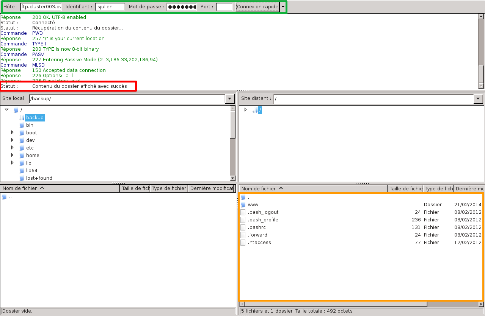
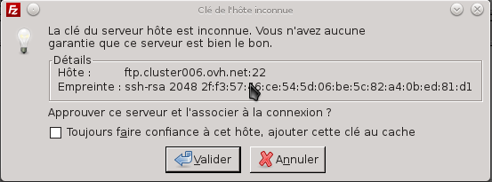
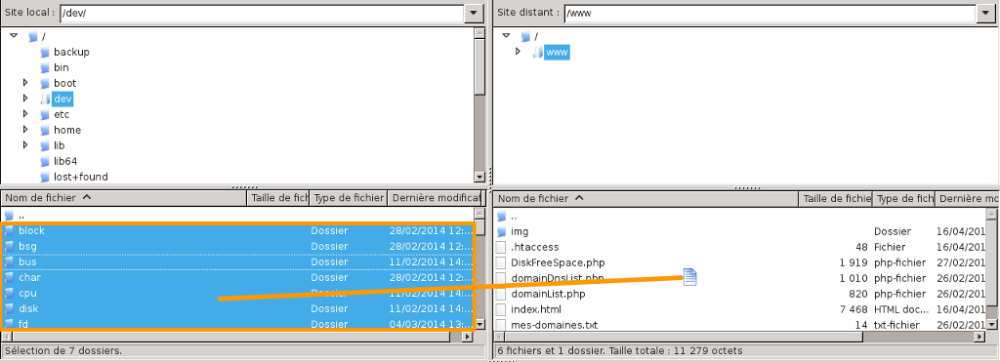
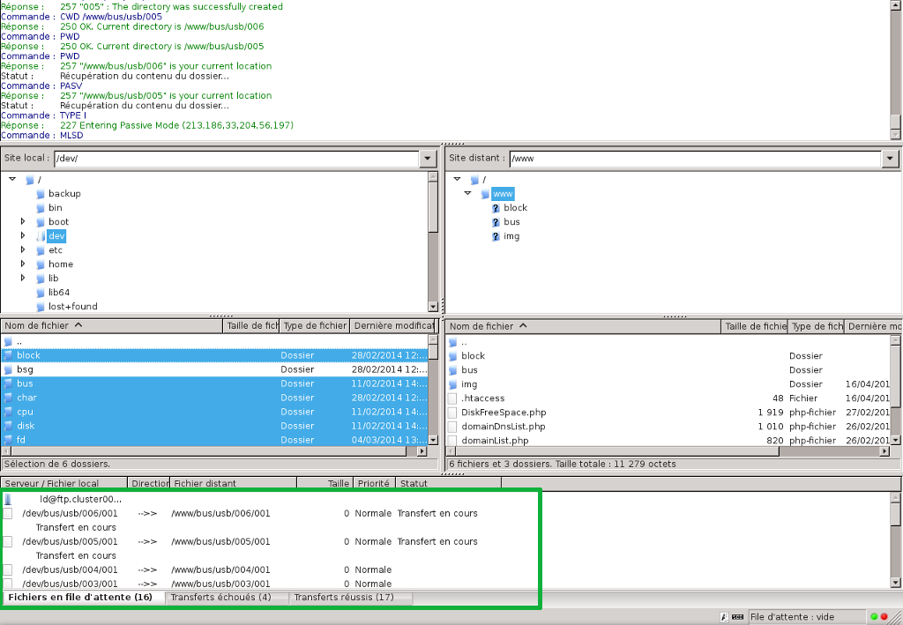
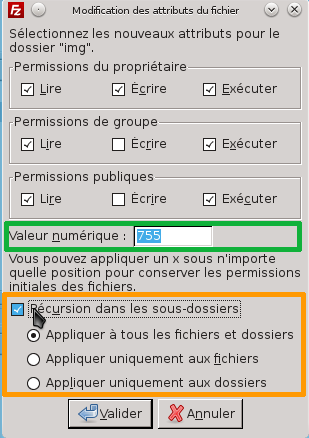
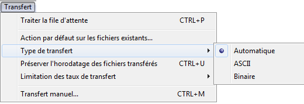
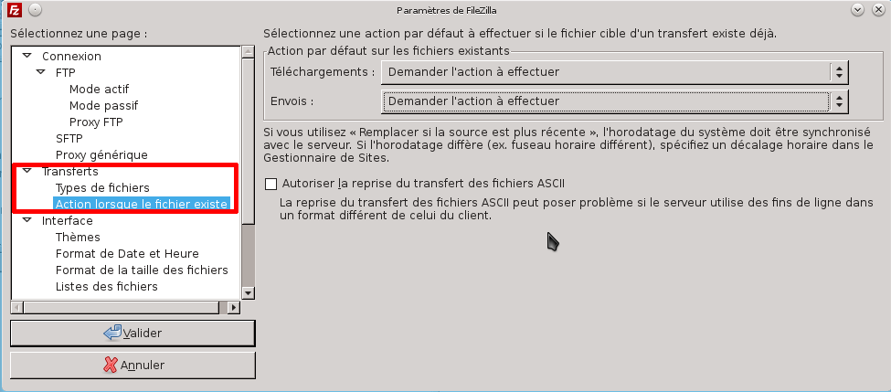

## Apresentação
FileZilla é um software disponível para vários sistemas operativos (Windows, MAcOSm, etc).

Este software dá-lhe a possibilidade de colocar online o seu website e permite-lhe a ligação ao seu espaço de alojamento (FTP).

Para noções sobre como utilizar o software, aceda ao site [url="https://filezilla-project.org/"[blue]do projeto FileZilla[/blue][/url]

{.thumbnail}


## Interface

## Detalhes sobre a apresentação de dados na ferramenta FileZilla
A zona 1 fornece informações sobre o estado da ligação, as transferências, os erros de comunicação, etc.
Geralmente as informações que não são úteis para amadores.

A zona 2 tem em conta a hierarquia de ficheiros para chegar à pasta do seu site (ou dos ficheiros a transferir) para o seu computador.

A zona 3 tem em conta a hierarquia de ficheiros para chegar à pasta onde atualmente está no servidor.

A zona 4 lista a diretoria que abriu no seu computador, tendo em conta o nome, o tamanho, o tipo e a data de modificação dos ficheiros.

A zona 5 lista o diretoria que abriu no servidor, tendo em conta o nome, o tamanho, o tipo, a data de modificação dos ficheiros e a propriedade dos ficheiros.

A zona 6 indica a lista de espera dos ficheiros que transferiu (ou está em curso de transferir) para o servidor ou para o computador.

Na parte superior da interface (a verde) tem em conta o nome do host (servidor ao qual está ligado), bem com o nome do utilizador FTP, a sua password e a porta utilizada.

{.thumbnail}

## Separador principal
O separador principal contém os ícones úteis ao funcionamento básico do software. Não utilizamos todos os botões para proceder à transferência de ficheiros. Consulte em baixo uma breve descrição dos ícones.
 Abrir o gestor de sites
 Apresentar ou ocultar o log (1)
 Apresentar ou ocultar a hierarquia dos ficheiros locais (2)
 Apresentar ou ocultar a hierarquia dos ficheiros distantes (3)
 Apresentar ou ocultar a fila de espera (6)
 Atualizar a lista das pastas e dos ficheiros
 Iniciar ou parar o tratamento da fila de espera
 Anular a operação em curso
 Desligar-me do servidor atualmente visível
 Ligar-me ao último servidor utilizado
 Apresentar a caixa de diálogo da gestão dos filtros das pastas
 Ativar ou desativar a comparação de uma pasta
 Ativar ou desativar a navegação sincronizada
 Procura recursiva de ficheiros


## Ligação FTP
No quadro verde em cima, para que possa estabelecer a ligação ao servidor distante, ser-nos-á pedido pelo software:

- Servidor : ftp.seu-dominio.tld ou ftp.cluster0XX.ovh.net ou newftp.cluster0XX.ovh.net
- Identificador: o seu login FTP
- Password: a password FTP associada ao login
- Porta : deixe vazio (caso contrário, coloque 21)


Após tudo preenchido de forma correta, clique em Ligação rápida para estabelecer a ligação ao servidor.

{.thumbnail}


## Ligação SFTP
O protocolo SFTP (SSH File Transfer Protocol) permite uma ligação FTP à porta 22 através de uma ligação segura.
Atenção, este tipo de ligação somente é válida a partir da oferta [Pro](http://www.ovh.pt/alojamento-partilhado/).
Irá conseguir, por exemplo, modificar os direitos de ficheiros que não poderá executar estando ligado via FTP à porta 21.

A verde em cima, a fim de estabelecer a ligação ao servidor distante ser-nos-á pedido:

- Servidor : ftp.seu-dominio.tld ou ftp.cluster0XX.ovh.net ou newftp.cluster0XX.ovh.net
- Identificador: o seu login FTP
- Password: a password FTP associada ao login
- Porta : 22 esta vez


Após clicar no botão Ligação rápida, irá abrir-se uma caixa de diálogo (ver ao lado) para se certificar da ligação ao host ao qual pretende estabelecer ligação.
Estando a ligar-se a um host OVH poderá selecionar "Configurar sempre neste host, adicionar esta chave à cache" para que não lhe volte aparecer esta mensagem.

{.thumbnail}


## Erros de ligação
A mensagem introduzida indica-nos um erro de autenticação aquando da ligação ao FTP do alojamento partilhado.

Este tipo de mensagem é gerada devido a um erro no par Login // Password

Verifique os seus dados para que se certifique que não existe nenhum erro aquando da introdução do utilizador/password. É ainda possível que peça no seu Espaço Cliente uma nova password de acesso FTP.

Está disponível um guia que diz respeito à alteração da password FTP nas ofertas partilhadas:[]({legacy}1374)

{.thumbnail}
Neste caso, é gerado um erro devido ao nome do servidor estar incorreto.

{.thumbnail}


## Transferência de ficheiros
Para proceder à transferência dos seus ficheiros via FTP pode simplesmente selecioná-los e efetuar um copiar-colar dos ficheiros na janela à esquerda (os seus ficheiros que possui localmente) para a janela à direita (o seu espaço de alojamento).


- Atenção, selecione a pasta alvo na janela à direita.


Após realizar esta operação, os seus ficheiros serão automaticamente colocados na ficha de espera para serem transferidos para o servidor.

{.thumbnail}


## Vista da fila de espera
Está disponível um mecanismo de visualização da fila de espera

Pode consultar:


- os ficheiros em lista de espera para serem transferidos para o servidor;

- os ficheiros para os quais a transferência falhou;

- os ficheiros que foram transferidos para o alojamento remoto;


{.thumbnail}


## Menu contextual do Servidor
Se efetuar um clique com o botão do lado direito do rato num dos ficheiros presentes (cf. zona 5), irá ser apresentado um menu contextual e terá à sua escolha várias opções

Transferir: transfere o ficheiro para o dossier local aberto.

Adição dos ficheiros à lista de espera: adiciona o ficheiro à lista de espera e permite, por exemplo, difereir o download de dados.

Mostrar/Edtar: permite apresentar ou editar diretamente um ficheiro presente no seu alojamento, embora deva possuir um software capaz de ler e editar o ficheiro no seu computador.

Criar uma pasta: permite a criação de uma nova pasta no seu alojamento distante.

Atualizar: atualiza a apresentação dos dados para apresentar corretamente os diferentes ficheiros presentes.

Eliminar: permite a eliminação do ficheiro selecionado.

Renomear: permite a alteração do nome do ficheiro selecionado.

Copiar os caminhos URL para a área de transferência: permite copiar de forma automática o link direto para o ficheiro selecionado.
Exemplo de URL que pode ser gerado: ftp://loginftp@ftp.cluster0XX.ovh.net/www/minhapasta1/meuficheiro.jpg

Permissões do ficheiro: dá-lhe a possibilidade de modificar os direitos de ficheiros (CHMOD)

{.thumbnail}


## Permissões de pastas e ficheiros
Para que possa aceder a esta interface faça clique direito com o rato num dos ficheiros presentes no servidor e depois selecione "Permissões do ficheiros".

Nesta interface tem a possibilidade de modificar os direitos (CHMOD) dos seus ficheiros e das pastas presentes no alojamento.

Coloque as permissões que deseja atribuir aos ficheiros, o valor CHMOD será atualizado automaticamente.

Pode ainda selecionar "Aplicar a todos os ficheiros e pastas".

Esta ação terá como efeito a modificação dos direitos da pasta em questão mas igualmente as pastas e ficheiros presentes na pasta.

{.thumbnail}


## Reabertura de Site
Abra o software FileZilla, clique em "Servidor" e selecione "Introduzir um comando personalizado".

No software FileZilla, é possível que encontre a designação "Introduzir um comando FTP." ao invés de "Introduzir um comando personalizado".

Introduza o seguinte comando:


```
SITE CHMOD 705 /
```


Se obtiver o seguinte erro:

550 would not chance perms on /. not such file or directory

será necessário usar o seguinte comando:


```
SITE CHMOD 705 .
```


Para verificar que a reabertura do site ocorreu de forma bem sucedida, teste através de um acesso ao site efetuado a partir do seu browser.

Este comando não funciona em SFTP.

{.thumbnail}
A apresentação do site deverá passar a ser novamente possível após 3 horas, no máximo.
Os nossos robôs passam a cada 3 horas para fazer verificações de alterações de estados.O tempo de reestabelecimento varia em função do momento em que solicitou a reabertura.

Se após 3 horas da ação de reabertura o seu site continuar offline, contacte o serviço de aconselhamento.


## Transferência de ficheiros binários
Para os ficheiros do tipo binário, por exemplo no caso de ficheiros CGI
pode ser interessante escolher como a transferência se irá realizar.

Para modificar, selecione "Transferências" no menu principal e de seguida clique em "Tipo de transferência".

{.thumbnail}


## Comparação de pastas
Esta opção apresenta diferentes cores nas zonas 3 e 4 para comparar as diferenças entre os ficheiros e pastas locais e no servidor.
Ao clicar com o botão direito do rato no ícone  poderá alterar o modo de comparação.
Propomos que ative ou desative a opção, mas igualmente:

- Comparar o tamanho dos ficheiros
- Comparar o "timestamp"
- Ocultar ficheiros idênticos


Cores :

- Laranja : o ficheiro encontra-se somente num lado
- Verde: o ficheiro é mais recente que o ficheiro não marcado do outro lado
- Vermelho: os tamanhos dos ficheiros são diferentes


{.thumbnail}


## Preferências

## Ligação
É possível modificar os seus parâmetros de ligação ao servidor.

No entanto, tenha cuidado, pode ser considerado abusivo para certos servidores e poderá ver o seu endereço IP bloqueado.

Para modificar estas regras, aceda a "Edição" e depois "Parâmetros" e finalmente "Ligação".

{.thumbnail}

## Transferências
É possível que modifique as preferências no que diz respeito às ações a executar por defeito aquando da modificação de um ficheiro existente.

Para modificar essas regras aceda a "Edição" e depois "Parâmetros" e finalmente "Transferências".

{.thumbnail}


## Conhecer o servidor de ligação
Em certos casos, o nosso suporte poderá ter de lhe solicitar que indique qual o servidor ao qual se liga com a ferramenta FileZilla.

Esta verificação pode ser necessária, por exemplo, se constatar lentidões ou anomalias diversas no acesso ao seu espaço FTP. Para conhecer qual o servidor:

- Visualize o quadro onde são apresentados os logs da ligação FTP (logo por baixo dos dados de ligação);
- Anote o nome do servidor identificado como webmXXX


{.thumbnail}

