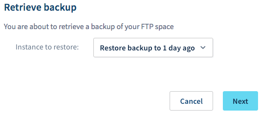
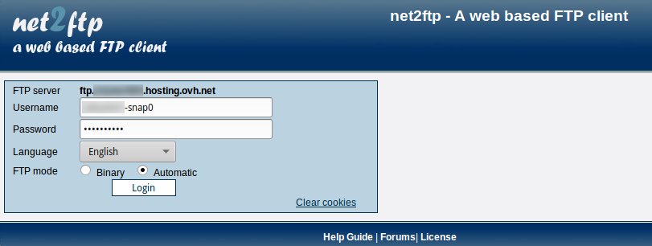

**Ostatnia aktualizacja dnia 24-09-2018**

## Wprowadzenie

W ramach usługi hostingu OVH otrzymujesz dostęp do przestrzeni dyskowej, na której możesz hostować Twoje strony WWW. Może się zdarzyć, że z jakiegoś powodu, na przykład w wyniku usunięcia lub modyfikacji pliku, Twoja strona WWW stanie się niedostępna i będziesz potrzebował przywrócić pojedynczy plik lub wszystkie dane przechowywane na przestrzeni dyskowej.

**Dowiedz się, jak przywrócić plik lub całą przestrzeń dyskową Twojego hostingu.**

## Wymagania początkowe

- Posiadanie oferty [hostingu](https://www.ovh.pl/hosting/){.external} (nie dotyczy hostingu Cloud Web).
- W zależności od użytej metody, posiadanie dostępu do interfejsu zarządzania usługą hostingu WWW w [Panelu klienta](https://www.ovh.com/auth/?action=gotomanager){.external} lub posiadanie hasła użytkownika FTP umożliwiającego zalogowanie do przestrzeni dyskowej. 

## W praktyce

Zanim przystąpisz do operacji, upewnij się, że wśród dostępnych dat przywrócenia przestrzeni dyskowej hostingu możesz wybrać odpowiadającą Ci datę.

- dzisiaj, o 00:01 rano;
- wczoraj, o 00:01 rano;
- przedwczoraj, o 00:01 rano;
- poprzednia niedziela, o 01:00 rano;
- niedziela dwa tygodnie temu, o 01:00 rano.

Jeśli chcesz wykorzystać starszą kopię zapasową, OVH nie będzie w stanie Ci jej dostarczyć. Ewentualnie wykorzystaj kopię zapasową, którą wykonałeś osobiście w przeszłości.

Określ również metodę przywracania, której użyjesz.

|Metoda przywracania|Opis|
|---|---|
|Przywracanie w Panelu klienta|Pozwala przywrócić całą zawartość przestrzeni dyskowej. Aktualna zawartość przestrzeni dyskowej zostanie zastąpiona wybraną kopią zapasową.|
|Przywracanie plików za pomocą programu lub interfejsu|Pozwala zalogować się do kopii zapasowej przestrzeni dyskowej tylko w trybie odczytu. Jest to metoda wymagająca większych umiejętności technicznych, pozwala jednak przywrócić jeden lub kilka plików z wcześniejszą datą bez konieczności usuwania całej zawartości przestrzeni dyskowej.|

Przejdź do sekcji dotyczącej wybranej przez Ciebie metody przywracania przestrzeni dyskowej. 

- [Przywracanie przestrzeni dyskowej w Panelu klienta](https://docs.ovh.com/pl/hosting/hosting_przywrocenie_kopii_zawartosci_ftp_w_aplikacji_filezilla/#przywracanie-przestrzeni-dyskowej-w-panelu-klienta){.external}

- [Przywracanie pliku za pomocą programu lub interfejsu](https://docs.ovh.com/pl/hosting/hosting_przywrocenie_kopii_zawartosci_ftp_w_aplikacji_filezilla/#przywracanie-pliku-za-pomoca-programu-lub-interfejsu){.external}

### Przywracanie przestrzeni dyskowej w Panelu klienta

Przed rozpoczęciem operacji zaloguj się do [Panelu klienta](https://www.ovh.com/auth/?action=gotomanager){.external}, kliknij `Hosting`{.action} na pasku usług po lewej stronie, następnie wybierz nazwę odpowiedniego hostingu. Przejdź do zakładki `FTP - SSH`{.action} i kliknij przycisk `Przywróć kopię zapasową`{.action}.

{.thumbnail}

W oknie, które się wyświetla wybierz z rozwijanego menu odpowiednią dla Ciebie datę:

|Wyświetlane oznaczenie daty|Data wykonania kopii zapasowej|
|---|---|
|D-1|dzisiaj, o 00:01 rano;|
|D-2|wczoraj, o 00:01 rano;|
|D-3|przedwczoraj, o 00:01 rano;|
|1 tydzień temu|poprzednia niedziela, o 01:00 rano;|
|2 tygodnie temu|niedziela dwa tygodnie temu, o 01:00 rano.|

Po wybraniu daty, kliknij przycisk `Dalej`{.action}. 

{.thumbnail}

Poświęć chwilę, aby upewnić się, że żaden plik nie zostanie usunięty w wyniku przywrócenia przestrzeni dyskowej, np. plik, który zapisałeś na przestrzeni po wybranej dacie przywrócenia. Jak zostało wspomniane wyżej, przywrócenie przestrzeni dyskowej spowoduje usunięcie wszystkich aktualnych danych, które zostaną zastąpione danymi z kopii zapasowej.

Kiedy jesteś gotowy do uruchomienia przywracania kopii zapasowej, kliknij przycisk `Zatwierdź`{.action}.

### Przywracanie pliku za pomocą programu lub interfejsu

Operacja składa się z kilku etapów. Upewnij się, że posiadasz hasło użytkownika FTP umożliwiające dostęp do przestrzeni dyskowej. 

> [!warning]
>
> Rozwiązanie to wymaga znajomości programu lub interfejsu, którego będziesz używał. Poniżej zamieszczamy kilka informacji dotyczących sposobu postępowania. W przypadku trudności zalecamy skorzystanie z pomocy specjalisty lub kontakt z producentem programu lub interfejsu. Niestety firma OVH nie będzie mogła udzielić wsparcia w tym zakresie.
>

#### Etap 1: wybranie programu lub interfejsu, którego będziesz używał

Na wstępie określ program lub interfejs, którego będziesz używał do łączenia się z kopią zapasową Twojej przestrzeni dyskowej. Jeśli już wybrałeś program lub interfejs, przejdź od razu do etapu 2. W przeciwnym razie zalecamy użycie jednego z trzech rozwiązań:

- **program FileZilla**: pobierz program ze strony producenta. OVH udostępnia przewodnik [Korzystanie z programu FileZilla na Twoim hostingu](https://docs.ovh.com/pl/hosting/hosting_www_przewodnik_dotyczacy_korzystania_z_programu_filezilla/){.external}, w którym znajdziesz instrukcje obsługi programu. Pamiętaj, że przewodnik OVH nie zastępuje oficjalnej dokumentacji producenta programu Filezilla.

- **program Cyberduck**: pobierz program ze strony producenta. OVH udostępnia przewodnik [Korzystanie z programu Cyberduck na Twoim hostingu](https://docs.ovh.com/pl/hosting/hosting_www_przewodnik_dotyczacy_korzystania_z_programu_cyberduck_mac/){.external}, w którym znajdziesz instrukcje obsługi programu. Pamiętaj, że przewodnik OVH nie zastępuje oficjalnej dokumentacji producenta programu Filezilla.

- **interfejs FTP Explorer**: zaloguj się do interfejsu w [Panelu klienta](https://www.ovh.com/auth/?action=gotomanager){.external}. Po zalogowaniu, kliknij `Hosting`{.action} na pasku usług po lewej stronie, następnie wybierz odpowiedni hosting. Przejdź do zakładki `FTP - SSH`{.action} i kliknij przycisk `FTP Explorer`{.action}.

Kiedy jesteś gotowy do rozpoczęcia operacji, przejdź do następnego etapu.

{.thumbnail}

#### Etap 2: logowanie do kopii zapasowej przestrzeni dyskowej

W wybranym interfejsie lub programie zaloguj się do przestrzeni dyskowej, aby uzyskać dostęp do zawartości kopii zapasowej, którą chcesz przywrócić. Potrzebna Ci do tego będzie nazwa użytkownika FTP, hasło oraz nazwa hosta Twojego serwera. 

Możesz odnaleźć te informacje w zakładce `FTP - SSH`{.action} na Twoim hostingu. Jeśli nie posiadasz hasła dla użytkownika FTP, zapoznaj się z instrukcjami zawartymi w przewodniku [Zmiana hasła do konta FTP](https://docs.ovh.com/pl/hosting/zmiana-hasla-konto-ftp/){.external}.

{.thumbnail}

Uzupełnij Twoją nazwę głównego użytkownika („login”) FTP sufiksem wskazującym kopię zapasową, do której chcesz się zalogować. W uzyskaniu dostępu do wybranej kopii zapasowej pomogą Ci poniższe wskazówki:

|Data wykonania kopii zapasowej|Sufiks do dodania:|Przykład uzupełnionej nazwy użytkownika|
|---|---|---|
|dzisiaj, o 00:01 rano;|-snap0|uzytkownikftp**-snap0**|
|wczoraj, o 00:01 rano;|-snap1|uzytkownikftp**-snap1**|
|przedwczoraj, o 00:01 rano;|-snap2|uzytkownikftp**-snap2**|
|poprzednia niedziela, o 01:00 rano;|-snap3|uzytkownikftp**-snap3**|
|niedziela dwa tygodnie temu, o 01:00 rano.|-snap4|uzytkownikftp**-snap4**|

Pamiętaj, aby zastąpić informację ogólną „uzytkownikftp” Twoją nazwą głównego użytkownika FTP. Zachowaj natomiast sufiks określający datę kopii zapasowej, do której chcesz uzyskać dostęp.

Metoda logowania do Twojej przestrzeni dyskowej jest różna w zależności od używanego interfejsu lub programu. Poniżej obrazek przedstawiający logowanie do przestrzeni przez interfejs FTP Explorer. 

{.thumbnail}

#### Etap 3: pobieranie wybranego pliku lub plików

Po zalogowaniu się, pobierz wybrany plik lub pliki. W tym celu przejrzyj zawartość Twojej przestrzeni dyskowej i zapisz lokalnie pliki. Operacja przebiega różnie w zależności od używanego programu lub interfejsu.

Zanim przejdziesz do kolejnego etapu, upewnij się, że pobrałeś wszystkie pliki, które zamierzasz przywrócić, następnie wyloguj się z przestrzeni dyskowej.

#### Etap 4: przywracanie wybranego pliku lub plików

Kiedy masz już plik lub pliki, zaloguj się ponownie do przestrzeni dyskowej. Nie dodawaj jednak sufiksu do Twojego użytkownika FTP, aby się zalogować. Jeśli nie wpiszesz sufiksu, zyskasz dostęp do aktualnej zawartości Twojej przestrzeni dyskowej, a nie to wcześniejszej kopii zapasowej.

Po zalogowaniu wgraj wybrany plik lub pliki. W tym celu przejrzyj zawartość Twojego komputera, następnie wybierz pliki i zastąp nimi stare pliki.

## Sprawdź również

[Korzystanie z programu FileZilla na Twoim hostingu](https://docs.ovh.com/pl/hosting/hosting_www_przewodnik_dotyczacy_korzystania_z_programu_filezilla/){.external}

[Korzystanie z programu Cyberduck na Twoim hostingu](https://docs.ovh.com/pl/hosting/hosting_www_przewodnik_dotyczacy_korzystania_z_programu_cyberduck_mac/){.external}

Przyłącz się do społeczności naszych użytkowników na stronie <https://community.ovh.com/en/>.
