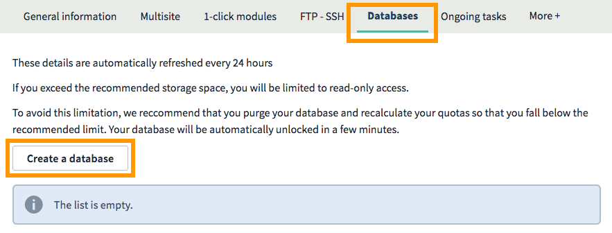
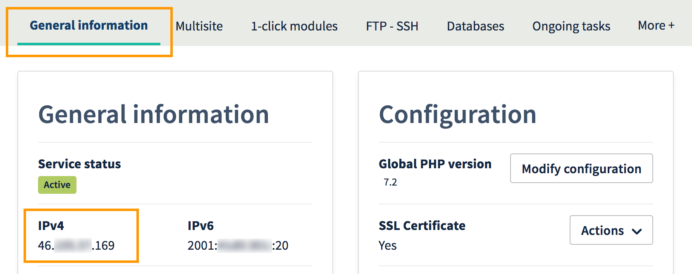

**Ultimo aggiornamento: 26/02/2018**

## Obiettivo

Uno spazio di hosting ti permette di creare il tuo sito con soluzioni chiavi in ​mano (come WordPress e PrestaShop) o sviluppare in autonomia la tua piattaforma grazie a server sempre disponibili.

**Questa guida ti mostra le operazioni di base da effettuare sul tuo hosting Web per mettere online il tuo sito in modo semplice e rapido.**

## Prerequisiti

- Disporre di un piano di [hosting Web](https://www.ovh.it/hosting-web/){.external} attivo
- Aver ricevuto l'email di conferma dell'installazione del tuo hosting Web 
- Disporre di un [dominio](https://www.ovh.it/domini/){.external} attivo, che corrisponderà all’indirizzo del tuo sito
- Avere accesso allo [Spazio Cliente OVH](https://www.ovh.com/auth/?action=gotomanager){.external}

## Procedura

### Step 1: definisci il tuo progetto

Creare un blog o un e-commerce, condividere una passione o promuovere un’attività professionale online, migrare un sito esistente in OVH... per realizzare al meglio il tuo progetto, è importante avere una visione chiara dell’obiettivo da raggiungere.

Grazie agli hosting Web OVH è possibile creare un nuovo sito o migrarne uno esistente.

- **Creare un nuovo sito Web**

Per pubblicare online file e contenuti è possibile creare un sito Internet in autonomia se si possiedono le competenze di programmazione necessarie, oppure affidarsi a soluzioni chiavi in mano come i CMS (Content Management System). La prima soluzione è più tecnica ma offre la possibilità di realizzare un progetto totalmente personalizzato. La seconda consente invece di usufruire di una struttura pronta all'uso anche senza possedere competenze tecniche specifiche.

Nello Spazio Cliente OVH è disponibile uno strumento che permette di installare in un click un modulo a scelta tra WordPress, PrestaShop, Drupal e Joomla!. Se non hai ancora deciso l’applicazione da installare, la nostra [pagina comparativa dei CMS](https://www.ovh.it/hosting-web/website/confronto-cms/){.external} potrebbe esserti di aiuto. Se il CMS che hai scelto non è presente fra le opzioni proposte da OVH, potrai installarlo manualmente nel tuo spazio di hosting.

- **Migrare in OVH un sito Web esistente**

La migrazione di un sito può risultare un’operazione delicata, soprattutto se eseguita su servizi in produzione e su cui non è possibile un'interruzione di servizio. In questo senso, la nostra guida descrive solo alcuni degli step da effettuare per trasferire i tuoi servizi. Per conoscere il processo completo, consulta la guida [Migrare un sito e un servizio di posta in OVH](https://docs.ovh.com/fr/hosting/migrer-mon-site-chez-ovh/){.external}.

### Step 2: installa il tuo sito

Una volta definito il progetto non resta che svilupparlo nello spazio di hosting. La fase successiva consiste quindi nel mettere online il tuo sito Internet. In base al tempo a tua disposizione e alle tue competenze, puoi scegliere fra tre opzioni.

#### Soluzione semplice in 1 click (competenze tecniche non necessarie)

Questa soluzione utilizza i moduli in 1 click OVH, che permettono di installare un CMS in modo semplice e veloce. OVH esegue l'installazione del sito e ti fornisce i dati necessari alla sua gestione.

Affinché l'operazione vada a buon fine è necessario che la directory di installazione del modulo sia vuota. Per installare il tuo modulo in 1 click, accedi allo [Spazio Cliente OVH](https://www.ovh.com/auth/?action=gotomanager){.external}. Nel menu a sinistra, clicca su `Hosting`{.action} e seleziona il nome del tuo servizio. Nella scheda `CMS in 1 click`{.action}, clicca sul pulsante `Aggiungi un modulo`{.action}.

{/thumbnail}

Per avviare l’operazione, scegli il CMS da installare assicurandoti che la casella `Installazione avanzata`{.action} non sia selezionata e clicca su `Installa`{.action}.

Attendi di ricevere l'email di conferma dell'installazione con le informazioni necessarie per effettuare l’accesso all’interfaccia di gestione del sito. A questo punto, passa agli step successivi.

Per maggiori informazioni su questa soluzione, consulta la nostra guida: [Installare i moduli in 1 click OVH](https://docs.ovh.com/it/hosting/hosting_condiviso_guida_ai_moduli_degli_hosting_condivisi/){.external}

#### Soluzione rapida in pochi click (competenze tecniche non necessarie)

Questa soluzione utilizza i moduli OVH, che permettono di installare un CMS in modo semplice e veloce. OVH esegue l'installazione del sito grazie alle informazioni inserite (ad esempio, le credenziali di accesso al CMS). Per utilizzare questa soluzione è necessario disporre di un’offerta che preveda la creazione di almeno un database.

Affinché l'operazione vada a buon fine è necessario assicurarsi che:

- la directory di installazione del modulo sia vuota
- sia già stato creato un database nello spazio di hosting

Per creare il database, accedi allo [Spazio Cliente OVH](https://www.ovh.com/auth/?action=gotomanager){.external}. Nel menu a sinistra, seleziona `Hosting`{.action} e poi il nome del tuo servizio. Clicca sulla scheda `Database`{.action} e poi su `Crea un database`{.action}. Inserisci le informazioni richieste e attendi che l'installazione sia terminata.

{/thumbnail}

Una volta creato il database, seleziona la scheda `CMS in 1 click`{.action} e clicca sul pulsante `Aggiungi un modulo`{.action}. Scegli il CMS da installare assicurandoti che la casella `Installazione avanzata`{.action} sia selezionata e clicca su `Continua`{.action}.

{/thumbnail}

Inserisci le informazioni richieste e poi avvia il processo di installazione. Attendi di ricevere l'email di conferma dell'installazione con le informazioni necessarie per effettuare l’accesso all’interfaccia di gestione del sito.

Per maggiori informazioni su questa soluzione, consulta la nostra guida: [Installare i moduli in 1 click OVH](https://docs.ovh.com/it/hosting/hosting_condiviso_guida_ai_moduli_degli_hosting_condivisi/){.external}

#### Soluzione manuale (competenze tecniche necessarie)

Questa soluzione permette di creare o migrare un sito Internet senza utilizzare i moduli OVH. Prima di iniziare, assicurati di avere a disposizione i file del sito da installare: dovrai connetterti manualmente al tuo spazio di storage per effettuarne l’upload e, se possibile, associare il sito a un database precedentemente creato.

I siti Internet sono molto diversi tra loro e non esiste quindi una procedura universale ma, in caso di necessità, puoi consultare le nostre guide ​[Mettere online il tuo sito](https://docs.ovh.com/it/hosting/hosting_condiviso_come_mettere_online_il_tuo_sito/){.external} e [Migrare un sito e un servizio di posta in OVH](https://docs.ovh.com/fr/hosting/migrer-mon-site-chez-ovh/){.external}. Una volta completata l’installazione, passa agli step successivi.

### Step 3: crea i tuoi account email

Se non intendi utilizzare gli account email inclusi nel tuo piano di [hosting](https://www.ovh.it/hosting-web/){.external}, questo step è facoltativo. Per creare uno o più indirizzi email, assicurati innanzitutto di essere connesso al tuo [Spazio Cliente OVH](https://www.ovh.com/auth/?action=gotomanager){.external}. Nel menu a sinistra, seleziona `Email`{.action}, clicca sul nome del tuo servizio, poi sulla scheda `Email`{.action} e infine sul pulsante `Crea un indirizzo email`{.action}. 

{/thumbnail}

Segui la procedura indicata e ripeti l’operazione per creare altri account. Per migrare i tuoi account email in OVH, ti consigliamo di utilizzare il nostro tool [OVH Mail Migrator](https://omm.ovh.net/){.external}. 

Per maggiori informazioni sulla creazione di un account email o la migrazione dei tuoi servizi in OVH, consulta le nostre guide [Creare un indirizzo email](https://docs.ovh.com/it/emails/servizio_email_guida_alla_creazione_di_un_indirizzo_email/){.external} e [Migrare un sito e un servizio di posta in OVH](https://docs.ovh.com/fr/hosting/migrer-mon-site-chez-ovh/){.external}.

### Step 4: verifica o modifica la configurazione del tuo dominio

In questa fase è necessario che il tuo sito sia installato sull’hosting Web OVH e i tuoi account email creati. Se la configurazione del dominio non è corretta, gli account di posta potrebbero non essere ancora attivi. Questa configurazione è infatti associata ai record DNS, che garantiscono la raggiungibilità del tuo sito Internet e la ricezione dei messaggi sugli indirizzi che utilizzano il tuo dominio.

Quando un utente accede al tuo sito Web ne digita il nome (corrispondente al tuo dominio) nella barra degli indirizzi del browser e, da quel momento, viene eseguita una risoluzione DNS. Questo processo consente di collegare il dominio al server su cui è ospitato il tuo sito grazie alle informazioni inserite nella zona DNS, una sorta di registro che ne contiene la configurazione.

Se hai registrato il tuo dominio durante l’ordine dell’hosting OVH e non hai apportato modifiche alla zona DNS dallo Spazio Cliente, passa allo step successivo. In caso contrario ti consigliamo di continuare nella lettura.

#### Conoscere i record DNS OVH 

Esistono diversi tipi di record DNS ma ci concentreremo in particolare su due di essi, che garantiscono la raggiungibilità del sito e la ricezione dei messaggi sui tuoi account email.

- **Record A, per un sito Internet**

Per verificare il record A da utilizzare nella zona DNS del tuo dominio, accedi allo [Spazio Cliente OVH](https://www.ovh.com/auth/?action=gotomanager){.external} e, nel menu a sinistra, clicca su `Hosting`{.action} e poi sul nome del tuo servizio. L'indirizzo IP viene mostrato in corrispondenza della voce "IPv4" nella scheda `Informazioni generali`{.action}.

{/thumbnail}

- **Record MX, per un server di posta**

Per verificare il record MX da utilizzare nella zona DNS del tuo dominio, accedi allo [Spazio Cliente OVH](https://www.ovh.com/auth/?action=gotomanager){.external} e, nel menu a sinistra, clicca su `Email`{.action} e poi sul nome del tuo servizio. L’informazione viene mostrata in corrispondenza della voce "Record MX" nella scheda `Informazioni generali`{.action} e può variare da un servizio all'altro in base al filtro DNS applicato.

{/thumbnail}

#### Verificare e modificare i record DNS

Ora che conosci i record DNS associati al tuo hosting Web OVH è necessario verificarli ed eventualmente modificarli. Le operazioni da effettuare variano in base al progetto che vuoi realizzare.

- **Dominio registrato con un hosting Web OVH**

Di default la configurazione del tuo dominio è già corretta e puoi quindi proseguire allo step successivo. Se però hai apportato modifiche alla tua zona DNS dallo [Spazio Cliente OVH](https://www.ovh.com/auth/?action=gotomanager){.external}, potrebbero essere necessarie alcune correzioni.
    
Per accedere alla zona DNS, clicca su `Domini`{.action} nel menu a sinistra e seleziona il nome del tuo dominio. Nella scheda `Zona DNS`{.action} è possibile verificare ed eventualmente modificare le informazioni necessarie. 

- **Dominio che non utilizza una zona DNS OVH**
    
In questo caso è necessario verificare la zona DNS del tuo dominio presso il provider che lo gestisce e, se necessario, modificare le informazioni.

- **Migrazione dei servizi (siti e account email) in OVH**

In questo caso le modifiche apportate ai DNS, se non effettuate al momento opportuno, possono causare l’irraggiungibilità dei tuoi servizi. È quindi necessario verificare ed eventualmente correggerne la configurazione alla fine del processo di migrazione.

> [!primary]
>
> La propagazione delle modifiche alla zona DNS potrebbe richiedere da 4 a 24 ore.
>

### Step 5: personalizza il tuo sito

A questo punto il tuo sito è online. In caso di migrazione di un sito già esistente e quindi già personalizzato, questo step è facoltativo. Se invece il sito è appena stato realizzato, ad esempio utilizzando i nostri moduli, è possibile personalizzarlo modificando il tema e pubblicando i primi contenuti.

Per maggiori informazioni sulle funzionalità disponibili, consulta la documentazione del CMS utilizzato per realizzare il tuo progetto.

### Step 6: utilizza i tuoi account email

A questo punto non ti resta che utilizzare i tuoi account di posta. OVH fornisce l'applicazione online RoundCube, disponibile all'indirizzo [https://mail.ovh.net/it/](https://mail.ovh.net/it/){.external}. Per accedervi, inserisci le credenziali associate all’indirizzo di posta creato in OVH.

Per maggiori informazioni su questo servizio, consulta la nostra [guida all’utilizzo di RoundCube](https://docs.ovh.com/it/emails/webmail_guida_allutilizzo_di_roundcube/){.external}. Per configurare l’account email su un client di posta o un dispositivo (ad esempio, smartphone o tablet), fai riferimento alla documentazione disponibile a questa pagina: <https://docs.ovh.com/it/emails/>.

## Per saperne di più

[Migrare un sito e un servizio di posta in OVH](https://docs.ovh.com/fr/hosting/migrer-mon-site-chez-ovh/){.external}

[Mettere online un sito](https://docs.ovh.com/it/hosting/hosting_condiviso_come_mettere_online_il_tuo_sito/){.external}

[Installare i moduli in 1 click OVH](https://docs.ovh.com/it/hosting/hosting_condiviso_guida_ai_moduli_degli_hosting_condivisi/){.external}

[Creare un indirizzo email](https://docs.ovh.com/it/emails/servizio_email_guida_alla_creazione_di_un_indirizzo_email/){.external}

[Utilizzare RoundCube](https://docs.ovh.com/it/emails/webmail_guida_allutilizzo_di_roundcube/){.external}

[Certificati SSL sugli hosting Web](https://docs.ovh.com/it/hosting/i_certificati_ssl_sugli_hosting_web_ovh/){.external}

Contatta la nostra Community di utenti all’indirizzo [https://www.ovh.it/community/](https://www.ovh.it/community/){.external}.