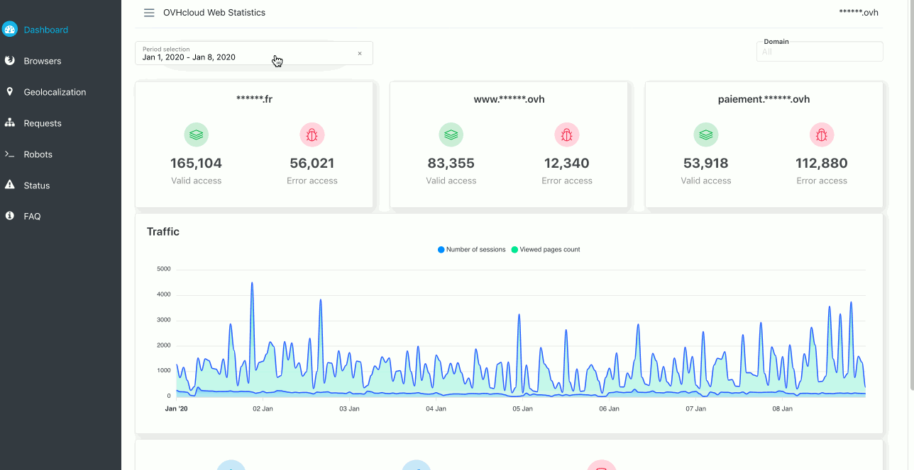

**Last updated 23rd September 2020**

## Objective

Web server logs and website statistics are included in your Web Hosting plan, easily accessible from your OVHcloud Control Panel.

**This guide provides an overview of the available logs and statistics.**

## Requirements

- an [OVHcloud Web Hosting plan](https://www.ovh.co.uk/web-hosting)
- access to the [OVHcloud Control Panel](https://www.ovh.com/auth/?action=gotomanager)

## Instructions

Log in to your [OVHcloud Control Panel](https://www.ovh.com/auth/?action=gotomanager) and select `Web`{.action} in the top navigation bar. Click `Hosting plans`{.action} in the services bar on the left-hand side, then choose the Web Hosting plan concerned.

Next, navigate to the `Statistics and logs`{.action} tab by selecting it in the `More +`{.action} submenu.

{.thumbnail}

In this tab, you can choose between two links: one to display the **website visit statistics** and the other to access the raw **logs** of your hosting.

|Web Hosting using the "Urchin 6" statistics|Web Hosting using the   "OVHcloud Web Statistics"|
|----------|:-------------:|
| {.thumbnail} | {.thumbnail} |

### Website visit statistics

#### OVHcloud Web Statistics

This tool helps you to track and control the traffic of websites hosted on your Web Hosting plan, by visually compiling statistics of attendance and audience measurement.

{.thumbnail}

The dashboard of OVHcloud Web Statistics is presented in 6 sections in the left panel.

- Dashboard: visualisation du trafic sur les sites de votre hébergement.
- Browsers: classement des navigateurs internet les plus utilisés pour visualiser vos sites.
- Geolocalization:  proportion de visiteurs en fonction de leur localisation.
- Requests: classement des pages les plus consultées sur vos sites.
- Robots: visualisation des robots qui passent sur vos sites.
- Status: statistiques des échecs et réussites rencontrés en fonction des codes HTTP retournés.
- FAQ: rubrique dédiée aux questions les plus fréquentes

The `Period selection` box allows you to select a specific time frame.

#### Urchin v6 (legacy)

If the access to the OVHcloud Web Statistics is not available on your hosting, you will have the legacy tool Urchin 6 instead.

{.thumbnail}

Urchin provides information about:

- the website traffic
- the number of visitors
- the number of pages viewed
- the weighting of the viewed pages
- the number of http requests
- the average connection times to your entire site or a particular page
- referrer URLs, to know where visitors come from
- the search engines used to find the site
- the keywords used in web searches leading to the site
- the most visited pages on the site

### Logs

You can view the raw logs of your site with a delay of about 5 minutes.

{.thumbnail}

Various types of logs are available:

- **web**: Here you can find the various logs of your site visits, as well as the outgoing actions from your site. For example, this allows you to detect malicious access attempts.
- **ftp**: The different FTP connections will be stored in these logs.
- **error**: These logs contain the errors generated by your site.
- **cgi**: These logs collect the various calls to the cgi.bin scripts that were made.
- **out**: These are the external calls of your hosting.
- **ssh**: These logs indicate the different connections made with the SSH protocol.
- **cron**: The results of executing your [scheduled tasks](../hosting_automated_taskscron) are logged here.

## Go further

Join our community of users on <https://community.ovh.com/en/>.
