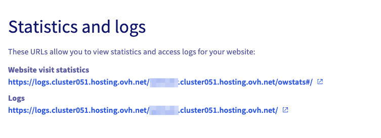

**Dernière mise à jour le 13/08/2020**

## Objectif

L'accès aux logs et aux statistiques de votre site est compris dans votre offre d'hébergement web, accessible via votre espace client OVHcloud.

**Découvrez comment consulter les statistiques et logs de votre site internet.**

## Prérequis

- Disposer d'une offre [d'hébergement web](https://www.ovh.com/fr/hebergement-web/){.external} compatible.
- Être connecté à votre [espace client OVHcloud](https://www.ovh.com/auth/?action=gotomanager){.external}.

## En pratique

Rendez-vous dans votre [espace client OVHcloud](https://www.ovh.com/auth/?action=gotomanager){.external}. Cliquez sur  l'onglet `Web`{.action}, puis sur `Hébergements`{.action} dans la colonne de gauche.

Sélectionnez l'hébergement concerné, cliquez sur l'onglet `Plus+`{.action} puis sur `Statistiques et logs`{.action}

{.thumbnail}

Dans la fenêtre qui s'affiche, vous avez le choix entre deux liens. L'un pour afficher les **statistiques des visites** et l'autre pour accéder aux **logs** bruts de votre hébergement.

|Hébergement avec l'outil de statistiques « Urchin 6 »|Hébergement avec l'outil de statistiques   « OVHcloud Web Statistics »|
|----------|:-------------:|
| {.thumbnail} | {.thumbnail} |

### Statistiques des visites

#### OVHcloud Web Statistics

Pour vous aider à mieux suivre et piloter le trafic de vos sites web, vous disposez d'un outil de statistiques de fréquentation et de mesure d’audience de vos sites internet hébergés sur votre hébergement mutualisé. 

{.thumbnail}

Le tableau de bord de OVHcloud Web Statistics se présente en 6 sections dans le panneau de gauche.

- Dashboard : visualisation du trafic sur les sites de votre hébergement.
- Browsers : classement des explorateurs internet les plus utilisés pour visualiser vos sites.
- Geolocalization :  proportion de visiteurs en fonction de leur localisation.
- Requests : classement des pages les plus consultées sur vos sites.
- Robots : visualisation des robots qui passent sur vos sites.
- Status : statistiques des échecs et réussites rencontrés en fonction des codes HTTP retournés.
- FAQ : rubrique dédiée aux questions les plus fréquentes

Le cadre `Period selection` en haut à droite vous permet de sélectionner une période précise.

#### Urchin v6 (historique)

Si vous ne disposez pas encore de l'outil OVHcloud Web Statistics, vous avez alors accès à Urchin 6.

{.thumbnail}

Urchin vous donne des informations sur :

- Le trafic de votre site
- Le nombre de visiteurs.
- Le nombre de pages visualisées.
- Le « poids » des pages visualisées.
- Le nombre de requêtes http.
- Les durées moyennes de connexion à l'ensemble de votre site ou une page particulière.
- Comment les visiteurs de votre site l'ont-ils connu ?
- Par quels moteurs de recherche ont-ils trouvé l'URL de votre site ?
- Quels mots-clés ont été utilisés lors de leur recherche ?
- Quelles pages de votre site ont été les plus visitées ? 

### Logs

Vous avez la possibilité de visualiser les logs bruts de votre site avec un différé d'environ 5 minutes.

{.thumbnail}

Différents type de logs sont à votre disposition :

- Logs Web : retrouvez ici les différents logs de consultation de votre site, ainsi que les différentes actions réalisées à partir de votre site. Cela vous permet par exemple de repérer des tentatives de hack.
- Logs FTP : les différentes connexions FTP seront enregistrées et conservées dans ces logs.
- Logs erreur : les différentes erreurs générées par votre site.
- Logs CGI : les différents appels aux scripts cgi.bin qui ont été réalisés.
- Logs out : les statistiques de votre hébergement sur les différents appels externes réalisés.
- Logs SSH : ces logs indiquent les différentes connexions réalisées avec le protocole SSH.
- Logs CRON : le résultat de l'exécution de vos tâches planifiées ([Les tâches automatisées (CRON) sur votre hébergement](../mutualise-taches-automatisees-cron/))

## Aller plus loin

Échangez avec notre communauté d'utilisateurs sur <https://community.ovh.com>.
