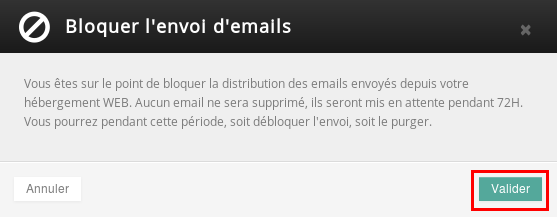

## Acceder al apartado «Scripts de mensajes» en su área de cliente

## - Conéctese a su [url="https://www.ovh.com/manager/web/login/"][blue][u]área de cliente[/u][/blue][/url].

- Seleccione el nombre de su alojamiento en la sección «Alojamientos» situada en la columna de la izquierda. 
- Haga clic en «Más +» y seleccione la opción «Scripts de mensajes».

{.thumbnail}

## Bloquear el envío de mensajes de correo desde su alojamiento
En algunas ocasiones puede ser necesario bloquear el envío de mensajes de correo desde su alojamiento.

## ¿En qué situaciones sería necesario?

- Cuando realice pruebas de script de envío de correos. 
- Cuando su sitio sea utilizado por un hacker para el envío de spam.

## Importante:
No se eliminará ningún mensaje, sino que se mantendrán en espera durante 72 h. Durante este periodo de tiempo podrá, bien desbloquear el envío, bien eliminar los mensajes.
1. Haga clic en el botón «Bloquear el envío».

{.thumbnail}
2. A continuación, haga clic en «Aceptar».

{.thumbnail}
3. Aparecerá el siguiente mensaje de confirmación:

{.thumbnail}

## Observación:
El estado del servicio pasará a «inactivo».

{.thumbnail}

## Depurar la cola de envío de mensajes
En ocasiones, será necesario depurar la cola de envío de mensajes del servidor para evitar un nuevo bloqueo. Para poder eliminar los mensajes, deberá bloquear en primer lugar su envío, tal y como hemos explicado previamente.

## Importante:
Tras eliminar estos mensajes, su cuenta se desbloqueará automáticamente. La operación tardará entre 5 y 10 minutos.
1. Haga clic en el botón «Eliminar los mensajes».

{.thumbnail}
2. A continuación, haga clic en «Aceptar».

{.thumbnail}
3. Aparecerá el siguiente mensaje de confirmación:

{.thumbnail}

## Observación:
El estado del servicio pasará a «depuración».

{.thumbnail}

## Desbloquear el envío
Al desbloquear el envío de mensajes, el servicio se reanudará cuando envíe el siguiente mensaje. Los mensajes que estuvieran bloqueados volverán a entrar en la cola de distribución.
1. Haga clic en el botón «Desbloquear el envío».

{.thumbnail}
2. A continuación, haga clic en «Aceptar».

{.thumbnail}
3. Aparecerá el siguiente mensaje de confirmación:

{.thumbnail}

## Modificar el destinatario de los informes de error
Si se producen errores al enviar mensajes desde su alojamiento web, recibirá un informe al día siguiente.
1. Haga clic en «Cambiar el destinatario».

{.thumbnail}
2. Indique, a continuación, la dirección de correo en la que desea recibir los informes de error y haga clic en «Aceptar».

{.thumbnail}
3. Se mostrará la nueva dirección de correo que haya indicado.

{.thumbnail}

