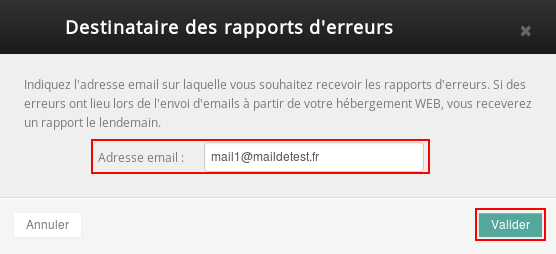

## Accedi alla sezione "Email automatiche" del tuo Spazio Cliente OVH

## Per farlo:

- accedi al tuo [Spazio Cliente OVH](https://www.ovh.com/manager/web/login/)
Se non riesci più ad accedere al tuo Spazio Cliente OVH, consulta [questa guida](https://www.ovh.it/g1909.metti-online-tuo-sito#le_password_associate_ai_tuoi_servizi_di_web_hosting_ovh_accesso_al_tuo_spazio_cliente_ovh).
- seleziona il nome del tuo hosting nella sezione Hosting del menu a sinistra
- clicca su Altre opzioni e seleziona Script email.

{.thumbnail}

## Blocca l'invio di email dal tuo hosting
Quando bloccare l'invio di email dal tuo hosting?

## Effettuare questa operazione è necessario, ad esempio, quando:

- esegui test di invio email tramite script 
- il tuo sito viene utilizzato da un hacker per l'invio di messaggi di Spam

## Attenzione:
Le email non vengono eliminate, ma sospese per 72 ore. Durante questo periodo, potrai sbloccare l'invio oppure annullarlo.
1. Clicca sul tasto Blocca l'invio

{.thumbnail}
2. Clicca su Conferma

{.thumbnail}
3. Visualizzi questo messaggio di conferma:

{.thumbnail}

## Nota:
Lo stato del servizio passa a Disattivato.

{.thumbnail}

## Elimina la coda di invio delle tue email
Eliminare la coda di invio del tuo server di posta è necessario, ad esempio, per evitare un nuovo blocco. Per riuscire a eliminare le tue email, devi prima bloccarne l'invio.

## Nota:
L'operazione può richiedere dai 5 ai 10 minuti. In seguito, il tuo account viene sbloccato automaticamente.
1. Clicca sul tasto Elimina le email

{.thumbnail}
2. Clicca su Conferma

{.thumbnail}
3. Visualizzi questo messaggio di conferma:

{.thumbnail}

## Nota:
Lo stato del servizio passa a Purge.

{.thumbnail}

## Sblocca l'invio
Effettuando questa operazione, l'invio riprende a partire dalla prossima email e i messaggi bloccati vengono rimessi in distribuzione.
1. Clicca sul tasto Sblocca l'invio

{.thumbnail}
2. Clicca su Conferma

{.thumbnail}
3. Visualizzi questo messaggio di conferma:

{.thumbnail}

## Modifica il destinatario delle notifiche di errore
Se si verificano errori durante l'invio di email dal tuo hosting WEB, il contatto indicato come destinatario delle notifiche di errore riceve un avviso il giorno dopo.
1. Clicca su Modifica il destinatario.

{.thumbnail}
2. Inserisci il nuovo indirizzo email e clicca su Conferma.

{.thumbnail}
3. Il nuovo indirizzo email viene visualizzato come destinatario delle notifiche di errore.

{.thumbnail}

