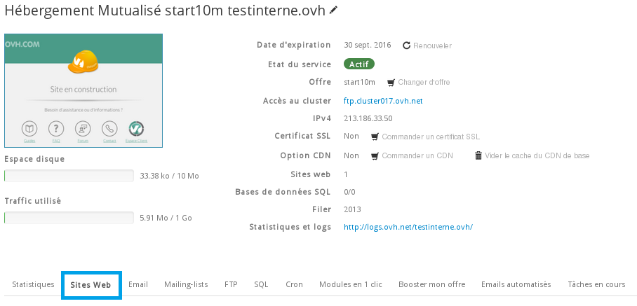

## 
mod_security è un modulo complementare di Apache che filtra tutte le richieste in entrata sui tuoi server Web. Per garantire una maggiore sicurezza, le intercetta e le verifica prima che vengano gestite dagli script.

Attivare Mod Security in un click dal tuo Spazio Cliente OVH garantisce una protezione rafforzata del tuo sito.

Grazie al Core Rule Set (CRS), approfitti immediatamente di una preconfigurazione ottimale del tuo Mod Security che ti protegge contro i più comuni tentativi di attacco, ad esempio:

- Trojan
- Email Injection
- Falla di sicurezza su file PDF
- File Injection sul tuo hosting
- SQL Injection o XSS

## 
Accedi al tuo [Spazio Cliente OVH](https://www.ovh.com/manager/web) e inserisci le tue credenziali (Nic-handle e password).

{.thumbnail}
Seleziona il tuo hosting nella sezione Hosting del menu a sinistra.

{.thumbnail}
Clicca sul tab Domini associati.

{.thumbnail}
Di default il firewall è Disattivato. Clicca sull'icona a forma di matita a destra del tuo dominio per accedere alle opzioni del tuo hosting condiviso.

{.thumbnail}
Seleziona la casella Attiva il firewall e clicca su Seguente per continuare.

{.thumbnail}
La finestra successiva mostra il riepilogo delle modifiche apportate e lo stato del firewall risulta attivo. Clicca su Conferma per completare l'operazione.

{.thumbnail}
A questo punto, il firewall è attivo sul tuo hosting condiviso.

{.thumbnail}

