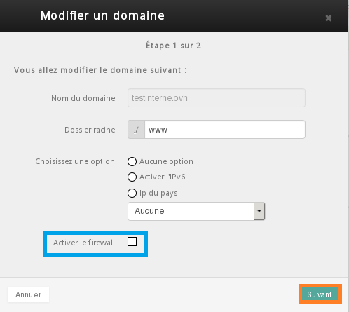
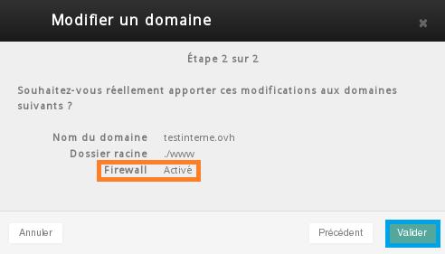

## 
Ten dodatkowy moduł Apache'a filtruje wszystkie zapytania wchodzące na serwery www. Ze względów bezpieczeństwa moduł ten sprawdza zapytania zanim zostaną one przetworzone przez skrypty. 

Włączając Mod Security w panelu klienta, korzystasz ze zwiększonej ochrony.

Dzięki Core Rule Set (CRS) korzystasz z optymalnej konfiguracji Mod Security, która chroni przed najczęstszymi atakami:

- Trojan,
- Iniekcje e-mail,
- Luki w plikach PDF,
- Iniekcja plików na hostingu,
- Iniekcja typu SQL lub XSS,
- itp.

## 
Zaloguj się do [panelu klienta](https://www.ovh.com/manager/web) za pomocą identyfikatora klienta i hasła.

{.thumbnail}
Wybierz hosting w sekcji "Hosting".

{.thumbnail}
Kliknij na zakładkę "Przypisane domeny".

{.thumbnail}
Domyślnie systemowy firewall jest wyłączony. Kliknij na długopis, aby przejść do opcji.

{.thumbnail}
Zaznacz pole "Włącz firewall i kliknij na Dalej.

{.thumbnail}
Pojawi się podsumowanie zmian. Status dla firewalla zmieni się na włączony. Kliknij na zatwierdź, aby dokończyć operację.

{.thumbnail}
Firewall został włączony.

{.thumbnail}

