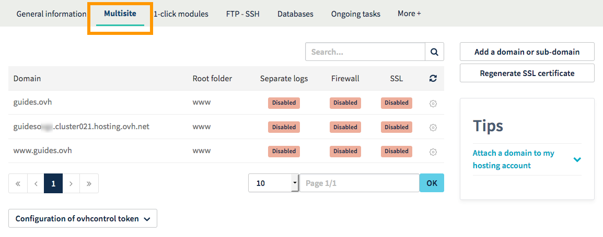
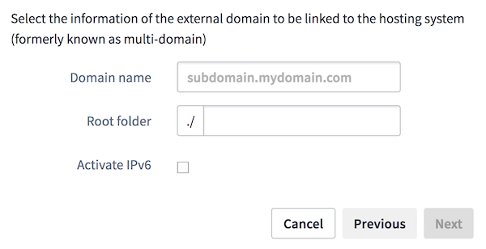

**Ostatnia aktualizacja z dnia 05-09-2018**

## Wprowadzenie

Istnieje możliwość instalacji kilku stron WWW na jednym hostingu. Dotyczy to zarówno domen zarejestrowanych w OVH, jak i u innych operatorów.

**Dowiedz się, jak zainstalować kilka stron WWW na Twoim hostingu.**

## Wymagania początkowe

- Posiadanie [hostingu OVH](https://www.ovh.pl/hosting/){.external}
- Zarejestrowana [domena lub kilka domen](https://www.ovh.pl/domeny/){.external}
- Możliwość modyfikacji konfiguracji Twojej domeny (strefy DNS)
- Dostęp do [Panelu klienta OVH](https://www.ovh.com/auth/?action=gotomanager){.external}

## W praktyce

### Etap 1: zarządzanie opcją MultiSite

Przed rozpoczęciem operacji zaloguj się do [Panelu klienta](https://www.ovh.com/auth/?action=gotomanager){.external}, kliknij `Hosting`{.action} na pasku usług po lewej stronie, następnie wybierz nazwę odpowiedniego hostingu. Przejdź następnie do zakładki `MultiSite`{.action}.

Tabela, która się wyświetla zawiera wszystkie nazwy domen dodanych do Twojego hostingu. Niektóre z nich zostały utworzone automatycznie podczas instalacji Twojego hostingu.

> [!primary]
>
> Jeśli w przypadku migracji strony WWW chcesz zapobiec przerwaniu ciągłości usługi, możesz wykonać kroki z [etapu 4: umieszczenie strony WWW w internecie](https://docs.ovh.com/pl/hosting/konfiguracja-multisite-na-hostingu/#etap-4-umieszczenie-strony-www-w-internecie){.external} w miejsce kroków z etapu 2. 
>

{.thumbnail}

### Etap 2: dodanie domeny lub subdomeny

Aby dodać nową domenę do Twojego hostingu, kliknij przycisk `Dodaj domenę lub subdomenę`{.action}, następnie wybierz domenę w oknie, które się wyświetli.

- **Dodaj domenę zarejestrowaną w OVH**:

Wyświetlają się jedynie domeny skonfigurowane w OVH i którymi zarządzasz w ramach konta klienta. Wybierz jedną domenę z listy, po czym kliknij `Dalej`{.action}. Przejdź następnie do [etapu 3.1: dodanie domeny zarejestrowanej w OVH](https://docs.ovh.com/pl/hosting/konfiguracja-multisite-na-hostingu/#etap-31-dodanie-domeny-zarejestrowanej-w-ovh){.external}.

- **Dodaj domenę zewnętrzną**:

Jeśli nazwa domeny nie wyświetla się na liście, traktowana jest wówczas jako domena zewnętrzna (w odniesieniu do Twojego identyfikatora klienta lub OVH). W takim przypadku zaznacz `Dodaj zewnętrzną domenę`{.action}, następnie kliknij przycisk `Dalej`{.action}. Przejdź następnie do [etapu 3.2: dodanie domeny zarejestrowanej w OVH](https://docs.ovh.com/pl/hosting/konfiguracja-multisite-na-hostingu/#etap-32-dodanie-domeny-zewnetrznej){.external}.

{.thumbnail}

### Etap 3.1: dodanie domeny zarejestrowanej w OVH

> [!primary]
>
> Ten etap ma zastosowanie jedynie, jeśli zaznaczyłeś opcję „Dodaj domenę zarejestrowaną w OVH”. W przypadku domeny zewnętrznej przejdź do części przewodnika zatytułowanej [etap 3.2: dodanie domeny zewnętrznej](https://docs.ovh.com/pl/hosting/konfiguracja-multisite-na-hostingu/#etap-32-dodanie-domeny-zewnetrznej){.external}.
>

Teraz spersonalizuj dodanie domeny. W zależności od wykupionego w OVH [hostingu](https://www.ovh.pl/hosting/){.external} niektóre z oferowanych elementów mogą być dostępne, inne zaś nie.

|Informacja|Opis |
|---|---|
|Domena|Nazwa wybranej domeny wprowadzana jest automatycznie. Możesz określić subdomenę (np. blog.mypersonaldomain.ovh) i jednocześnie utworzyć jej wersję wraz z WWW (np. www.mypersonaldomain.ovh). Domena ta stanie się adresem strony WWW, którą chcesz umieścić w Internecie.|
|Katalog główny|Określ katalog z przestrzeni dyskowej, w którym hostowana będzie Twoja domena. Na tej właśnie przestrzeni należy umieścić pliki strony WWW, aby wyświetlały się online. Przykładowo, w przypadku blog.mypersonaldomain.ovh katalogiem głównym może być „blog”. Jeśli folder nie istnieje, zostanie automatycznie utworzony.|
|Włącz obsługę IPv6|Umożliwia aktywację protokołu IPv6 dla danej domeny. Dowiedz się więcej na [naszej stronie IP](https://www.ovh.pl/hosting/ip.xml){.external}.|
|SSL|Umożliwia korzystanie z bezpiecznego połączenia (HTTPS: //) z wybraną nazwą domeny. Dowiedz się więcej na [naszej stronie SSL](https://www.ovh.pl/ssl/){.external}. Aktywując SSL i CDN (Content Delivery Network), możesz również użyć protokołu **HTTP2**.|
|Włącz CDN|Umożliwia aktywację CDN dla wybranej domeny (zapisywanie w pamięci podręcznej elementów statycznych Twojej strony WWW, takich jak obrazy). Dowiedz się więcej na [naszej stronie CDN](https://www.ovh.pl/hosting/cdn.xml){.external}. Aktywując SSL i CDN, możesz również użyć protokołu **HTTP2**.|
|Krajowy adres IP|Umożliwia korzystanie z geolokalizowanego adresu IP (w wymienionych krajach) dla wybranej domeny. Dowiedz się więcej na [naszej stronie IP](https://www.ovh.pl/hosting/ip.xml){.external}.|
|Włącz firewall|Umożliwia aktywację zapory (analiza zapytań) dla danej domeny. Dowiedz się więcej na [naszej stronie ModSecurity](https://www.ovh.pl/hosting/mod_security.xml){.external}.|
|Rozdzielone logi|Umożliwia wydzielenie logów dotyczących wybranej domeny. Wybierz z listy nazwę domeny, która będzie stanowiła dostęp do wydzielonych logów. Dowiedz się więcej na [naszej stronie Szczegóły statystyk](https://www.ovh.pl/hosting/statystyki_stron.xml){.external}.|

Po uzupełnieniu informacji, kliknij przycisk `Dalej`{.action}. Następnie sprawdź podsumowanie, które się wyświetli.

{.thumbnail}

Po wybraniu domeny zarejestrowanej w OVH możesz automatycznie lub ręcznie zmodyfikować konfigurację DNS: 

- **w przypadku automatycznej konfiguracji DNS**: zaznacz kratkę `Konfiguracja automatyczna (zalecana)`{.action};
- **w przypadku ręcznej konfiguracji DNS**: usuń zaznaczenie w kratce `Konfiguracja automatyczna (zalecana)`{.action}, następnie pobierz informacje odnośnie zmian, które się wyświetlają. Jeśli chcesz przeprowadzić tę konfigurację, skorzystaj z dokumentacji [Modyfikacja strefy DNS OVH](https://docs.ovh.com/pl/domains/hosting_www_jak_edytowac_strefe_dns/){.external}.

Kliknij przycisk `Zatwierdź`{.action}, aby rozpocząć dodawanie domeny. Może do potrwać do godziny. Efekty modyfikacji domeny staną się widoczne po upływie 4-24 godzin ze względu na niezbędny czas propagacji.

Po dodaniu domeny przejdź do [etapu 4: umieszczenie strony WWW online](https://docs.ovh.com/pl/hosting/konfiguracja-multisite-na-hostingu/#etap-4-umieszczenie-strony-www-w-internecie){.external}.

### Etap 3.2: dodanie domeny zewnętrznej

> [!primary]
>
> Ten etap ma zastosowanie jedynie, jeśli zaznaczyłeś opcję „Dodaj domenę zewnętrzną” (która nie jest zarejestrowana w OVH lub którą nie możesz zarządzać poprzez Panel klienta OVH). W przypadku domeny zarejestrowanej w OVH wróć do [etapu 3.1: dodanie domeny zarejestrowanej w OVH](https://docs.ovh.com/pl/hosting/konfiguracja-multisite-na-hostingu/#etap-31-dodanie-domeny-zarejestrowanej-w-ovh){.external}.
>

Teraz spersonalizuj dodanie domeny. Niektóre opcje zawarte w Twojej usłudze hostingu nie mogą być aktywowane podczas tej operacji. Aby je aktywować, zakończ operację i zmodyfikuj ustawienia opcji MultiSite, kiedy ta zostanie dodana.

|Informacja|Opis |
|---|---|
|Domena|Wpisz nazwę domeny, której chcesz używać. Możesz określić subdomenę (np. blog.mypersonaldomain.ovh) i jednocześnie utworzyć jej wersję wraz z WWW (np. www.mypersonaldomain.ovh). Domena ta będzie odpowiadała adresowi strony WWW, którą chcesz umieścić w Internecie. Pamiętaj, że musisz mieć uprawnienia do modyfikacji konfiguracji domeny (jej strefy DNS), aby proces dodania domeny został ukończony.|
|Katalog główny|Określ katalog z przestrzeni dyskowej, w którym hostowana będzie Twoja domena. Na tej właśnie przestrzeni należy umieścić pliki strony WWW, aby wyświetlały się online. Przykładowo, w przypadku blog.mypersonaldomain.ovh katalogiem głównym może być „blog”. Jeśli folder nie istnieje, zostanie automatycznie utworzony.|
|Włącz obsługę IPv6|Umożliwia aktywację protokołu IPv6 dla danej domeny. Dowiedz się więcej na [naszej stronie IP](https://www.ovh.pl/hosting/ip.xml){.external}.|

Po uzupełnieniu informacji, kliknij przycisk `Dalej`{.action}. Następnie sprawdź podsumowanie, które się wyświetli.

{.thumbnail}

Po wybraniu domeny zewnętrznej konieczne jest przeprowadzenie etapu weryfikacji, dzięki któremu będziemy mogli sprawdzić, czy dodanie domeny jest uprawnione. Otrzymasz wiadomość e-mail z prośbą o zmianę konfiguracji DNS domeny. 

Zanotuj elementy, które się wyświetlą, następnie kliknij przycisk `Zatwierdź`{.action}. Domena jest dodana tymczasowo, abyś mógł zmodyfikować jej konfigurację DNS.

> [!warning]
>
> Utworzenie subdomeny ovhcontrol jest niezbędne, aby dodanie domeny mogło zostać w pełni zrealizowane. Jeśli modyfikacja nie zostanie przeprowadzona, dodanie domeny zostanie anulowane.
>

Modyfikacja konfiguracji domeny (jej strefy DNS) powinna zostać zrealizowana w interfejsie dostawcy zarządzającego domeną. W przypadku domeny OVH skorzystaj z przewodnika [Modyfikacja strefy DNS](https://docs.ovh.com/pl/domains/hosting_www_jak_edytowac_strefe_dns/){.external}. Efekty modyfikacji domeny staną się widoczne po upływie 4-24 godzin ze względu na niezbędny czas propagacji.

Jak odnaleźć elementy do modyfikacji konfiguracji DNS domeny:

|Pole|Gdzie znaleźć informację?|Opis |
|---|---|---|
|TXT|Zakładka `MultiSite`{.action}, następnie kliknij **Konfiguracja tokena ovhcontrol**|Umożliwia OVH sprawdzenie, czy dodanie każdej domeny zewnętrznej jest legalne. Utwórz pole TXT z subdomeną **ovhcontrol** (na przykład: ovhcontrol.mypersonaldomain.ovh).|
|A i AAAA|Zakładka `Informacje ogólne`{.action}, następnie **IPv4** i **IPv6**|Umożliwia Twojej domenie wyświetlanie strony WWW, którą zamieścisz w Internecie na Twoim hostingu.|

### Etap 4: umieszczenie strony WWW w Internecie

Po dodaniu domeny wystarczy umieścić w Internecie powiązaną z nią stronę WWW. Przeprowadź tę operację w katalogu głównym, który zdefiniowałeś na poprzednim etapie.

Stronę WWW możesz zbudować w oparciu o gotowy szablon przy użyciu modułu dostarczanego przez OVH. Strona zostanie wówczas automatycznie zainstalowana w uprzednio skonfigurowanym katalogu głównym. O modułach dowiesz się więcej z przewodnika [Automatyczna instalacja strony WWW za pomocą modułu CMS](https://docs.ovh.com/pl/hosting/hosting_www_przewodniki_dotyczace_modulow_na_hostingu_www/){.external}. 

Jeśli chcesz zainstalować ręcznie Twoją stronę WWW, przygotuj pliki, a następnie umieść je online w odpowiednim katalogu głównym na przestrzeni dyskowej. Dowiesz się więcej z przewodnika [Instalacja strony WWW na hostingu OVH](https://docs.ovh.com/pl/hosting/hosting_www_umieszczenie_strony_w_internecie/){.external}.

> [!primary]
>
> Jeśli chcesz zainstalować kilka stron WWW na Twoim hostingu, wykonaj tę operację kilka razy.
>
> Zalecamy nie instalować na jednym hostingu zbyt wielu stron. Im większa liczba zainstalowanych stron, tym większe zużycie przypisanych do danego hostingu zasobów. Na [stronie z ofertą](https://www.ovh.pl/hosting/){.external} usług hostingowych znajdziesz informację o liczbie stron WWW, które możesz zainstalować.
>

## Sprawdź również

[Automatyczna instalacja strony WWW za pomocą modułu CMS](https://docs.ovh.com/pl/hosting/hosting_www_przewodniki_dotyczace_modulow_na_hostingu_www/){.external}

[Modyfikacja strefy DNS ](https://docs.ovh.com/pl/domains/hosting_www_jak_edytowac_strefe_dns/){.external}

[Uruchomienie strony WWW na Twoim hostingu](https://docs.ovh.com/pl/hosting/hosting_www_umieszczenie_strony_w_internecie/){.external}

Przyłącz się do społeczności naszych użytkowników na stronie [https://community.ovh.com/en/](https://community.ovh.com/en/){.external}.