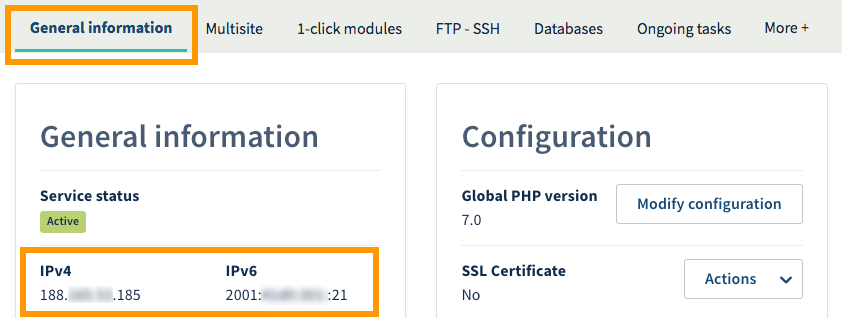
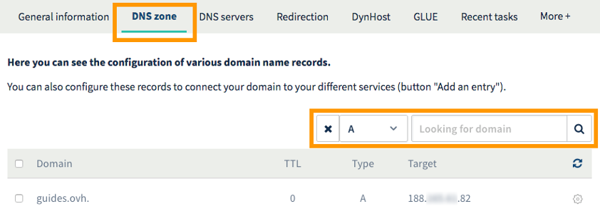

**Stand 07.12.2018**

## Einleitung

Die Seite mit der Fehlermeldung „Seite nicht installiert“ bedeutet entweder, dass die DNS-Zone Ihrer Domain nicht korrekt konfiguriert ist oder der Domainname Ihrer Website nicht richtig auf Ihrem OVH Webhosting eingerichtet wurde.

**In dieser Anleitung erfahren Sie, wie Sie den Fehler „Seite nicht installiert" beheben.**

## Voraussetzungen

- Sie besitzen ein [OVH Webhosting](https://www.ovh.de/hosting/){.external} Angebot.
- Sie können Ihr [OVH Webhosting](https://www.ovh.de/hosting/){.external}, auf dem die betreffende Website gehostet ist, verwalten.
- Sie können die betreffende Domainkonfiguration verwalten (d. h. die DNS-Zone der Domain).
- Sie sind in Ihrem [OVH Kundencenter](https://www.ovh.com/auth/?action=gotomanager){.external} eingeloggt.

## Beschreibung

Die Seite mit der Fehlermeldung „Seite nicht installiert“ wird nur in den beiden folgenden Fällen angezeigt:

- Die Domain Ihrer Website wurde der Konfiguration Ihres OVH Webhostings nicht korrekt als **Multisite** hinzugefügt.
- Die Domain Ihrer Website ist nicht korrekt mit Ihrem OVH Webhosting verbunden, da in der DNS-Konfiguration nicht die richtige IP-Adresse angegeben wurde.

Im Folgenden erklären wir Ihnen, wie Sie beide Einstellungen überprüfen, um den Fehler „Seite nicht installiert“ zu beheben.

{.thumbnail}

### Schritt 1: Webhosting-Konfiguration überprüfen (Multisite)

Um zu überprüfen, ob die Domain Ihrem Webhosting korrekt als Multisite hinzugefügt wurde, loggen Sie sich im [OVH Kundencenter](https://www.ovh.com/auth/?action=gotomanager){.external} ein und gehen Sie links im Menü auf `Hosting-Pakete`{.action}. Wählen Sie in der Liste Ihrer Hosting-Pakete das Webhosting aus, auf dem die Website gehostet ist, für die Sie die Fehlermeldung „Seite nicht installiert“ erhalten. Gehen Sie dann auf den Tab `Multisite`{.action}.

Die angezeigte Tabelle listet alle Domains auf, die Ihrem Hosting als Multisite zugewiesen sind. Sie können auch die Suchfunktion verwenden, um die betreffende Domain zu suchen.

Folgende Szenarien sind möglich: 

|Mögliches Szenario|Erforderliche Maßnahme|
|---|---|
|Domain wird in der Tabelle angezeigt|Das bedeutet, dass die Domain Ihrem Webhosting korrekt als Multisite hinzugefügt wurde. Wenn Sie die Seite innerhalb der letzten 15 Minuten hinzugefügt haben, warten Sie einen Moment, bis die Fehlermeldung „Seite nicht installiert“ verschwindet. Wird der Fehler weiterhin angezeigt, lesen Sie unter [Schritt 2: DNS-Konfiguration der Domain überprüfen](https://docs.ovh.com/de/hosting/webhosting_fehler_-_webseite_ist_nicht_installiert/#schritt-2-dns-konfiguration-der-domain-uberprufen){.external} weiter.|
|Domain wird nicht mehr in der Tabelle angezeigt|Wenn Sie die Domain hinzugefügt haben, diese aber nicht mehr in der Tabelle angezeigt wird, haben Sie möglicherweise nicht alle notwendigen Schritte durchgeführt, um sie zu Ihrem Webhosting hinzuzufügen oder die Domain aus Versehen gelöscht. Um Ihre Domain erneut hinzuzufügen, folgen Sie der Anleitung „[Mehrere Websites auf einem Webhosting einrichten](https://docs.ovh.com/de/hosting/multisites-mehrere-websites-konfigurieren/){.external}“.|
|Domain wird nicht in der Tabelle angezeigt|Sie haben die Domain Ihrem OVH Webhosting noch nicht als Multisite hinzugefügt. Um Ihre Domain hinzuzufügen, folgen Sie der Anleitung „[Mehrere Websites auf einem Webhosting einrichten](https://docs.ovh.com/de/hosting/multisites-mehrere-websites-konfigurieren/){.external}“.|

Wird die Seite mit der Fehlermeldung „Seite nicht installiert“ trotz der oben genannten Maßnahmen immer noch angezeigt, gehen Sie zum nächsten Schritt „DNS-Konfiguration der Domain überprüfen“ über.

### Schritt 2: DNS-Konfiguration der Domain überprüfen

Sehen Sie zuerst nach, welche DNS-Konfiguration für OVH verwendet werden muss. Gehen Sie dazu im Bereich des betreffenden Webhostings auf den Tab `Allgemeine Informationen`{.action} und notieren Sie sich die Adressen, die unter **IPv4** und **IPv6** stehen.

{.thumbnail}

Sie können nun die DNS-Konfiguration Ihrer Domain überprüfen. Verwenden Sie dazu das Interface des Anbieters, der die Konfiguration verwaltet.

> [!primary]
>
> Wenn Ihre Domain bei OVH registriert ist, können Sie überprüfen, ob sie unsere Konfiguration verwendet. Klicken Sie dazu im [OVH Kundencenter](https://www.ovh.com/auth/?action=gotomanager){.external} links im Menü auf `Domains`{.action} und anschließend auf die entsprechende Domain. Gehen Sie dann auf den Tab `DNS Server`{.action}.
>

Je nach Konfiguration der Domain können Sie diese auf zwei Arten überprüfen:

- **Ihre Domain verwendet nicht die OVH Konfiguration** (d. h. sie verwendet nicht die DNS-Server von OVH): Überprüfen Sie die Konfiguration Ihrer Domain über das Interface des Anbieters, bei dem diese verwaltet wird.

- **Ihre Domain verwendet die OVH Konfiguration**: Überprüfen Sie die Konfiguration im [OVH Kundencenter](https://www.ovh.com/auth/?action=gotomanager){.external}. Nachdem Sie die betreffende Domain ausgewählt haben, klicken Sie auf den Tab `DNS Zone`{.action}. Die DNS-Konfiguration wird Ihnen in einer Tabelle angezeigt. Jede Zeile entspricht einem DNS-Eintrag. Sie können die Einträge nach dem Eintragstyp oder der Domain filtern.

{.thumbnail}

Überprüfen Sie im Verwaltungsinterface der Domain, für die die Fehlermeldung „Seite nicht installiert“ angezeigt wird, dass die folgenden DNS-Einträge korrekt konfiguriert sind.

|Eintrag|Ziel|
|---|---|
|A|Das Ziel muss der **IPv4**-Adresse entsprechen, die Sie sich notiert haben.|
|AAAA|Das Ziel muss der **IPv6**-Adresse entsprechen, die Sie sich notiert haben.|

Folgende zwei Szenarien sind denkbar:

|Mögliches Szenario|Erforderliche Maßnahme|
|---|---|
|Die Ziele sind korrekt.|In diesem Fall ist die Konfiguration Ihrer Domain korrekt. Wenn Sie die DNS-Konfiguration innerhalb der letzten 24 Stunden geändert haben, warten Sie ab, bis die Änderungen voll wirksam sind.|
|Die Ziele sind nicht korrekt.|Die DNS-Konfiguration Ihrer Domain muss geändert werden. Wenn die Domain die OVH Konfiguration verwendet, folgen Sie bitte den Schritten in der Anleitung [Bearbeiten der OVH DNS-Zone](https://docs.ovh.com/de/domains/webhosting_bearbeiten_der_dns_zone/){.external}. Verwendet sie nicht die OVH Konfiguration, folgen Sie bitte den Anweisungen im Interface des jeweiligen Anbieters. Die Änderung erfordert eine Propagationszeit von maximal 24 Stunden, bevor sie voll wirksam ist.|

Wenn Sie die in Schritt 1 und 2 beschriebenen Maßnahmen ausgeführt und die angegebenen Propagationszeiten abgewartet haben, sollte die Seite mit der Fehlermeldung „Seite nicht installiert“ nicht mehr erscheinen.

## Weiterführende Informationen 

[Mehrere Websites auf einem Webhosting einrichten](https://docs.ovh.com/de/hosting/multisites-mehrere-websites-konfigurieren/){.external}

[Bearbeiten der OVH DNS-Zone](https://docs.ovh.com/de/domains/webhosting_bearbeiten_der_dns_zone/){.external}

Für den Austausch mit unserer User Community gehen Sie auf [https://community.ovh.com/en/](https://community.ovh.com/en/){.external}.