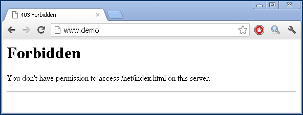

## Introducción

## Preguntas que hay que hacerse
En caso de que un sitio web funcione lento, hay que hacerse las siguientes preguntas: 

¿Cuándo apareció la ralentización?
Así puede ver si el problema se debe a una modificación reciente en el sitio web, por ejemplo la adición de un nuevo plugin mal optimizado o de un nuevo tema que realice muchas llamadas externas y pueda ralentizar el sitio web.

¿La lentitud es aleatoria o permanente?
Para identificar la causa de la ralentización, también puede ser interesante comprobar en qué momento del día aparece el problema de lentitud y ver si corresponde a una gran afluencia de tráfico en el sitio, o si en ese momento se ejecutan otras tareas en el alojamiento.

¿Se produce en todo el sitio web o solo en una parte?
Si solo hay una página afectada, y no todo el sitio web, es interesante analizar esa página y comprobar qué consulta o script podrían causar la ralentización.

¿Aparece algún error? ¿De qué tipo?
Compruebe si se generan errores para delimitar el origen del problema. En esta guía encontrará distintos tipos de errores y sus principales causas.

{.thumbnail}


## Firebug
Una herramienta de análisis que puede ser útil es [Firebug](https://addons.mozilla.org/es/firefox/addon/firebug/).

Se trata de un complemento para el navegador Mozilla Firefox que, entre otras cosas, permite analizar en detalle el tiempo de carga de la página. 

Para ello, abra el panel «Red».

En el ejemplo de la imagen podemos ver que la página tarda 5,6 segundos en cargar. Gracias a Firebug, vemos que una de las imágenes, «accueil.png», tarda 2,42 segundos en cargarse, ya que pesa más de 1 MB. Sería recomendable optimizar esa imagen para mejorar el tiempo de acceso al sitio web.

{.thumbnail}


## Analizador de scripts

## Introducción
En OVH ponemos a su disposición un analizador de scripts, en versión beta, con el que podrá analizar los scripts de su sitio web.

Para utilizarlo, acceda a su área de cliente. Seleccione el alojamiento correspondiente y haga clic en «Alojamiento» > «Analizador de scripts (Beta)».

Para analizar uno de los scripts, haga clic en «Lanzar un nuevo análisis».

{.thumbnail}

## Análisis del script
Introduzca la URL del script que quiera analizar. Es posible incluir parámetros.

{.thumbnail}

## Resultado
La comprobación del script puede tardar unos minutos. 

Una vez finalizada la verificación, le enviaremos una notificación por correo electrónico con el asunto: «Análisis de script finalizado».

A continuación, podrá consultar el análisis en el área de cliente.

Para más información sobre el analizador de scripts, consulte esta guía:

- [Uso del analizador de scripts](http://guias.ovh.es/AnalizadorScript)


{.thumbnail}


## Estadísticas del sitio web

## Lectura de los datos
En la nueva [área de cliente](https://www.ovh.com/manager/web/login.html) puede acceder a unas nuevas estadísticas del sitio web.

Peticiones HTTP: Indica el número de hits medio del sitio. Los hits son peticiones de acceso a un archivo, ya sea de texto, imagen, etc., formadas al realizar la llamada a una página web por el navegador. Se clasifican por código HTTP: 2xx/3xx, 4xx, 5xx.

Tiempo medio de respuesta: Corresponde al tiempo medio de respuesta de las páginas, distinguiendo entre dinámicas y estáticas.

Conexiones salientes: Permite ver las conexiones salientes realizadas por los servidores. Por ejemplo, en caso de hack, el servidor podría estar siendo utilizado para atacar otros sitios web externos. También puede verificar las llamadas externas realizadas por módulos de tipo Facebook, Twitter, etc. Esta puede ser una de las razones por las que un sitio web puede ralentizarse.

Uso de la CPU: Indica el uso de CPU que hace el sitio web. Esto puede ayudarle a identificar una posible sobrecarga.

Superación del límite de recursos: Esta gráfica muestra el uso de los workers PHP. Esto puede orientarle hacia una posible necesidad de cambiar a un plan de hosting superior. El uso de PHP-FPM puede ayudarle a reducir el uso de workers PHP.

{.thumbnail}
En el ejemplo de la imagen, el sitio web ha sido hackeado el 11 de julio. Desde ese momento, el tiempo de carga del sitio web y las conexiones salientes aumentan considerablemente. Una vez corregido el fallo de seguridad, el tiempo de respuesta, las conexiones salientes y el uso de la CPU se normalizan.


## PHP-FPM
Con el objetivo de acelerar las respuestas PHP, hemos adaptado PHP-FPM a nuestra infraestructura web.

En nuestros laboratorios de prueba obtenemos un rendimiento hasta 7 veces más rápido que el antiguo mecanismo.

Para más información sobre el funcionamiento de PHP-FPM, consulte esta guía:

- []({legacy}1175)


Al utilizar PHP-FPM, se modifican algunas variables de servidor: 

|Variable|Sin PHP-FPM|Con PHP-FPM|
|max_execution_time|120s|300s|
|max_input_vars|2000|16000|
|memory_limit|128M|512M|


{.thumbnail}
El archivo .ovhconfig funciona en la raíz del alojamiento y en las subcarpetas de primer nivel (p. ej.: /www/), pero no en las subcarpetas de segundo nivel o superior (p. ej.: /www/test/, /www/test/test2/).
En la imagen puede un ejemplo de gráfica de uso de PHP-FPM. 

Se observa que después de configurarlo, la carga de CPU baja considerablemente, lo que mejora el rendimiento del sitio web.

{.thumbnail}


## Plugins

## Uso de plugins de caché
Los CMS utilizan muchas librerías, de modo una sola página web puede llamar a una gran cantidad de elementos. Los navegadores de internet de sus visitantes deberán cargar y leer todos esos elementos.

Para optimizar el uso de su CMS, es recomendable utilizar plugins de caché. Estos plugins evitan tener que regenerar todo el contenido del sitio web cada vez que se carga la página.

Puede buscar un plugin de caché en la web de la comunidad del CMS que utilice: Joomla!, PrestaShop, WordPress... para optimizar su sitio web.

{.thumbnail}

## Desactivación o eliminación de plugins inútiles
Para mejorar el rendimiento de su CMS, también puede ser útil desactivar, o incluso eliminar por completo, los plugins que no utilice. Así evitará que el navegador cargue elementos inútiles.


## CDN
Para mejorar la velocidad de acceso a su sitio web, de descarga y para mejorar el posicionamiento natural, puede utilizar el servicio CDN (Content Delivery Network) de OVH para almacenar sus archivos, aplicaciones y sitios web más cerca de sus usuarios finales.

De eta forma, mejorará el tiempo de respuesta de los usuarios finales desde cualquier lugar del mundo, ya que los elementos estáticos serán cargados directamente desde el punto de presencia más cercano al visitante.

En esta página encontrará más información sobre nuestra oferta comercial de CDN:

- [La CDN de OVH](https://www.ovh.es/cdn/)


{.thumbnail}


## SQL

## Por qué optimizar una base de datos
Es necesario realizar un mantenimiento de las bases de datos para que tengan un buen rendimiento, es decir, que la información que contienen se entregue lo más rápidamente posible al script que la solicita.

{.thumbnail}
Para ello, la base de datos debe estar bien estructurada y optimizada. A continuación se explica cómo.

## 1. En la base de datos
Indexar la base de datos
Para aumentar la velocidad de las búsquedas en cada consulta, hay que indexar los campos que se utilizan en las cláusulas WHERE.

Por ejemplo, si realiza con frecuencia una búsqueda de personas en una ciudad determinada, hay que indexar el campo «ciudad» con la siguiente consulta:


```
ALTER TABLE `test` ADD INDEX ( `ciudad` );
```


Limpiar la base de datos
Si hay datos que ya no consulta, ¿por qué no archivarlos? Las tablas serán más ligeras y las búsquedas se realizarán más rápidamente.

## 2. En los scripts
Limitar los resultados
Limitar el número de resultados visualizados (por ejemplo, a 10 por página) con la cláusula LIMIT de la consulta SQL.

Agrupar las consultas
Agrupar las consultas al principio del script de esta forma:


```
conexion_BD
consulta1
consulta2
...
desconexion_BD

Visualización...
Tratamiento de los datos
Bucles...
Visualización...
...
```


Optimizar utilizando la caché
Si hay elementos que se obtienen de la base de datos y que no cambian, guárdelos en caché.

Este truco reducirá drásticamente los accesos a la base de datos y acelerará la carga del sitio web.

También puede utilizar la caché de sesión, guardando los resultados de las consultas en variables de sesión. De ese modo, cuando deba realizar una consulta igual, ya no tendrá que ejecutarla y, en su lugar, podrá recuperar las variables de sesión.

Obtener solo los datos útiles
Compruebe que, en las consultas SQL, solo selecciona lo que realmente necesita y, sobre todo, que no ha olvidado las conexiones entre las tablas.

Por ejemplo:


```
(where tabla1.campo = tabla2.campo2)
```


Evitar las opciones que consumen muchos recursos
Por ejemplo, evite utilizar, HAVING, que ralentiza las consultas, así como GROUP BY, a menos que sea necesario.


## Códigos de error
A continuación se ofrece una lista con los códigos de error más comunes y sus causas más probables:

## 404
Este error aparece cuando intenta consultar una página que no existe o que ha sido eliminada del servidor.

También es posible que la reescritura de URL no se haya realizado bien, lo que envía una petición a una página inexistente.

{.thumbnail}

## 403
Este error está relacionado con los permisos de los archivos (CHMOD).

El usuario no tiene suficientes permisos para consultar la página solicitada.

Dichos permisos pueden haber sido modificados por OVH tras detectar un hack del sitio web o por el propio cliente.

{.thumbnail}

## 500
El error 500 puede deberse a:


- El archivo .htaccess está mal configurado o mal codificado.

- Los permisos de los archivos no son correctos.

- Nuestro robot Okillerd ha detenido un script, por ejemplo en caso de que tarde demasiado en ejecutarse o que incluya comandos no autorizados.


{.thumbnail}

## Servidor no encontrado
En primer lugar, compruebe que su conexión a internet esté activa.

Borre la caché del navegador y compruebe que el cortafuegos no esté interfiriendo en su conexión a internet.

El error puede deberse a una configuración incorrecta de los DNS o a que el dominio no exista.

{.thumbnail}

## Error establishing a database connection
Este error está relacionado con la conexión a la base de datos.

Puede deberse a que los archivos del sitio web del cliente estén mal configurados y no tengan la información correcta para conectarse a la base de datos.

También puede aparecer aleatoriamente cuando se realizan demasiadas conexiones simultáneas a la base de datos.

{.thumbnail}

