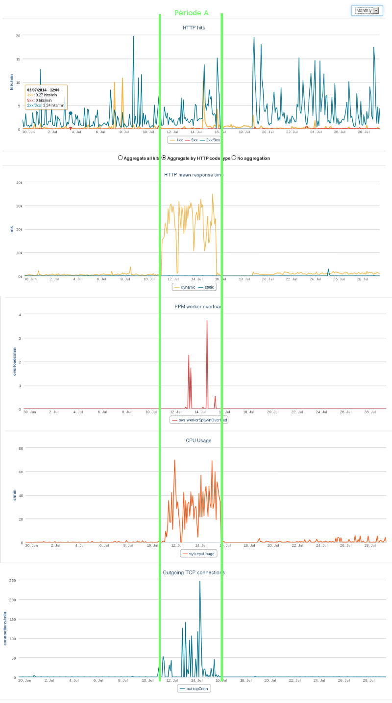

## Yleistä

## Kotisivujen hidastellessa, muutama kysymys, joita miettiä:

- Milloin hidastelu alkoi?

Alkamisajankohdasta voi päätellä, liittyykö hidastelu hiljattain tehtyyn muutokseen kuten huonosti optimoidun lisäosan lisäykseen tai uuteen teemaan, joka tekee paljon kyselyitä ulospäin.

- Onko hidastelu jatkuvaa vai ilmaantuuko se aika ajoin?

Milloin hitautta ilmenee, voi auttaa paljastamaan sen syitä. Mahdollisesti se tapahtuu samaan aikaan kun sivuilla on ollut paljon kävijöitä tai jos sillä hetkellä webhotellissa on käynnistetty tehtäviä.

- Hidasteleeko koko sivu vai jokin osa?

Jos ainoastaan yksi sivu on hidas, kannattaa analysoida erityisesti ko. sivu ja varmistaa, mikä kysely tai skripti voisi hitauden aiheuttaa.

- Tuleeko hidastelusta virheilmoitus? Jos tulee, mikä se on?

Ohjeen lopussa on lista erilaisista virheistä ja niiden yleisimmistä aiheuttajista.


{.thumbnail}


## Firebug
[Firebug](https://addons.mozilla.org/fr/firefox/addon/firebug/)-moduuli on Mozilla Firefox -selaimen analysointityökalu, jolla voi analysoida yksityiskohtaisesti sivuston latausajan.

Mene selaimen "Verkko"-välilehteen.

Oheisesta esimerkistä näkyy, että sivun latautumiseen kuluu 5,6 sekuntia. Firebugin avulla näkyy, että yksi ladatuista kuvista "accueil.png" on yli 1 MB:n kokoinen, ja sen lataamisessa kestää 2,42 sekuntia. Sivun latautumisen nopeuttamiseksi kannattaa siis optimoida tätä kuvaa.

{.thumbnail}


## Sivuston tilastotiedot

## Tietojen lukeminen
Voit päästä tarkastelemaan sivusi tilastotietoja uudesta hallintapaneelistaurl="https://www.ovh.com/manager/web/login.html"] [/url].


-  HTTP-pyynnöst: Ilmoittaa osumien keskimääräisen luvun sivulla. (Hit: pääsypyynnöt tiedostoon (oli tyyppi mikä tahansa, teksti, kuva jne.), jotka ovat muodostuneen verkkosivulla selaimessa). Osumat on luokiteltu http-koodilla: 2xx/3xx - 4xx - 5xx

- Keskimääräinen vastausaika: Vastaa sivujen keskimääräistä vastausaikaa. Eriteltynä Dynamic- ja Static-tyypin sivut.

- Resurssikaton ylitykset: Graafi näytää PHP Workersien käytön, tämä voi näkyä piikkinä ja viitata tarpeeseen vaihtaa webhotellia. PHP-FPM käyttö voi auttaa vähentämään PHP Workers -käyttöä.

- CPU:n käyttö: Ilmoittaa sivusi prosessoriajan käytön. CPU-piikit voivat aiheuttaa ylikuormitusta.

- Lähtevät yhteydet: Mahdollistaa palvelinten toteuttamien lähtevien yhteyksien tarkastelun, esimerkiksi hakkerointitapauksissa palvelin voi hyökätä muihin ulkopuolisiin verkkosivuihin. On myös mahdollsita tarkastaa ulosmenevät puhelut, jotka ovat tapahtuneet moduleeilla kuten Facebook, Twitter jne. Tämä voi olla yksi hitauden aiheuttajista.


{.thumbnail}

- Näytöllä näkyvässä tapauksessa, verkkosivuun on hakkeroitu 11. heinäkuuta ja siksi latausaika sekä sivun lähtevien yhteyksien määrä on kasvanut räjähdysmäisesti. Tietoturvariskin korjauksen jälkeen, latausaika, lähtevät yhteydet ja CPU-käyttö on palautunut normaaliin tilaan.


## PHP-FPM
PHP—FPM on otettu käyttöön, jotta PHP-skriptien ja -sivustojen latausaikoja voitaisiin parantaa.

Laboratoriotestimme ovat osoittaneet jopa 7-kertaista nopeushyötyä verrattuna vanhempiin toimintatapoihin.

Ohje PHP-FPM:stä:


- []({legacy}1175)


Eräitä palvelinmuuttujia muutetaan PHP-FPM:ää käytettäessä:

|Muuttuja|ilman PHP-FPM:ää|PHP-FPM:n kanssa|
|max_execution_time|120 s|300 s|
|max_input_vars|2000|16000|
|memory_limit|128 M|512 M|


{.thumbnail}

- .ovhconfig-tiedosto toimii webhotellin juuressa tai ensimmäisen tason alahakemistossa (esim. /www/), mutta ei kakkos- tai siitä suurempien tasoissa (esim. /www/test/, /www/test/test2/)


Esimerkki PHP-FPM:n käytöstä.

Voidaan huomata, että käyttöönoton jälkeen suoritinkuormitus on laskenut merkittävästi, jolloin sivuston suorituskyky on parantunut.

{.thumbnail}


## Liitännäiset

## Välimuistiliitännäisen käyttö
Sisällönhallintajärjestelmät käyttävät paljon kirjastoja, jolloin yhden nettisivun on käsiteltävä valtavasti eri elementtejä. Vierailijoiden Internet-selainten on ladattava ja luettava kaikki elementit.

Sisällönhallintajärjestelmän optimoimiseksi on suositeltavaa käyttää välimuistiliitännäisiä, joiden avulla voi välttää koko nettisivuston sisällön uudelleengeneroitumisen joka latauskerralla.

Suosittelemme välimuistiliitännäisen hakua käytetyn sisällönhallintajärjestelmän (Joomla!, PrestaShop, WordPress) sivustoilta ja foorumeilta verkkosivuston optimoimiseksi.

{.thumbnail}

## Deaktivoiminen - turhien liitännäisten poisto
Sisällöhallintajärjestelmän suorituskyvyn parantamiseksi kannattaa sulkea tai poistaa käyttämättömät liitännäiset kokonaan. Näin vältetään myös turhien elementtien lataaminen selaimeen.


## CDN
Parantaaksesi sivujesi suorituskykyä, lataamista ja hyödyntääksesi luonnollisia referenssejä, voit käyttää OVH:n CDN-järjestelmää(Content Delivery Network) tiedostojen, liitännäisten ja verkkosivujen varastointiin lähelle loppukäyttäjiä.

Näin parannat vastausaikaa loppukäyttäjillesi kaikkialla maailmassa, sillä sivusi staattiset osat ladataan suoraan vierailijan toimesta, häntä lähinnä olevasta pisteestä

Tutustu kaupallisiin CDN-tuotteisiimme: [Kaupalliset CDN-tuotteet](https://www.ovh.com/fr/cdn/)

{.thumbnail}


## SQL

## Miksi optimoida tietokanta?
Tietokantaa täytyy optimoida jatkuvasti, jotta se pysyy suorituskykyisenä.
Suorituskyvyllä tarkoitetaan tässä sitä, että tietokantaan sisältyvät tiedot voidaan palauttaa mahdollisimman nopeasti niitä pyytäneeseen skriptiin.

{.thumbnail}
Sitä varten tarvitaan hyvin strukturoitu ja optimoitu tietokanta. Seuraavaksi katsotaan kuinka tietokantaa voi optimoida paremmin.

## 1. Tietokannassa

- Indeksoi tietokanta:


Nopeuttaaksesi hakua, täytyy asettaa indeksi kenttiin, joita käytetään ehdossa WHERE.

Esimerkki:

```
Haet usein henkilöitä kaupungin mukaan. Indeksoi kenttä "kaupunki" seuraavalla pyynnöllä:

ALTER TABLE `test` ADD INDEX ( `kaupunki` );
```


- Tietokannan puhdistus:


Arkistoi tietokantoja, jotka eivät ole enää käytössä.
Taulukot eivät ole yhtä täynnä ja haut ovat nopeampia.

## 2. Skripteissä

- Näytön rajoitus:


Voit rajoittaa tietojen näyttöä tiettyyn lukuun (esi. 10kpl/sivu) SQL-pyynnön osassa LIMIT.


- Pyyntöjen uudelleen ryhmittely


Ryhmittele pyyntöjäsi skriptin alussa näin:


```
yhteys_kantaan
pyyntö1
pyyntö2
...
yhteyden_katkaisu_kannasta

Näyttö...
Tietojen käsittely
Loopit...
Näyttö...
...
```


- Optimoi välimuistin kautta:


Jos tietokannasta haetaan muuttumattomia elementtejä, kannattaa ne laittaa välimuistiin.

Tämä vähentää huomattavasti kirjautumisten määrää tietokantaan ja nopeuttaa sivun latautumista.

Voit myös tehdä istunnon välimuistissa. Laita haun tulokset muuttujiksi istuntoon, kun teet seuraavan kerran identtisen haun, hakua ei enää suoriteta vaan saat sen sijaan istunnon muuttujat.


- Kerää vain hyödyllisiä tietoja:


Tarkista, että SQL-pyyntösi sisältää vain tarvitsemasi tiedot, ja erityisesti että linkkejä taulukoiden välillä ei ole unohdettu. 

Esimerkki:


```
(where table1.champs = table2.champs2)
```


- Vältä paljon resursseja kuluttavia vaihtoehtoja:


Vältä esimerkiksi "HAVING" ehdon käyttämistä, sillä se tekee pyynöistä raskaita, samoin "GROUP BY" ehtoa ei suositella käytettävän ellei se ole täysin välttämätöntä.

