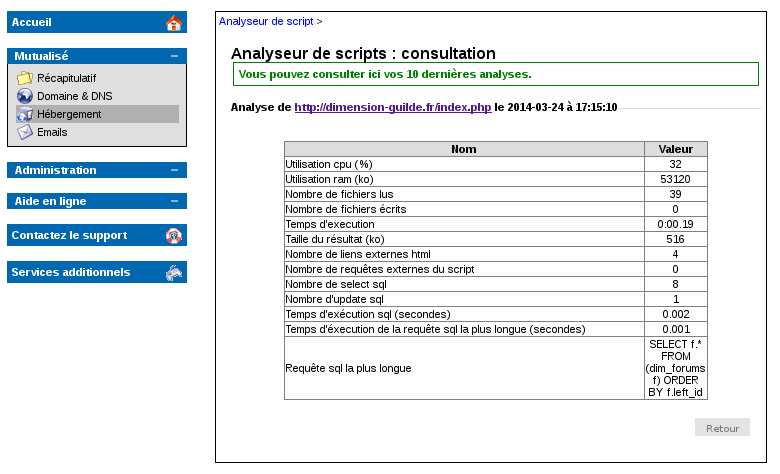
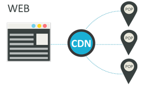
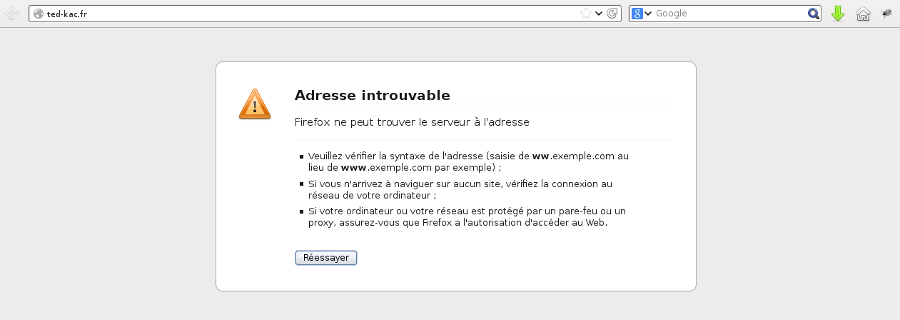

## Informacje ogólne

## Pytania, które należy sobie zadać:
W przypadku spowolnień należy odpowiedzieć sobie na te pytania:


- Od kiedy strona działa wolniej?

Jeśli problem jest związany z niedawno wprowadzoną na stronie www zmianą, przyczyną może być dodanie nowej nieprawidłowo zoptymalizowanej wtyczki, nowego motywu, który wykonuje dużo zewnętrznych zapytań i spowalnia działanie strony Internetowej.

- Spowolnienia są przypadkowe czy występują stale?

Aby określić przyczynę spowolnień, należy sprawdzić, w którym momencie dnia pojawia się problem, i czy jest to związane z dużym ruchem na stronie lub czy inne zadania są wykonywane na hostingu w tym czasie.

- Czy spowolnienia dotyczą całej strony czy części strony?

Jeśli problem dotyczy tylko części strony, należałoby przeanalizować działanie tej części strony i sprawdzić, jakie zapytanie lub skrypt jest przyczyna spowolnień.

- Czy pojawia się komunikat z błędem? Jeśli tak, jaki to komunikat?

Sprawdź, czy pojawiają się błędy. W przewodniku tym znajdziesz opis różnych rodzajów błędów.


{.thumbnail}


## Firebug
Interesujące narzędzie do analizy to [Firebug](https://addons.mozilla.org/pl/firefox/addon/firebug/).

Jest to moduł dla przeglądarki Mozilla Firefox. 

Pozwala on na szczegółowe analizowanie czasu ładowania się strony internetowej. 

W tym celu należy przejść do zakładki "Sieć".

Przykład pokazuje, że czas ładowania strony to 5,6 sekundy. Dzięki modułowi Firebug widać, że czas ładowania jednego z obrazków "accueil.png" to 2,42 sekundy, ponieważ ma on rozmiar 1 MB. Można więc zoptymalizować obrazek, w celu przyspieszenia czasu dostępu do strony www.

{.thumbnail}


## Weryfikacja skryptu

## Informacje ogólne
Funkcja weryfikowania skryptów jest dostępna w wersji beta. Pozwala ona na wykonanie analizy wybranego skryptu działającego w ramach Twojej strony www. 

Aby skorzystać z tej funkcji, przejdź do panelu klienta. 

Wybierz hosting i przejdź do sekcji "Hosting" -> "Weryfikacja skryptów (Beta)"


- Aby rozpocząć nową analizę wybranego skryptu, wybierz ikonkę "Rozpocznij nową weryfikację"


{.thumbnail}

## Weryfikacja skryptu
Podaj skrypt, który chcesz sprawdzić. 

W tym celu wpisz adres skryptu, który chcesz poddać weryfikacji.

{.thumbnail}

## Wynik
Weryfikacja skryptu może trwać kilka minut. 

Po zakończeniu weryfikacji otrzymasz e-mail:


```
Zakończenie weryfikacji skryptu
```


Wyniki weryfikacji są dostępne w panelu klienta.

{.thumbnail}


## Statystyki strony

## Odczytywanie danych
W nowym [panelu klienta](https://www.ovh.com/manager/web/login.html) możesz sprawdzać statystyki strony.


- Zapytania HTTP: Wskazują średnią liczbę zapytań na stronie (zapytanie o dostęp do pliku). Zapytania są klasyfikowane przez kod http: 2xx/3xx - 4xx - 5xx

- Średni czas odpowiedzi: Odnosi się do średniego czasu odpowiedzi stron. Rozróżniamy strony dynamiczne i statyczne. 

- Przekroczenie zasobów: Ten wykres pokazuje zasoby wykorzystane przez workery PHP. Korzystanie z PHP-FPM może pomóc w zmniejszeniu wykorzystania workerów PHP. 

- Wykorzystanie procesora: Wskazuje wykorzystanie procesora przez stronę. Dzięki temu możesz wykryć przeciążenia. 

- Połączenia wychodzące: Możesz sprawdzać połączenia wychodzące realizowane przez serwer. Na przykład w przypadku włamania serwer może służyć do atakowania innych zewnętrznych stron www. Możesz również weryfikować połączenia zewnętrzne wykonywane przez moduły takie jak Facebook, Twitter...itp. Może to być jedną z przyczyn wolnego działania strony www.


{.thumbnail}

- W przykładzie widocznym na zrzucie ekranu strona www została zhakowana 11 lipca. Z tego powodu zwiększyło się obciążenie strony i liczba połączeń wychodzących. Po naprawieniu luk w zabezpieczeniu czas odpowiedzi, połączenia wychodzące i wykorzystanie procesora powróciły do normy.


## PHP-FPM
Aby przyspieszyć odpowiedzi PHP, dostosowaliśmy PHP-FPM do naszej infrastruktury www. 

Podczas testów otrzymaliśmy 7 razy szybsze wyniki niż na poprzednim mechanizmie. 

Udostępniamy przewodnik dotyczący zastosowania PHP-FPM:


- []({legacy}1175)


Niektóre zmienne serwerów zmieniają się podczas korzystania z PHP-FPM:

|Zmienna|bez PHP-FPM|z PHP-FPM|
|max_execution_time|120s|300s|
|max_input_vars|2000|16000|
|memory_limit|128M|512M|


{.thumbnail}

- Plik .ovhconfig działa w katalogu głównym hostingu lub w podkatalogu poziomu 1 (na przykład: /www/) ale nie w katalogach poziomu 2 i wyższego (na przykład: /www/test/ , /www/test/test2/)


Oto przykład użycia PHP-FPM.

Można zauważyć, że po wprowadzeniu tej opcji, obciążenie procesora radykalnie się zmniejsza i w związku z tym wydajność strony się zwiększa.

{.thumbnail}


## Wtyczki

## Zastosowanie wtyczki cache
Korzystanie z modułów CMS wiąże się z odwoływaniem się do licznych bibliotek, w taki sposób, że jedna strona www może przetwarzać bardzo dużą liczbę elementów. Przeglądarki internetowe osób odwiedzających muszą załadować i odczytać wszystkie te elementy. 

Aby zoptymalizować działanie modułu CMS, zaleca się używanie wtyczek cache, dzięki którym można uniknąć ponownego generowania całej treści strony www przy każdym ładowaniu strony.

Zalecamy poszukanie wtyczki cache na stronie modułu CMS, z którego korzystasz (Joomla! - PrestaShop - WordPress), w celu zoptymalizowania strony www.

{.thumbnail}

## Wyłączanie - -usuwanie niepotrzebnych wtyczek
Aby zwiększyć wydajność modułu CMS, można wyłączyć lub całkowicie usunąć niepotrzebne wtyczki. Dzięki temu można uniknąć ładowania się niepotrzebnych elementów.


## CDN
Jeśli chcesz zwiększyć wydajność dostępu do strony, wydajność pobierania i skorzystać z optymalizacji naturalnego pozycjonowania, skorzystaj z usługi CDN (Content Delivery Network) OVH, do przechowywania plików, aplikacji, stron www jak najbliżej użytkowników końcowych.

W ten sposób zmniejszasz czas odpowiedzi na całym świecie, ponieważ statyczne elementy strony będą pobierane przez osobę odwiedzającą w punkcie POP, który znajduje się najbliżej. 

Opis oferty CDN: [Oferta CDN](https://www.ovh.pl/cdn/)

{.thumbnail}


## SQL

## Dlaczego trzeba zoptymalizować bazę?
Baza danych powinna być zawsze wydajna. Oznacza to, że informacje zawarte w bazie powinny być jak najszybciej zwracane do skryptu, który je odpytuje.

{.thumbnail}
Baza powinna więc być dobrze zorganizowana i zoptymalizowana. Sprawdzimy, jak zoptymalizować bazę.

## 1. W bazie danych

- Indeksowanie bazy danych:


Aby zwiększyć szybkość wyszukiwania podczas odpytywania, należy umieścić index w polach, które są używane w klauzulach WHERE.

Przykład:

```
Regularnie wyszukujesz osobę za pomocą miasta. Trzeba więc indeksować pole "miasto" za pomocą następującego zapytania:

ALTER TABLE `test` ADD INDEX ( `ville` );
```


- Czyszczenie bazy danych:


Niektóre dane nie są już sprawdzane. Dlaczego nie miałbyś ich zarchiwizować? Wyszukiwania będą wykonywane szybciej.

## 2. W skryptach

- Ograniczenie wyświetlania:


Ograniczenie wyświetlania wpisów do określonej liczby (na przykład 10 na stronę) w części LIMIT dla zapytania SQL. 


- Łączenie zapytań:


Połącz zapytania na początku skryptu w ten sposób:


```
łączenie_baza
zapytanie1
zapytanie2
...
rozłączanie_baza

Wyświetlanie ...
Przetwarzanie danych
Pętle ...
Wyświetlanie ...
...
```


- Optymalizowanie poprzez korzystanie z cache:


Jeśli posiadasz elementy, które są pobierane z bazy danych i które się nie zmieniają, umieść je w pamięci cache.

Dzięki temu zmniejszą się zapytania do bazy danych i przyspieszy się ładowanie strony.

Możesz również skorzystać z cache dla sesji. 
Umieść wyniki zapytania w zmiennej sesji. W przypadku identycznego zapytania, nie będziesz musiał go wykonywać, pobierzesz zmienną sesji.


- Pobieranie tylko potrzebnych danych:


W zapytaniach SQL sprawdź, czy wybrałeś tylko to, czego potrzebujesz i czy nie zapomniałeś o połączeniach między tabelami. 

Przykład:


```
(where table1.champs = table2.champs2)
```


- Unikaj opcji wykorzystujących dużo zasobów:


Unikaj używania "HAVING", który obciąża zapytania. Unikaj używania "GROUP BY", chyba że jest to niezbędne.


## Lista kodów błędów
Poniżej znajduje się lista kodów błędów i ich prawdopodobne przyczyny:

## 404
Ten błąd pojawia się, gdy chcesz wejść na stronę, która nie istnieje na serwerze. 

Możliwe, że adres strony został źle wpisany.

{.thumbnail}

## 403
Ten błąd jest związany z uprawnieniami do plików (CHMOD).

Użytkownik nie ma wystarczających uprawnień, aby wejść na daną stronę. 

Uprawnienia te mogą zostać zmienione przez OVH na skutek włamania na stronę lub przez klienta.

{.thumbnail}

## 500
Przyczyną błędu 500 może być:


- Nieprawidłowo skonfigurowany lub zakodowany plik .htaccess;

- Nieprawidłowe uprawnienia do plików;

- Skrypt, który został odłączony przez naszego robota Okillerd, na przykład w przypadku pliku, który długo się wykonuje lub niedozwolonego polecenia.


{.thumbnail}

## Nie można odnaleźć strony
Najpierw sprawdź, czy posiadasz aktywny dostęp do Internetu. 

Wyczyść cache przeglądarki i sprawdź, czy nie ma firewalla, który mógłby blokować połączenie z Internetem. 

Błąd ten może być spowodowany nieprawidłową konfiguracją DNS lub użyciem nie istniejącej domeny.

{.thumbnail}

## Error establishing a database connection
Błąd ten jest związany z połączeniem do bazy danych. 

Błąd ten może wynikać z nieprawidłowo skonfigurowanych plików na stronie. Pliki te mogą zawierać nieprawidłowe dane do połączenia z bazą danych. 

Błąd ten może się również pojawić w przypadku zbyt dużej liczby jednoczesnych połączeń do bazy danych.

{.thumbnail}

