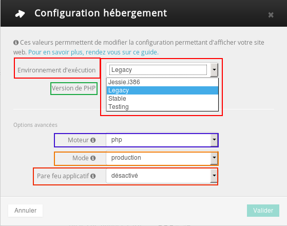
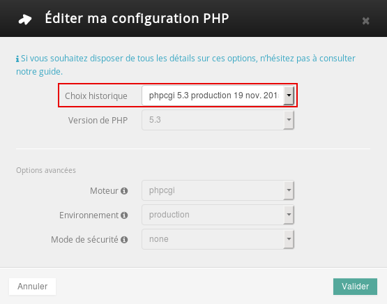

## Informacija apie PHP

## Kas yra PHP?
PHP - tai atviro kodo programavimo kalba, dažniausiai naudojama dinaminių svetainių kūrimui.

Be to, ši kalba dažniausiai naudojama internete, jos pagalba sukurtos populiariausios TVS: Wordpress, Joomla!, Drupal...

## Kam skirtas PHP-FPM?
PHP-FPM pagreitina PHP užklausas, sumažina skaitymų iš disko kiekį ir PHP kodo apdorojimą. Testavimo laboratorijose, lyginant su anksčiau naudotu mechanizmu, pasiekėme iki 7 kartų greitesnį kodo vykdymą.

## Kokia nauda klientui migravus į naują PHP versiją?
Migravus į naują palaikomą PHP versiją galima ne tik pasinaudoti naujovėmis, bet ir pataisyti saugumo spragas (apsisaugoti nuo įsibrovimų).

Be to, OVH siūlo optimizavimą su PHP-FPM, tai pagerina svetainių našumą nuo 5.3 versijos.

## Mano svetainė ar jos dalis naudoja seną PHP versiją, kaip elgtis?
Patariame patikrinti svetainę ir automatines užduotis su nauja versija jau dabar. Toliau gide paaiškinsime, kaip tai galite padaryti.

## Kodėl OVH neatlieka atnaujinimo automatiškai?
Kiekviena svetainė yra unikali ir negalime atnaujinimo pritaikyti kiekvienam klientui, todėl šią operaciją turite atlikti patys.

## Aš esu programuotojas ir noriu operaciją atlikti pats
Tokiu atveju rekomenduojame skaityti išsamų .ovhconfig gidą: []({legacy}1207)


## Naudojamos versijos tikrinimas
Prisijunkite prie valdymo sąsajos ir skyriuje Platforma spragtelėkite talpinimo planą.

Svetainės naudojama versija bus nurodyta eilutėje Globali PHP versija (1).

{.thumbnail}
Norėdami pakeisti versiją, spragtelėkite nuorodą Keisti konfigūraciją (nr. 2 iliustracijoje).


## Versijos keitimas
Galite rinktis šiuos nustatymus:

Vykdymo aplinka:
OVH svetainių talpinimo planuose leidžiama keisti vykdymo aplinką, kurioje veikia jūsų svetainė. Jūs galite rinktis: naudotis stabilia konfigūracija ilguoju laikotarpiu arba OVH programų atnaujinimais. 

Plačiau apie vykdymo aplinkas skaitykite gide:
[]({legacy}2149)

Versija:

- 5.4
- 5.5
- 5.6
- 7.0

(pagal nutylėjimą parenkama paskutinė stabili 5.6 versija)

Variklis:

- php (PHP FPM įjungta)
- phpcgi (PHP FPM išjungta)

(pagal nutylėjimą parenkamas php variklis, jis rekomenduojamas, kad galėtumėte naudotis PHP FPM privalumais. FPM privalumai pateikti bendrosios informacijos skiltyje aukščiau).

Aplinka:

- development: įkėlimas į spartinančiąją atmintinę netaikomas ir PHP klaidos pateikiamos svetainėje (display_errors=On).
- production: statiniai failai, pvz., paveikslėliai, garso ir vaizdo įrašai, HTML ar CSS failai yra su didesniu galiojimo terminu, todėl failai ilgiau saugomi spartinančioje atmintinėje, o klaidos nepateikiamos svetainėje (display_errors=Off).

Saugumo režimas:
- jokio.
- security: įjungia mod_security ugniasienė.


{.thumbnail}
Patariame naudoti konfigūraciją pagal nutylėjimą, ją įjungsite pasirinkdami pavyzdyje pateiktus nustatymus.
Keitimai įsigalioja per kelias minutes.

{.thumbnail}
Naują PHP versiją galite įjungti spragtelėję Keisti konfigūraciją, po to Keisti esamą konfigūraciją.

{.thumbnail}


## Grįžimas prie ankstesnės versijos
Jeigu dėl PHP versijos keitimo svetainėje atsiranda klaidų, galite grįžti atgal keisdami PHP konfigūraciją. Pakaks spragtelėti Keisti konfigūraciją.

{.thumbnail}
Po to spragtelėkite Grįžti prie ankstesnės konfigūracijos.

{.thumbnail}
Jeigu atlikote tik vieną PHP versijos keitimą, matysite langą, pavaizduotą pavyzdyje. Jeigu atlikote keletą keitimų, norimą versiją atstatykite naudodami Pasirinkimų istoriją.

{.thumbnail}
Keitimai įsigalioja per kelias minutes.

{.thumbnail}
Jeigu norite naudoti naujausią PHP versiją, patariame pirmiausiai perskaityti žemiau pateiktą skyrių „Kaip patikrinti, ar svetainė suderinama su nauja PHP versija?“


## Kaip patikrinti, ar svetainė suderinama su nauja PHP versija?
1. Jeigu naudojate turinio valdymo sistemą, pvz., Wordpress, Joomla!, Dotclear, PHPBB ir t.t., pirmiausiai tikrinkite oficialią dokumentaciją:

- [Wordress](https://codex.wordpress.org/Updating_WordPress)
- [Joomla](https://docs.joomla.org/Portal:Upgrading_Versions)
- [Drupal](https://www.drupal.org/upgrade)
- [Prestashop](http://doc.prestashop.com/pages/viewpage.action?pageId=11272342)

...

2. Jeigu jūsų svetainėje naudojamas asmeninis sprendimas, skaitykite [oficialų PHP migravimo gidą](http://php.net/manual/en/appendices.php). 

Jeigu nesate svetainės kūrėjas, susisiekite su svetainės administratoriumi.

## PHP versijos tiksliame kataloge tikrinimas
Kliento sąsajoje matoma globali PHP versija, t.y. versija, nurodyta šakniniame talpinimo kataloge. Jeigu kuriame nors subkataloge naudojate kitą versiją, jūs matysite versiją tik po to, kai įkelsite ir naršyklėje atidarysite [info.php](https://www.ovh.com/fr/documents/info.php).

Jeigu norite patys susikurti failą, tiesiog nukopijuokite pateiktą kodą:

```
<?php phpinfo(); ?>
```

Po to išsaugokite failą .php formatu: info.php

Įkelkite failą į norimą katalogą per FTP ([]({legacy}1380)), pvz., į /www/manowordpress/ katalogą.

Po to naršyklėje sutinkite adresą iki info.php failo, pvz., www.mano-svetaine.com/manowordpress/info.php.

{.thumbnail}


## PHP versiją esu nustatęs .htaccess faile, kas bus su juo?
Šiame faile nurodyta versija nebus naudojama, kadangi pirmenybė teikiama valdymo sąsajoje nurodytai versijai. 

Jeigu .htaccess faile yra kitos direktyvos (URL perrašymas, nukreipimai), jos toliau veiks.


## Kokie yra PHP FPM apribojimai?
Saugumo sumetimais bus išjungtos toliau nurodytos funkcijos (nebepalaikomos PHP):

```
register_globals
magic_quotes_gpc
```


## Migruodamas susidūriau su problemomis, ką daryti?
Mūsų pagalbos skyrius negalės pakeisti PHP versijos už jus, tačiau galės patarti, kaip tinkamai atnaujinti PHP versiją (kliento sąsajoje arba .ovhconfig faile). Mūsų pagalbos skyrius nebus atsakingas už potencialius funkcijų sutrikimus.

## Reikia pagalbos?
OVH partnerių tinkle jūs galite rasti web konsultantą, kuris padės migruoti svetainę: [http://www.ovh.biz/](http://www.ovh.biz/).

