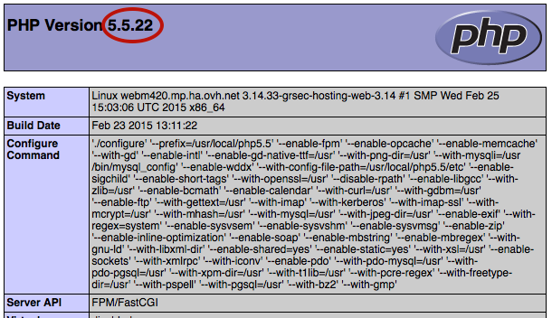

## Informacje związane z PHP

## Czym jest PHP?
PHP to język programowania wykorzystywany przede wszystkim do tworzenia dynamicznych stron www.
Jest najpopularniejszy język wykorzystywany dziś w Internecie, na którym opierają się moduły takie jak Wordpress, Joomla, Drupal ...

## Do czego służy PHP FPM?
Funkcja ta pozwala na przyspieszenie odpowiedzi PHP, minimalizuje połączenia dyskowe i przetwarzanie kodu PHP. W naszych laboratoriach otrzymaliśmy 7 razy większą wydajność w porównaniu ze starym mechanizmem.

## Jakie korzyści dla użytkownika wynikają z migracji na nowe wersje PHP?
Przenosząc swoją stronę na najnowsze wersje PHP, w znacznie mniejszym stopniu narażasz się na luki bezpieczeństwa (włamania) i korzystasz jednocześnie z nowości. 
Poza tym OVH proponuje darmową optymalizację PHP-FPM, która zwiększa wydajność począwszy od wersji 5.3.

## Moja strona / część mojej strony korzysta ze starych wersji PHP. Co zrobić?
Doradzamy przetestowanie stron i zaplanowanych zadań z nowymi wersjami. W dalszej części tego przewodnika wyjaśnimy, jak to zrobić.

## Dlaczego OVH nie wykonuje tej aktualizacji automatycznie?
Każda strona jest unikalna. Nie możemy niestety wykonać spersonalizowanych aktualizacji. Należy więc samodzielnie wykonać te operacje.

## Jestem programistą i chcę wykonać konfigurację ręcznie.
Skorzystaj z przewodnika na temat konfiguracji pliku .ovhconfig: []({legacy}1207)


## Sprawdzenie aktualnej wersji
Zaloguj się do panelu klienta i kliknij na swój hosting w części "Platformy". W linii "Globalna wersja PHP" będzie widoczna wersja używana przez Twoją stronę (1).

{.thumbnail}
Aby zmienić wersję, kliknij na link "Zmień konfigurację" (2 na powyższym zdjęciu).


## Zmiana wersji
Możesz wybrać następujące elementy:

Środowisko uruchomieniowe:
Na hostingu www OVH można zmienić środowisko uruchomieniowe, w którym działa strona www. Dzięki temu można długoterminowo korzystać ze stabilnej konfiguracji lub z najnowszych aktualizacji dla oprogramowania dostarczanego przez OVH. 


Zapraszamy do zapoznania się z tym przewodnikiem:
[]({legacy}2149)

Wersja:

- 5.4
- 5.5
- 5.6
- 7.0 

Domyślnie możesz wybrać najnowszą wersję stabilną 5.6.

Silnik:

- php (włącza PHP FPM)
- phpcgi (wyłącza PHP FPM)

Silnik php jest wybrany domyślnie. Zaleca się używanie tego silnika, aby korzystać z PHP FPM. Funkcja FPM jest opisana w części "Informacje ogólne".

Środowisko: 

- development: nie jest stosowany cache a logi PHP pojawiają się na stronie (display_errors=On).
- production: pliki statyczne takie jak obrazy, filmy, pliki audio, html, css są ważne dłużej, co maksymalizuje umieszczenie w pamięci cache plików w przeglądarkach a logi PHP nie pojawiają się na stronie (display_errors=Off).

Tryb bezpieczeństwa:
- none
- security: Pozwala na włączenie firewalla systemowego typu mod_security.


{.thumbnail}
Zalecamy w konfiguracji domyślnej wybranie opcji wskazanych na powyższym zrzucie ekranu.
Zmiana nastąpi w ciągu kilku minut.

{.thumbnail}
Następnie będziesz mógł ponownie zmienić wersję PHP klikając na "Zmień konfigurację" i "Zmień bieżącą konfigurację".

{.thumbnail}


## Powrót do poprzedniej wersji
Jeśli zmiana wersji PHP powoduje problemy z działaniem Twojej strony, możesz wrócić do poprzedniej konfiguracji PHP. W tym celu kliknij na przycisk "Zmień konfigurację".

{.thumbnail}
Następnie kliknij na "Powrót do poprzedniej konfiguracji".

{.thumbnail}
Jeśli nie wykonałeś zmian wersji PHP, pojawi się ta ramka. W przeciwnym wypadku wystarczy wybrać wersję w zakładce "Wybór historyczny".

{.thumbnail}
Zmiana nastąpi w ciągu kilku minut.

{.thumbnail}
Jeśli musisz wrócić do poprzedniej wersji php, sugerujemy sprawdzenie części "Jak upewnić się, czy moja strona jest kompatybilna z nową wersją PHP?"


## Jak upewnić się, czy moja strona jest kompatybilna z nową wersją PHP?
1. Jeśli używasz modułu zarządzania treścią takiego jak Wordpress, Joomla, Dotclear czy PHPBB, należy najpierw zaktualizować stronę postępując zgodnie z oficjalnymi przewodnikami:

- [Wordress](https://codex.wordpress.org/Updating_WordPress)
- [Joomla](https://docs.joomla.org/Portal:Upgrading_Versions/en)
- [Drupal](http://drupal.org/documentation/)
- [Prestashop](http://doc.prestashop.com/pages/viewpage.action?pageId=11272342)

...

2. Jeśli Twoja strona działa w oparciu o własne rozwiązanie, należy skorzystać z [oficjalnych przewodników PHP](http://php.net/manual/fr/appendices.php). 
Jeśli nie tworzysz samodzielnie swojej strony, skontaktuj się w tej sprawie ze swoim webmasterem.

## Jak sprawdzić wersję PHP używaną w danym katalogu?
W panelu klienta widoczna jest ogólna wersja PHP, czyli wersja zdefiniowana dla katalogu głównego na hostingu. Jeśli korzystasz ze specyficznej konfiguracji dla podkatalogu, możesz sprawdzić wykorzystywaną w nim wersję PHP pobierając poniższy plik (kliknij prawym przyciskiem i wybierz "Zapisz jako"):  [info.php](https://www.ovh.com/fr/documents/info.php)
Jeśli chcesz samodzielnie utworzyć taki plik, wystarczy utworzyć plik tekstowy z taką zawartością:

```
<?php phpinfo(); ?>
```


Następnie należy zapisać plik w formacie .php i nazwać go info.php.

Wgraj plik na FTP ([]({legacy}1380)) w wybranym katalogu, na przykład /www/wordpress/.
W przeglądarce www otwórz ten plik info.php. Na przykład: www.twoja-strona.com/wordpress/info.php

{.thumbnail}


## Skonfigurowałem plik .htaccess, aby wymusić wersję PHP. Czy to będzie działać?
Wersja PHP zdefiniowana w tym pliku nie będzie brana pod uwagę, ponieważ ważniejsza jest wersja zdefiniowana w panelu klienta. Jeśli Twój plik .htaccess zawiera inne dyrektywy (URL rewriting, przekierowanie, ...), pozostaną one aktywne.


## Jakie są ograniczenia funkcji PHP FPM?
Ze względów bezpieczeństwa poniższe opcje są wyłączone (odradzane przez PHP):

```
register_globals
magic_quotes_gpc
```


## Mam problemy podczas migracji? Co mogę zrobić?
Nasi konsultanci nie będą mogli zmienić wersji php w Twoim imieniu. Mogą jednak poinformować Cię, jak dokonać aktualizacji wersji PHP (w panelu klienta lub w pliku .ovhconfig). Pomoc techniczna nie może być odpowiedzialna za ewentualne problemy z działaniem.

## Potrzebujesz pomocy?
Skorzystaj z usług naszych partnerów: [https://partners.ovh.com/](https://partners.ovh.com/).

