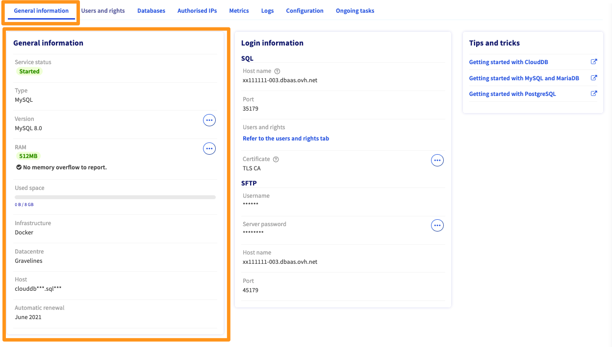
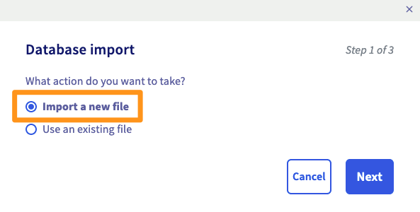

**Última actualización: 15/01/2018**

## Objetivo

El servicio SQL Privado permite disfrutar de una instancia de SQL que, en combinación con un plan de hosting de OVH, permite disponer de recursos dedicados y garantizados. De esta manera, ofrece un mejor rendimiento y mayor flexibilidad en los sistemas de bases de datos disponibles, así como en los que es posible crear. De manera general, este servicio está destinado a clientes con necesidades específicas.

Esta guía explica cómo empezar con un SQL Privado.

## Requisitos

- Tener un SQL Privado (incluido en un [plan de hosting](https://www.ovh.es/hosting/){.external} o contratado como [opción SQL](https://www.ovh.es/hosting/opciones-sql.xml){.external}).
- Tener un [plan de hosting ](https://www.ovh.es/hosting/){.external} alojado en el mismo datacenter que el SQL Privado (puede consultar dicha información en el área de cliente de OVH).
- Estar conectado al [área de cliente de OVH](https://www.ovh.com/auth){.external}.

## Procedimiento

### Ver la información general de la instancia

En la columna izquierda del [área de cliente de OVH](https://www.ovh.com/auth){.external}, haga clic en `Bases de datos`{.action} y seleccione el servicio de bases de datos correspondiente. Por defecto, se abrirá la pestaña `Información general`{.action}.

> [!primary]
>
> El nombre del servicio de SQL Privado puede mostrarse de dos formas distintas en el área de cliente:
>
> - o bien contiene una parte de su ID de cliente, pero terminado en tres cifras (001 para el primer servicio SQL Privado que instale, 002 para el segundo, y así sucesivamente);
> - o bien empieza por **sqlprive-**, seguido de una parte de su ID de cliente y terminado en tres cifras (001 para el primer servicio SQL Privado que instale, 002 para el segundo, y así sucesivamente).
>

En dicha pestaña podrá consultar la información más importante relativa al servicio de SQL. Le invitamos a tomarse unos momentos para asegurarse de que la información mostrada es correcta y se corresponde con las indicaciones que se ofrecen a continuación.

|Información|Detalles|
|---|---|
|Estado del servicio|Indica si el servicio está iniciado, se está reiniciando o está suspendido. El servicio debe estar iniciado para poder realizar cualquier tipo de acción.|
|Tipo|Muestra el sistema de bases de datos utilizado por el servidor. Si no sabe si el tipo utilizado es correcto, debe saber que el más frecuente es **MySQL**, aunque existen otros, como PostgreSQL o MariaDB. Por ejemplo, si su sitio web está basado en WordPress, MySQL es un sistema perfectamente adecuado.|
|Versión|Muestra la versión del sistema de bases de datos utilizado por el servidor. Asegúrese de que su sitio web es compatible con la versión elegida.|
|RAM|Muestra la memoria RAM disponible para el servicio SQL e indica cuándo se está sobrepasando dicha cantidad de memoria. El servicio SQL Privado tiene recursos de RAM dedicados y garantizados. Si lo necesita, puede cambiar a un modelo superior, así como recibir alertas si consume todos los recursos de RAM de su servicio.|
|Infraestructura|Muestra la infraestructura utilizada por el servicio. Se trata de una información inherente a la infraestructura de OVH.|
|Datacenter|Muestra el centro de datos en el que se ha creado el servicio. Asegúrese de que el datacenter de su servicio sea el mismo que el del plan de hosting de OVH en el que esté alojado su sitio web.|
|Host|Indica el servidor de OVH en el que se ha creado el servicio. Se trata de una información inherente a la infraestructura de OVH y se utiliza en nuestras comunicaciones relacionadas con [incidencias](http://travaux.ovh.net/){.external}.|

{.thumbnail}

### Crear una base de datos

Todos los datos de su sitio web (por ejemplo, los comentarios, si se trata de un blog) se almacenan en una base de datos.

Para crear su primera base de datos, abra la pestaña `Bases de datos`{.action} y haga clic en el botón `Añadir una base de datos`{.action}.

{.thumbnail}

Se abrirá una ventana en la que, si lo desea, podrá crear también un usuario. El usuario es imprescindible, ya que se le asignarán permisos que le permitirán conectarse al servicio y realizar consultas a la base de datos tales como lectura, inserción o eliminación de datos.

Puede crear el usuario al mismo tiempo que la base de datos marcando la casilla `Crear un usuario`{.action}, o bien puede crearlo en otro momento dejándola desmarcada. Lo más sencillo y rápido es marcar la casilla.

Si ha optado por crear el usuario ahora, complete la información solicitada siguiendo las indicaciones y haga clic en `Aceptar`{.action}.

- **Nombre de la BD** (obligatorio): Nombre que tendrá la base de datos.
- **Nombre de usuario** (obligatorio si ha marcado la casilla): Usuario que podrá conectarse a la base de datos y realizar consultas.
- **Permisos** (obligatorio si ha marcado la casilla): Permisos que tendrá el usuario sobre la base de datos. Para un uso convencional, seleccione `Administrador`{.action}. Más adelante podrá modificar los permisos.
- **Contraseña**/**Repetir contraseña** (obligatorio si ha marcado la casilla): Introduzca una contraseña y luego confírmela introduciéndola de nuevo.

> [!warning]
>
> Por motivos de seguridad, es necesario que los datos introducidos cumplan las condiciones indicadas.
>

{.thumbnail}

### Crear un usuario (opcional)

Si ha creado el usuario junto con la base de datos en la operación anterior, no tendrá que realizar esta etapa. Para un uso convencional, un único usuario es más que suficiente. No obstante, para determinados proyectos puede ser necesario habilitar a varios usuarios para que intervengan en la base de datos. Por ejemplo, uno de los usuarios puede tener permisos de lectura y escritura, mientras que otro solo tenga permisos de lectura.

Si ya ha creado su primer usuario y su proyecto no requiere disponer de más usuarios, puede pasar a la siguiente operación. Para crear un usuario, abra la pestaña `Usuarios y permisos`{.action} y haga clic en el botón `Añadir un usuario`{.action}.

{.thumbnail}

Se abrirá una ventana en la que deberá completar la información solicitada siguiendo las indicaciones. A continuación haga clic en `Aceptar`{.action}.

- **Nombre de usuario:** Usuario que podrá conectarse al servicio. En la siguiente etapa podrá asignarle permisos sobre la base de datos.
- **Contraseña**/**Repetir contraseña**: Introduzca una contraseña y luego confírmela introduciéndola de nuevo.

> [!warning]
>
> Por motivos de seguridad, se recomienda respetar las indicaciones que se ofrecen al introducir la información.
>

{.thumbnail}

Una vez haya creado el usuario, deberá asignarle permisos para que pueda realizar acciones en la base de datos, tales como la lectura, la inserción o la eliminación de datos. Para ello, haga clic en el icono con forma de rueda dentada situado al final de la línea correspondiente al usuario, y seleccione `Editar los permisos`{.action}.

{.thumbnail}

En la nueva página, seleccione el permiso correspondiente haciendo clic. Para un uso convencional, seleccione `Administrador`{.action}.

{.thumbnail}

### Importar una base de datos

Esta operación solo debe realizarse si desea importar una copia de seguridad de una base de datos preexistente (necesario para, por ejemplo, migrar un sitio web a OVH o migrar las bases de datos a un SQL Privado). Si no tiene que importar ninguna base de datos, puede pasar a la siguiente operación.

Hay varias maneras de importar una base de datos. OVH ofrece una herramienta que permite hacerlo desde el área de cliente. A continuación vamos a explicar el funcionamiento de esa herramienta. Si desea utilizar otro método de importación, consulte la guía [Todo sobre el SQL Privado](https://docs.ovh.com/es/hosting/todo_sobre_el_sql_privado/){.external}.

#### 1. Acceder a la importación de una base de datos

Abra la pestaña `Bases de datos`{.action}, haga clic en el icono con forma de rueda dentada correspondiente a la base de datos y seleccione `Importar un archivo`{.action}.

{.thumbnail}

Se abrirá una ventana, en la que deberá marcar la opción `Importar un nuevo archivo`{.action}. A continuación haga clic en `Siguiente`{.action}.

{.thumbnail}

#### 2. Seleccione y envíe el archivo de la copia de seguridad

Asigne un nombre al archivo (que le permitirá identificar esta copia de seguridad más adelante si quiere volver a restaurarla) y **seleccione el archivo** de la copia de seguridad en su ordenador. A continuación haga clic en `Enviar`{.action}.

Espere hasta que la pantalla indique que el archivo se ha enviado correctamente y, a continuación, haga clic en `Siguiente`{.action}.

{.thumbnail}

#### 3. Ejecute la importación de la base de datos

Por último, seleccione las opciones adicionales que quiere que se apliquen:

- **Vaciar la base de datos actual:** Si marca la casilla, todo el contenido existente en la base de datos se eliminará y será sustituido por el de la copia de seguridad. En este caso, como la base de datos está vacía, vamos a dejarla desmarcada.
- **Enviar un email al finalizar la importación:** Si marca la casilla, se enviará una notificación por correo electrónico cuando haya finalizado la importación de la base de datos.

{.thumbnail}

### Conectar el sitio web con la base de datos

Una vez que la base de datos está creada y que uno o más usuarios tienen permisos sobre la misma, solo queda conectar el sitio web a la base de datos. Esto puede hacerse de varias formas, en función del sitio web o del CMS utilizado (WordPress, Joomla...), o de la fase en la que se encuentre si está instalando un sitio web, pero, en cualquier caso, para poder realizar esta operación deberá disponer de los siguientes datos:

- **Nombre de la base de datos:** Nombre que le haya asignado a la base de datos al crearla.
- **Nombre de usuario:** Nombre que le haya asignado al usuario al crear la base de datos o al crear el usuario adicional, en su caso.
- **Contraseña:** Contraseña asociada al usuario, que ha establecido en las operaciones anteriores.
- **Nombre del host:** Servidor en el que está alojado el servicio de bases de datos, que debe introducir para que el sitio web pueda conectarse a la base de datos. Puede consultarlo en el área de cliente, en la pestaña `Información general`{.action}, dentro del recuadro **Información de conexión**.
- **Puerto:** Puerto de conexión al SQL Privado, que permite que el sitio web pueda conectarse a la base de datos. Puede consultarlo en el área de cliente, en la pestaña `Información general`{.action}, dentro del recuadro **Información de conexión**.

> [!warning]
>
> Existe la posibilidad de que, en la configuración del sitio web, no aparezca ningún campo **puerto**. En ese caso, deberá añadirlo a continuación del nombre del host, separándolo con dos puntos (nombredehost:puerto).
>

{.thumbnail}

Ya puede finalizar la instalación de su sitio web o la migración de su base de datos a su nuevo SQL Privado.

## Más información

[Todo sobre el SQL Privado](https://docs.ovh.com/es/hosting/todo_sobre_el_sql_privado/){.external}

Interactúe con nuestra comunidad de usuarios en [ovh.es/community](https://www.ovh.es/community/).