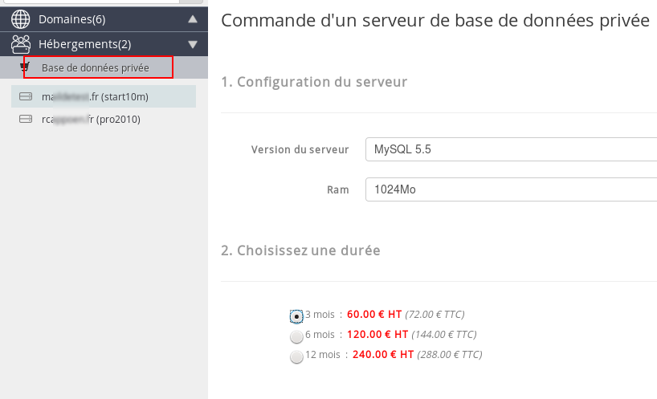
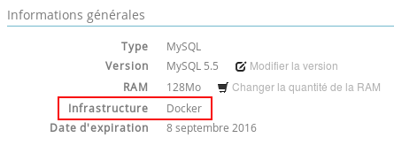
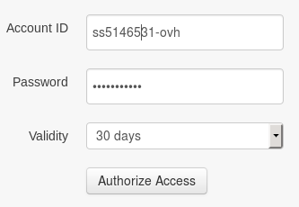
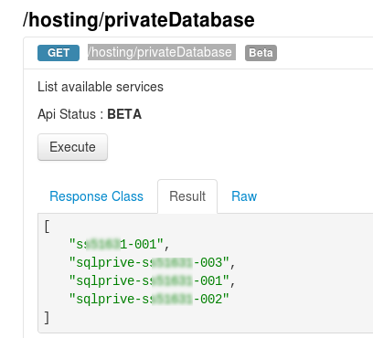
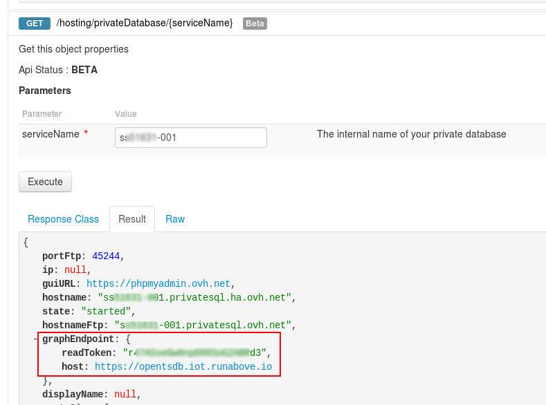
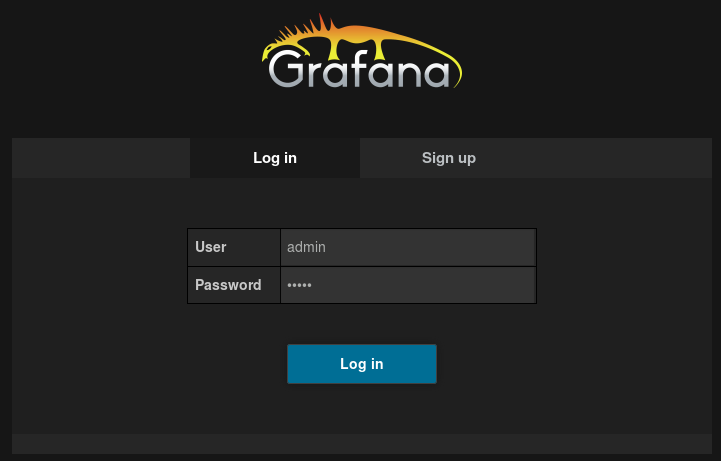
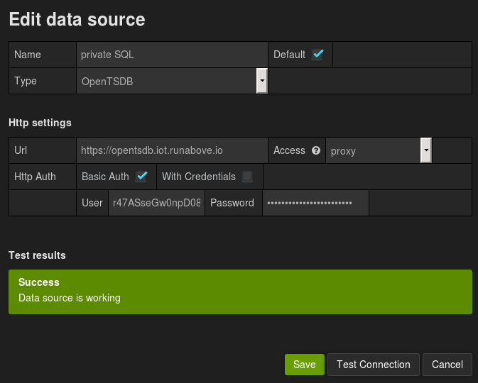
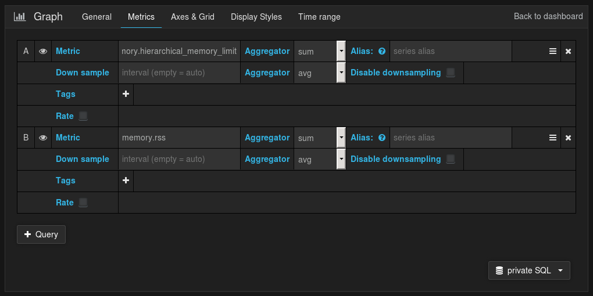

## 

## Cos'è Docker?
Docker è un programma open-source che automatizza il deployment di applicazioni all'interno di container software.

{.thumbnail}

## Cos'è Grafana ?
Grafana è una soluzione open-source che consente di visualizzare graficamente dati da diverse sorgenti.

{.thumbnail}


## Un'istanza
Per installare Grafana è necessario utilizzare Docker, installabile su diversi prodotti offerti da OVH:


- [VPS](https://www.ovh.it/vps/)
- [Server dedicati](https://www.ovh.it/server_dedicati/)
- [Istanze Cloud](https://www.ovh.it/cloud/istanze/)


## Docker

## Come installare Docker?
Consulta la documentazione disponibile a [questo link](https://docs.docker.com/engine/installation/) e scegli l'installazione in base alla tua macchina.

## Su un VPS
Se hai attivato un VPS OVH, puoi installare la distribuzione "Docker on Ubuntu" per usufruire di un server con Docker incluso.

{.thumbnail}


## Grafana

## Installa Grafana su Docker
Per utilizzare Grafana sulla porta 80 del tuo server, esegui questo comando:


```
docker run -i -p 80:3000 grafana/grafana
```


Per maggiori informazioni, clicca su [questo link](http://docs.grafana.org/installation/docker/).
Per installare Grafana senza Docker, consulta[questa documentazione](http://docs.grafana.org/installation/).


## Server SQL Privato

## Tipo di SQL Privato
Per recuperare le metriche, il tuo servr SQL Privato deve essere di tipo Docker.

## Attivazione gratuita sugli hosting Performance
Se hai scelto una soluzione di hosting Performance, puoi attivare gratis un server SQL Privato. Per maggiori informazioni, consulta [questa guida](https://www.ovh.it/g2023.tutto_sullsql_privato#gestisci_il_tuo_sql_privato_attiva_gratis_il_tuo_sql_privato).

## Attiva un server SQL Privato
Attiva il tuo server SQL Privato direttamente dal tuo Spazio Cliente OVH.


- Tutti i nuovi server SQL Privati sono di tipo "Docker"


{.thumbnail}

## Il tuo server SQL Privato è di tipo Legacy o Docker?
I vecchi server SQL Privati sono di tipo Legacy (ad esempio: sqlprive-kx11111-009), i nuovi di tipo Docker (ad esempio: sx11111-012).
Sono due infrastrutture differenti.

{.thumbnail}


## Recupera il token tramite l'API OVH

## Accedi all'API OVH
Per accedere all'API OVH, clicca sul link qui sotto e poi su Login.

[https://api.ovh.com/console/](https://api.ovh.com/console/)

{.thumbnail}

## Recupera il token
Per recuperare la lista dei server SQL Privati presenti sul tuo account, utilizza questa funzione e clicca su "Execute":


```
/hosting/privateDatabase
```


{.thumbnail}
Inserisci il nome del tuo server SQL Privato di tipo Docker utilizzando questa funzione:


```
/hosting/privateDatabase/{serviceName}
```


Le due funzioni necessarie sono indicate in "graphEndpoint":


- readToken
- host


{.thumbnail}


## Utilizza Grafana

## Accedi al tuo Grafana
Per accedere al tuo Grafana, apri il tuo browser e inserisci le credenziali predefinite:


- admin/admin


{.thumbnail}

## Aggiungi la tua sorgente di dati
Per farlo, clicca su "Data Sources" nella colonna di sinistra e poi su "Add new" in alto.

Inserisci queste informazioni:


- Name: il nome della tua sorgente di dati, nel nostro esempio "private SQL".
- Default: Si
- Type: "OpenTSDB"
- URL: inserisci il contenuto del campo "host" recuperato precedentemente con l'API OVH
- Access: "proxy"
- Http Auth: Seleziona "Basic Auth" e deseleziona "With Credentials"
- User: inserisci il contenuto del campo "readToken" recuperato precedentemente con l'API OVH
- Password: inserisci anche qui il contenuto del campo "readToken" recuperato precedentemente con l'API OVH


Esegui un test di connessione e, se il risultato è positivo, aggiungi la sorgente di dati.

{.thumbnail}

## Configura la tua "Dashboard"
Clicca su "Dahboards" nella colonna di sinistra, poi in alto su "Home" e infine su "New". Si apre un nuovo pannello di controllo.


- Per rinominarlo, clicca sull'icona "Manage Dashboard" e poi su "Settings".
- Per salvarlo, clicca sull'icona del "Dischetto" in alto.


Il pannello è composto da righe ("Row"). Per aggiungere il primo grafico, clicca sul tasto verde, seleziona "Add Panel" e poi "Graph".

{.thumbnail}
Nel tab "General", inserisci il titolo del tuo grafico (nel nostro esempio, "RAM").

{.thumbnail}

- Clicca sul tab "Metrics" e verifica che la tua sorgente di dati sia selezionata.


La prima metrica da inserire è "memory.hierarchical_memory_limit", corrispondente alla RAM massima assegnata al tuo server SQL Privato.

Clicca poi su "+ Query" per aggiungere la seconda metrica "memory.rss", corrispondente alla RAM utilizzata dal tuo server.

{.thumbnail}
Clicca sul tab "Axes & Grid" e, in "Left Y", seleziona prima l'unità "data" e poi "Bytes"

{.thumbnail}

- In alto a destra, scegli l'intervallo di tempo. Nel nostro esempio, ecco il risultato degli ultimi 60 giorni.


{.thumbnail}


## Le metriche
Ecco 3 tipi di metriche importanti per monitorare le performance del tuo SQL Privato:

|Limite massimo di RAM utilizzabile|memory.hierarchical_memory_limit|
|RAM Utilizzata|memory.rss|
|Numero di connessioni MySQL attive|mysql.active_connections|


Per consultare la documentazione Docker ufficiale relativa alle metriche, clicca su questo link:


- [https://docs.docker.com/engine/articles/runmetrics/](https://docs.docker.com/engine/articles/runmetrics/)


