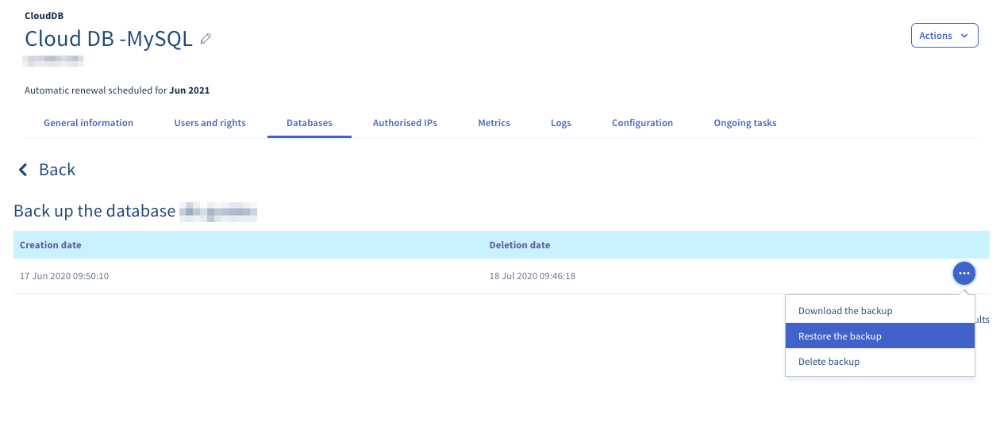

**Letzte Aktualisierung am 16.09.2020**

## Ziel

Nach einem Fehler auf Ihrer Datenbank müssen Sie in der Lage sein, ein Backup wiederherzustellen oder eine lokale Datenbank importieren zu können. 

**Diese Anleitung erklärt, wie Sie eine Datenbank auf Ihrem Datenbankserver wiederherstellen oder importieren können.**

## Voraussetzungen

- Sie verfügen über ein [SQL Private Webhosting](https://www.ovh.de/hosting/sql-optionen.xml) oder nutzen [Cloud Databases](https://www.ovh.de/cloud-databases/).
- Sie haben Zugriff auf Ihr [OVHcloud Kundencenter](https://www.ovh.com/auth/?action=gotomanager).

## In der praktischen Anwendung

> [!primary]
>
> Beachten Sie, dass die Dienste [SQL Private](https://www.ovh.de/hosting/sql-optionen.xml) und [Cloud Databases](https://www.ovh.de/cloud-databases/) keinen Zugriff auf den Host gewähren, sondern auf die darauf gehosteten Datenbanken. Es gibt keinen "root"-Zugang. Generische SQL-Befehle funktionieren normal, und Programme wie HeidiSQL, SQuirreL oder Adminer sind vollständig kompatibel.
> 

### Datenbank über das Kundencenter wiederherstellen und importieren

Loggen Sie sich in Ihr [OVHcloud Kundencenter](https://www.ovh.com/auth/?action=gotomanager) ein und klicken Sie im Bereich `Web`{.action} links in der Menüleiste auf `Datenbanken`{.action}. Wählen Sie den Datenbanknamen aus und gehen Sie dann auf den Tab `Datenbanken`{.action}.

In der Spalte **Sicherungen** indiziert die Zahl die für Ihre Datenbank verfügbaren Sicherungen.

#### Eine Sicherung wiederherstellen

Klicken Sie auf `...`{.action} rechts neben der Datenbank und dann auf `Die Sicherungen anzeigen`{.action}.

Die Liste der verfügbaren Backups erscheint. Klicken Sie auf den Button `...`{.action} rechts neben dem ausgewählten Backup und dann auf `Sicherung  wiederherstellen`{.action}.

{.thumbnail}

> [!warning]
>
> Eine Wiederherstellung bedeutet, dass der Inhalt der Datenbank durch die Sicherung ersetzt wird.
> Wenn Sie sich nicht sicher bezüglich dieses Prozesses sind, erstellen Sie zuerst ein Backup.
> 

#### Eine lokale Sicherung importieren

Klicken Sie auf den Button `...`{.action}. rechts neben der Datenbank und dann auf `Datei importieren`{.action}.

{.thumbnail}

Hierzu haben Sie zwei Möglichkeiten:

##### 1\. Neue Datei importieren

Klicken Sie anschließend auf **Neue Datei importieren** und dann auf `Weiter`{.action}.

Geben Sie einen Namen für Ihre importierte Datei ein, klicken Sie auf `Durchsuchen`{.action}, um diese auszuwählen, bestätigen mit `Absenden`{.action} und klicken dann auf `Weiter`{.action}.

> [!warning]
>
> Die Datei muss im ".gz"-Format sein.
> 

{.thumbnail}

Haken Sie, wenn Sie möchten, **Aktuelle Datenbank leeren** und **E-Mail am Ende des Imports senden** vor dem Import an, um über den Abschluss der Operation auf der E-Mail-Adresse Ihres OVHcloud Kunden-Accounts informiert zu werden, und klicken Sie dann auf `Bestätigen`{.action}.

##### 2\. Bestehende Datei verwenden

Wenn Sie bereits zuvor eine Datei importiert haben, können Sie die Option **Bestehende Datei verwenden** nutzen.

Wählen Sie dann die Datei im Drop-down-Menü aus und klicken Sie auf `Weiter`{.action}.

{.thumbnail}

Haken Sie, wenn Sie möchten, **Aktuelle Datenbank leeren** und **E-Mail am Ende des Imports senden** vor dem Import an, um über den Abschluss der Operation auf der E-Mail-Adresse Ihres OVHcloud Kunden-Accounts informiert zu werden, und klicken Sie dann auf `Bestätigen`{.action}.

### MySQL oder MariaDB Datenbank-Import außerhalb des Kundencenters

In manchen Fällen kann es sein, dass der auf Ihrem Datenbankserver verfügbare RAM nicht ausreicht, um den gewünschten Import durchzuführen. Ist das der Fall, empfehlen wir Ihnen, das [Tool von OVHcloud im Kundencenter zu verwenden](./#datenbank-uber-das-kundencenter-wiederherstellen-und-importieren_1).

#### MySQL oder MariaDB Datenbank über phpMyAdmin importieren

Um Ihre Datenbank direkt über phpMyAdmin zu importieren, müssen Sie sich zuerst mit ihr verbinden. Folgen Sie hierzu den Schritten im Abschnitt ["Verbindung zu einer MySQL oder MariaDB Datenbank herstellen"](../datenbank-verbindung-auf-bdd/#verbindung-zu-einer-mysql-oder-mariadb-datenbank-herstellen).

Wenn Sie in phpMyAdmin eingeloggt sind, wählen Sie die Datenbank aus, indem Sie auf ihren Namen klicken.

Klicken Sie anschließend auf den Tab `Importieren`{.action}.

Wählen Sie Ihre Backup-Datei aus, indem Sie `Durchsuchen`{.action} klicken. (Die Datei darf 100 MB nicht überschreiten.)

> [!primary]
>
> Wir empfehlen Ihnen, Ihre Datenbank in mehrere Dateien aufzuteilen, wenn sie mehr als 100 MB groß ist, und mehrere Importe über phpMyAdmin durchzuführen.<br>
> Der Import von Dateien über 100 MB kann über das Kundencenter erfolgen, indem Sie den Schritten im Abschnitt ["Datenbank über das Kundencenter wiederherstellen und importieren"](./#datenbank-uber-das-kundencenter-wiederherstellen-und-importieren_1) folgen.

Lassen Sie die Standardoptionen aktiviert und klicken Sie auf `Ausführen`{.action}, um den Import zu starten.

{.thumbnail}

#### MySQL oder MariaDB Datenbank über die Kommandozeile importieren

Diese Aktion ist nur über [SSH]( ../webhosting_ssh_auf_ihren_webhostings/) von einem [OVHcloud Webhosting](https://www.ovh.de/hosting) aus möglich.

```bash
cat datenbankname.sql | mysql --host=server --user=benutzername --port=port --password=passwort datenbankname
```

#### MySQL oder MariaDB Datenbank über eine PHP Datei importieren

```php
1. <?php
2. echo "Ihre Datenbank wird wiederhergestellt.......<br>"
3. system("cat datenbankname.sql | mysql --host=server --user=benutzername --port=port --password=passwort datenbankname");
4. echo: "Ihre Datenbank ist auf diesem Hosting eingerichtet."
5
```

> [!warning]
>
> - Um zu vermeiden, dass jemand auf diese Datei mit sensiblen Daten zugreift, können Sie sie [entsprechend absichern](https://docs.ovh.com/gb/en/hosting/how_to_password_protect_a_directory_on_your_website/).
> - Diese Aktion ist nur von einem [OVHcloud Webhosting](https://www.ovh.de/hosting) aus möglich.
>

### Import von PostgreSQL Datenbanken außerhalb des Kundencenters

In manchen Fällen kann es sein, dass der auf Ihrem Datenbankserver verfügbare RAM nicht ausreicht, um den gewünschten Import durchzuführen. Ist das der Fall, empfehlen wir Ihnen, das [Tool von OVHcloud im Kundencenter zu verwenden](./#datenbank-uber-das-kundencenter-wiederherstellen-und-importieren_1).

#### PostgreSQL Datenbank über die Kommandozeile importieren

Diese Aktion ist nur über [SSH]( ../webhosting_ssh_auf_ihren_webhostings/) von einem [OVHcloud Webhosting](https://www.ovh.de/hosting) aus möglich (ab Version "stable").

```bash
psql --host=server --port=port --user=benutzername --password=passwort datenbankname < datenbankname.sql
```

#### PostgreSQL Datenbank über eine PHP Datei importieren

```php
1. <?php
2. echo "Ihre Datenbank wird wiederhergestellt.......<br>"
3. system("PGPASSWORD=passwort psql --host=server --port=port --user=benutzername --password=passwort datenbankname < datenbankname.sql");
4. echo: "Ihre Datenbank ist auf diesem Hosting eingerichtet."
5
```

> [!warning]
>
> - Um zu vermeiden, dass jemand auf diese Datei mit sensiblen Daten zugreift, können Sie sie [entsprechend absichern](https://docs.ovh.com/gb/en/hosting/how_to_password_protect_a_directory_on_your_website/).
> - Diese Aktion ist nur von einem [OVHcloud Webhosting](https://www.ovh.de/hosting) aus möglich.
>

## Weiterführende Informationen

Für den Austausch mit unserer User Community gehen Sie auf <https://community.ovh.com>.
