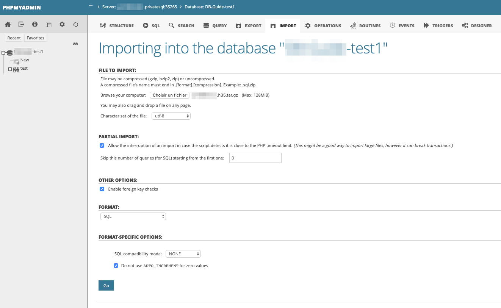

> [!primary]
> Questa traduzione è stata generata automaticamente dal nostro partner SYSTRAN. I contenuti potrebbero presentare imprecisioni, ad esempio la nomenclatura dei pulsanti o alcuni dettagli tecnici. In caso di dubbi consigliamo di fare riferimento alla versione inglese o francese della guida. Per aiutarci a migliorare questa traduzione, utilizza il pulsante "Modifica" di questa pagina.
>

**Ultimo aggiornamento: 11/06/2020**

## Obiettivo

In caso di errore sul database, è necessario essere in grado di ripristinare un backup o importare un database locale. 

**Questa guida ti mostra come ripristinare e importare il database sul tuo server di database.**

## Prerequisiti

- Disporre di una [soluzione di hosting SQL Privato](https://www.ovh.it/hosting-web/opzioni-sql.xml) o [Cloud Database](https://www.ovh.it/cloud-databases/)
- Avere accesso allo [Spazio Cliente OVHcloud](https://www.ovh.com/auth/?action=gotomanager)

## Procedura

> [!primary]
>
> Non è disponibile alcun accesso super utente "root".
> <br> I comandi SQL generici funzionano normalmente e software come HeidiSQL, SQuirreL o Adminer sono completamente compatibili.
> 

### Ripristina e importa un database dallo Spazio Cliente

Accedi allo [Spazio Cliente OVHcloud](https://www.ovh.com/auth/?action=gotomanager). Clicca sulla scheda `Web Cloud` e poi su `Database`{.action} nel pannello di sinistra. Seleziona il nome del tuo database server. Clicca sulla scheda `Database`.

Al livello della colonna **"Backup"**, la cifra corrisponde al numero di backup disponibili per il tuo database.

#### Ripristina un backup esistente

Clicca sui tre puntini `...`{.action} in corrispondenza del database e seleziona `Visualizza i backup`{.action}.

Visualizzi la lista dei backup disponibili, clicca sul pulsante `...`{.action} in corrispondenza del backup scelto e seleziona `Ripristina il backup`{.action}.

{.thumbnail}

> [!warning]
>
> Il ripristino comporta la sostituzione del contenuto del database dopo il ripristino.
> Se non sei sicuro di cosa stai facendo, ti consigliamo di eseguire un backup prima.
> 

#### Importa un backup locale

Clicca sui tre puntini `...`{.action} in corrispondenza del database e seleziona `Importa un file`{.action}.

{.thumbnail}

Hai due possibilità:

##### 1\. Importa un nuovo file

Clicca su **"Importa un nuovo file"** e poi su `Seguente`{.action}.

Inserisci un nome per il tuo file importato, clicca su `Seleziona`{.action} il nome e poi `Invia`{.action}, poi su `Avanti`{.action}.

> [!warning]
>
> Il file deve essere in formato ".gz".
> 

{.thumbnail}

Seleziona **"Svuota il database attuale"** prima dell'importazione e **"Invia un'email alla fine dell'importazione"** per essere informato della fine dell'operazione sull'indirizzo email di riferimento del tuo account OVHcloud, poi clicca su `Conferma`{.action}.

##### 2\. Utilizza un file esistente

Se hai già importato un file in precedenza, puoi scegliere l'opzione **"Importa un file esistente"**.

Seleziona il file nel menu a tendina e clicca su `Seguente`{.action}.

{.thumbnail}

Seleziona **"Svuota il database attuale"** prima dell'importazione e **"Invia un'email alla fine dell'importazione"** per essere informato della fine dell'operazione sull'indirizzo email di riferimento del tuo account OVHcloud, poi clicca su `Conferma`{.action}.

### Importazione di database MySQL o MariaDB dallo Spazio Cliente

In alcuni casi, la RAM disponibile nel tuo database potrebbe non consentire di effettuare l'importazione desiderata. In questo caso, ti consigliamo di utilizzare il tool OVHcloud nello Spazio Cliente. Accedi alla sezione ["Ripristina e importa un database dallo Spazio Cliente"](./#ripristina-e-importa-un-database-dallo-spazio-cliente) di questa guida.


#### Importare il mio database MySQL o MariaDB da phpMyAdmin

Per importare il tuo database direttamente da phpMyAdmin, è necessario connetterti prima a questo database. Per farlo, fare riferimento a [questa guida](../connessione-database-server-bdd).

Una volta connesso a phpMyAdmin, seleziona il tuo database cliccando sul suo nome.

Clicca sulla scheda `Importa`{.action}.

Seleziona il tuo file di backup cliccando `Sfoglia`{.action} (attenzione, il file non può superare i 100 MB).

> [!primary]
>
> Ti consigliamo di frazionare il tuo database in più file quando supera i 100 MB ed effettuare diverse importazioni da phpMyAdmin.<br>
> Per importare file di contenuto superiore a 100 MB, accedi allo Spazio Cliente, seguendo lo Step ["Ripristina e importa un database dallo Spazio Cliente"](./#ripristina-e-importa-un-database-dallo-spazio-cliente).


Lascia le opzioni predefinite e clicca su `Esegui`{.action} per avviare l'importazione.

{.thumbnail}

#### Importare il tuo database MySQL o MariaDB da riga di comando

Questa azione è possibile solo in [SSH](../hosting_condiviso_il_protocollo_ssh/) da un hosting condiviso OVHcloud.

```bash
cat nom_de_base.sql | mysql —host=server —user=utente —port=port —password=password nome_database
```
#### Importare un database MySQL o MariaDB da un file PHP

```php
1. <?php
2. echo "Il tuo database è in corso di ripristino.......<br>";
3. system("cat nom_de_base.sql | mysql —host=server —user=utente —port=port —password=password nome_database);
4. echo "E' finita. Il tuo database è attivo su questo hosting."
5. ?>
```

> [!warning]
>
> - Per evitare che un terzo acceda al file con dati sensibili, consulta questa guida per rendere [sicuro l'accesso](../how_to_password_protect_a_directory_on_your_website/)
> - Questa azione è possibile solo da un hosting OVHcloud condiviso.
>

### Importazione di database PostgreSQL al di fuori dello Spazio Cliente

In alcuni casi, la RAM disponibile nel tuo database potrebbe non consentire di effettuare l'importazione desiderata. In questo caso, ti consigliamo di utilizzare il tool OVHcloud nello Spazio Cliente. Accedi alla sezione ["Ripristinare e importare un database dallo Spazio Cliente"](./#ripristina-e-importa-un-database-dallo-spazio-cliente) di questa guida.

#### Importa il tuo database PostgreSQL da riga di comando

Questa azione è possibile esclusivamente in [SSH](../hosting_condiviso_il_protocollo_ssh/) da un hosting condiviso OVHcloud in versione stabile o superiore.

```bash
psql —host=server —port=port —user=utente —password=password nome_database < nome_database.sql
```

#### Importa il tuo database PostgreSQL da un file PHP

```php
1. <?php
2. echo "Il tuo database è in corso di ripristino.......<br>";
3. system("PGPASSWORD=password psql —host=server —port=port—user=utente —password=password nome_database < nome_database.sql");
4. echo "E' finita. Il tuo database è attivo su questo hosting."
5. ?>
```

> [!warning]
>
> - Per evitare che un terzo acceda al file con dati sensibili, consulta questa guida per rendere [sicuro l'accesso](../how_to_password_protect_a_directory_on_your_website/)
> - Questa azione è possibile solo da un hosting OVHcloud condiviso.
>

## Per saperne di più

Contatta la nostra Community di utenti all’indirizzo <https://community.ovh.com>.

