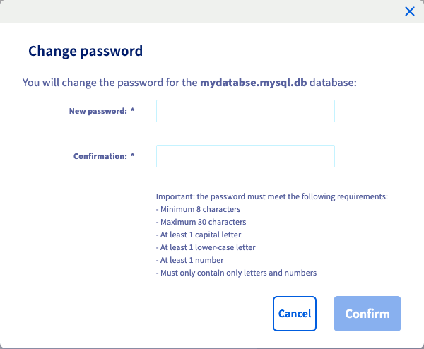

**Última atualização: 07/02/2019**

## Sumário

Uma base de dados (*database*, “DB” ou “BDD”) permite armazenar elementos considerados dinâmicos, tal como comentários ou artigos, por exemplo. Atualmente, estas bases de dados são utilizadas pela maior parte dos sistemas de gestão de conteúdos (*Content Management System* ou CMS), como o WordPress ou o Joomla!, e são acessíveis através de uma palavra-passe associada.

**Saiba como alterar a palavra-passe de uma base de dados criada num serviço de alojamento web.**

## Requisitos

- Ter um serviço de [alojamento web da OVH](https://www.ovh.pt/alojamento-partilhado/){.external}.
- Ter acesso à secção de gestão do alojamento web a partir da [Área de Cliente OVH](https://www.ovh.com/auth/?action=gotomanager){.external}.

> [!warning]
>
> Ao alterar a palavra-passe da base de dados, terá igualmente de repetir esta mudança no ficheiro de configuração que liga a base de dados ao seu website.
>

## Instruções

### 1 - Avaliar a situação

**Alterar a palavra-passe de uma base de dados é uma operação sensível**: caso a modificação não seja realizada corretamente, esta alteração pode deixar inacessíveis todos os websites que utilizem a base de dados. Iremos explicar os impactos de uma alteração da configuração de um alojamento web para que compreenda as consequências de tal operação.

Hoje em dia, praticamente todos os CMS (WordPress, Joomla!, etc.) usam uma base de dados para armazenar elementos dinâmicos, como os comentários ou os artigos. Portanto, para estes websites é indispensável uma conexão à base de dados para que possam funcionar corretamente. Nesse sentido, existe um ficheiro de configuração que dispõe das informações da base de dados e que permite essa ligação. Assim, ao alterar a palavra-passe da base de dados na OVH, deverá obrigatoriamente refletir esta alteração no ficheiro que liga o website e a base de dados.

> [!primary]
>
> Antes de realizar qualquer alteração, recomendamos vivamente que verifique se o website está ligado a uma base de dados. Se for o caso, certifique-se de que sabe como refletir a alteração para evitar que o website fique inacessível.
>
> Uma vez que esta configuração é inerente à configuração do seu website e não à OVH, recomendamos que contacte o editor do seu website ou um profissional, tal como um fornecedor especializado, caso necessite de ajuda para realizar esta operação.
>

### 2 - Aceder à gestão das bases de dados do alojamento

Para iniciar a operação, aceda à [Área de Cliente OVH](https://www.ovh.com/auth/?action=gotomanager){.external}, clique em `Alojamentos`{.action} na barra à esquerda e selecione o nome do alojamento que pretende. Por fim, clique no separador `Base de dados`{.action}.

Aparecerá uma tabela com todas as bases de dados criadas no quadro do plano de alojamento web.

{.thumbnail}

### 3 - Alterar a palavra-passe da base de dados

Para alterar a palavra-passe, clique nos três pontos à direita da base de dados em causa e, a seguir, em `Alterar palavra-passe`{.action}.

{.thumbnail}

Na nova janela, introduza a nova palavra-passe, confirme que está correta e clique em `Validar`{.action}.

**A implementação da alteração demorará alguns minutos.**

> [!primary]
>
> Por razões de segurança, escolha a sua palavra-passe de acordo com as indicações apresentadas. Além disso, recomendamos que:
>
> - não utilize duas vezes a mesma palavra-passe;
>
> - selecione uma palavra-passe sem qualquer relação com as suas informações pessoais (apelido, nome ou data de nascimento, por exemplo);
>
> - renove as suas palavras-passe de forma regular;
>
> - não anote nem envie as suas palavras-passe para o seu endereço de e-mail;
>
> - não guarde as palavras-passe no seu browser, mesmo que lhe seja sugerido.
>

{.thumbnail}

### 4 - Restabelecer a ligação entre a base de dados e o website

> [!primary]
>
> Se o seu website não precisar de estar associado a uma base de dados, esta parte é opcional.
>

Se o site apresentar uma mensagem indicando que a ligação à base de dados não pode ser efetuada, isso significa que não refletiu a alteração da palavra-passe no ficheiro que assegura a ligação entre o website e a base de dados.

Para que o website possa estabelecer essa ligação, existe um ficheiro no espaço de armazenamento com informações que permitem essa ligação: um nome de utilizador, a respetiva palavra-passe, o nome da base de dados e o endereço do servidor. Dado que a alteração da palavra-passe foi realizada a partir da Área de Cliente OVH, a ligação foi interrompida.

Para a restabelecer, deve introduzir a nova palavra-passe no ficheiro que contém as informações relativas à base de dados. Uma vez que esta configuração é inerente à configuração do seu website e não à OVH, recomendamos que contacte o editor do seu website ou um profissional, tal como um fornecedor especializado, caso necessite de ajuda para realizar estas operações.

## Quer saber mais?

[Saber mais sobre a segurança das palavras-passe graças à ANSSI.](https://www.ssi.gouv.fr/en/){.external}

Fale com a nossa comunidade de utilizadores em [https://community.ovh.com/en/](https://community.ovh.com/en/){.external}