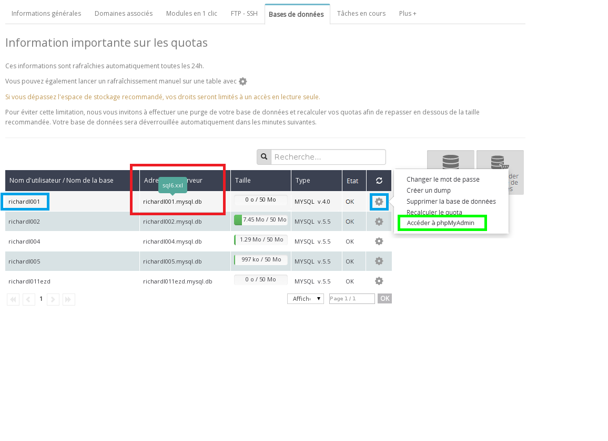
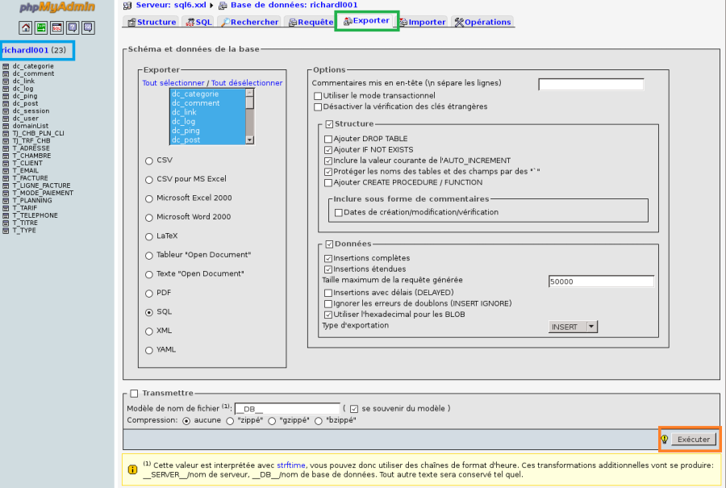
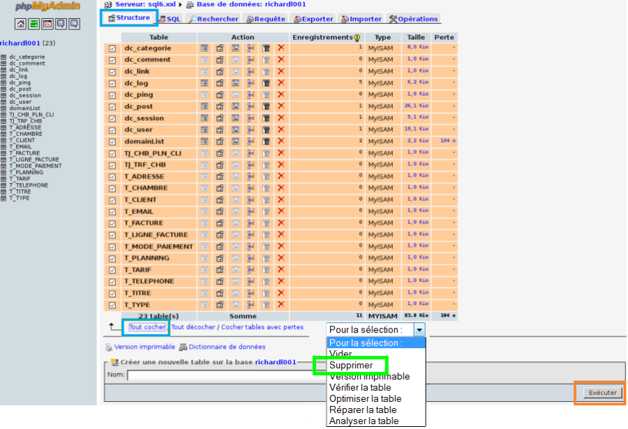
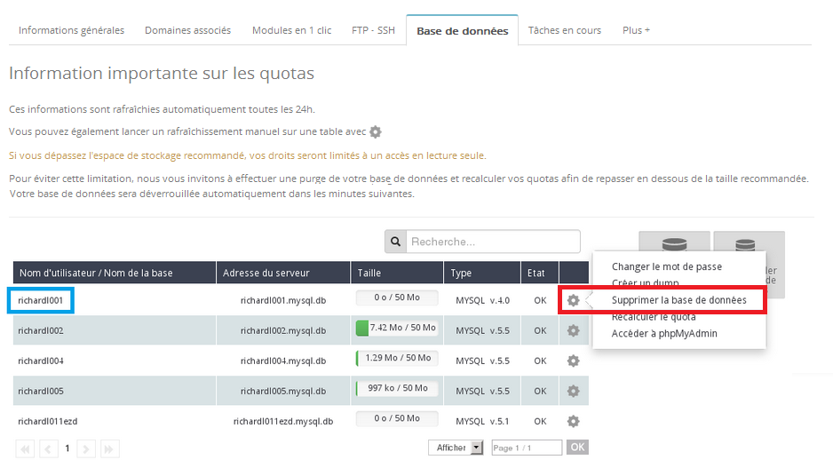

## Dlaczego warto wykonać migrację?
Należy zawsze korzystać z najnowszych wersji udostępnionych przez producentów usług. 
Najnowsze wersje zawierają czasem dodatkowe funkcje, ale przede wszystkim zwiększają bezpieczeństwo i optymalizują działanie usługi.
Korzystanie z najnowszych wersji zapewnia większą jakość i bezpieczeństwo usług, którymi zarządzasz.

## Ile czasu trwa migracja?
Migracja trwa od 10 do 40 minut.

## Gdzie można odnaleźć dane dostępowe do bazy danych?
Zaloguj się do [panelu klienta](https://www.ovh.com/manager/web/login/).

Po zalogowaniu wybierz swój hosting z lewej strony z menu Hosting. 
Przejdź do zakładki Baza danych.

W zakładce tej zobaczysz listę utworzonych już baz danych. Będzie tam również informacja na temat wersji bazy danych. 
W części tej odnajedziesz również nazwę użytkownika i adres serwera, które przydadzą nam się w kolejnym etapie.

Kliknij na koło zębate z prawej strony. Będziesz mógł zmienić hasło do bazy danych, jeśli go nie pamiętasz.

{.thumbnail}

## Jak zalogować się do bazy danych w wersji SQL 4?
Istnieją dwie możliwości zalogowania się do bazy danych SQL 4:

- Skorzystaj z [tego linka](https://phpmyadmin.ovh.net/old/).
lub
- W[panelu klienta](https://www.ovh.com/manager/web/login/), w sekcji Hosting, Baza danych kliknij na koło zębate z prawej strony na poziomie bazy danych SQL 4 i wybierz "Dostęp do phpMyAdmin" i "https://phpmyadmin.ovh.net/old/" (w dolnej części strony).

{.thumbnail}
Po przejściu na stronę logowania do interfejsu [phpmyadmin](https://phpmyadmin.ovh.net/old/), należy podać poniższe dane:

- Username = Użytkownik bazy danych
- Password = Hasło do bazy danych
- Server Choice = Adres serwera (informacja ta znajduje się w panelu klienta w zakładce Baza danych). Na przykład: sql6.xxl.

{.thumbnail}

## Jak zarejestrować kopię zapasową bazy danych w wersji SQL 4?
Po zalogowaniu do interfejsu PhpMyAdmin kliknij na bazę danych w kolumnie z lewej strony.
Następnie wybierz zakładkę "Exportuj". Wybierz opcje eksportu. 
Jeśli nie wiesz, jakie opcje wybrać, zalecamy pozostawienie domyślnych opcji.

Kliknij na przycisk "Wykonaj".

Zostanie wygenerowany tekst - zawartość bazy. 

Wystarczy skopiować i przekleić cały ten tekst do pliku tekstowego na Twoim komputerze i zapisać plik w formacie ".SQL".

Baza danych została zapisana lokalnie na Twoim komputerze.

{.thumbnail}

## Jak wyczyścić bazę danych w wersji SQL 4?
Po skopiowaniu bazy danych należy ją wyczyścić z poziomu interfejsu PhpMyAdmin. Aby to wykonać, kliknij jeszcze raz na bazę danych w kolumnie z lewej strony. 

Na środku zobaczysz wszystkie swoje tabele. 

Kliknij na "Zaznacz wszystko" i z rozwijalnej listy "Zaznaczone" wybierz "Usuń".

Następnie kliknij na "Wykonaj.

Pojawi się okno, w którym wystarczy potwierdzić operację. 

Po wykonaniu tej operacji baza będzie pusta.

{.thumbnail}

## Jak usunąć bazę danych w wersji SQL 4?
Możesz wylogować się z interfejsu PhpMyAdmin.
W [panelu klienta](https://www.ovh.com/manager/web/login/) kliknij na hosting i na zakładkę Bazy danych.

Z prawej strony bazy danych w wersji MYSQL v4.0 kliknij na ikonkę koła zębatego i wybierz opcję "Usuń bazę danych". 

Pojawi się okno pop-up z prośbą o potwierdzenie operacji. Kliknij na "Zatwierdź".

Operacja usuwania bazy danych może trwać około 10-15 minut.

{.thumbnail}

## Jak utworzyć bazę danych w wersji MySQL 5.5?
Po usunięciu bazy danych w wersji SQL4 będziesz mógł utworzyć nową bazę danych w wersji MySQL 5.5. Zaloguj się do [panelu klienta](https://www.ovh.com/manager/web/login/), wybierz domenę w sekcji Hosting i przejdź do zakładki Bazy danych.

Kliknij na przycisk Stwórz bazę danych.

Wybierz silnik MySQL i aktualnie dostępną wersję: 5.5. Kliknij na "Dalej". 

Zakładanie bazy danych trwa około 5-10 minut. Możesz monitorować operację w zakładce "Zadania w trakcie".

## Jak przywrócić/zaimportować kopię zapasową w bazie danych w wersji MySQL 5.5?
Jeśli chcesz przywrócić kopię zapasową bazy danych, zapoznaj się z [tym przewodnikiem](https://www.ovh.pl/g1393.import-bazy-danych-mysql).

## Moja strona nie działa, pomimo że wykonałem kopię zapasową i przywróciłem bazę danych. Dlaczego?
Jeśli przywróciłeś kopię zapasową bazy danych, na Twojej stronie może pojawić się błąd połączenia z bazą danych. 

Dzieje się tak, ponieważ Twoja strona próbuje łączyć się ze starą bazą danych, a baza ta została usunięta. 
Należy więc wskazać stronie, że ma używać nowej bazy danych, zmieniając plik konfiguracyjny.

## Jak zmodyfikować plik konfiguracyjny?
W zależności od rodzaju strony, plik konfiguracyjny może się znajdować w różnych miejscach na serwerze FTP. 
Zaloguj się na przestrzeń FTP. Możesz skorzystać z [tego przewodnika](https://www.ovh.pl/g1380.program-filezilla).

Jeśli przykładowo Twoja strona opiera się na module WordPress, plik konfiguracyjny nosi nazwę wp-config.php i znajduje się w katalogu głównym strony na serwerze FTP. 

W przypadku innych modułów CMS lub stron wykonywanych przez programistów, należy skontaktować się z wykonawcą strony i zapytać, gdzie znajduje się plik konfiguracyjny. 

Po odnalezieniu pliku należy go wyedytować. 

Skopiuj plik lokalnie na swój komputer i wyedytuj plik za pomocą odpowiedniego programu, jak na przykład WordPad lub notes. 

Należy zmodyfikować linie typu "DB_NAME", "DBPASSWORD", "DB_USER" oraz "DB_HOST" (mogą one nosić inne nazwy w zależności od typu strony), wprowadzając nowe wartości. Można je odnaleźć w [panelu klienta](https://www.ovh.com/manager/web/login/) w zakładce "Bazy danych".

## Otrzymujesz błąd bezpiecznego połączenia.
Podczas operacji na bazach danych możesz otrzymać błąd bezpiecznego połączenia.
Jest to konflikt między wersją Firefoxa i naszą stroną PhpMyAdmin.

Aby uniknąć tego problemu, skorzystaj z innej przeglądarki.

## Import nie przebiega prawidłowo.
Nie powinieneś mieć problemu z zaimportowaniem baz danych utworzonych w wersji MySQL4 na serwer MySQL5. 
Nie możesz jednak używać nazwy tabeli w części lub w całości identycznej ze słowami zarezerwowanymi dla MySQL określonymi na poniższej liście:

|ADD ALL ALTER ANALYZE AND AS ASC ASENSITIVE BEFORE BETWEEN BIGINT BINARY BLOB BOTH BY CALL CASCADE CASE CHANGE CHAR CHARACTER CHECK COLLATE COLUMN CONDITION CONNECTION CONSTRAINT CONTINUE CONVERT CREATE CROSS CURRENT_DATE CURRENT_TIME CURRENT_TIMESTAMP CURRENT_USER CURSOR DATABASE DATABASES DAY_HOUR DAY_MICROSECOND DAY_MINUTE DAY_SECOND DEC DECIMAL DECLARE DEFAULT DELAYED DELETE DESC DESCRIBE DETERMINISTIC DISTINCT DISTINCTROW DIV DOUBLE DROP DUAL EACH ELSE ELSEIF ENCLOSED ESCAPED EXISTS EXIT EXPLAIN FALSE FETCH FLOAT FLOAT4 FLOAT8 FOR FORCE FOREIGN FROM FULLTEXT GRANT GROUP HAVING HIGH_PRIORITY HOUR_MICROSECOND HOUR_MINUTE HOUR_SECOND IF IGNORE IN INDEX INFILE INNER INOUT INSENSITIVE INSERT INT INT1 INT2 INT3 INT4 INT8 INTEGER INTERVAL INTO IS ITERATE JOIN KEY KEYS KILL LEADING LEAVE LEFT LIKE LIMIT LINES LOAD LOCALTIME LOCALTIMESTAMP LOCK LONG LONGBLOB LONGTEXT LOOP LOW_PRIORITY MATCH MEDIUMBLOB MEDIUMMINT MEDIUMTEXT MIDDLEINT MINUTE_MICROSECOND MINUTE_SECOND MOD MODIFIES NATURAL NOT NO_WRITE_TO_BINLOG NULL NUMERIC ON OPTIMIZE OPTION OPTIONALLY OR ORDER OUT OUTER OUTFILE PRECISION PRIMARY PROCEDURE PURGE RAID0 READ READS REAL REFERENCES REGEXP RELEASE RENAME REPEAT REPLACE REQUIRE RESTRICT RETURN REVOKE RIGHT RLIKE SCHEMA SCHEMAS SECOND_MICROSECOND SELECT SENSITIVE SEPARATOR SET SHOW SMALLINT SONAME SPATIAL SPECIFIC SQL SQLEXCEPTION SQLSTATE SQLWARNING SQL_BIG_RESULT SQL_CALC_FOUND_ROWS SQL_SMALL_RESULT SSL STARTING STRAIGHT_JOIN TABLE TERMINATED THEN TINYBLOB TINYINT TINYTEXT TO TRAILING TRIGGER TRUE UNDO UNION UNIQUE UNLOCK UNSIGNED UPDATE USAGE USE USING ETC_DATE ETC_TIME UTC_TIMESTAMP VALUES VARBINARY VARCHAR VARCHARACTER VARYING WHEN WHERE WHILE WITH WRITE X509 XOR YEAR_MONTH ZEROFILL|

