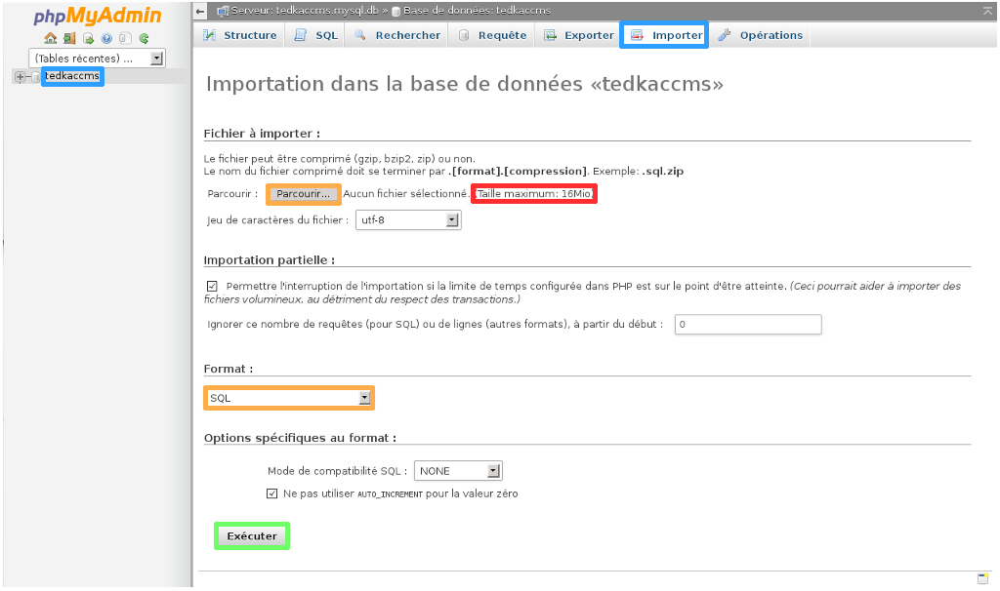

Vous trouverez dans ce guide différentes manières d'importer votre base de données sur nos serveurs.

Cliquez [ici](http://www.ovh.com/fr/hebergement-web/faq){.external} pour retrouver nos différents guides des offres d'hébergement mutualisé.

*Retrouvez le guide pour l'exportation des bases de données :* []({legacy}1394){.ref}


## Généralités

### Pre-requis
Vous devez avoir en votre possession :

- Le fichier de sauvegarde de votre base , appelé dump*, obtenu lors de la sauvegarde de la base ( Un guide est disponible concernant la sauvegarde des bases de données SQL []({legacy}1394){.ref} ).

La sauvegarde de la base de données est généralement de type .sql. *Si votre base a été créée chez un autre prestataire qu'OVH, nous vous invitons à le contacter afin d'obtenir plus d'informations concernant la récupération de votre base de données via son service.*

- Il est également nécessaire d'avoir en votre possession votre identifiant le mot de passe , ainsi que l'hôte sql de la base de données qui vous permettent de vous connecter dans la base de données.


{.thumbnail}


## Importation

### Depuis votre espace client OVH
La solution la plus simple et la plus rapide pour importer votre base de données est de vous rendre sur votre [espace client OVH](https://www.ovh.com/manager/){.external}. L'avantage de cette méthode est qu'il n'y a  **pas de limite de taille**  à l'import de votre fichier de sauvegarde.

Une fois connecté à l'[espace client](https://www.ovh.com/manager/){.external} avec votre couple  **NIC-Handle/Mot de passe** , sélectionnez votre hébergement dans la partie de gauche, puis rendez-vous dans l'onglet Bases de données.


{.thumbnail}

A droite de la base de données dans laquelle vous voulez importer votre sauvegarde, cliquez sur le rouage, et choisissez "Importer un fichier".

Suivez ensuite les étapes du manager afin d'importer votre sauvegarde SQL.


{.thumbnail}


### Depuis PhpMyAdmin pour MySQL
Vous devez vous connecter à la base de données via  **PhpMyAdmin** .

Veuillez suivre ce lien pour vous y connecter : [PhpMyAdmin OVH](https://phpmyadmin.ovh.net){.external}

*Un guide est disponible concernant l'utilisation de PhpMyAdmin* : []({legacy}1374){.ref}

- Une fois connecté sur PhpMyAdmin, sélectionnez votre base de données en cliquant sur son nom (cf encadré bleu en haut à gauche de la screen ci-contre).
- Cliquez ensuite sur "Importer" .
- Sélectionnez votre fichier de sauvegarde en cliquant sur "Parcourir" ( attention le fichier ne peut pas dépasser 16 Mo ).
- Cliquez sur "Exécuter" pour lancer l'importation.


{.thumbnail}


> [!success]
>
> - Le fichier ne peut pas dépasser 16 Mo .
>

### Depuis un script present sur votre hebergement
*Il vous est possible de créer ces scripts dans un fichier txt. Vous devrez leur donner l'extension correspondant au langage utilisé.*

Dans les scripts ci-dessous, remplacez :

- nom_de_la_base.sql par le nom de votre fichier.
- serveur_sql par le nom du serveur sur lequel votre base de données est créée.
- nom_de_la_base par le nom de votre base de données.
- mot_de_passe par le mot de passe associé à votre base de données.

*Le code à renseigner et à compléter :*


```php
1. <?php
2. echo "Votre base est en cours de restauration.......
3. <br>";
4. system("cat nom_de_la_base.sql | mysql --host=serveur_sql --user=nom_de_la_base --password=mot_de_passe nom_de_la_base");
5. echo "C'est fini. Votre base est en place sur cet hébergement.";
6. ?>
```

*Le code à renseigner et à compléter :*


```bash
#!/usr/bin/perl

print "Votre base est en cours de restauration.......
<br>";
system("cat nom_de_la_base.sql | mysql --host=serveur_sql --user=nom_de_la_base --password=mot_de_passe nom_de_la_base");
print "C'est fini. Votre base est en place sur cet hébergement.";
```

- Uploadez via FTP le script que vous avez créé ainsi que le dump* de votre base dans le répertoire www de votre hébergement et appelez votre script avec le navigateur via cette url : [http://votre_domaine.com/importbase.php](http://votre_domaine.com/importbase.php){.external}

Remplacez  **votre_domaine.com**  par votre nom de domaine et  **importbase.php**  par le nom de votre fichier.

**Votre fichier de sauvegarde est compressé ?**

Si jamais votre dump* est compressé, donc de la forme .sql.gz, il suffit alors de placer cette commande en début de script :


```bash
system("gunzip nom_de_la_base.sql.gz");
```

Exemple : *Le code complété en exemple :*


```php
1. <?php
2. echo "Décompression du fichier.....
3. <br>";
4. system("gunzip testbackup.sql.gz");
5. echo "Votre base est en cours de restauration......
6. <br>";
7. system("cat testbackup.sql | mysql --host=mysql5-21.pro --user=testimport --password=RtPgDsmLE testimport");
8. echo "C'est fini. Votre base est en place sur cet hébergement.";
9. ?>
```

*Le code complété en exemple :*


```bash
#!/usr/bin/perl

print "Décompression du fichier.....
<br>";
system("gunzip testbackup.sql.gz");
print "Votre base est en cours de restauration.......
<br>";
system("cat testbackup.sql | mysql --host=mysql5-21.pro --user=testimport --password=RtPgDsmLE testimport");
print "C'est fini. Votre base est en place sur cet hébergement.";
```


### Depuis une commande via ssh
- Récupérez votre identifiant et le mot de passe FTP qui vous permettent de vous connecter sur l'hébergement web.
- Posséder une offre permettant l'accès via ssh ( [voir les
caractéristiques de nos
offres](https://www.ovh.com/fr/hebergement-web/){.external} )
- [Connexion ssh mutualisé](http://guide.ovh.net/SshMutualise){.external}

Connectez-vous en ssh à votre hébergement mutualisé.

Rendez-vous dans le répertoire où vous avez placé le fichier à importer, vous devez ensuite taper cette commande :

*Le code à renseigner et à compléter :*


```bash
cat nom_de_la_base.sql | mysql --host=serveur_sql --user=nom_de_la_base --password=mot_de_passe nom_de_la_base
```

*Le code complété en exemple :*


```bash
cat testbackup.sql | mysql --host=mysql5-21.pro --user=testimport --password=RtPgDsmLE testimport
```


### Depuis le service SQL privé
Un guide concernant l'importation d'une base de données est disponible à ce niveau :

- [Importation base de données SQL Privé]({legacy}2023){.ref}


## Informations utiles

### Erreur a cause du nom de la base de donnees
Il peut également être nécessaire d'ajouter cette ligne en haut de votre fichier de sauvegarde :


```bash
use nom_de_votre_base;
```

Où nom_de_votre_base correspond au nom de la base dans laquelle vous importerez ces données.


### Lexique
dump* : *fichier de sauvegarde de la base de données de votre site.*