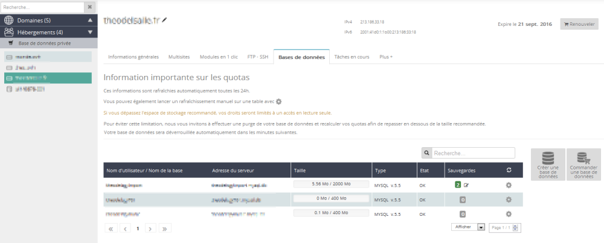

## Wstępne wymagania
Musisz dysponować:


- Plikiem z kopią bazy danych (dump*) otrzymanym podczas wykonywania kopii bazy danych (Przewodnik na temat kopii zapasowej bazy danych SQL []({legacy}1394)). Kopia bazy danych to zazwyczaj plik .sql. 
Jeśli Twoja baza danych została utworzona u dostawcy innego niż OVH, skontaktuj się z nim, aby otrzymać informacje dotyczące uzyskania kopii bazy danych. 

- Parametrami takimi jak identyfikator, hasło i serwer sql bazy danych, które pozwolą Ci na połączenie się z bazą danych. 
Zapoznaj się z przewodnikiem na temat odzyskiwania danych do logowania do bazy SQL:[]({legacy}1374)


{.thumbnail}


## Z poziomu panelu klienta
Najprostszym i najszybszym rozwiązaniem dotyczącym zaimportowania bazy danych jest wykonanie tej operacji w [panelu klienta OVH](https://www.ovh.com/manager/).
Zaletą tej metody jest brak limitu rozmiaru importowanego pliku kopii zapasowej.

Po zalogowaniu do [panelu klienta](https://www.ovh.com/manager/) za pomocą identyfikatora klienta i hasła, wybierz hosting w menu z lewej strony i przejdź do sekcji Bazy danych.

{.thumbnail}
Z prawej strony bazy danych, do której chcesz zaimportować kopię, kliknij na ikonkę koła zębatego i wybierz "Importuj plik". 

Następnie przejdź przez kolejne etapy, aby zaimportować kopię SQL.

{.thumbnail}


## Z poziomu PhpMyAdmin dla MySQL
Połącz się z bazą danych za pomocą PhpMyAdmina.

Interfejs ten jest dostępny na tej stronie:
[PhpMyAdmin OVH](https://phpmyadmin.ovh.net)

Zapoznaj się z przewodnikiem na temat PhpMyAdmina: []({legacy}1374)


- Po zalogowaniu do PhpMyAdmina wybierz bazę danych klikając na jej nazwę.

- Następnie kliknij na "Importuj".

- Wybierz plik z kopia bazy klikając na "Przeglądaj" (uwaga: plik nie może przekroczyć 16 MB).

- Kliknij na "Wykonaj", aby uruchomić importowanie.

Jeśli pobierzesz kopię bazy danych z panelu klienta, rozpakuj plik przed jego zaimportowaniem.


{.thumbnail}

## Przypomnienie:

- Plik nie może przekraczać 16 MB.


## Z poziomu skryptu zainstalowanego na hostingu
Tego typu skrypt możesz utworzyć w pliku txt. Plik powinien mieć rozszerzenie związane z używanym językiem.

W poniższych skryptach zastąp:


- nazwa_bazy.sql nazwą pliku.

- serwer_sql nazwą serwera, na którym utworzona jest baza danych.

- nazwa_bazy nazwą bazy danych.

- hasło hasłem przypisanym do bazy.

Plik z kopią bazy powinien najpierw zostać umieszczony na FTP na hostingu.


## W PHP (importbase.php):
Kod do wpisania i uzupełnienia: 


```
<?php
echo "Votre base est en cours de restauration.......
<br>";
system("cat nazwa_bazy.sql | mysql --host=serwer_sql --user=nazwa_bazy --password=hasło nazwa_bazy");
echo "C'est fini. Votre base est en place sur cet hébergement.";
?>
```


## W perlu (importbase.cgi):
Kod do wpisania i uzupełnienia: 


```
#!/usr/bin/perl

print "Votre base est en cours de restauration.......
<br>";
system("cat nazwa_bazy.sql | mysql --host=serwer_sql --user=nazwa_bazy --password=hasło nazwa_bazy");
print "C'est fini. Votre base est en place sur cet hébergement.";
```


- Wgraj przez FTP utworzony skrypt i dump* bazy danych w katalogu www hostingu i odpytaj skrypt za pomocą przeglądarki: http://nazwa_domeny.com/importbase.php 


Zastąp nazwa_domeny.com swoją nazwą domeny i importbase.php nazwą swojego pliku.

Twój plik jest spakowany?

Jeśli dump* jest spakowany, czyli ma formę .sql.gz, wystarczy umieścić to polecenie na początku skryptu:


```
system("gunzip nazwa_bazy.sql.gz");
```


Przykład:

## W PHP: spakowany dump + przywrócenie bazy danych
Przykład kodu: 


```
<?php
echo "Décompression du fichier.....
<br>";
system("gunzip testbackup.sql.gz");
echo "Votre base est en cours de restauration......
<br>";
system("cat testbackup.sql | mysql --host=mysql5-21.pro --user=testimport --password=RtPgDsmLE testimport");
echo "C'est fini. Votre base est en place sur cet hébergement.";
?>
```


## W perlu: spakowany dump + przywrócenie bazy danych
Przykład kodu: 


```
#!/usr/bin/perl

print "Décompression du fichier.....
<br>";
system("gunzip testbackup.sql.gz");
print "Votre base est en cours de restauration.......
<br>";
system("cat testbackup.sql | mysql --host=mysql5-21.pro --user=testimport --password=RtPgDsmLE testimport");
print "C'est fini. Votre base est en place sur cet hébergement.";
```


## Z poziomu polecenia ssh

## Wstępne wymagania

- Przygotuj login i hasło do FTP. 
Zapoznaj się z przewodnikiem na temat odzyskiwania danych do FTP: []({legacy}1374)

- Musisz mieć ofertę z dostępem przez ssh ([sprawdź nasza ofertę](http://www.ovh.pl/hosting/))


Poniżej znajduje się link do przewodnika na temat ssh na hostingu:


- [SSH na hostingu](http://pomoc.ovh.pl/SshNaHostingu)


## Importowanie bazy danych przez ssh
Połącz się z hostingiem przez ssh.

Przejdź do katalogu, w którym umieściłeś plik, który chcesz zaimportować i wpisz to polecenie:

Kod do wpisania i uzupełnienia: 


```
cat nazwa_bazy.sql | mysql --host=serwer_sql --user=nazwa_bazy --password=hasło nazwa_bazy
```


Przykład kodu: 


```
cat testbackup.sql | mysql --host=mysql5-21.pro --user=testimport --password=RtPgDsmLE testimport
```


## Z poziomu Prywatnego Serwera SQL
Przewodnik dotyczący importowania bazy danych:


- [Importowanie bazy danych na prywatnym serwerze SQL](https://www.ovh.pl/g2023.prywatny_serwer_sql#kopia_zapasowa_importowanie_przywracanie)


## Błąd związany z nazwą bazy danych
Możliwe, że trzeba będzie dodać tą linię w górnej części pliku kopii zapasowej: 


```
use nazwa_bazy;
```


Gdzie nazwa_bazy to nazwa bazy, do której importujesz te dane.


## Słowniczek
dump*: plik z kopią zapasową bazy danych strony.

