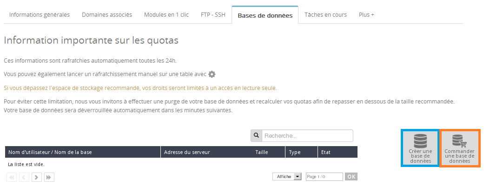
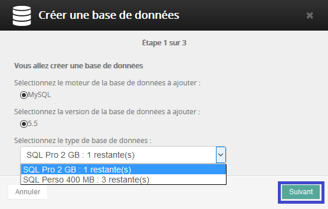
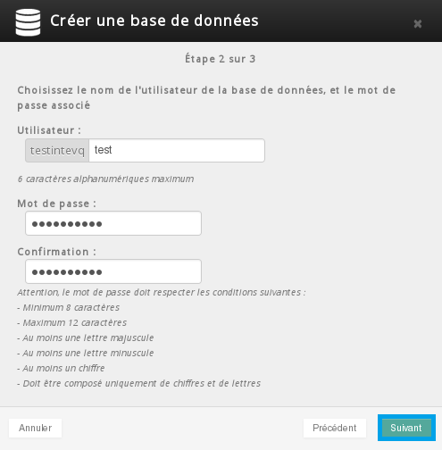

## Informations generales
Une base de données est un ensemble de données structurées et organisées afin de stocker et d'accéder à de grandes quantités de manière efficace. On parle souvent de "BDD" ou de "SQL". Le SQL est le langage permettant de demander à la base d'inclure, d'éditer, de récupérer ou de supprimer des données.

Les offres d'hébergement mutualisé de OVH incluent par défaut des bases de données SQL. Leur nombre et leur taille maximum dépend de l'offre que vous avez commandé. Vous pouvez retrouver leur [détail ici](https://www.ovh.com/fr/hebergement-web){.external}.

Ces bases de données ne sont accessibles que depuis les hébergements mutualisés d'OVH. Vous ne pourrez pas connecter un site ou une application en dehors de OVH sur ces bases de données.

Les bases de données créées sont de type : MySQL

## Gestion d'une base de donnees mutualise

### Création d'une base de donnees
Connectez-vous à votre [espace client](https://www.ovh.com/manager/web){.external} à l'aide de votre couple identifiant (nic-handle, par exemple " **xx999-ovh** ") - mot de passe.

{.thumbnail}

Dans notre exemple nous utilisons une offre d'hébergement mutualisé OVH comprenant plusieurs bases de données. Nous allons créer une base de données MySQL. Sélectionnez votre hébergement dans la section "Hébergements" puis l'onglet Bases de données

{.thumbnail}

- Cliquez sur Créer une base de données afin d'accéder au formulaire de création.
- Si vous n'avez plus de base de données disponible, vous pouvez commander des bases supplémentaires .

{.thumbnail}

Vous pourrez à ce niveau :

- Connaitre la version de votre base de données
- Sélectionner le type de base de données (choix possible à partir d'une offre pro)

*Vous ne pouvez créer que des bases de type MySQL, si vous devez par contre créer une base de type postGreSQL, vous devrez disposez d'un serveur SQL Privé.*

{.thumbnail}

Une fois le formulaire complété cliquez sur "Suivant" A ce niveau, vous devrez renseigner :

- Un nom d'utilisateur ( 6 caractères alphanumériques maximum )
- Un mot de passe, celui-ci doit respecter certaines conditions indiquées sur le formulaire.

{.thumbnail}

Cliquez sur "suivant" afin de passer à la dernière étape.

Il s'agit ici d'un résumé concernant la création de votre base, si vous ne constatez aucune erreur vous pouvez "valider".

{.thumbnail}

Si tout s'est bien déroulé, un message de succès sera affiché. Votre base de données peut prendre quelques minutes avant d'être pleinement fonctionnelle. Vous recevrez un e-mail lorsque celle-ci sera disponible.

{.thumbnail}

La création de votre base de donnée est maintenant terminée.

## Les options de gestion disponibles depuis l'espace client OVH
Une fois votre base de données créée, OVH vous fournit un panel de fonctionnalités afin de simplifier son administration.

{.thumbnail}

### Changer le mot de passe
Permet de mettre à jour le mot de passe de votre base de donnée depuis l'espace client.

- Attention : modifier le mot de passe de la base de données n'est pas anodin. Cela peut entrainer une coupure du site ou des services utilisant cette base de données .

En cas de changement de mot de passe, si vous avez un site qui utilise cette base de donnée, il faudra  **impérativement**  mettre a jour le mot de passe dans le fichier de connexion présent sur le serveur FTP.

### Créer une sauvegarde (dump)
Il est possible de générer une sauvegarde de votre base de données directement depuis l'espace client.

OVH vous propose de récupérer les données de votre base à différentes dates :

- Maintenant : c'est à dire les données actuellement stockées dans la base
- Hier : les données telles qu'elles étaient stockées il y a 24 heures
- Semaine dernière : les données telles qu'elles étaient stockées il y a 7 jours.

Cette fonctionnalité permet de récupérer des données en cas de suppression ou d'altération des données, qu'elle soit malveillante ou non.

{.thumbnail}

Afin de valider, cliquez sur "Suivant", puis sur "Valider". La création de la sauvegarde peut prendre quelques minutes. Lorsqu'elle est terminée, un e-mail vous sera envoyé à l'adresse de votre compte client.

### Restaurer une sauvegarde (dump)
Si vous souhaitez restaurer les données d'une sauvegarde créée par la méthode détaillée ci-dessus, vous pourrez le faire ici.

Dans le menu de restauration, à droite de chaque sauvegarde effectuée avec la méthode ci-dessus, vous pouvez :

- Télécharger la sauvegarde sur votre ordinateur
- Restaurer la base de données à partir de cette sauvegarde

{.thumbnail}

### Supprimer la base de donnees
Si vous ne souhaitez pas conserver une base de données, vous pouvez la supprimer définitivement avec ce bouton.

**Cette action est irréversible et entrainera la perte de toutes les données contenues dans la base de données** .

Une fenêtre pop-up vous rappellera que la suppression est définitive et une confirmation sera alors demandé.

{.thumbnail}

### Recalculer le quota
**Information importante sur les quotas**  :

Ces informations sont rafraîchies automatiquement toutes les  **24h** .

Vous pouvez également lancer un rafraîchissement manuel sur une base de donnée depuis votre espace client.

Si vous dépassez l'espace de stockage recommandé, vos droits seront limités à un accès en lecture seule.

Pour éviter cette limitation, nous vous invitons à effectuer une purge de votre base de données et recalculer vos quotas afin de repasser en dessous de la taille recommandée. Votre base de données sera déverrouillée automatiquement dans les minutes suivantes.

### Acceder a phpMyAdmin
Pour vous connecter à phpMyAdmin, cliquez sur `Accéder à phpMyAdmin`{.action}

{.thumbnail}

Vous devrez renseigner uniquement le mot de passe de votre base de données. Le reste des informations sera automatiquement pré-remplies.

- Mot de passe : le mot de passe de votre base de données.

Version : vous pouvez choisir de vous connecter sur la base de données actuelle, ou sur une sauvegarde à 1 ou 7 jours.

{.thumbnail}

> [!primary]
>
> Vous pouvez également accéder directement à phpMyAdmin via l'un de ces liens :
> Si votre hébergement se situe au datacentre "Paris" : https://phpmyadmin.ovh.net/
> Si votre hébergement se situe au datacentre "Gravelines" : https://phpmyadmin.hosting.ovh.net/
> Retrouvez le datacentre de votre hébergement dans votre espace client puis dans l'onglet "Informations générales" de votre hébergement.
> 

## Erreurs recurrentes

### Can't connect to local MySQL
Il s'agit d'une erreur de connexion sur le serveur MySQL. Le message dit que votre script essaie de se connecter sur MySQL en local et il n'arrive pas. MySQL chez OVH (en hébergement mutualisé) ne fonctionne pas en local mais sur le réseau, dans la configuration de vos scripts, vous avez probablement mis localhost et ceci n'est pas correct. Il est donc nécessaire de renseigner comme nom du serveur dans le fichier de configuration de votre site "nom_de_votre_bdd.mysql.db".

### Too Many Connection
Si vous obtenez l'erreur " **Too many connections**" en essayant de vous connecter à MySQL, cela signifie qu'il y a déjà  **max_connections**  clients connectés au serveur mysql. Vous avez atteint dans ce cas le nombre de connexion simultanées autorisées (limitée à 30). Dans ce cas, il vous faut vérifier au niveau de votre programmation, que toutes vos connexions SQL soient correctement fermées après chaque requêtes.

## Autres Actions

### Importer un dump (sauvegarde)
Comment importer le backup de ma base de données MySQL ? Quelles sont les différentes méthodes pour le faire ?

[Importer une base de données](https://docs.ovh.com/fr/hosting/mutualise-guide-importation-dune-base-de-donnees-mysql/){.ref}

### Exporter une base de donnee
Comment exporter ma base de données SQL ? Quelles sont les différentes méthodes pour réaliser le backup de ma base de données ?

[Exporter une base de données](https://docs.ovh.com/fr/hosting/exportation-bases-donnees/){.ref}