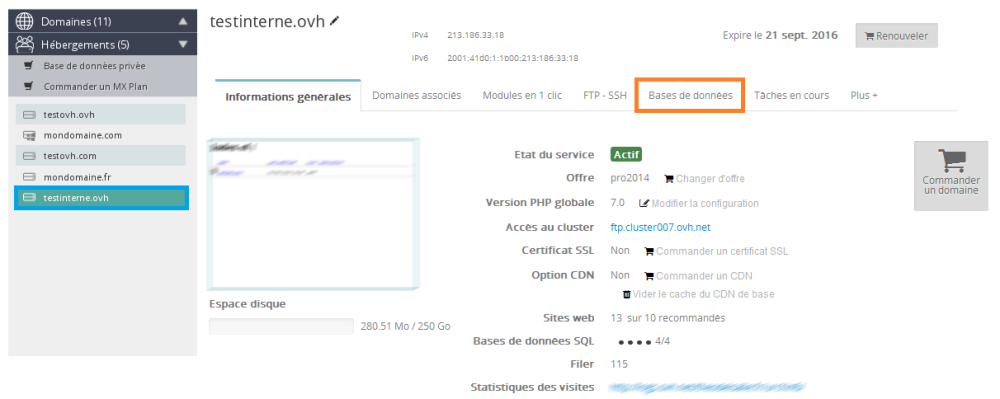
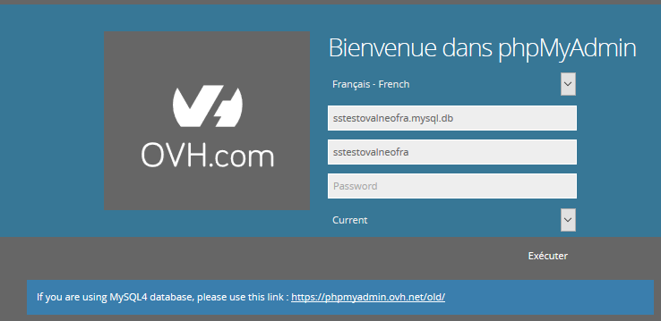

## Bendra informacija
Duomenų bazės - tai tokios duomenų struktūros, kuriose yra saugomi dideli kiekiai informacijos, kuri yra pildoma, atnaujinama, analizuojama. Jos dažnai žymimos DB arba SQL.

OVH svetainių talpinimo planai suteikiami su duomenų bazėmis.

Duomenų bazių skaičius, jų dydis priklauso nuo jūsų talpinimo plano. Plačiau apie mūsų talpinimo planus skaitykite [čia](https://www.ovh.lt/svetainiu-talpinimas/){.external}.

Prie šių duomenų bazių galima jungtis tik iš OVH svetainių talpinimo serverių.

Prie duomenų bazės nepavyks prisijungti iš svetainės ar aplikacijos, esančios ne OVH svetainių talpinimo serveriuose.

OVH siūlo 2 tipų duomenų bazes: MySQL ir PostgreSQL

## Svetainiu talpinimo duomenu bazes valdymas

### Duomenu bazes kurimas
Prisijunkite prie [paskyros](https://www.ovh.com/manager/web){.external} nurodę savo kliento ID (pavyzdžiui  **xx999-ovh** ) ir slaptažodį.

{.thumbnail}

Mūsų pavyzdyje naudosime talpinimo planą su keliomis duomenų bazėmis. Mes sukursime MySQL duomenų bazę. Valdymo sąsajoje spragtelėkite Priegloba, tuomet Duomenų bazės

{.thumbnail}

- Norėdami sukurti duomenų bazę, spragtelėkite Sukurti duomenų bazę .
- Jeigu išnaudojote visas duomenų bazes, galite užsakyti papildomų, spragtelėję Užsakyti duomenų bazes .

{.thumbnail}

Užsakant reikės nurodyti:

- Duomenų bazės tipą: MySQL ar PostgreSQL
- Duomenų bazės versiją
- Pasirinkti duomenų bazės tipą (pasirinkimas galimas nuo plano PRO)

{.thumbnail}

Užpildę formą paspauskite Tęsti Čia jūs turite nurodyti:

- Naudotojo vardą ( iki 6 skaitinių - raidinių simblolių )
- Slaptažodį (pagal formoje nurodytus reikalavimus).

{.thumbnail}

Spauskite Tęsti ir pereisite prie kito žingsnio.

Matysite duomenų bazės kūrimo procedūros santrauką. Patikrinkite, ar nėra klaidų ir spragtelėkite Patvirtinti.

{.thumbnail}

Jeigu procedūra bus sėkmingai užregistruota, matysite pranešimą apie tai. Duomenų bazės pradės veikti po kelių minučių. Apie duomenų bazės suteikimą informuosime el. paštu.

{.thumbnail}

Duomenų bazė sukurta.

## OVH sasajoje galimos valdymo parinktys
Kai duomenų bazė bus sukurta, OVH valdymo sąsajoje matysite funkcijas, kurios palengvins administravimą.

{.thumbnail}

### Slaptazodzio keitimas
Valdymo sąsajoje galite pakeisti duomenų bazės slaptažodį.

- Dėmesio: pakeitus slaptažodį gali nustoti veikti svetainė, kuri naudoja šią duomenų bazę .

Jeigu keičiate slaptažodį,  **būtina**  pakeisti duomenų bazę naudojančios svetainės nustatymus, paprastai šie nustatymai keičiami per FTP pasiekiamame faile.

### Atsargines kopijos (dump) kurimas
Atsarginę duomenų bazės kopiją galite kurti valdymo sąsajoje.

OVH suteikia galimybę gauti skirtingu metu atliktą duomenų bazės kopiją:

- Dabar: t.y. šiuo metu išsaugotų duomenų kopija;
- Vakar: duomenys, kurie buvo duomenų bazėje prieš 24 valandas;
- Praeitą savaitę: duomenys, kurie buvo prieš 7 dienas.

Ši funkcija leidžia atstatyti duomenis, jeigu jie buvo netyčia ištrinti ar pakeisti, sugadinti ir pan.

{.thumbnail}

Pasirinkę kopiją spragtelėkite Tęsti ir patvirtinkite operaciją. Kopijos kūrimas užtrunka kelias minutes. Po to bus atsiųstas el. pranešimas su atsargine kopija. Laiškas siunčiamas jūsų paskyroje nurodytu el. pašto adresu.

### Atstatymas is atsargines kopijos (dump)
Norėdami atkurti duomenis iš turimos atsarginės kopijos, sekite toliau pateiktas instrukcijas.

Atkūrimo meniu, dešiniau nuo kopijos pavadinimo, yra mygtukai, kurie leidžia:

- Parsisiųsti kopiją į kompiuterį
- Atkurti duomenų bazę iš šios kopijos

{.thumbnail}

### Duomenu bazes salinimas
Jeigu duomenų bazė nereikalinga, OVH valdymo sąsajoje galima ją ištrinti.

**Atlikus šią operaciją bus neatkuriamai pašalinti visi duomenys, esantys duomenų bazėje** .

Matysite iššokantį langą, kuriame turėsite patvirtinti duomenų bazės trynimą.

{.thumbnail}

### Perskaiciuoti kvota
**Svarbi informacija apie kvotas** :

Šie duomenys yra atnaujinami automatiškai kas  **24 valandas** .

Kvotos perskaičiavimą galite paleisti bet kuriuo metu, valdymo sąsajoje.

Viršijus paskirtą duomenų kiekį, duomenų bazė bus perjungta į tik skaitymo režimą.

Šio apribojimo išvengsite, jeigu išvalysite nenaudojamus duomenis ir perskaičiuosite kvotą, kol neviršytas rekomenduojamas kiekis. Išvalius duomenų bazę ir perskaičiavus kopiją, duomenų bazė bus atblokuota per kelias minutes.

### Prieiga prie phpMyAdmin
Jums tereikia įvesti duomenų bazės slaptažodį, visi kiti duomenys yra užpildomi automatiškai.

- Password: jūsų duomenų bazės slaptažodis.

Version: jūs galite pasirinkti, ar jungtis prie dabartinės duomenų bazės, ar 1, ar 7 dienų senumo kopijos.

{.thumbnail}

> [!success]
>
> https://phpmyadmin.ovh.net/
> 

## Daznos klaidos

### Can't connect to local MySQL
Tai yra prisijungimo prie MySQL serverio klaida. Pranešime nurodoma, kad skriptas bando prisijungti prie MySQL duomenų bazės lokaliai. Tačiau OVH MySQL (svetainių talpinimo) neveikia lokaliai, bet tinkle. Greičiausiai konfigūracijos faile nurodėte localhost ir tai yra klaida. Būtina svetainės konfigūravimo faile nurodyti teisingą duomenų bazės serverio adresą.

### Too Many Connections
Jeigu matote pranešimą " **Too many connections** ", tai reiškia, kad prie mysql duomenų bazės yra prisijungęs maksimalus leidžiamas ( **max_connections** ) vartotojų skaičius. Vienalaikių prisijungimų prie duomenų bazės skaičius OVH svetainių talpinimo duomenų bazėse yra apribotas iki 30. Tokiu atveju jums reikia patikrinti savo svetainę, ar tinkamai uždaromos atidarytos SQL sesijos.

## Kiti veiksmai

### Importavimas is dump failo (atsargines kopijos)
Kaip importuoti MySQL duomenų bazę iš turimos atsarginės kopijos? Kokie galimi būdai tai padaryti?

Apie tai skaitykite [šiame gide](https://www.ovh.lt/g1393.mysql-duomenu-bazes-importavimasl){.external}.

### Duomenu bazes eksportavimas
Kaip eksportuoti SQL duomenų bazę? Kokie yra skirtingi būdai sukurti atsargines duomenų bazės kopijas?

Apie tai skaitykite [šiame gide](https://www.ovh.lt/g1394.duomenu-bazes-eksportavimas){.external}.