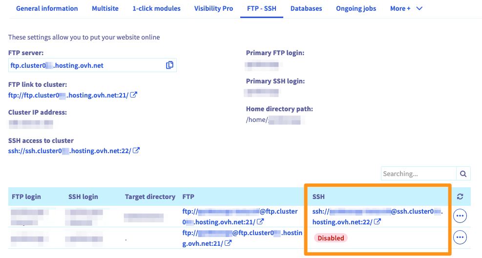
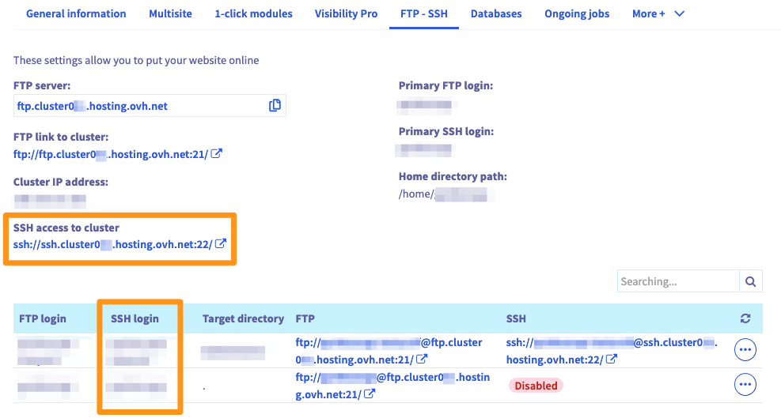

**Última actualización: 04/08/2020**

## Objetivo

Los planes de hosting de OVHcloud permiten disponer de un espacio de almacenamiento en el que publicar los archivos de sus sitios web o aplicaciones. Para acceder a este espacio de almacenamiento, es necesario tener un usuario FTP o SSH y las contraseñas asociadas.

**Esta guía explica cómo conectarse y utilizar el acceso SSH en un alojamiento web de OVHcloud.**

## Requisitos

- Tener contratado un plan de [hosting de OVHcloud](https://www.ovh.es/hosting/) con acceso SSH.
- Disponer de las claves necesarias para conectarse por SSH al espacio de almacenamiento.
- Conectarse al [área de cliente de OVHcloud](https://www.ovh.com/auth/?action=gotomanager){.external}, en la sección `«Web»`{.action}.

## Procedimiento

### 1\. Comprobar que el acceso SSH está activo

En primer lugar, conéctese al [área de cliente de OVHcloud](https://www.ovh.com/auth/?action=gotomanager) en la sección `Web`{.action} y, en la columna izquierda, haga clic en `Alojamientos`{.action}. Seleccione el alojamiento correspondiente y abra la pestaña `FTP - SSH`{.action}. Se mostrará la información relativa a su espacio de almacenamiento. 

En la columna «SSH» podrá consultar si el usuario SSH (o «Login SSH») dispone de un acceso SSH activo. En caso de que no esté activado, aparecerá la mención «Desactivado».

{.thumbnail}

Para activarlo, haga clic en el botón `(...)`{.action} situado al final de la línea correspondiente al usuario y seleccione `Editar`{.action}. Aparecerá una ventana en la que podrá activar el acceso SSH. Si no tiene la opción de activarlo, asegúrese de que su [plan de hosting de OVHcloud](https://www.ovh.es/hosting/) dispone de un acceso SSH.

### 2\. Obtener los datos de conexión

Para conectarse por SSH a su espacio de almacenamiento necesitará los elementos que se incluyen a continuación. Puede consultar esta información en la pestaña `FTP - SSH`{.action} de su alojamiento.

|Elemento|Dónde consultarlo|
|---|---|
|Usuario SSH activo|Puede consultarlo en la columna «Usuario SSH» de la tabla. Le recordamos que este usuario debe [disponer de un acceso SSH activo](./#1-comprobar-que-el-acceso-ssh-esta-activo).|
|Contraseña del usuario SSH|Si ha olvidado su contraseña, podrá modificarla haciendo clic en el botón  `...`{.action} > `Cambiar la contraseña`{.action}.|
|Dirección del servidor SSH|Consulte la sección «Acceso SSH al cluster». La dirección del servidor SSH es la que aparece tras «ssh://» y termina antes de los dos puntos («:»).|
|Puerto de conexión al servidor SSH|Consulte la sección «Acceso SSH al cluster». El número de puerto aparece tras los dos puntos («:»).|

Por ejemplo, en `ssh://ssh.cluster023.hosting.ovh.net:22/`, la dirección del servidor SSH sería «ssh.cluster023.hosting.ovh.net» y el puerto de conexión SSH sería «22».

{.thumbnail}

### 3\. Conectarse por SSH al espacio de almacenamiento

Para conectarse por SSH, utilice un terminal de línea de comandos. De este modo podrá interactuar directamente con el espacio de almacenamiento. 

En MacOS, Linux y Windows 10, esta herramienta está instalada por defecto. Si tiene un entorno Windows más antiguo, deberá instalar un programa como PuTTY o añadir la funcionalidad OpenSSH. Tenga en cuenta que el procedimiento será diferente en función del sistema operativo que utilice.

Existen dos formas de conectarse según el método que utilice:

#### 3.1\. Desde un terminal

> [!warning]
> En nuestros planes de hosting, no hay acceso «root» o superusuario por SSH.

Una vez abierto el terminal, utilice el siguiente comando sustituyendo los elementos «sshlogin», «sshserver» et «connectionport» por los correspondientes a sus claves SSH. 

```ssh
ssh sshlogin@sshserver -p connectionport
```

Después de ejecutar el comando, el sistema le pedirá que introduzca la contraseña del usuario SSH. Una vez conectado, vaya al siguiente paso: [Interactuar por SSH con su espacio de almacenamiento](./#4-interactuar-por-ssh-con-su-espacio-de-almacenamiento_1).

{.thumbnail}

#### 3.2\. Desde un software

Una vez abierto el programa (PuTTY, por ejemplo), introduzca las claves de conexión. Tenga en cuenta que el procedimiento será diferente en función del programa que utilice. A continuación le ofrecemos, a modo de recordatorio, la información que deberá introducir:

|Información solicitada|Detalles|
|---|---|
|Servidor SSH|Indique la dirección del servidor SSH que anotó en el [paso 2](./#2-obtener-los-datos-de-conexion). Según el programa utilizado, puede denominarse «Dirección del servidor», «Nombre del host» o incluso «Host Name».|
|Puerto de conexión|Introduzca el puerto de conexión que anotó en el [paso 2](./#2-obtener-los-datos-de-conexion).|
|Usuario SSH|Introduzca el usuario SSH. Según el programa utilizado, puede denominarse «Nombre de usuario», «Identificador», «Login» o incluso «Username».|
|Contraseña del usuario SSH|Es la contraseña asociada al usuario SSH.<br><br> Según el programa utilizado, puede denominarse «contraseña» o «password».|

Una vez conectado, vaya al siguiente paso.

### 4\. Interactuar por SSH con su espacio de almacenamiento

Para interactuar con su espacio de almacenamiento, deberá utilizar una serie de comandos (cada uno tiene un significado directo procedente del inglés). Incluimos a continuación la lista de comandos necesarios. **Tenga en cuenta que esta lista no es exhaustiva**.

|Comando|Significado en inglés|Descripción| 
|---|---|---|
|pwd|Print working directory|Muestra el directorio de trabajo actual.| 
|cd `arg`|Change directory|Permite cambiar el directorio de trabajo por el indicado en lugar de `arg`.|
|cd `..`|Change directory|Permite cambiar el directorio de trabajo, subiendo un nivel en el árbol de directorios.|
|cd|Change directory|Si no especifica ningún argumento, le permite reposicionarse en la raíz de su espacio de almacenamiento (home).|
|ls|List|Permite desplegar el contenido del directorio de trabajo. Puede añadir atributos para modificar la vista del resultado del comando (como `ls -ulhG`).| 
|chmod `droit` `arg`|Change mode|Permite cambiar los permisos del archivo o del directorio mencionado como argumento `arg`.| 
|mkdir `arg`|Make directory|Permite crear un repertorio con el nombre del argumento `arg`.| 
|touch `arg`|Touch|Permite crear un archivo vacío, si todavía no existe, con el nombre mencionado como argumento `arg`.|
|rm `arg`|Remove|Permite eliminar el archivo mencionado como argumento `arg`.| 
|rm -r `arg`|Remove|Permite eliminar el repertorio mencionado como argumento `arg`, así como todo el contenido de manera recursiva.| 
|mv `arg1` `arg2`|Move|Permite renombrar o desplazar un elemento (especificado como `arg1`) en una nueva localización (especificada como `arg2`).| 

A través del comando, también podrá lanzar un script utilizando una versión específica de PHP. Por ejemplo, para la versión de PHP 7.1, utilice el siguiente comando adaptando los elementos a su caso particular:

```sh
/usr/local/php7.1/bin/php myscript.php
```

Según la versión de PHP que utilice, es posible que tenga que modificar el entorno de ejecución por motivos de compatibilidad. Para más información, consulte nuestra documentación >

## Más información

[Modificar la configuración de un alojamiento web](../cambiar_el_entorno_de_ejecucion_de_un_alojamiento/)

[Configurar el archivo .ovhconfig de un alojamiento web](../configurar-archivo-ovhconfig/)

Interactúe con nuestra comunidad de usuarios en <https://community.ovh.com/en/>.
