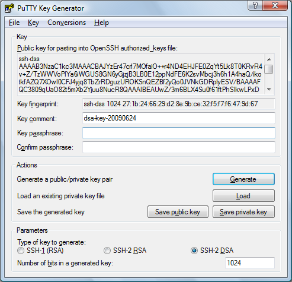

## 

- Un hosting che ti permette di accedere in SSH (a partire dall'offerta Pro)
- un accesso SSH (se hai bisogno di aiuto, consulta [questa guida](https://www.ovh.it/g1962.hosting_condiviso_protocollo_ssh))


## 
Una volta effettuato l'accesso sul tuo hosting in SSH, crea la cartella principale dei tuoi repository SVN e poi il repository.

Per farlo, esegui prima il comando


```
mkdir svn
```


e poi


```
svnadmin create svn/repository_test
```


Per verificare che le cartelle siano state create correttamente, utilizza questo comando:


```
ls -la
```


## 
Il risultato dovrebbe essere di questo tipo:

{.thumbnail}


## Linux con openssh
Per accedere dal tuo pc (client svn) ai repository SVN, è necessario creare un paio di chiavi DSA. Per farlo, digita sul tuo terminale il comando


```
ssh-keygen -t dsa
```


e recupera la riga che di default si trova nel file .ssh/id_dsa.pub della tua home. Per modificare questo file, utilizza il comando "vi":


```
vi .ssh/id_dsa.pub
```


La chiave è divisa in tre stringhe di caratteri che indicano il tipo, la chiave e un commento.


## Windows con Putty
Per accedere dal tuo pc (client svn) ai repository SVN, scarica e installa Windows Putty.
Per creare un paio di chiavi DSA avvia PuTTYGen, genera le chiavi e salvale:

{.thumbnail}


## 
Dopo aver generato la tua chiave, aggiungila sul tuo hosting nel file .ssh/authorized_keys2. Per farlo, inserisci questi comandi:


```
mkdir .ssh
chmod 700 .ssh
vi .ssh/authorized_keys2
```


Una volta aperto il file, inserisci:


```
command="/usr/bin/svnserve --root=/home.XXX/loginFTP/svn --tunnel --tunnel-user=marco",no-port-forwarding,no-agent-forwarding,no-X11-forwarding,no-pty
```


seguita dalla chiave creata precedentemente, tutto sulla stessa riga!
NB: sostituisci "/home.XXX/loginFTP" e "marco" con i tuoi dati.
Per sapere i valori da utilizzare per sostituire "/home.XXX/loginFTP" utilizza il comando "pwd" in SSH

{.thumbnail}
In questo modo, recuperi il contenuto del repository senza necessariamente connetterti alla macchina in SSH.
Attenzione: ricordati che non puoi utilizzare la stessa chiave per i servizi SVN e SSH.


## Con Linux
Per effettuare un test dal tuo pc, accedi al repository SVN con:


```
svn checkout svn+ssh://loginFTP@clusterXXX/repository_test
```


## Con Windows (TortoiseSVN)

- Scarica e installa tortoisesvn ([http://tortoisesvn.net/downloads](http://tortoisesvn.net/downloads))
- Clicca due volte sulla chiave privata. In basso a destra compare un'icona e la chiave viene caricata nel client per l'autenticazione
- Crea una directory, clicca con il tasto destro e seleziona "SVN Checkout". Inserisci


```
svn+ssh://loginFTP@clusterXXX/repository_test
```


nel campo "URL of repository" e clicca su OK.

{.thumbnail}
Se hai bisogno di aiuto, consulta la documentazione di Subversion disponibile in inglese: [http://svnbook.red-bean.com/en/1.5/index.html](http://svnbook.red-bean.com/en/1.5/index.html)


## Crea più account
Per prima cosa, è necessario creare più chiavi SSH.
Quando aggiungi la chiave pubblica sull'hosting


```
command="/usr/bin/svnserve --root=/home.XXX/loginFTP/svn --tunnel --tunnel-user=marco",no-port-forwarding,no-agent-forwarding,no-X11-forwarding,no-pty
```


modifica il parametro qui sotto aggiungendo i tuoi user:


```
--tunnel-user
```


Ti ricordiamo che è possible autorizzare l'accesso in sola lettura aggiungendo il parametro


```
--read-only.
```


## Check in locale dal server
Per effettuare un check in locale, utilizza questo comando:


```
svn+ssh://login@ftp.nome-sito.tld/home.XXX/login/svn/repository_test
```


