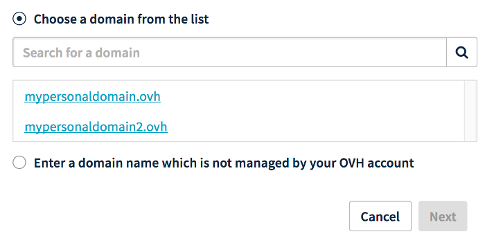

**Ostatnia aktualizacja dnia 2018-01-31**

## Wprowadzenie

Dodanie domeny do usługi Exchange jest niezbędne, abyś mógł korzystać z kont, które zamówiłeś w ramach usługi. Możesz również dodać do usługi Exchange kilka domen. 

**Dowiedz się, jak dodać domenę do usługi.**

## Wymagania początkowe

- Wykupienie [usługi Exchange](https://www.ovh.pl/emaile/hosted-exchange/){.external}.
- Zarejestrowana domena lub kilka domen.
- Możliwość modyfikacji konfiguracji Twojej domeny (jej strefy DNS).
- Dostęp do [Panelu klienta OVH](https://www.ovh.com/auth/?action=gotomanager){.external}.

## W praktyce

### Etap 1: logowanie do usługi Exchange

Po utworzeniu usługi Office 365 i uzyskaniu do niej dostępu, możesz nią zarządzać poprzez [Panel klienta OVH](https://www.ovh.com/auth/?action=gotomanager){.external}.

W tym celu zaloguj się do Panelu klienta, kliknij w `Microsoft`{.action}, a następnie w `Exchange`{.action} na pasku usług po lewej stronie. Zaznacz wybraną usługę Exchange.

> [!primary]
>
> Nazwa usługi Hosted Exchange w Panelu klienta zaczyna się od **hosted-** lub **private-**, następnie zawiera część Twojego identyfikatora klienta i kończy się cyfrą (1 dla pierwszej zainstalowanej usługi Hosted lub Private Exchange, 2 dla drugiej, etc.).
>

### Etap 2: dodanie domeny

Aby dodać domenę, kliknij w zakładkę `Przypisane domeny`{.action}. Tabela wyświetla nazwy domen aktualnie przypisanych do Twojej usługi Exchange. Aby dodać nową domenę, kliknij w przycisk `Dodaj domenę`{.action}.

> [!warning]
>
> Wszystkie konta e-mail utworzone w ramach Twojej usługi Exchange mogą wyświetlać w katalogu wszystkie adresy e-mail powiązane z usługą Exchange, również te, które mają różne nazwy domen. Aby wyłączyć ten sposób wyświetlania kont w domenach, musisz zamówić nową [usługę Exchange](https://www.ovh.pl/emaile/){.external} dla wybranych domen.
>

{.thumbnail}

W oknie dodawania domeny znajdziesz następujące opcje:

- **Wybierz domenę z listy**: wyświetlają się jedynie domeny skonfigurowane w OVH i wskazane jako kontakty w koncie klienta;

- **Wpisz domenę, która nie jest zarządzana na Twoim koncie OVH**: aby usługa działała poprawnie, musisz mieć możliwość modyfikacji konfiguracji domeny (jej strefy DNS).

Po wybraniu opcji kliknij `Dalej`{.action}.

{.thumbnail}

Okno wyświetla teraz informacje dotyczące konfiguracji trybów. 

- **Jeśli podałeś nazwę domeny nieobsługiwanej przez OVH**: zostanie domyślnie skonfigurowany tryb nieautorytatywny.

- **Jeśli wybrałeś z listy nazwę domeny obsługiwanej przez OVH**: wybierz jeden z trybów.

|Tryb|Opis|
|---|---|
|Autorytatywny|Odpowiedni, jeśli do obsługi poczty w Twojej domenie używasz jedynie usługi Exchange. Nie pozwala na korzystanie z innego rozwiązania poczty elektronicznej w połączeniu z usługą Exchange.|
|Nieautorytatywny|Odpowiedni, jeśli do obsługi Twojej domeny używasz kont Exchange oraz jednocześnie innego rozwiązania poczty elektronicznej. Wskaż serwer, na którym hostowane jest Twoje rozwiązanie poczty elektronicznej.|

> [!primary]
>
> Wybór trybu nie jest ostateczny i możesz zmienić go później w Panelu klienta.
>

Kliknij przycisk `Dalej`{.action}, aby kontynuować proces dodawania domeny.

{.thumbnail}

**Jeśli wybrałeś z listy nazwę domeny obsługiwaną przez OVH**, jej konfiguracja może zostać przeprowadzona automatycznie. W celu przeprowadzenia automatycznej konfiguracji zaznacz odpowiednie pola i kliknij `Dalej`{.action}, aby kontynuować proces dodawania domeny.

**Jeśli podałeś nazwę domeny nieobsługiwanej przez OVH**, konfiguracja powinna zostać przeprowadzona na kolejnym etapie.

{.thumbnail}

Przed zakończeniem konfiguracji sprawdź wyświetlające się informacje, następnie kliknij przycisk `Zatwierdź`{.action}, aby zakończyć proces dodawania domeny. Wykonaj czynności tego etapu tyle razy, ile to konieczne, w zależności od liczby kont, które posiadasz.

### Etap 3: konfiguracja nazwy domeny (DNS)

Po dodaniu przypisanej domeny upewnij się, że konfiguracja jest poprawna, korzystając z tabeli, która się wyświetla poniżej. Zielony przycisk oznacza, że domena została poprawnie skonfigurowana. W przypadku gdy przycisk jest czerwony:

- **jeśli podczas dodawania domeny wybrałeś automatyczną konfigurację**: aktualizacja zmian w Panelu klienta może potrwać kilka minut;

- **jeśli wprowadziłeś nazwę domeny nieobsługiwanej przez OVH**: kliknij czerwony przycisk, aby wyświetlić listę modyfikacji do wprowadzania. Jeśli Twoja domena nie korzysta z serwerów DNS, wprowadź odpowiednie modyfikacje, korzystając interfejsu do zarządzania konfiguracją Twojej domeny. Jeśli chcesz się dowiedzieć więcej o konfiguracji CNAME, skorzystaj z dokumentacji [Tworzenie pola CNAME po dodaniu przypisanej domeny](https://docs.ovh.com/pl/microsoft-collaborative-solutions/exchange_20132016_dodanie_pola_cname/){.external}.

> [!primary]
>
> Efekty modyfikacji domeny staną się widoczne po upływie 1-24 godzin ze względu na niezbędny czas propagacji.
>

W celu sprawdzenia, czy konfiguracja pola CNAME jest poprawna, otwórz tabelę `Przypisane domeny`{.action} w Twojej usłudze Exchange. Jeśli przycisk jest zielony, nazwa domeny została prawidłowo dodana.  Jeśli nie jest zielony, może to oznaczać, że nie zakończyła się jeszcze propagacja.

{.thumbnail}

### Etap 4: konfiguracja i korzystanie z kont

Po dodaniu wybranych domen do usługi Exchange możesz je skonfigurować z kontami Exchange. Operację tę możesz przeprowadzić, klikając zakładkę `Konta e-mail`{.action}. Możesz zamówić nowe konta, klikając w przycisk `Zamówienie kont`{.action} lub `Dodaj konta`{.action}. 

Wszystkie konta e-mail utworzone w ramach Twojej usługi Exchange mogą wyświetlać w katalogu wszystkie adresy e-mail powiązane z usługą Exchange, również te, które mają różne nazwy domen.

Po skonfigurowaniu Twoich kont możesz zacząć ich używać. OVH udostępnia w tym celu interfejs Webmail **Outlook Web Application** (OWA) dostępny pod linkiem [https://mail.ovh.net/pl/](https://mail.ovh.net/pl/){.external}. 
Abyś mógł korzystać z konta Exchange w sposób optymalny, upewnij się, czy jest ono kompatybilne z Twoim programem pocztowym. Jeśli chcesz skonfigurować Twoje konto e-mail na smartfonie, tablecie lub programie pocztowym lub jeśli chcesz uzyskać pomoc w zakresie funkcji Exchange, skorzystaj z naszej dokumentacji dostępnej tutaj: [https://docs.ovh.com/pl/microsoft-collaborative-solutions/](https://docs.ovh.com/pl/microsoft-collaborative-solutions/){.external}.

OVH oferuje licencje Outlook w [Panelu klienta](https://www.ovh.com/auth/?action=gotomanager){.external}, a ponadto licencje Office 365 na stronie [https://www.ovh.pl/office-365/](https://www.ovh.pl/office-365/){.external}. Zalecamy skorzystanie z jednego z tych rozwiązań, jeśli chcesz używać programu pocztowego Outlook lub innych programów Office.

## Sprawdź również

[Tworzenie pola CNAME po dodaniu przypisanej domeny](https://docs.ovh.com/pl/microsoft-collaborative-solutions/exchange_20132016_dodanie_pola_cname/){.external}.

Przyłącz się do społeczności naszych użytkowników na stronie <https://community.ovh.com>