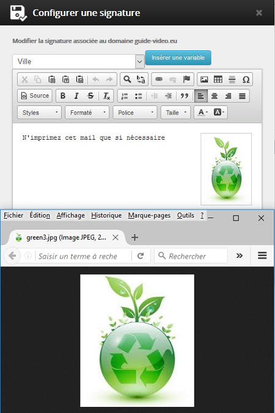
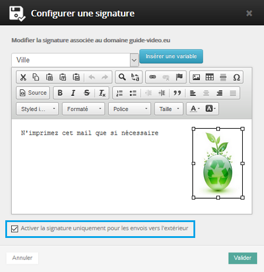

Vous pouvez créer une signature par domaine validé.

Utilisez les outils à votre disposition pour personnaliser et mettre en forme votre signature. Cette signature sera intégrée automatiquement au bas de chaque message envoyé depuis les adresses associées à votre domaine Exchange.

Des variables sont aussi disponibles pour personnaliser la signature générique avec les coordonnées des différents collaborateurs.

Cliquez [ici](https://www.ovh.com/fr/emails/hosted-exchange/guides/){.external} pour retrouver nos différents guides.

## Signature de mail - Espace client OVH

### Mise en place Partie 1
Afin de créer votre signature (pied de page), connectez-vous à votre [Espace client](https://www.ovh.com/manager/web/login.html){.external}.

Sélectionnez votre offre Exchange dans "Plateforme".

Choisissez l'onglet `Plus +`{.action} puis `Pied de page`{.action}.

{.thumbnail}

### Mise en place Partie 2
Utilisez les outils à votre disposition pour personnaliser et mettre en forme votre signature.

Des variables sont aussi disponibles pour personnaliser la signature générique avec les coordonnées des différents collaborateurs.

Pour ajouter une image ou un logo, utilisez son URL en l'insérant après avoir cliqué sur le bouton `image`{.action}.

*Afin d'ajouter plus rapidement une image ou un logo dans votre signature. Il vous est aussi possible de faire un glisser-déposer de l'image, de votre navigateur vers l'outil de signature, comme vous le montre la capture d'écran ci-contre.*

{.thumbnail}

### Mise en place Partie 3
Il vous sera ensuite possible de redimensionner l'image à la taille voulue.

Il est possible de n'activer la signature que pour les envois d'e-mails vers l'extérieur (vers une adresse e-mail non liée à votre domaine) en cochant la case prévue à cet effet.

Cliquez sur `Valider`{.action} pour enregistrer votre signature.

Elle sera associée à tous les e-mails du domaine choisi.

{.thumbnail}

### Mise en place Partie 4
Une fois votre signature paramétrée, elle apparaîtra dans votre espace client.

Il vous est possible de la modifier, ou de la supprimer.

Un tableau récapitulatif vous renseignera sur les informations générales de votre signature.

{.thumbnail}

## Utilisation signature OWA 2013

### Exemple e-mail Partie 1
Voici comment ajouter votre signature dans un e-mail depuis l'interface du [Webmail Exchange](https://ex.mail.ovh.net/owa/){.external}.

Identifiez-vous avec votre adresse e-mail entière et le mot de passe de votre compte e-mail.

Une fois connecté dans l'onglet "Messagerie" sélectionnez en haut à gauche "nouveau message".

Rédigez votre mail, puis, pour y ajouter votre signature, sélectionnez "Insérer" puis "Signature".

*La signature ne va pas apparaître dans le corps du message : c'est normal.*

Finalisez votre envoi en cliquant sur "Envoyer".

{.thumbnail}

### Exemple e-mail Partie 2
L'e-mail est correctement reçu et notre signature apparaît correctement.

{.thumbnail}

## Utilisation signature OWA 2016
Depuis le webmail exchange 2016, il n'y a pas de manipulation nécessaire pour ajouter votre pied de page.

Lors de l'envoi d'un e-mail, celui-ci n'est pas visible dans le corps du message, ce qui est normal. Il s'affiche cependant correctement lors de la réception de l'e-mail par le destinataire.

{.thumbnail}